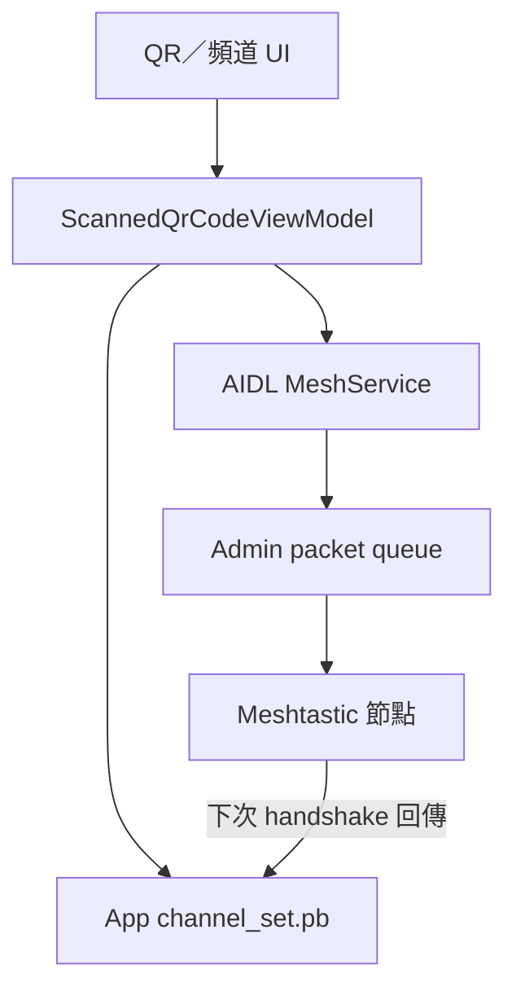
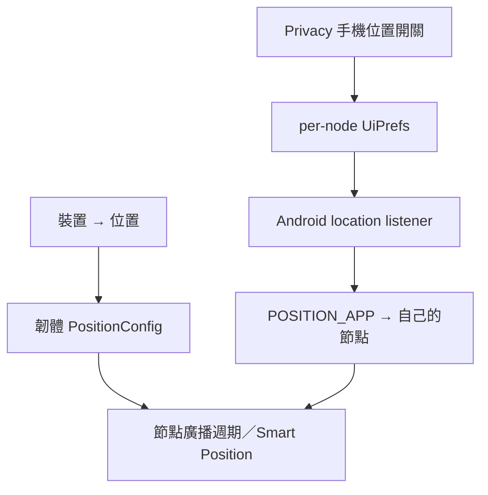

# NTsocial MeshLink Android 頻道持久性與手機定位可靠性調查暨改善計畫

> 調查日期：2026-08-05；實作完成日期：2026-08-06
> 調查基準：`4393f611a2b2ecae6f44f0907b59ad762a7ae61c`；實作基準：`4151d6227a00dbfac6bec4e5afbab784c98fd4b1`
> Meshtastic upstream 對照基準：`771022067500012143e48736462e353f92afcf6e`  
> 範圍：Android App；共用 KMP 頻道契約已評估並通過編譯，未變更韌體、Windows UI／IPC／品牌／封裝或 `core/proto`

## 0. 2026-08-06 實作結果

本節是目前 source 的最新狀態；後續第 1～8 節保留修正前的根因調查、證據與設計依據，其中「目前缺陷」等敘述應以本節為準。

### 0.1 頻道可靠性

- QR 與本機手動頻道變更已共用單一、序列化的可靠套用流程：先確認本機 admin session，送出完整 slot edit，逐筆同時等待 radio queue admission 與相同 request ID／sender 的 `Routing.NONE`，commit 後要求全新完整 config handshake，只有 radio readback 與預期完全相同才回報成功。
- QR 對話框不再在命令剛入列時關閉或顯示假成功；套用期間不可關閉，失敗會留在畫面並顯示錯誤。例外路徑也會從 Applying 收斂到 Failed，不會永久卡住。
- handshake 的 channel、LoRa 與 `config_complete` 改由同一個 generation collector 建立完成屏障；中斷的 handshake 不會先清掉上一份已完成快取。
- 頻道頁新增「儲存並保護」快照。功能預設關閉、按 radio 穩定身分隔離，快照保存在 App 私有 DataStore；只有經 radio readback 驗證的使用者變更才能建立或更新快照。
- 背景修復只處理可證明為 placeholder／缺失的 secondary slot。Primary、LoRa、容量、radio 身分、generation 或任何現存內容衝突時一律 fail closed，不會覆寫；每個 radio generation 最多嘗試一次。
- protected snapshot reconciliation 會先於內建 NTsocial channel provisioner 執行，避免暫時缺失的 protected slot 被 provisioner 佔用。既有內建頻道 provisioner 仍是原本的 queue/cache 路徑，本次沒有把它宣稱為同等的 verified transaction。

### 0.2 手機 GPS 分享

- 【裝置 → 位置】現在直接提供「使用手機位置」開關，沿用既有的 per-node `provide-location-$nodeNum` 偏好，沒有建立第二份互相矛盾的設定。
- desired state 會依「目前連線 radio、既有 opt-in、非 fixed position、Fine 或 Coarse 權限、系統定位開關、App lifecycle」統一 reconcile；重連、切換節點、node database ready、權限撤銷／重授、系統定位關閉／開啟及 process 重新建立都會重新評估。
- Android location manager 以同一把鎖保護 start／stop／restart，避免斷線與重新啟動競速；暫時失去權限或平台條件時停止 listener，但保留使用者 desired state，條件恢復後可重新啟動。
- `MeshService` 只有在使用者明確啟用、具備位置權限且系統定位開啟時才使用 location foreground-service type；停用時會降級並停止 listener。本次不要求背景位置權限，也沒有加入雲端位置服務。
- fixed position 會暫停手機位置供應；現有已啟用偏好即使權限或 GPS 關閉仍可由 UI 明確停用。

### 0.3 自動化驗證與仍需完成的實機證據

- JDK 21、Android SDK 與 en-US JVM locale 下，`spotlessApply spotlessCheck assembleDebug test allTests` 成功；`kmpSmokeCompile :app:lintFdroidDebug :app:lintGoogleDebug` 亦成功。
- 新增／修改範圍沒有新增 Detekt finding。root `detekt` 仍只重現既有 7 項：BLE 3、model 1、network 1、data 2；這些位於本任務未修改的既有檔案。
- 共用 KMP 變更已由 Desktop/JVM 與 KMP smoke compile 覆蓋；沒有新增 Windows IPC、UI、品牌或封裝行為。
- 目前環境沒有連接 Meshtastic radio，因此尚未取得真實 8-slot QR 寫入／回讀、斷線後 secondary 自動修復、Android 11～17 各權限／背景情境，以及第二個 radio 實際收到手機位置封包的證據。這些仍是發布前必要的硬體驗收，不能由單元測試推論。

## 1. 結論摘要

這兩個問題都不是單一 UI 小錯，而是 App 將「已提出要求」過早當成「節點已確實完成」。不過修正不需要大規模重構，也不應直接合併一千多個 upstream commits。

### 1.1 頻道問題的真正核心

目前 QR 匯入流程會產生**假成功**：

1. 沒有先確認本機節點的 admin session passkey 仍有效。
2. Android 呼叫只到 nullable AIDL Binder，再把 admin packet 放入本機傳送佇列；沒有等到 Routing ACK，更沒有從節點回讀。
3. App 隨即把完整 QR 頻道清單寫入自己的 `channel_set.pb`，所以畫面先看起來成功。
4. 若節點其實拒絕、漏收或只套用部分 slot，下一次連線時 App 會清空本機觀測快取並以節點回傳值重建；這時 secondary channels 才「消失」。

因此，增加頻道快照是合理的第二層保護，但**不能先把快照自動修復接到目前不可靠的寫入管線**。第一優先必須是讓一次頻道套用具備 session readiness、完整 slot 寫入、明確失敗、commit 後回讀驗證。

### 1.2 GPS 問題的真正核心

若使用者只操作【裝置 → 位置】，目前程式**必然不會啟動手機 GPS 分享**：

- 【裝置 → 位置】只修改節點韌體的 `Config.PositionConfig`，例如位置廣播週期、Smart Position、固定位置與節點上的實體 GPS。
- 手機位置分享由另一個預設為 `false` 的 per-node App 偏好 `provide-location-$nodeNum` 控制，而且開關放在一般 Settings 的 Privacy 區塊。

即使使用者找到另一個開關，現行流程仍可能停在「偏好已開、實際 location listener 未啟動」：Fine/Coarse 權限判定矛盾、初次啟動失敗沒有可重試狀態、AIDL Binder 尚未就緒時呼叫會靜默消失、斷線後也沒有可靠的 desired-state reconciliation；Android 14+ 的 location foreground-service type 亦未與使用者明確 opt-in 綁定。

### 1.3 建議發布順序

| 優先級 | 內容 | 發布條件 |
|---|---|---|
| P0-A | 可靠頻道套用：session、full-slot、edit session、Routing 結果、重連回讀 | 8-slot QR、尾端刪除、斷線與 stale session 實機通過 |
| P0-B | 手機位置入口與 service reconciliation 修復 | 第二個真實節點可在背景／重連後收到位置 |
| P1 | 明示 opt-in 的 per-radio 頻道快照與「僅 secondary 缺失」自動修復 | P0-A 已證明可驗證收斂，且 conflict 測試通過 |

不建議把 P1 快照當成 P0-A 的替代品。

## 2. 調查方法與證據分級

本報告沿著 UI → ViewModel → Binder/Service → admin/packet queue → radio truth → reconnect/readback 的完整路徑檢查，並與 Meshtastic 當代 upstream 的相關提交對照。

| 等級 | 定義 | 本報告用法 |
|---|---|---|
| A：程式碼確證 | 目前 source 必然具有該行為，不需猜測 | 可直接列為必修根因 |
| B：高度吻合的 runtime trigger | 失敗路徑確實存在，且可解釋症狀；但缺少該次裝置 log | 需加 trace 後判斷使用者當次撞到哪一條 |
| C：目前無證據 | 只有可能性，source 或測試未支持 | 不應用來主導設計 |

重要限制：只靠 repository 無法誠實判定某一位使用者那一次失敗究竟是 `ADMIN_BAD_SESSION_KEY`、Binder 未綁定、傳送途中斷線，還是僅 App 快取 race。可以確定的是，現行管線會把上述多種失敗都偽裝成成功，這就是需要修復的共同根因。

## 3. 專案與 upstream 基線

- fork HEAD：`4393f611a2b2ecae6f44f0907b59ad762a7ae61c`。
- upstream main：`771022067500012143e48736462e353f92afcf6e`。
- merge-base：`c0d95d6ac4196fcbc705f2d3f174c7d9c46a77b2`（2026-05-07）。
- 相對 merge-base，fork-only 51 commits、upstream-only 1043 commits。
- Android target SDK 為 37；因此 Android 14+ 的 while-in-use location FGS 限制是實際發布條件，不是未來議題。
- [`MeshConfigFlowManagerImpl.kt`](core/data/src/commonMain/kotlin/com/ntsocial/meshlink/core/data/manager/MeshConfigFlowManagerImpl.kt) 273–297 行目前把 `hasGPS=false`、`maxChannels=8` 寫死；修復流程在未驗證前不可拿這兩個欄位自動判定實體 GPS 能力或非 8-slot 裝置容量。

結論：不應 merge/cherry-pick 整個 upstream。應手工移植少量已驗證的行為與測試，保留 NTsocial 的 package、AIDL 相容層、內建頻道政策與現有 UI。

---

## 4. 問題一：Primary／Secondary 頻道匯入後不完整或重連遺失

### 4.1 目前資料流



目前 `B → F` 會在 `D` 只是入列後執行，早於 `E` 的確實套用與回讀。這是畫面先成功、重連後才暴露缺失的關鍵。

### 4.2 已由程式碼確證的缺陷

#### C1. QR 匯入沒有先取得／刷新有效 admin session（A）

`ScannedQrCodeViewModel.setChannels()` 直接開始送 `set_channel`，沒有 session readiness gate：

- [`ScannedQrCodeViewModel.kt`](core/ui/src/commonMain/kotlin/com/ntsocial/meshlink/core/ui/qr/ScannedQrCodeViewModel.kt)，59–72 行。
- [`CommandSenderImpl.kt`](core/data/src/commonMain/kotlin/com/ntsocial/meshlink/core/data/manager/CommandSenderImpl.kt)，196–212 行，會直接附上 `SessionManager.getPasskey(destNum)`。
- [`SessionManagerImpl.kt`](core/data/src/commonMain/kotlin/com/ntsocial/meshlink/core/data/manager/SessionManagerImpl.kt)，79、101–118 行；session 超過 240 秒會被標為 `Stale`，但 `getPasskey()` 仍回傳舊 key。
- [`MeshConnectionManagerImpl.kt`](core/data/src/commonMain/kotlin/com/ntsocial/meshlink/core/data/manager/MeshConnectionManagerImpl.kt)，255–259 行斷線會清 session；345–349 行僅 fire-and-forget 一次 `get_owner_request` 來 seed passkey，沒有等它完成才允許 QR 寫入。

相反地，NTsocial 內建頻道 provisioner 已有正確方向：[`NtsocialChannelProvisioner.kt`](core/data/src/commonMain/kotlin/com/ntsocial/meshlink/core/data/ntsocial/NtsocialChannelProvisioner.kt) 83–88、184–211 行會先確保 active local admin session。一般 QR 與手動頻道入口沒有共用這個 gate。

高度吻合的失敗序列如下：原本 primary 已存在，因此 diff 不重寫 primary；QR 只送新增的 secondary；session 尚未 seed 或已過期，節點以 `ADMIN_BAD_SESSION_KEY` 拒絕 secondary；App 仍把完整清單寫入快取。重連後 primary 看似保留，而 secondary 全部或部分「遺失」。這條失敗類別由程式碼確定存在；是否正是某次客訴的 trigger，仍需 Routing.Error trace。

#### C2. 「suspend／循序呼叫」不等於節點完成（A）

2026-07-31 的 `fec591ec8e90fbfca2477c51b64f237b50f406e5` 將多個 slot 放進單一 coroutine loop，改善了呼叫順序；但實際每一層都提早返回：

- [`AndroidRadioControllerImpl.kt`](core/service/src/androidMain/kotlin/com/ntsocial/meshlink/core/service/AndroidRadioControllerImpl.kt) 93–99 行只是 `meshService?.setConfig/setChannel`；Binder 為 null 時直接 no-op，連警告都沒有。
- [`MeshService.kt`](core/service/src/androidMain/kotlin/com/ntsocial/meshlink/core/service/MeshService.kt) 292–294、328–330 行只把 void AIDL 呼叫轉交 handler。
- [`MeshActionHandlerImpl.kt`](core/data/src/commonMain/kotlin/com/ntsocial/meshlink/core/data/manager/MeshActionHandlerImpl.kt) 320–328 行呼叫 fire-and-forget `sendAdmin()`，並立刻另開 coroutine 樂觀更新本機快取。
- [`PacketHandlerImpl.kt`](core/data/src/commonMain/kotlin/com/ntsocial/meshlink/core/data/manager/PacketHandlerImpl.kt) 137–173 行顯示 `sendToRadioAndAwait()` 最多等待 QueueStatus；QR 路徑甚至沒有使用它。

所以目前只能保證「App 依序提出命令」，不能保證：

1. Binder 存在；
2. packet 已被 radio queue 接受；
3. admin session 有效；
4. Routing ACK 為成功；
5. firmware 已套用每個 slot；
6. commit 後重連回讀與 desired state 相同。

#### C3. 現有 `sendAdminAwait()` 也不能直接當成 applied success（A）

`sendAdminAwait()` 等待的是 QueueStatus。Routing packet 到達時，[`MeshDataHandlerImpl.kt`](core/data/src/commonMain/kotlin/com/ntsocial/meshlink/core/data/manager/MeshDataHandlerImpl.kt) 291–305 行不論 `Routing.Error` 是成功或 NAK，都以 `complete=true` 移除 response。也就是說，即使改成目前的 Boolean `sendAdminAwait()`，仍可能把 `ADMIN_BAD_SESSION_KEY`、`NOT_AUTHORIZED` 等錯誤當成「已完成等待」。

需要把「radio queue admission」與「該 packet ID 的 Routing 結果」分開建模，並以 commit 後 radio readback 作最後真值。

#### C4. REPLACE 依賴可能不完整／假成功的 App cache（A）

[`ProtoExtensions.kt`](core/ui/src/commonMain/kotlin/com/ntsocial/meshlink/core/ui/util/ProtoExtensions.kt) 75–92 行的 `getChannelList(new, old)` 只送出與本機 cache 看起來不同的 slot。

後果包括：

- 若 cache 已被上一次假成功污染，App 會錯誤地跳過其實未寫入 radio 的 slot。
- 若 handshake cache 少了尾端 slot，長清單換成短清單時，App 可能不知道還要送 trailing `DISABLED`，舊 secondary 會留在節點。
- REPLACE 沒有完整套用八個 slot 的 authoritative materialization，也沒有在送出前移除 blank secondary／semantic duplicate。

#### C5. App observed cache 與 radio truth 沒有完成屏障（A）

[`MeshConfigFlowManagerImpl.kt`](core/data/src/commonMain/kotlin/com/ntsocial/meshlink/core/data/manager/MeshConfigFlowManagerImpl.kt) 207–233 行在每次 handshake 開始時用獨立 `handledLaunch` 清除 channel/local config；[`MeshConfigHandlerImpl.kt`](core/data/src/commonMain/kotlin/com/ntsocial/meshlink/core/data/manager/MeshConfigHandlerImpl.kt) 82–85 行又為每個 incoming channel 開獨立 coroutine 寫 DataStore；`config_complete` 沒有等待這些 writes 的 barrier。

註解宣稱封包循序到達即可保證 clear 先於 update，但實際 DataStore 操作已切到多個 `Dispatchers.Default` jobs，不能用 caller 的到達順序推導完成順序。結果可能有兩種：

- radio 其實完整，但 App 的 `channel_set.pb` 暫時／持續缺 slot；
- 內建 provisioner 在不完整 cache 上誤判空 slot，增加覆蓋實際已佔用 slot 的風險。

此外，[`ChannelSetDataSource.kt`](core/datastore/src/commonMain/kotlin/com/ntsocial/meshlink/core/datastore/ChannelSetDataSource.kt) 63–75 行收到 `DISABLED` 會直接 return，不能可靠地用增量回傳移除舊 cache。

#### C6. 目前沒有「使用者 desired snapshot」（A）

`channel_set.pb` 是每次 handshake 都會被清掉、再由 radio 回填的單一全域 observed cache；它不是依 radio identity 保存的使用者意圖，也不是可用來做背景修復的基準。

因此使用者提出的快照方向正確，但必須新增獨立狀態，不能把現有檔案重新命名成 snapshot。

### 4.3 哪些不是目前的主要根因

- QR URL／Base64／protobuf 解析：2026-07-31 已有 dense QR 與 camera path 測試，沒有證據顯示現在仍是隨機 secondary 遺失主因。
- ADD 容量：節點最多 8 slots；已有 primary 時再掃 8 個 incoming，最多只能選 7 個，這是正確容量限制，不是遺失。若要完整以 QR 的 8 個取代現況，應用 REPLACE。
- DataStore 檔案損毀：目前沒有證據。
- NTsocial built-in provisioner 任意刪除其他頻道：完整 cache 下，它只更新同名／同 PSK 頻道或 append，沒有任意清除政策；真正風險是它讀到不完整 observed cache。

### 4.4 upstream 已完成而 fork 尚未具備的關鍵行為

Meshtastic upstream 在 fork 分叉後有兩個直接相關的 primary-source 修正：

1. [`cbd72bee` — Serialize channel import writes](https://github.com/meshtastic/Meshtastic-Android/commit/cbd72bee4959c26d40133609afa30b00e34243ab)：引入 authoritative channel replacement，明確指出只做 cache diff 會留下 stale slots，並註明 `setLocalChannel` 只等入列、不等 firmware ACK。
2. [`9bb4ccc2` — Apply channel imports via edit-settings transaction](https://github.com/meshtastic/Meshtastic-Android/commit/9bb4ccc23ca3aa34dab9108303fa8807f2975bb7)：把完整 channel replacement 與 optional LoRa config 包在 `begin_edit_settings`／`commit_edit_settings` 中，只在 session 結束後一次更新 cache。

upstream 現況還會：

- 固定 materialize 全部 8 slots，尾端明確 `DISABLED`；
- 移除 blank secondary 與 semantic duplicate；
- 將 primary 保留為 slot 0、其餘有效 secondary compact；
- 把 LoRa 與 channels 放在同一 edit session，避免每 slot 都觸發昂貴 persist/reload/reboot。

但 upstream 自己的註解也承認這不是 ACID rollback：firmware 收到每個 `set_channel` 時仍會改 in-memory table，只是把 persist/reload/reboot 延到 commit。因此 NTsocial 不能只移植 `begin/commit` 後就宣稱「完全原子」；仍必須在 commit／reboot 後用 fresh radio truth 驗證。

### 4.5 P0：先建立可靠、可驗證的唯一套用管線

建議新增一個 service-owned、單一責任的 `ApplyLocalChannelSet` coordinator，讓 QR REPLACE/ADD、手動頻道編輯、profile install、NTsocial built-in provisioner，以及未來 snapshot repair 共用。它只需要一個 per-radio Mutex／single-flight，不需要引入新的背景排程框架。

#### 單次套用流程

1. **Capture context**：記錄 stable radio identity、connection generation、desired revision；要求 Connected、完整 handshake snapshot 已 commit、非 managed mode，且 channel 數不超過實際 `maxChannels`。
2. **Ensure fresh session**：沿用／泛化現有 `ensureLocalAdminSession` 思路；NoSession 或 Stale 時先 request admin response 並等待 passkey refresh。timeout 或 disconnect 即明確失敗，絕不修改 observed cache。
3. **Normalize authoritative desired state**：REPLACE 先移除 blank/duplicate secondary、compact，再建立 `0..<maxChannels` 全 slot 清單；不存在的尾端一律 `DISABLED`。ADD 仍尊重容量與既有頻道。
4. **Begin edit settings**：使用 fork 已存在的 `beginEditSettings`／`commitEditSettings` 協議與 [`InstallProfileUseCase.kt`](core/domain/src/commonMain/kotlin/com/ntsocial/meshlink/core/domain/usecase/settings/InstallProfileUseCase.kt) 既有路徑；不直接 cherry-pick upstream 架構。
5. **逐 packet 判定結果**：每個 slot 使用獨立 packet ID；先確認 QueueStatus，再等同一 packet ID 的 Routing ACK。任何 NAK 都是失敗；`ADMIN_BAD_SESSION_KEY` 只允許刷新 session 後把整個 operation 重跑一次。
6. **Commit**：所有必要 writes 成功才送 commit。QR 明確 REPLACE 時，optional LoRa 可在同一 session；背景 missing-only repair 不自動改 LoRa/region/RF。
7. **Readback**：commit 後等待節點 reboot/reconnect 與完整 config handshake，或以明確 correlated channel reads 取得 fresh radio truth。只有 normalized exact match 才標記成功並一次更新 observed cache。
8. **Indeterminate handling**：若中途斷線，由於 edit session 不保證 rollback，狀態應為 `NeedsReadback`，不能顯示成功或自行猜測；重連後先 readback，再做冪等重試。

QR dialog 應在結果出來後才 dismiss，最少呈現 `Applying → Reconnecting/Verifying → Verified/Failed`。Binder 為 null、service unbound、session timeout、Routing NAK 與 readback mismatch 都必須是可見失敗，不可 safe-call no-op。

#### 修正 handshake truth

建議 Stage 1 先用 generation-bound 的 in-memory index map 收集 incoming channels，收到 `config_complete` 後一次 `replaceAllSettings()`；或使用單一序列 writer 並在 complete 前 await barrier。不可繼續讓 clear、每個 channel update 與 complete 分散在互不等待的 jobs。

`onNodeDbReady()`、built-in provisioner 與 snapshot comparator 都只能在這個 barrier 之後啟動。

### 4.6 P1：安全的 per-radio 頻道快照與背景修復

#### 三份狀態必須分開

| 狀態 | 來源 | 用途 |
|---|---|---|
| Observed radio truth | 完整 handshake/readback | 呈現節點目前真值，不可當永久 desired |
| Saved desired snapshot | 使用者按「儲存並保護」或已驗證成功的 import | 唯一可做修復的基準 |
| Editing draft | 畫面暫存 | 未套用前不可更新上述兩者 |

#### 建議 snapshot 最小欄位

- `schemaVersion`、`revision`、`savedAt`。
- `deviceId` 導出的不可逆 radio identity fingerprint，加上 `myNodeNum` 作輔助核對；BLE address 只可當 hint。若沒有穩定 `deviceId`，可儲存但禁止 unattended repair。
- `maxChannelsAtSave`、ordered normalized slots、必要的 channel role/settings。
- LoRa fingerprint 只供 conflict 判斷；P1 自動修復不自動改 region/preset。
- `baseObservedDigest`，用來辨識 snapshot 是基於哪一次已驗證 radio truth。

PSK 只存於 App-private storage，排除 Auto Backup／export；production log、analytics、錯誤訊息不得包含 PSK、頻道完整 protobuf 或 channel URL。若專案已有 secure storage，應沿用；本 hotfix 不另造一套密碼學協議。

#### 僅允許一種自動修復

| 比對結果 | 條件 | 行為 |
|---|---|---|
| `EXACT` | 所有 slot 相同 | 不寫入 |
| `MISSING_SECONDARY_ONLY` | primary 完全相同；目前仍存在的每個 slot 與 snapshot 同 slot 相同；差異只剩 snapshot 中一或多個 secondary 變 absent/disabled | 只補缺失 slot，套用後 readback |
| `CONFLICT` | primary、名稱、PSK、slot 位置、LoRa、capacity 任一改變；或出現 snapshot 外新頻道 | 禁止背景寫；顯示「採用節點目前設定」／「明確還原快照」 |
| `UNVERIFIABLE` | handshake 不完整、identity 不穩定、managed mode、正在編輯或另一 operation 執行中 | 不寫入，等待下一次完整事件 |

其他防護：

- 只在完整 handshake/readback 事件後比較；不用 WorkManager、不輪詢。
- 每個 connection generation 最多自動嘗試一次；失敗即 `NeedsAttention`，避免 reboot／flash 風暴。
- operation capture 的 identity、generation、snapshot revision 任一改變就取消。
- 使用者在 MeshLink 內合法刪除／修改頻道時，完成 readback 後詢問「更新快照」或「停止保護」，避免被背景功能復活。
- 多支手機或官方 App 修改 radio 時視為 conflict，不互相覆寫。
- built-in NTsocial ensure 與 snapshot repair 共用同一 coordinator／Mutex；順序為 handshake truth commit → canonical policy settle/readback → snapshot compare。

### 4.7 頻道測試與發布驗收

#### 單元／整合測試

- Session：NoSession 不得送 set；Stale 必須 refresh；Active 才進入 apply。
- Result correlation：Queue success + Routing NONE 才是該 packet 成功；`ADMIN_BAD_SESSION_KEY`、`NOT_AUTHORIZED`、timeout 都失敗。
- 順序：begin → slots 0..N → trailing disabled → optional LoRa → commit → reconnect/readback。
- 任一步失敗都不得更新 observed 或 desired snapshot。
- Handshake 注入 delayed clear/interleaved channels；`config_complete` 後必須得到完整有序清單。
- REPLACE：primary + 0..7 secondary、長→短尾端 disable、duplicate、placeholder、不同 `maxChannels`。
- Binder null、service rebind、Queue timeout、Routing NAK、commit 前斷線、commit 後 mismatch。
- Snapshot classifier 的 EXACT／MISSING_ONLY／CONFLICT／UNVERIFIABLE；同 generation 最多一次。
- built-in provisioner 與 QR/manual apply 同時觸發時必須串行。

#### 真機 release gate

1. 新連線後立刻掃 QR（session 尚未 seed）。
2. 連線超過 300 秒再掃。
3. primary + 7 secondary 的完整 REPLACE，套用後從節點 fresh readback exact match。
4. 每個 slot 間注入 BLE disconnect；UI 不得顯示假成功，重連後可收斂。
5. App 前／後景、process death、service rebind；重連 10 次仍 exact match。
6. 節點 A/B 各自 snapshot，切換不得交叉套用。
7. 由另一支手機合法改 primary/name/PSK/add channel；MeshLink 不得自動回滾，只能顯示 conflict。

---

## 5. 問題二：手機 GPS 沒有成為節點位置來源

### 5.1 目前其實有兩套互不相連的設定



| 設定 | 真正控制內容 | 不控制內容 |
|---|---|---|
| `position_broadcast_secs`、Smart Position | 節點韌體對 mesh 的廣播政策 | 不會啟動 Android location listener |
| `gps_mode`、`gps_update_interval`、GPIO | 節點上的實體 GPS 模組 | 不是手機取樣設定 |
| `fixed_position` | 節點固定座標政策 | 不是手機持續分享開關 |
| `provide-location-$nodeNum` | App 是否取手機位置並注入本機節點 | 不直接決定 LoRa 廣播週期 |

因此正確架構仍應是：手機提供 `LOC_EXTERNAL` fix 給自己的節點，節點再依 PositionConfig 決定何時向其他節點廣播；App 不應另做一個平行的 LoRa 廣播 scheduler。

### 5.2 已由程式碼確證的 GPS 缺陷

#### G1. 【裝置 → 位置】完全沒有接到手機位置偏好（A）

[`PositionConfigScreen.kt`](feature/settings/src/commonMain/kotlin/com/ntsocial/meshlink/feature/settings/radio/component/PositionConfigScreen.kt) 94–138、141–266 行只編輯／儲存 `Config.PositionConfig`。

手機位置的唯一 gate 是：

- [`UiPrefsImpl.kt`](core/prefs/src/commonMain/kotlin/com/ntsocial/meshlink/core/prefs/ui/UiPrefsImpl.kt) 180–190 行，key `provide-location-$nodeNum`，預設 `false`。
- [`MeshConnectionManagerImpl.kt`](core/data/src/commonMain/kotlin/com/ntsocial/meshlink/core/data/manager/MeshConnectionManagerImpl.kt) 135–152 行，只有此偏好為 true 才 `locationManager.start()`。
- [`PrivacySection.kt`](feature/settings/src/commonMain/kotlin/com/ntsocial/meshlink/feature/settings/component/PrivacySection.kt) 42–81 行才呈現該開關。

所以若使用者只依產品直覺設定【裝置 → 位置】，手機 GPS 100% 不會啟動。這是最明確的功能落差。

#### G2. UI 顯示 enabled 不代表 listener 存在（A）

[`AndroidMeshLocationManager.kt`](core/service/src/androidMain/kotlin/com/ntsocial/meshlink/core/service/AndroidMeshLocationManager.kt) 49–78 行在權限不足時直接 return，沒有錯誤狀態、pending restart 或把偏好改回 false。於是 `provide-location-$nodeNum=true` 與 `locationFlow=null` 可以長期同時存在。

#### G3. Fine／Coarse 權限判定互相矛盾（A）

- [`PlatformUtils.kt`](core/ui/src/androidMain/kotlin/com/ntsocial/meshlink/core/ui/util/PlatformUtils.kt) 171–191 行同時請 Fine/Coarse，但任一 grant 就呼叫 `onGranted()`。
- 同檔 271–278 行與 [`ContextServices.kt`](core/common/src/androidMain/kotlin/com/ntsocial/meshlink/core/common/ContextServices.kt) 84–88 行只承認 Fine。

Android 12+ 使用者選「約略位置」時，權限 callback 會宣稱成功，manager 隨即因缺 Fine 靜默 no-op。

建議 hotfix 採一致政策：**Fine 或 Coarse 都可啟動，但 Coarse 顯示「約略位置」且可提示升級精準度**。若產品決定精確定位是硬需求，也可以全面要求 Fine；重點是 UI callback、service predicate、FGS predicate 與狀態文字必須使用同一規則，不能現在這樣一邊 `any`、一邊 Fine-only。

#### G4. permission／GPS 恢復後的重試可能靜默消失（A）

- `AndroidMeshLocationManager.start()` 沒有保存 callback，也沒有 `restart()`。
- [`AndroidRadioControllerImpl.kt`](core/service/src/androidMain/kotlin/com/ntsocial/meshlink/core/service/AndroidRadioControllerImpl.kt) 216–221 行對 nullable Binder 只使用 safe-call；Binder 尚未 ready 時呼叫直接消失。
- disconnect／DeviceSleep 會在 [`MeshConnectionManagerImpl.kt`](core/data/src/commonMain/kotlin/com/ntsocial/meshlink/core/data/manager/MeshConnectionManagerImpl.kt) 255–299 行停止 location manager；`onNodeDbReady()` 沒有明確重新 reconcile 目前偏好。

因此典型 race 是：偏好先變 true → service collector 在尚無權限時 start 並返回 → 權限 callback 再觸發一次，但碰到 Coarse-only 或 Binder 尚未綁定 → 呼叫再次消失；偏好沒有再改變，後續也沒有事件保證重試。

#### G5. Android 14+ location FGS type 沒有與明確 opt-in 綁定（A）

[`MeshService.kt`](core/service/src/androidMain/kotlin/com/ntsocial/meshlink/core/service/MeshService.kt) 161–172 行只要有 Fine 權限，不管 `provide-location` 是否開啟，就宣告 `LOCATION` type；196–227 行若 Android 14+ 背景啟動拒絕，會退回 connectedDevice-only，但之後沒有把「desired location sharing」與實際 FGS type 重新協調。

專案 target SDK 37。Android 官方文件要求 location FGS 在啟動時滿足 location service 與 runtime permission；Android 14+ 因 while-in-use 限制，App 在背景建立 location FGS 通常還需要 `ACCESS_BACKGROUND_LOCATION`。官方也明確允許服務已運行後再次呼叫 `startForeground()` 來增加 service type：

- [Foreground service types — Location](https://developer.android.com/develop/background-work/services/fgs/service-types)
- [Launch a foreground service — add service types](https://developer.android.com/develop/background-work/services/fgs/launch)
- [Request location permissions](https://developer.android.com/develop/sensors-and-location/location/permissions)

本次不建議用新增 `ACCESS_BACKGROUND_LOCATION` 當捷徑，因為它會增加使用者摩擦與 Google Play location policy 審查。較小風險做法是：背景／開機先只啟動 connectedDevice；使用者在前景明確開啟手機位置且權限成立時，再 promotion 為 `connectedDevice|location` 並啟動 listener。若開機後尚未有合法前景 promotion 機會，狀態顯示「開啟 App 以恢復手機位置分享」。

#### G6. 傳送功能存在，但缺乏端到端健康證據（A）

[`AndroidMeshLocationManager.kt`](core/service/src/androidMain/kotlin/com/ntsocial/meshlink/core/service/AndroidMeshLocationManager.kt) 59–75 行會建立 `LOC_EXTERNAL` position；[`CommandSenderImpl.kt`](core/data/src/commonMain/kotlin/com/ntsocial/meshlink/core/data/manager/CommandSenderImpl.kt) 215–236 行會送到自己的 node number、channel 0、`POSITION_APP`、`BACKGROUND` priority。封包形狀與 Meshtastic 的「把手機位置注入本機節點」模式一致。

目前真正缺的是可觀測狀態：listener 是否開始、是否拿到第一個 fresh fix、POSITION_APP 是否被 radio queue 接受、韌體何時依 broadcast policy 對外送、另一個節點是否收到。不能用 App 自己的地圖／node cache 更新冒充 RF 分享成功。

### 5.3 仍需實機 trace 才能判定的 runtime trigger

若使用者已明確打開 Privacy 的手機位置開關、授予適用權限、節點 Connected，仍完全沒有位置，必須以不含座標的分段事件判斷停在哪一層：

1. selected node 的 desired preference 是否為 true；
2. service 是否具備合法 location FGS type；
3. location provider listener 是否已註冊；
4. 是否收到第一筆 fresh fix；
5. `sendPosition()` 是否建立 POSITION_APP；
6. radio queue 是否接受；
7. firmware 是否依 `position_broadcast_secs`／Smart Position 發送；
8. 第二個實體節點是否收到。

可能的 trigger 包括 Binder race、Android 14+ FGS 降級、權限被撤銷／改成約略、GPS 關閉、OEM 背景限制或 BLE 尚未 ready。這些路徑存在，但沒有 trace 前不應宣稱某一條是所有裝置的唯一原因。

### 5.4 upstream 可借用、但不能整包移植的行為

- [`3e0d2d39` — Remove AIDL API and modernize service architecture](https://github.com/meshtastic/Meshtastic-Android/commit/3e0d2d39c3549256d043bd4c03e14d1b5329da1c) 在 upstream 的 location manager 保存 scope/callback 並加入 idempotent `restart()`，使 permission grant 或 GPS 恢復後可重試。
- [`b0333ff1` — Foreground start policy](https://github.com/meshtastic/Meshtastic-Android/commit/b0333ff163a974274a7f001c349cdcbc3796c59d) 將 Android 前／背景與 location FGS type 決策抽成可測試 policy；Android 14+ 背景不宣告 location type，回到合法前景條件時再取得。

不能直接 cherry-pick `3e0d2d39`，因為它刪除 AIDL/core-api 並改動大量 service、DI、build 與 map 架構。NTsocial 只需手工移植「保存 desired callback + restart/reconcile」的小行為。`b0333ff1` 也應只移植純 policy 與測試概念，並額外加上 NTsocial 所需的 explicit per-node opt-in 條件。

upstream 現在仍把 phone-location toggle 放在 Privacy，而非 Device → Position；Fine/Coarse policy 也不是本 fork 需求的完整答案。因此不能把 upstream 當成可直接替換的完整修復。

### 5.5 P0：最小 GPS 修復設計

#### 1. 把入口放回使用者預期的位置，但只保留一份 truth

在本機節點的【裝置 → 位置】加入「使用此手機作為節點位置來源」開關，直接讀寫既有 `provide-location-$nodeNum`。

- 舊 Privacy 開關在至少一個相容版本內保留，兩個入口映射同一 preference，避免 migration／使用習慣風險。
- 不新增第二個 preference。
- 不因 `gps_mode == NOT_PRESENT` 自動開啟；位置分享必須有使用者明確同意。
- `fixed_position=true` 時停用或明確衝突提示，避免同時聲稱固定與 live phone source。
- 說明文字明確區分：「手機提供位置」與「節點依 Broadcast Interval／Smart Position 對外廣播」。

#### 2. 讓 MeshService 成為唯一 location lifecycle owner

加入小型、冪等的 reconcile function，不需重構整套 service：

```text
shouldRun = explicitPerNodeOptIn
            && selectedNodeIsConnected
            && permissionPolicySatisfied
            && systemLocationEnabled
            && locationFgsLegallyActive
            && fixedPositionIsFalse
```

事件來源包括 preference、node switch、permission result/revocation、GPS off/on、service ready、`onNodeDbReady()`、disconnect/reconnect、App 回到前景與 FGS promotion 結果。

- `shouldRun=false`：idempotent stop，並記錄不含位置的 stopped reason。
- false → true：start/restart；重複 true 不建立第二個 listener。
- 初次條件不足：保存 desired callback／pending reconcile，條件恢復後可重試。
- node switch：先 stop 舊節點，再讀新節點 preference。
- disconnect：stop；同一節點 reconnect 也必須主動 reconcile，不依賴 `StateFlow` 是否重新 emit equal object。
- Binder/UI 只改 desire／要求 permission；service ready 後自行消費 desire，禁止 UI fire-and-forget 成為唯一觸發點。

#### 3. 統一 permission policy

建議允許 Fine 或 Coarse：

- Fine：狀態 `Precise`。
- Coarse：照常分享，但狀態 `Approximate`，提供「允許精確位置」入口。
- Denied：listener 不啟動，開關顯示 blocked 或回復 false。
- Revoked：立即 stop。

若產品決定只接受 Fine，則 request callback 也必須明確檢查 Fine，Coarse 不得回報 `onGranted`。兩種政策二選一，不可混用。

#### 4. 正確管理 FGS type

- service 背景／boot start：connectedDevice-only。
- App 在前景、明確 opt-in 且權限成立：再次 `startForeground()`，使用 `connectedDevice|location`；成功後才啟動 listener。
- promotion 失敗：停止 listener，狀態為 `PausedNeedsForeground`／`Unavailable`，不得顯示 Active。
- opt-out：立即停止 location updates；notification 亦應反映不再分享。
- 不在 P0 要求 `ACCESS_BACKGROUND_LOCATION`。若產品日後要求「重開機後、使用者完全不開 App 也立即恢復位置」，需另做 Play policy／隱私評估後再決定。

#### 5. 提供誠實、隱私安全的健康狀態

最小狀態可為：

- `Off`
- `WaitingPermission`
- `WaitingSystemLocation`
- `WaitingForegroundService`
- `WaitingFirstFix`
- `FeedingNode`
- `PausedDisconnected`
- `Error`

`FeedingNode` 只能表示 App 已把 fresh position 交給本機 radio，不能命名為「全網已收到」。production telemetry 只記 desired enabled、permission precision、provider subscribed、first-fix event、fix age/accuracy bucket、position queue result與 stopped reason；禁止記 latitude、longitude、精確軌跡或完整 node ID。

### 5.6 GPS 測試與發布驗收

| 層級 | 必測案例 |
|---|---|
| Unit：reconcile | opt-out、未連線、無權限、GPS off、FGS 未合法、fixed position、全部滿足、重複 start、node switch、同節點 reconnect |
| Permission | Fine、Coarse、Denied、永久拒絕、執行中撤銷；UI/service 使用相同 predicate |
| Android manager | 初次無權限後取得可 restart；listener 只註冊一次；stop 確實 remove；GPS off/on 可恢復 |
| Packet | own node、channel 0、POSITION_APP、LOC_EXTERNAL、timestamp、BACKGROUND priority；固定位置不被 App 本機畫面誤判 |
| FGS policy | API 33、34、36/37；前／背景；opt-in true/false；permission true/false；promotion 成功／失敗 |
| Migration/UI | 舊 preference 保留；兩個開關同一 truth；未開啟者升級後不得自動開啟 |
| 真機生命週期 | fresh install、process death、boot、螢幕關閉 30 分鐘、GPS off/on、permission revoke/regrant、BLE disconnect/reconnect |
| 雙節點 RF | Broadcast Interval 1/5 分鐘、Smart Position 開/關；接收端看到來源節點更新 |

GPS release gate 必須是：同一節點在 App 重啟、BLE 斷線重連、螢幕關閉後，第二個真實節點仍能在韌體設定允許的週期內收到位置。只看到本機 App node cache 更新不算通過。

---

## 6. 建議修改範圍

### 6.1 頻道

| 模組／檔案 | 最小修改責任 |
|---|---|
| `core/ui/.../ProtoExtensions.kt` | full-slot replacement、normalization、尾端 DISABLED；移植 upstream 行為與 tests |
| `core/ui/.../qr/ScannedQrCodeViewModel.kt` | 改呼叫唯一 coordinator，輸出 applying/verified/error，不自行 replace cache |
| `core/service/.../AndroidRadioControllerImpl.kt` | nullable no-op 改成明確 disconnected result；保留 AIDL 相容 |
| `core/data/.../CommandSenderImpl.kt`、packet result handling | 分離 QueueStatus 與 Routing result，不把 NAK complete 當 success |
| `core/data/.../MeshConfigFlowManagerImpl.kt`、`MeshConfigHandlerImpl.kt` | generation-bound channel accumulator／writer barrier |
| `core/datastore/.../ChannelSetDataSource.kt` | observed truth 的全量 commit；修正 DISABLED／尾端收縮語意 |
| 新的 service/domain coordinator | session → edit → write → commit → reconnect/readback；所有入口共用 |
| 新的 snapshot repository（P1） | per-radio desired state、revision、classifier；不取代 observed cache |

### 6.2 GPS

| 模組／檔案 | 最小修改責任 |
|---|---|
| `PositionConfigScreen.kt` | 本機節點 phone-source 開關，沿用既有 per-node pref |
| `PrivacySection.kt`、`SettingsViewModel.kt` | 相容入口；共用狀態與 permission/status 文案 |
| `ContextServices.kt`、`PlatformUtils.kt` | 統一 Fine/Coarse predicate 與 request result |
| `AndroidMeshLocationManager.kt` | 保存 callback、idempotent start/restart/stop、輸出健康狀態 |
| `MeshConnectionManagerImpl.kt` | service-owned desired-state reconcile；node/reconnect/permission/GPS 事件 |
| `MeshService.kt` | explicit opt-in + foreground context 的可測試 FGS type policy與 promotion 結果 |
| `CommandSenderImpl.kt`／PacketHandler | 位置只保留 latest fresh update、斷線不累積 stale backlog、回報 radio queue admission |

Android 是本次修正主體。Desktop 的 `DirectRadioControllerImpl.startProvideLocation()` 目前是 no-op，但 Android DI 實際走 `AndroidRadioControllerImpl`；Desktop 問題應另開工作，不混入本次 hotfix。

## 7. 發布、觀測與 rollback 策略

### 7.1 分階段啟用

1. Internal/QA：先打開可靠 apply 與 GPS reconcile 的詳細 stage telemetry。
2. Closed track：頻道 snapshot UI 可顯示與儲存，但 auto-repair 先保持關閉；收集 readback mismatch 類型。
3. P1 啟用：只開 `MISSING_SECONDARY_ONLY` 自動修復；任何 conflict 維持人工決定。
4. Production：保留本機 emergency kill switch，可停 auto-repair 而不影響 QR 手動可靠套用。

### 7.2 隱私安全 log

頻道可記：operation ID、hashed radio identity、connection generation、snapshot revision、slot index/role、packet ID、session state、QueueStatus、Routing.Error、readback digest。

GPS 可記：desired state、permission 精度、provider subscribed、first-fix event、fix age/accuracy bucket、POSITION_APP queue result、stop reason。

不得記：PSK、session passkey、完整 ChannelSettings/QR payload、精確 GPS 座標、完整 node identity、軌跡。

### 7.3 明確不做的事情

- 不 merge 1043 個 upstream-only commits。
- 不把「每 slot 加 delay」當可靠性保證。
- 不把 QueueStatus 當 firmware applied／durable success。
- 不把 `channel_set.pb` 直接當 desired snapshot。
- 不遇到任何 mismatch 就持續背景覆寫。
- 不在背景自動改 LoRa region/preset/RF 設定。
- 不新增定期 WorkManager 輪詢；只在完整連線／readback 事件 reconcile。
- 不因節點看似沒有 GPS 就未經同意自動開啟手機定位。
- 不在 P0 直接要求 `ACCESS_BACKGROUND_LOCATION`。
- 不用本機 UI 看到座標當作其他節點已收到的證據。

## 8. 最終判定

### 頻道

「頻道設定會遺失」的共同根因不是 QR protobuf 本身，而是 App 沒有一條能證明 radio 已收斂的寫入管線：缺 session gate、nullable/void fire-and-forget、Routing NAK 未正確判定、diff 依賴不可靠 cache、commit 後無 readback，加上 handshake cache 無 barrier。快照功能應在這些基礎修好後加入，且只對嚴格的 secondary missing-only 案例自動修復。

### GPS

「依【裝置 → 位置】設定自動分享手機 GPS」目前尚未被實作：該頁與 phone-location preference 完全分離。既有 POSITION_APP 能力仍在，但 consent、permission、Binder、reconnect 與 FGS lifecycle 沒有形成單一可重試的 service state machine。把同一個明示開關放進使用者預期頁面、統一權限規則、由 MeshService 反覆 reconcile desired/actual state，並以第二個真實節點驗收，就能以相對小的修改完整解決。

這個順序兼顧了已上架產品的風險：先消除假成功，再加嚴格範圍的自癒；先讓既有定位能力可靠啟動，再考慮任何更高權限或更複雜的背景機制。
