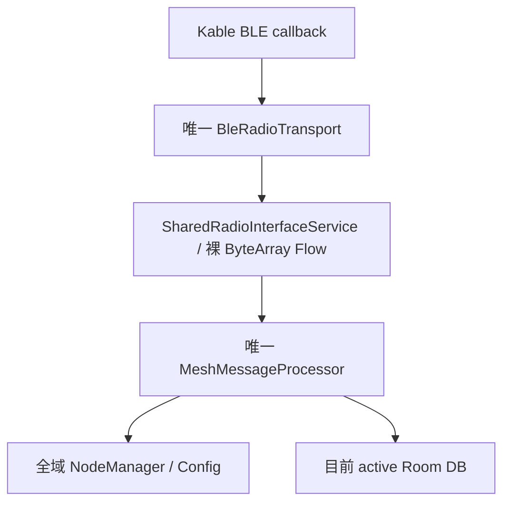
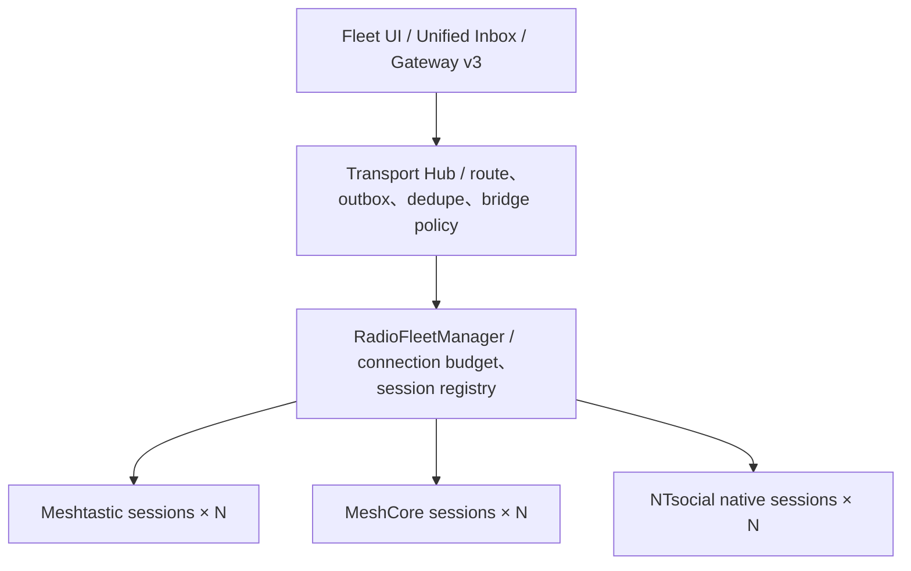
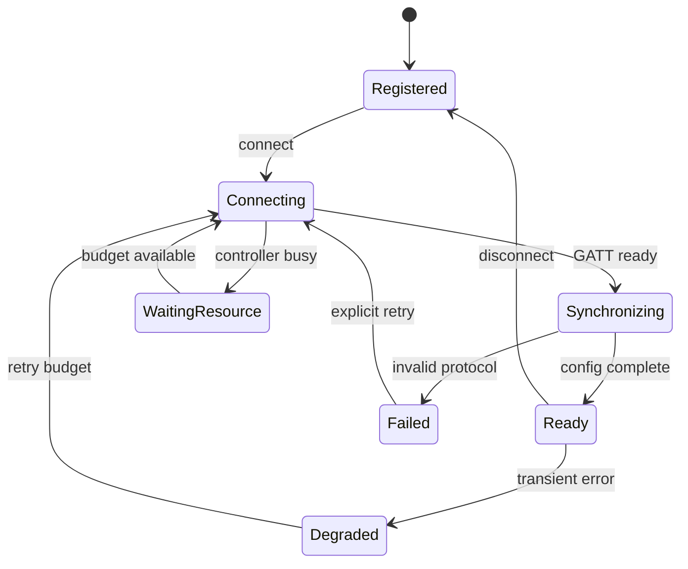

# Android NTsocial MeshLink 多節點、多平台無線電通訊架構提案

- 報告日期：2026-08-23
- 目標專案：`nuclear718/ntsocial-mesh-gateway-android`
- App 稽核基準：`main@e4c97badf810cbe5088a5ad9a3e72c853a72a2a7`（2026-08-21）
- DIY 節點稽核基準：`main@76219cd7562f76d1543f12944efc4379f788a233`（2026-08-19）
- 報告性質：架構、風險、遷移與施工提案；**尚未實作本文所述功能**

## 1. 執行摘要

### 1.1 直接回答

**技術上辦得到。**

Android App 可以同時維持多個 BLE GATT client、同時連接 3～4 台 Meshtastic 節點，也可以在同一個 App 內整合 Meshtastic、MeshCore 與第三套自訂協議。每台 Meshtastic 節點可有自己的 LoRa 設定、Primary Channel、ChannelSet、NodeDB、目的與重連生命週期。

但是，這不是把目前的 `BleRadioTransport` 複製四份就能安全完成的功能。目前 NTsocial MeshLink 在 transport 以上，幾乎所有核心物件都以「全 App 只有一台選中的 radio」為前提。若直接增加 BLE 連線數，最危險的結果不只是斷線，而是：

- Radio A 的封包被 Radio B 的 parser／NodeDB／Room DB 接收。
- 相同 packet ID 或 channel slot 在不同 radio 間互相覆蓋。
- WorkManager 重試時，訊息由「目前 radio」而不是原始指定 radio 發出。
- 舊 session callback 冒充新 session，或任一節點斷線清除其他節點的全域狀態。
- Gateway route token 指到正確 channel slot，卻指錯實體 radio。

因此正確方向是：**先把一台 radio 的完整狀態改成 endpoint-scoped session，再建立 fleet manager 管理多個 session；MeshCore 與自訂協議透過 adapter 接入；最後才加入可選擇啟用的跨平台 bridge。**

### 1.2 可行性判定

| 需求 | 判定 | 重要限制 |
|---|---|---|
| Android 同時連接 3～4 台 BLE radio | 可行，但需實機認證 | Android 沒有保證跨 OEM 的固定最大 GATT 連線數 |
| 同時連多台、不同 Primary Channel 的 Meshtastic | 可行 | 每台必須有獨立 session、config、NodeDB、outbox、generation |
| 統一顯示多 radio 收到的訊息 | 可行 | 每筆資料必須攜帶 `endpointId`、`protocol`、`network/route identity` |
| 從統一 UI 回覆原訊息 | 可行 | 必須預設沿原 ingress route 回覆，不能只靠 channel index |
| 同時整合 Meshtastic + MeshCore | 可行 | 兩套 codec、握手、身分、ACK 與路由語意必須分離 |
| 再加入 NTsocial 自訂協議 | 可行 | 自訂協議必須先定義穩定 adapter 契約與 BLE／framing 規格 |
| Meshtastic 與 MeshCore 在 RF 封包層直接互通 | 不可行 | 即使 LoRa PHY 相同，封包、加密、身分及路由格式仍不同 |
| App 將一平台訊息轉送到另一平台 | 有條件可行 | 這是解密後重封裝的 application gateway，不是透明 repeater |
| 第一版自動橋接所有 native text/control | 不建議 | 容易產生迴圈、錯誤身分、ACK 誤判與金鑰邊界混亂 |

### 1.3 建議的第一個可發布範圍

第一個正式版本應限定為：

1. 最多四個已登錄 BLE endpoints；連線建立一次一台，穩定後可並行收訊。
2. Meshtastic 多節點完整隔離。
3. MeshCore 一台以上的 text／channel data 收發。
4. 統一收件匣、endpoint／platform 徽章、沿原 route 回覆、手動選 route 發送。
5. Gateway v3 新增多 endpoint API；v1／v2 繼續指向使用者指定的 legacy primary Meshtastic endpoint。
6. 跨平台 bridge 預設關閉；第一版若開放，只橋接 NTsocial 自己的 binary overlay，`maxBridgeHops = 1`。
7. 不透過 LoRa 傳送媒體 bytes；只傳短文字、狀態與既有 NTsocial envelope。

## 2. 稽核範圍與版本邊界

### 2.1 Android 專案

本報告以 Android 專案提交 [`e4c97bad`](https://github.com/nuclear718/ntsocial-mesh-gateway-android/tree/e4c97badf810cbe5088a5ad9a3e72c853a72a2a7) 為準。專案是 Kotlin Multiplatform／Compose Multiplatform 架構，因此 commonMain 的模型與 repository 改動會同時影響 Android、Desktop、iOS。本文的第一施工目標是 Android，但共用契約必須保持可跨平台編譯，其他平台 transport wiring 應分開驗收。

### 2.2 DIY 節點

DIY 節點專案提交 [`76219cd`](https://github.com/nuclear718/NTsocial-with-Meshtastic-/tree/76219cd7562f76d1543f12944efc4379f788a233) 顯示目前硬體為 nice!nano／nRF52840 搭配 RFM95W／SX1276，README 提供 Gerber、pinout、UF2 與 Meshtastic `2.8.0.b10d31e` 成品韌體。

這個硬體倉庫本身**沒有完整韌體原始碼**；README 指向另一個 `nuclear718/faketec-RA-01SH-P` 專案。因此本報告能確認的是：目前 App 端可把該節點視為標準 Meshtastic Device API endpoint；不能把硬體倉庫誤稱為已完成自訂 wire protocol 的原始碼稽核。

另一個產品安全問題是 README 公開記載所有節點使用相同固定 BLE PIN。這對 DIY 測試方便，但正式多節點產品應改成每台獨立 PIN／配對身分，並把 endpoint 綁定到握手後的穩定 radio identity，而不是只信裝置名稱或 BLE address。

### 2.3 外部協議基準

- Android：官方 BLE、背景連線及 `connectedDevice` foreground service 文件。
- Meshtastic：官方 Client API、Device API、mesh algorithm 與 encryption 文件。
- MeshCore：官方 repository `main@d92964352441e53b93e8667b802e04f6e072b39e`（firmware 1.17.1，2026-08-14）與現行 Companion Protocol。

「最新」只代表本報告稽核日期可取得的上述提交／文件，不代表未來永遠相容；實作時應把協議版本與 conformance tests 固定在 dependency／release 流程中。

## 3. 現行 Android 架構：可保留的基礎

目前低階 BLE 實作不是主要瓶頸，以下設計可繼續使用：

- [`BleConnectionFactory`](https://github.com/nuclear718/ntsocial-mesh-gateway-android/blob/e4c97badf810cbe5088a5ad9a3e72c853a72a2a7/core/ble/src/commonMain/kotlin/com/ntsocial/meshlink/core/ble/BleConnectionFactory.kt) 每次可產生新的 connection instance。
- [`KableBleConnectionFactory`](https://github.com/nuclear718/ntsocial-mesh-gateway-android/blob/e4c97badf810cbe5088a5ad9a3e72c853a72a2a7/core/ble/src/commonMain/kotlin/com/ntsocial/meshlink/core/ble/KableBleConnectionFactory.kt) 雖然 factory 本身是 singleton，但每次 `create()` 都會建立新的 `KableBleConnection`。
- [`BleRadioTransport`](https://github.com/nuclear718/ntsocial-mesh-gateway-android/blob/e4c97badf810cbe5088a5ad9a3e72c853a72a2a7/core/network/src/commonMain/kotlin/com/ntsocial/meshlink/core/network/radio/BleRadioTransport.kt) 每個 instance 已各自持有 address、connection scope、`BleConnection`、write mutex、GATT profile 與 reconnect policy。
- 現有 generation-bound callback 與 exact-session 檢查是正確的 fail-closed 思路；應提升為「每個 endpoint 各有 generation」，而不是刪除。
- [`DatabaseManager`](https://github.com/nuclear718/ntsocial-mesh-gateway-android/blob/e4c97badf810cbe5088a5ad9a3e72c853a72a2a7/core/database/src/commonMain/kotlin/com/ntsocial/meshlink/core/database/DatabaseManager.kt) 已能快取多個 per-address database；需要改的是只允許一個 active DB 的 API。
- Android manifest 已宣告 BLE 權限、`FOREGROUND_SERVICE_CONNECTED_DEVICE`，`MeshService` 也已有 `connectedDevice|location` service type。應延伸現有單一 foreground service 統一管理 fleet，不應為四台 radio 啟動四個 service。
- Gateway v2 已具 caller-bound route token、`source_channel_id`、radio generation、TTL 與 idempotency 的良好安全基礎；v3 應延伸而不是推翻它。

## 4. 現行程式碼中的單節點假設

### 4.1 關鍵證據

| 現行檔案／symbol | 單節點假設 | 多節點時的風險 | 建議 |
|---|---|---|---|
| [`SharedRadioInterfaceService.kt`](https://github.com/nuclear718/ntsocial-mesh-gateway-android/blob/e4c97badf810cbe5088a5ad9a3e72c853a72a2a7/core/service/src/commonMain/kotlin/com/ntsocial/meshlink/core/service/SharedRadioInterfaceService.kt) | 一個 `radioTransport`、address、session state、generation、裸 `Flow<ByteArray>` | 後連線取代前連線；raw bytes 無法辨認來源 | 拆成 per-endpoint session，fleet 只做管理 |
| [`RadioInterfaceService.kt`](https://github.com/nuclear718/ntsocial-mesh-gateway-android/blob/e4c97badf810cbe5088a5ad9a3e72c853a72a2a7/core/repository/src/commonMain/kotlin/com/ntsocial/meshlink/core/repository/RadioInterfaceService.kt) | 單一 `currentDeviceAddressFlow`、`sendToRadio(bytes)` | API 無法指定 endpoint | 保留 legacy façade；新增 fleet API |
| [`RadioSessionState.kt`](https://github.com/nuclear718/ntsocial-mesh-gateway-android/blob/e4c97badf810cbe5088a5ad9a3e72c853a72a2a7/core/repository/src/commonMain/kotlin/com/ntsocial/meshlink/core/repository/RadioSessionState.kt) | 只有一組 selected／active address／epoch | generation 只防切換競態，不能表示多 session | generation 下沉至每個 endpoint |
| [`ActiveBleConnection.kt`](https://github.com/nuclear718/ntsocial-mesh-gateway-android/blob/e4c97badf810cbe5088a5ad9a3e72c853a72a2a7/core/ble/src/commonMain/kotlin/com/ntsocial/meshlink/core/ble/ActiveBleConnection.kt) | 全域只有一個 `active` | 最後連線者覆蓋前者；RSSI／disconnect 判斷錯台 | 移除全域 pointer，或改 endpoint registry |
| [`ScannerViewModel.kt`](https://github.com/nuclear718/ntsocial-mesh-gateway-android/blob/e4c97badf810cbe5088a5ad9a3e72c853a72a2a7/feature/connections/src/commonMain/kotlin/com/ntsocial/meshlink/feature/connections/ScannerViewModel.kt) | 只掃 Meshtastic UUID；點選呼叫單一 `setDeviceAddress` | UI 是「切換」不是「加入 fleet」 | 改成 discovery + register + per-card connect toggle |
| [`KableBleScanner.kt`](https://github.com/nuclear718/ntsocial-mesh-gateway-android/blob/e4c97badf810cbe5088a5ad9a3e72c853a72a2a7/core/ble/src/commonMain/kotlin/com/ntsocial/meshlink/core/ble/KableBleScanner.kt) | filter 僅接受一個 service UUID | 無法一次分類 Meshtastic、MeshCore、自訂協議 | 新增多 UUID scan request 與 protocol probe |
| [`RadioPrefsImpl.kt`](https://github.com/nuclear718/ntsocial-mesh-gateway-android/blob/e4c97badf810cbe5088a5ad9a3e72c853a72a2a7/core/prefs/src/commonMain/kotlin/com/ntsocial/meshlink/core/prefs/radio/RadioPrefsImpl.kt) | 只保存 `devAddr2`、`devName` | 新選擇覆蓋舊 endpoint | 新增 durable endpoint catalog；舊 key 只做 migration |
| [`MeshServiceOrchestrator.kt`](https://github.com/nuclear718/ntsocial-mesh-gateway-android/blob/e4c97badf810cbe5088a5ad9a3e72c853a72a2a7/core/service/src/commonMain/kotlin/com/ntsocial/meshlink/core/service/MeshServiceOrchestrator.kt) | 只切一個 DB、載入一份 NodeManager、收一條無來源 Flow | parser、NodeDB、DB 串台 | orchestration 移至 session actor |
| `NodeManagerImpl`、`MeshConnectionManagerImpl`、`RadioConfigRepositoryImpl`、`MeshMessageProcessorImpl` | radio-owned mutable state 都是 `@Single` | 相同 node number／config nonce 交錯污染 | 由 `MeshtasticSessionComponentFactory` 建立 session graph |
| [`DatabaseManager.kt`](https://github.com/nuclear718/ntsocial-mesh-gateway-android/blob/e4c97badf810cbe5088a5ad9a3e72c853a72a2a7/core/database/src/commonMain/kotlin/com/ntsocial/meshlink/core/database/DatabaseManager.kt) | 多 DB cache，但只有 `currentDb/currentAddress` | 並行寫入當下 active DB | 注入固定的 `EndpointDatabaseHandle` |
| `ChannelSetDataSource`、`LocalConfigDataSource`、`ModuleConfigDataSource` | 全 App 固定 DataStore 檔案 | 多 radio config 互相覆寫 | per-endpoint store 或移入 endpoint DB |
| `MessageQueue`、`WorkManagerMessageQueue`、`SendMessageWorker` | queue key 只有 packet ID；worker 使用目前 DB／controller | packet ID 碰撞、切換後錯 radio 重送 | delivery ID + endpoint + route generation |
| `NtsocialGatewayProvider`、`RouteTokenStore`、`CommandReceiver` | v2 route 只有 channel／單一 radio generation | token 無法區分相同 slot 的四台 radio | v1/v2 不動；新增 endpoint-aware v3 |
| [`MeshCoreStateStore.kt`](https://github.com/nuclear718/ntsocial-mesh-gateway-android/blob/e4c97badf810cbe5088a5ad9a3e72c853a72a2a7/feature/meshcore/src/commonMain/kotlin/com/ntsocial/meshlink/feature/meshcore/MeshCoreStateStore.kt) | 一份 active transport／contacts／channels／messages snapshot | 第二台 MeshCore 會覆蓋第一台 | snapshot 移入 MeshCore endpoint session |

### 4.2 現行資料流為何無法安全擴成 List



上圖每一層都遺失來源 identity。把第一層改成四個 BLE connection，而不把 `endpointId` 貫穿到底，只會讓四條資料流更快地進入同一組全域狀態。

## 5. Android 同時連接 3～4 台 BLE 的工程判斷

Android 的 `BluetoothManager.getConnectedDevices(GATT)` 以集合表示連線，API 模型允許多個 GATT client；每台 peripheral 也可以有自己的 `BluetoothGatt`／Kable connection、callback 與 operation queue。因此三到四個低流量 LoRa companion radio 是合理的產品目標。

但 Android 官方沒有公布一個所有手機、所有 OEM 都保證的最大同時 GATT 連線數。控制器資源、OEM Bluetooth stack、耳機／手錶／車機等其他連線，以及同時執行 service discovery、MTU、descriptor write 都會影響結果。正確產品承諾應是：

> 架構支援最多四個 active endpoints；實際 effective budget 依通過認證的裝置 profile 與執行期資源狀況決定。

### 5.1 建議 BLE policy

- `desiredActiveSessions = 4`；未認證手機可先以 effective budget 2 啟動，允許使用者或 capability profile 升到 4。
- `connectionBootstrapConcurrency = 1`：一次只做一台的 connect、service discovery、notification、MTU 與 protocol sync；READY 後再啟動下一台。
- 每個 endpoint 一個 GATT operation actor；同一 connection 一次只允許一個未完成的 read／write／descriptor operation。
- READY 後不同 endpoint 可並行接收 notification，write queue 只在 endpoint 內序列化。
- fleet 層使用 jittered exponential backoff 與全域 reconnect token bucket；一台不斷 flap 不得餓死其他三台。
- 資源不足時只把最低優先 endpoint 標為 `WAITING_RESOURCE`，不可拆掉已健康的 sessions，也不可顯示成 READY。
- 掃描使用一個 shared scan multiplexer；UI 登錄完成後停止持續掃描，重連優先使用已配對 identity／address。
- 目前 `BleRadioTransport` 在 profile discovery 後要求 high connection priority；多 radio 時只在握手或 outbound burst 暫時升至 HIGH，完成後回 BALANCED。
- 現有 `MeshService` 繼續作唯一 aggregate foreground service，通知顯示例如「3/4 radios connected」。
- process 被殺後 GATT 會關閉；durable endpoint registry、outbox 與 reconnect intent 必須能在 service 重建後恢復。

### 5.2 RF 層的另一個限制

BLE 能同時連四台，不代表四個彼此靠近的 LoRa module 適合同時發射。相同或鄰近頻率的發射可能造成碰撞，甚至讓旁邊接收機前端過載。App 應加入 `RfAirtimeScheduler`，錯開由手機觸發的 TX；但它無法控制節點自己產生的 telemetry、routing 或 relay，因此仍需用真實天線距離、頻率組合與功率做測試。

## 6. 多台 Meshtastic 節點的正確模型

Meshtastic 的 BLE service UUID 在所有節點相同，這不妨礙多連線；connection instance／bonded identity／endpoint ID 才是區分依據。每一台連線都必須獨立執行：

1. 建立 GATT／啟用 `FromNum` notification。
2. 產生自己的 `want_config_id`。
3. 讀取自己的 `FromRadio` queue，直到 matching config-complete。
4. 建立自己的 `MyNodeInfo`、NodeDB、ChannelSet、LocalConfig、ModuleConfig snapshot。
5. 維護自己的 packet queue、admin session、reconnect generation 與 database handle。

### 6.1 Primary Channel 與 route namespace

`MeshPacket.channel` 是該 radio 的 local channel index，不是全域 ID。因此：

- Radio A 的 channel 0 不等於 Radio B 的 channel 0。
- 相同顯示名稱不等於相同網路。
- 相同 PSK 但不同 frequency／region／modem preset 也不一定互通。
- route key 至少要包含 `protocol + endpointId + logicalNetworkFingerprint + stableChannelIdentity`。
- slot 只能是被 generation 驗證過的即時投影，不能作 durable identity。

如果數個用途其實使用完全相同的 LoRa PHY，只是不同加密 channel，一台 Meshtastic radio 的 primary／secondary channels 可能已足夠；如果頻率、region、modem preset、監聽任務、天線或備援角色不同，使用多台 radio 才是正確做法。

### 6.2 同一 mesh 的重複收訊

同一個 Meshtastic packet 可能同時被兩台已連線 radio 收到。去重不應使用全 App `packetId`，建議 native fingerprint：

`(protocol, logicalNetworkFingerprint, senderNodeNum, packetId)`

當 native packet ID 不可用時，才以 sender、route、payload hash 與短時間窗作 fallback。去重後仍要保留多筆 `IngressObservation`，因為兩台 radio 的 RSSI、SNR、hop metadata 有診斷價值。

## 7. Meshtastic、MeshCore 與自訂協議的邊界

| 面向 | Meshtastic | MeshCore | NTsocial 自訂協議建議 |
|---|---|---|---|
| BLE service | Meshtastic UUID | Nordic UART Service | 獨立 UUID，不與前兩者衝突 |
| Host framing | protobuf `ToRadio/FromRadio` | binary command／response／events | versioned binary frame |
| 連線握手 | `want_config_id` config sync | `APP_START`、device query、time、contacts／channels sync | `HELLO` + capability negotiation |
| 主要身分 | node number，另有 public-key 能力 | 32-byte Ed25519 public key | 穩定 public identity |
| Channel identity | radio-local slot + channel/config | radio-local 0～7 + channel secret/type | stable route ID + config fingerprint |
| 路由 | flooding／next-hop direct | flood／stored repeater path | 明確聲明 routing capability |
| ACK 語意 | queue／routing／rebroadcast 等多層 | command ACK、sent event、delivery report | 明確分開 radio accepted 與 peer receipt |
| App 可見內容 | radio 解密後的應用層資料 | radio 處理 direct／group crypto 後回傳 | adapter 內完成 crypto／codec |

即使兩平台設定完全相同的 LoRa frequency、SF、BW、coding rate，它們也不會因此直接互通。跨平台轉送的真實流程是：

```text
來源 radio 解密
→ App 取得應用層內容
→ 正規化並套用 bridge policy
→ 目的 adapter 重新封裝
→ 目的 radio 使用自己的金鑰發送
```

目的平台看到的是 gateway 重新發出的訊息，不是原 sender 的原生密碼學身分；因此 UI 與 API 都不得宣稱跨平台端對端加密仍然連續存在。

## 8. 目標架構



### 8.1 四個必要層次

1. **Physical link**：BLE／USB／TCP 的連接、MTU、read/write、重連；不知道 Meshtastic message 或 MeshCore contact。
2. **Protocol session**：一個 endpoint 的握手、codec、config、native identity、route 與 ACK 映射。
3. **Radio fleet**：所有 endpoint 的登錄、優先順序、connection budget、session generation 與 aggregate state。
4. **Transport hub**：統一訊息、durable outbox、route planner、去重、delivery tracking 與 opt-in bridge。

MeshCore frame 不得塞入 Meshtastic `IMeshService`／`DataPacket`；Meshtastic protobuf 也不得逸出成全 App 的 canonical data model。

### 8.2 身分層次

| 身分 | 意義 | 可否變動 |
|---|---|---|
| `EndpointId` | App 登錄的一台實體 radio；App 產生的 UUID | 穩定，不隨 BLE address／名稱變動 |
| `SessionGeneration` | 該 endpoint 一次有效連線／config snapshot | 每次 reconnect 或破壞性 config 變更遞增 |
| `LogicalNetworkId` | App 內對一個可互通 RF／security domain 的 opaque fingerprint | config 改變時可能改變 |
| `RouteId` | endpoint 上一個 direct／group／channel 送出目的 | 穩定 ID，解析到當下 native slot |
| `NativePrincipalId` | Meshtastic node、MeshCore public key 或自訂身分 | protocol 原生 |
| `CanonicalPrincipalId` | 使用者明確綁定的跨平台人物 | 不得依 display name 自動建立 |

`LogicalNetworkId`／stable channel identity 不應保存或輸出 raw secret。若 adapter 能讀到 channel secret，可在本機用 `HMAC-SHA-256(appInstallSalt, protocol + RF 參數 + normalized secret)` 產生不可逆 fingerprint，讓同一 App 內的兩台 radio 判斷是否屬於同一 network；若協議不允許讀取 secret，就使用裝置提供的 opaque stable identity，並預設**不自動合併**。既有 `source_channel_id` 的「opaque、stable；slot 可變」原則應完整保留。

## 9. 建議新增的核心 Kotlin 契約

以下是目標 signature，目的是固定資料所有權與隔離邊界；不是已經可以直接編譯的完整 patch。

### 9.1 Endpoint 與 session state

```kotlin
@JvmInline
value class RadioEndpointId(val value: String)

enum class RadioProtocol {
    MESHTASTIC,
    MESHCORE,
    NTSOCIAL_NATIVE,
}

data class RadioEndpointProfile(
    val id: RadioEndpointId,
    val protocol: RadioProtocol,
    val transportAddress: String,
    val displayName: String,
    val role: String?,
    val enabled: Boolean,
    val autoConnect: Boolean,
    val priority: Int,
    val legacyPrimary: Boolean,
)

sealed interface EndpointSessionState {
    data object Registered : EndpointSessionState
    data object Connecting : EndpointSessionState
    data object Synchronizing : EndpointSessionState
    data class Ready(val generation: Long) : EndpointSessionState
    data class Degraded(val reason: String) : EndpointSessionState
    data object WaitingResource : EndpointSessionState
    data class Failed(val retryAtMillis: Long?) : EndpointSessionState
}
```

`RadioEndpointId` 是 App 自己保存的穩定 UUID；`transportAddress` 只是可更新的 transport locator。`legacyPrimary` 只供現有單 radio UI 與 Gateway v1/v2 相容，不代表 fleet 只能有一個 READY endpoint。

### 9.2 Protocol adapter 與 per-endpoint session

```kotlin
interface RadioProtocolAdapter {
    val protocol: RadioProtocol

    fun probe(advertisement: BleAdvertisement): ProbeResult

    fun createSession(
        endpoint: RadioEndpointProfile,
        context: EndpointSessionContext,
    ): RadioEndpointSession
}

interface RadioEndpointSession {
    val endpointId: RadioEndpointId
    val state: StateFlow<EndpointSessionState>
    val routes: StateFlow<List<NativeRoute>>
    val events: Flow<ProtocolEvent>

    suspend fun start()
    suspend fun submit(command: NativeEgressCommand): NativeSubmission
    suspend fun stop()
}
```

`RadioProtocolAdapter` 只負責判斷協議與建立 session；`RadioEndpointSession` 擁有一台 radio 的 mutable state。`events` 已隱含 exact endpoint，不再把裸 `ByteArray` 丟到全域 parser。

### 9.3 Fleet manager

```kotlin
interface RadioFleetManager {
    val snapshots: StateFlow<Map<RadioEndpointId, EndpointSnapshot>>
    val events: Flow<FleetEvent>

    suspend fun register(candidate: DiscoveredRadio): RadioEndpointId
    suspend fun connect(endpointId: RadioEndpointId)
    suspend fun disconnect(endpointId: RadioEndpointId)
    suspend fun submit(
        endpointId: RadioEndpointId,
        expectedGeneration: Long,
        command: NativeEgressCommand,
    ): NativeSubmission
}
```

`submit` 強制攜帶 endpoint 與 expected generation。若 radio 已 reboot、channel snapshot 已改變或 route 被刪除，必須 fail closed，而不是改送到同 slot 的新頻道。

### 9.4 Canonical transport model

```kotlin
data class CanonicalTransportMessage(
    val messageId: String,
    val originProtocol: RadioProtocol,
    val originEndpointId: RadioEndpointId,
    val logicalNetworkId: String,
    val nativeMessageId: String?,
    val sender: NativePrincipalRef?,
    val conversation: ConversationRef,
    val content: TransportContent,
    val createdAtMillis: Long,
    val expiresAtMillis: Long?,
    val bridgeTrace: List<String>,
)

data class IngressObservation(
    val messageId: String,
    val endpointId: RadioEndpointId,
    val sessionGeneration: Long,
    val receivedAtMillis: Long,
    val rssi: Int?,
    val snr: Float?,
    val hops: Int?,
)
```

Canonical transport model 只用來做短期 transport／routing／統一 inbox 投影，**不取代 NTsocial 母程式的 canonical social history**。同一 message 可有多筆 observation，避免為了去重而丟失 RF 診斷資料。

### 9.5 Delivery 語意

```kotlin
enum class DeliveryStage {
    DURABLY_QUEUED,
    ADAPTER_ACCEPTED,
    RADIO_ACCEPTED,
    OVER_AIR_SENT,
    RELAY_OBSERVED,
    NATIVE_ACK,
    PEER_APP_RECEIPT,
    FAILED_TRANSIENT,
    FAILED_PERMANENT,
    EXPIRED,
}
```

不可把 `ACCEPTED_LOCAL`、MeshCore `PACKET_MSG_SENT`、Meshtastic routing ACK 或聽到 relay 全部顯示成「對方已收到」。只有 NTsocial application receipt 才能宣稱 peer App 已處理。

## 10. Session state machine



每個 endpoint 各自運行這個 state machine。Fleet 只決定誰可以進入 Connecting、何時重試與 aggregate status；它不能共享 protocol handshake nonce 或 command queue。

## 11. Meshtastic 重構方案

### 11.1 不要把所有 repository 改成巨大的 Map

不建議在每個 `NodeManager`、`RadioConfigRepository`、`MeshConnectionManager` 方法上增加 `endpointId`，再讓所有 singleton 內部維護 `Map<EndpointId, ...>`。這會把原本清楚的一台 Meshtastic 狀態圖變成全域多租戶物件，任何漏掉 key 的路徑都會造成資料串台。

建議建立 `MeshtasticSessionComponentFactory`，每次明確建立：

- `MeshtasticRadioSession`／由現有 `SharedRadioInterfaceService` 抽出的 per-session state。
- 一個 `BleRadioTransport`。
- session-owned `MeshConnectionManager`、`MeshMessageProcessor`、`FromRadioPacketHandler`、`MeshRouter`。
- session-owned `NodeManager`、admin／config readback state。
- 固定的 `EndpointDatabaseHandle` 與 endpoint config store。
- session-owned inbound／outbound actor 與 generation。

不要複製整個 Koin application；用明確 factory 組出一個 session component，避免 `@Single` annotation 與動態 endpoint scope 互相衝突。

### 11.2 Legacy 相容 façade

現有 feature、`RadioController`、`RadioInterfaceService`、`ServiceRepository` 一次全面改寫的風險太高。建議新增：

```text
FleetBackedRadioInterfaceService
  └─ 觀察 primaryEndpointId
     └─ 將舊 API 投影到指定 Meshtastic session
```

- 舊 `setDeviceAddress` 在 migration 期間改成「建立／選定 legacy primary endpoint」。
- 舊 `connectionState` 只顯示 legacy primary 的狀態。
- 舊 `receivedData` 僅供該 façade 的 Meshtastic session，不供新 unified hub 使用。
- 新 Connections／Unified Inbox 直接讀 `RadioFleetManager`，不經 legacy façade。

這能讓多節點核心先落地，同時維持現有單 radio 頁面與 Gateway v1/v2。

### 11.3 狀態 scope 分類

| Scope | 元件／資料 | 規則 |
|---|---|---|
| Endpoint session-owned | transport、handshake nonce、NodeDB、ChannelSet、Local／Module Config、admin state、native ACK、RSSI、packet queue | 不得被其他 endpoint 讀寫或清除 |
| Fleet-global | endpoint catalog、connection／reconnect budget、aggregate FGS、unified outbox、dedupe、bridge ledger | 所有 key 必須包含 endpoint／route namespace |
| App-global | theme、語言、權限狀態、使用者對 fleet 的 policy | 不包含 radio config 或 native secret |
| Legacy-primary-only（第一階段） | 現有完整 radio config UI、firmware update、既有 Gateway v1/v2 | 由 façade 明確標示目前投影 endpoint |

手機 GPS 注入、MQTT proxy、telemetry request 等「會產生 RF／網路流量」的功能不能因 fleet READY 就自動對四台全開。它們必須成為 per-endpoint policy，第一階段只沿 legacy primary 啟用；使用者明確開啟其他 endpoint 後，仍要經 airtime／privacy policy。

## 12. Database、DataStore 與 durable outbox

### 12.1 Native database 隔離

把現行 `DatabaseManager.switchActiveDatabase(address)` 改造成 keyed handle：

```kotlin
interface EndpointDatabaseCatalog {
    suspend fun open(
        endpointId: RadioEndpointId,
        nativeAddress: String,
    ): EndpointDatabaseHandle
}

interface EndpointDatabaseHandle {
    val endpointId: RadioEndpointId
    suspend fun <T> read(block: suspend (MeshDatabase) -> T): T
    suspend fun <T> write(block: suspend (MeshDatabase) -> T): T
}
```

`currentDb` 可暫時保留給「目前正在查看的 legacy primary」UI，但 radio ingress、outbox worker、config sync 都不得再用 current DB 決定資料歸屬。

### 12.2 Config store

`local_config.pb`、`module_config.pb`、`channel_set.pb`、`local_stats.pb` 目前是全 App 固定檔案。兩種可行方案：

1. 由 `RadioScopedStoreFactory` 產生 `radio_<endpointId>_channel_set.pb` 等檔案。
2. 將 radio config snapshot 移到對應 endpoint 的 Room DB。

建議第二種，因為 message、route 與 config generation 可以有一致的交易邊界；raw PSK／secret 則留在 protocol-owned secure storage，不進 unified transport DB。

### 12.3 全域 transport ledger

另外建立不含 native secret 的 fleet transport DB，至少包含：

| Table | 用途 | 關鍵唯一鍵 |
|---|---|---|
| `radio_endpoint` | endpoint registry、protocol、address、priority、auto-connect | `endpoint_id` |
| `native_route` | endpoint 上可用 route 與 captured generation | `route_id` |
| `transport_message` | canonical transport envelope | `message_id` |
| `ingress_observation` | 每台 radio 的 RF 收訊 metadata | `message_id + endpoint_id + native_fingerprint` |
| `delivery` | 一則 message 到一條 route 的 durable 工作 | `message_id + route_id` |
| `delivery_attempt` | retry／native receipt 歷程 | `delivery_id + attempt_no` |
| `ingress_dedup` | native packet 防重播 | `protocol + network + fingerprint` |
| `bridge_ledger` | 防止跨網重複送出 | `message_id + target_network` |
| `fragment_state` | 小 payload 的重組狀態 | `message_id + part_index` |

### 12.4 WorkManager 修正

目前 unique work `send_message_<packetId>` 在多 radio 下不安全。改為：

```text
radio_delivery_<globallyUniqueDeliveryId>
```

Worker input 必須保存 `deliveryId`，再由 DB 解析出 exact `endpointId`、`routeId`、expected generation 與 channel identity。Worker 不可讀 `currentDb`，也不可透過全域 controller 把訊息送給目前 radio。

送出前必須重新驗證：

1. endpoint 仍存在且允許 send。
2. session 是 READY。
3. generation 與 delivery capture 相符。
4. route stable identity 仍存在。
5. route 解析出的 slot／contact 是當下同一 native identity。
6. payload 不超過 adapter capability；需要時先 fragment。

## 13. MeshCore 實作計畫

現有 [`docs/meshcore-integration.md`](https://github.com/nuclear718/ntsocial-mesh-gateway-android/blob/e4c97badf810cbe5088a5ad9a3e72c853a72a2a7/docs/meshcore-integration.md) 已正確記載：目前只有 domain model、UI/state 與 codec 基礎，尚未完成 BLE／USB／TCP transport、真實 sync、持久化、設定寫入與 message send。

### 13.1 每個 MeshCore endpoint 需要

- Nordic UART GATT profile：service `6E400001...`、App→radio RX `...0002`、radio→App TX `...0003`。
- 獨立 `MeshCoreCommandActor`：一次只允許一個 command，等待 response 或 timeout 後才能送下一個。
- 連線後依序執行 `APP_START`、device query、time、contacts、channels 與 queued messages sync。
- 獨立 command correlation、inactivity reconnect、MTU 與 max-payload capability。
- endpoint-owned contacts、channels、conversation snapshot；現有單一 `MeshCoreStateStore` 不得作 fleet store。
- 原生 ACK／delivery report 映射到前述分層 `DeliveryStage`。

Nordic UART Service 是通用 profile，不是 MeshCore 專屬識別。掃描命中 NUS 只能標示為 candidate；完成 notification 後必須用受限的 protocol probe／device query 驗證合法 MeshCore response，才能把它登錄成 MeshCore endpoint。驗證失敗要安全斷線，不能把任意 NUS 裝置交給 MeshCore parser。

### 13.2 更新現有 codec

專案文件的舊基準是 MeshCore 1.16.0；稽核時官方已到 [firmware 1.17.1／`d929643`](https://github.com/meshcore-dev/MeshCore/tree/d92964352441e53b93e8667b802e04f6e072b39e)。在建立 transport 前應先用 golden vectors 更新 [`MeshCoreCompanionProtocol.kt`](https://github.com/nuclear718/ntsocial-mesh-gateway-android/blob/e4c97badf810cbe5088a5ad9a3e72c853a72a2a7/core/meshcore/src/commonMain/kotlin/com/ntsocial/meshlink/core/meshcore/MeshCoreCompanionProtocol.kt)，至少包含：

- `CMD_SEND_CHANNEL_DATA = 0x3E`。
- `RESP_CODE_CHANNEL_DATA_RECV = 0x1B`。
- binary channel datagram，現行最大 data payload 163 bytes。
- 現行尚未處理的 sent／time／advertisement／ACK／log events。
- 未知 event 必須 length-check、記錄 redacted diagnostic 後安全忽略，不能讓 session actor 崩潰。

MeshCore binary channel datagram 是 NTsocial overlay 最適合的入口，因為它可以攜帶 message ID、fragment header 與 signature；native text 不適合隱藏這些欄位。正式產品應向 MeshCore 申請固定 `data_type`；開發／POC 才使用其保留的 testing namespace。

163-byte 上限小於 Meshtastic 現有 client envelope 的 180-byte 邊界，所以 chunking 必須是 route capability 驅動，不能全平台硬編碼同一 payload size。第一版也不應假設 MeshCore 已支援 direct binary overlay；先限定 channel data。

## 14. 第三套 NTsocial 自訂協議

自訂協議若從一開始符合下列契約，日後只需新增 adapter，不必再修改 fleet、unified inbox 或 bridge engine：

- 獨立 BLE service／RX／TX UUID。
- `HELLO` 中交換 protocol major/minor、capability bitmap、max frame、max payload、MTU 與 device identity。
- 穩定 public identity，不只依賴可變的 BLE address／名稱。
- 128-bit message ID、request ID／response correlation、非同步 event stream。
- 明確的 network／route stable identity、TTL／hop limit、native sequence。
- length framing、fragmentation／reassembly、CRC 作傳輸錯誤偵測。
- replay protection、idempotent send、精確 ACK level。
- 使用經審核的標準 AEAD／signature／key agreement；**不要自行發明密碼學原語**。
- disconnect 後的 sync cursor／replay window。
- fake radio／emulator 與 golden frame vectors。

第一版採 compile-time KMP adapter module，例如 `core:ntsocial-radio`。不要先做任意 APK／Dex 動態 plugin 載入，否則會引入簽章、權限、ABI 與惡意程式碼風險。

## 15. Unified routing、去重與跨平台 bridge

### 15.1 統一收件匣不等於橋接

- **Unified Inbox**：App 同時顯示多平台收到的訊息，不會自動重新發射。
- **Manual fan-out**：使用者明確選擇一或多條 destination routes。
- **Bridge**：符合 rule 的 ingress 自動在另一 network 重新送出。

第一版應先完成前兩項；bridge 需額外安全審查與 soak test。

### 15.2 Bridge rule

```kotlin
data class BridgeRule(
    val source: RouteSelector,
    val targets: List<RouteSelector>,
    val allowedContentTypes: Set<String>,
    val maxBridgeHops: Int,
    val ttlMillis: Long,
    val rateLimit: RateLimit,
    val enabled: Boolean,
)
```

安全預設：

- `enabled = false`。
- 第一版 `maxBridgeHops = 1`。
- source 與 target 必須是 exact logical network／route；禁止用「同 channel 名稱」或「同 slot」自動配對。
- 第一版只允許 NTsocial binary overlay；不橋接 admin/config、routing control、ACK、telemetry、node advert 或任意 native text。
- 若同一 logical network 有兩台 radio，預設 `ANY_ONE` 選健康 route，不同時重複發送；redundant-send 必須由使用者明確開啟。

### 15.3 三層防迴圈

1. **Ingress dedupe**：`UNIQUE(protocol, logicalNetworkId, nativeFingerprint)`。
2. **Canonical dedupe**：`UNIQUE(messageId)`。
3. **Bridge egress ledger**：`UNIQUE(messageId, targetLogicalNetworkId)`。

bridge 必須在同一 DB transaction 先 reserve ledger，再 enqueue delivery，不能先 RF send、事後才記錄。另需：

- 不送回原 ingress network。
- target 已在 bridge trace 時拒絕。
- TTL 到期拒絕。
- fragment 全部收齊並驗證完整性後才允許 bridge。
- receipt／control frame 不再 fan-out。
- durable ledger 是主要防護；程序內 LRU cache 只能加速，不能作唯一防線。

Native protocol 無法攜帶隱藏 bridge metadata 時，可用本機 fingerprint ledger 防回音，但會有誤判可能；這也是第一版只橋接 NTsocial overlay 的理由。

### 15.4 身分與金鑰

- Meshtastic node number、MeshCore public key、自訂 protocol identity 一律先視為不同 principal。
- 相同 display name 不代表同一個人。
- `CanonicalPrincipalId` 只能由使用者明確綁定，若要標示「已驗證」，需完成兩平台 ownership challenge。
- adapter 自己保存 native secret；hub 只取得 opaque route identity、security class 與 capabilities。
- 不自動把 Meshtastic PSK 複製為 MeshCore secret。
- raw PSK／secret 不進 Provider、log、crash report、analytics 或 unified DB。
- `MeshCoreChannel(secret: ByteArray)` 在真實 transport 上線前應改成 redacted projection／`SecretRef`；raw secret 只在 secure store 與 codec command 的最短生命週期內存在。

## 16. Gateway v3

專案規範要求 Gateway v1 immutable、v2 additive。現有 v1／v2 不能直接增加會改變既有 caller 語意的多 radio 行為。建議：

- v1／v2 永遠投影到使用者指定的 `legacyPrimaryEndpointId`。
- 新增 fleet-aware v3，繼續使用既有 signature permission／caller verification。
- v3 不接受 caller 自行指定 BLE address 或 native channel slot；caller 只能使用 provider 發出的短期 route token。

### 16.1 建議 URI

```text
/v3/endpoints
/v3/routes
/v3/status
/v3/message-changes
```

### 16.2 主要欄位

| URI | 必要欄位 |
|---|---|
| `endpoints` | `endpoint_id`、`protocol`、alias、state、capabilities、generation；不含 BLE secret |
| `routes` | `route_token`、`endpoint_id`、`protocol`、opaque `source_route_id`、display label、max payload、captured generation、expiry |
| `status` | fleet aggregate + per-endpoint state；v1/v2 仍回 legacy primary |
| `message-changes` | cursor epoch、message ID、ingress endpoint、protocol、route、delivery stage |

route token 必須綁定：

`caller + endpointId + protocol + stableRouteId + capturedNativeSlot + endpointGeneration + expiry`

Idempotency fingerprint 也要加入 `endpointId`、`protocol`、`routeId`，避免相同 client message ID 在不同 radio 被錯誤視為同一工作。

## 17. Connections 與訊息 UI

### 17.1 Connections 改為 Radio Fleet

每張 endpoint card 顯示：

- protocol badge：Meshtastic／MeshCore／NTsocial。
- alias、用途／role。
- `CONNECTING / SYNCHRONIZING / READY / DEGRADED / WAITING_RESOURCE / FAILED`。
- RSSI、battery、最後收訊時間。
- Primary Channel／MeshCore channel 摘要，但顯示值必須帶 endpoint context。
- auto-connect、priority、connect toggle。
- 「設為 legacy primary」選項，只影響舊畫面與 Gateway v1/v2。

掃描結果不再直接呼叫 `setDeviceAddress`。使用者點選後先建立 `RadioEndpointProfile`，再選擇是否 auto-connect。

### 17.2 Unified Inbox

- 每則訊息顯示 platform badge、endpoint alias 與 route label。
- Reply 預設沿原 ingress endpoint／route；若 generation 已失效，要求使用者重新選 route，不靜默改送。
- 同一 native message 經兩台 radio 收到時顯示一則 canonical message，可展開查看多筆 RSSI／SNR observations。
- Fan-out 是明確動作，並在 UI 顯示每條 delivery leg 的狀態。
- 所有「送出」「radio accepted」「relay observed」「peer receipt」文案分開。

### 17.3 既有設定頁

第一階段現有 Meshtastic Nodes、Channels、Radio Config 頁面只顯示 legacy primary。第二階段再加入 endpoint selector；所有寫入 command 必須捕捉 exact endpoint generation，不能依全域目前 radio。

## 18. 具體檔案與程式碼修改清單

### 18.1 新增

| 路徑 | 內容 |
|---|---|
| `core/radio-fleet/build.gradle.kts` | KMP fleet／hub module；先維持一個模組，避免過早切太多 Gradle modules |
| `core/radio-fleet/.../model/RadioEndpoint.kt` | `EndpointId`、profile、protocol、state、capabilities |
| `core/radio-fleet/.../RadioEndpointStore.kt` | durable registry、priority、auto-connect、legacy primary migration |
| `core/radio-fleet/.../RadioFleetManager.kt` | session map、connection budget、aggregate events |
| `core/radio-fleet/.../RadioEndpointSession.kt` | adapter／session SPI |
| `core/radio-fleet/.../BleConnectionCoordinator.kt` | bootstrap semaphore、reconnect budget、scan multiplexer |
| `core/radio-fleet/.../UnifiedTransportHub.kt` | canonical ingress、route planner、delivery tracker |
| `core/radio-fleet/.../BridgePolicyEngine.kt` | opt-in rule、ledger、loop protection |
| `core/service/.../MeshtasticSessionComponentFactory.kt` | 建立 endpoint-scoped Meshtastic graph |
| `core/service/.../MeshtasticRadioSession.kt` | 從 `SharedRadioInterfaceService` 抽出的 per-session state machine |
| `core/database/.../EndpointDatabaseCatalog.kt` | keyed DB handle |
| `core/meshcore/.../MeshCoreBleSession.kt` | NUS link、handshake、sync |
| `core/meshcore/.../MeshCoreCommandActor.kt` | 每 endpoint 一次一個 command |
| `core/meshcore/.../MeshCoreProtocolAdapter.kt` | Fleet adapter |
| `core/ntsocial-radio/...` | 第三協議 adapter、codec、fake；後期新增 |
| `core/gateway/.../v3/*` | endpoint-aware provider contract／route token |

### 18.2 修改

| 現行檔案／區域 | 修改 |
|---|---|
| `settings.gradle.kts` | include `:core:radio-fleet`，後期 include `:core:ntsocial-radio` |
| `BleScanner.kt`／`KableBleScanner.kt` | 新增 `BleScanRequest(serviceUuids: Set<Uuid>, addresses: Set<String>)`；保留舊 overload |
| `MeshtasticBleDevice.kt` | 不再假定所有 advertisement 都是 Meshtastic；抽出 generic BLE candidate |
| `ActiveBleConnection.kt`／`KableBleConnection.kt` | 移除單一 global active；狀態歸 session 或 keyed registry |
| `BleRadioTransport.kt` | 加入可調 connection priority；握手後回 BALANCED；錯誤回報帶 endpoint context |
| `SharedRadioInterfaceService.kt` | 抽出 per-session 邏輯；剩餘舊 API 改成 fleet-backed primary façade |
| `RadioInterfaceService.kt` | 舊 interface 保留；新程式不得用它控制 fleet |
| `MeshService.kt`／`MeshServiceOrchestrator.kt` | 一個 FGS 啟動 fleet，聚合 notification；不再把裸 bytes送全域 processor |
| `NodeManagerImpl`、`MeshConnectionManagerImpl`、`MeshMessageProcessorImpl` 等 | 移除 radio-owned `@Single`；由 session factory 建立 |
| `DatabaseManager.kt` | 新增 keyed handle；current DB 限縮為 legacy UI projection |
| config DataSources | endpoint scope 或移入 endpoint DB；保留舊檔 migration |
| `RadioPrefsImpl.kt` | 舊 `devAddr2` 一次性遷移成 legacy primary endpoint；暫不刪 key |
| `MessageQueue.kt`／`WorkManagerMessageQueue.kt`／`SendMessageWorker.kt` | packet ID 改 globally unique delivery ID；input 加 endpoint／route generation |
| `MeshCoreCompanionProtocol.kt` | 對齊 1.17.1 events、`0x3E/0x1B` 與 golden tests |
| `MeshCoreStateStore.kt`／`MeshCoreViewModel` | 由單 snapshot 改成 endpoint projection；conversation ID 加 endpoint／network |
| `NtsocialGatewayContract.kt` 等 | v1/v2 原樣保留；additive v3 |
| `ScannerViewModel.kt`／Connections UI | 單一 selected address 改 fleet cards；保留 legacy primary selector |

### 18.3 DataStore migration

首次升級時：

1. 如果 endpoint table 為空且 `devAddr2` 非空，建立一筆 `MESHTASTIC` endpoint。
2. 用 App 產生的 UUID 作 `EndpointId`，保存原 address／name。
3. 設為 `legacyPrimary = true`、`autoConnect = true`。
4. 完成後寫 migration version；不得每次啟動重複建立。
5. 舊 key 暫留，直到 v1/v2 與所有舊 feature 完成 fleet migration。

## 19. 建議開發階段

### Phase 0：契約與安全網（1～2 person-weeks）

- 固定 endpoint／route／delivery／generation 模型。
- 建立 fake transport、golden protocol tests、DB migration tests。
- 記錄現有 v1/v2 contract tests，確保後續不回歸。
- 此階段仍只連一台真實 radio。

**Exit gate**：舊單 radio App 行為與 Gateway v1/v2 完全相容。

### Phase 1：Meshtastic session isolation（4～6 person-weeks）

- 抽出 `MeshtasticRadioSession`。
- session-scope NodeManager、processor、config、DB、queue。
- 建立 `RadioFleetManager`，先以兩個 fake sessions 交錯送相同 node／packet ID。
- 加入 endpoint registry 與 legacy migration。

**Exit gate**：fake A/B 不存在任何 DB、config、node、outbox 交叉污染。

### Phase 2：真實多 Meshtastic BLE（2～4 person-weeks）

- shared scanner、connection coordinator、global reconnect budget。
- 先兩台，再四台，加入 per-card UI。
- aggregate FGS 與 background／process-rebuild recovery。

**Exit gate**：四台不同 Primary Channel 交錯收發，單台重啟不影響其他三台。

### Phase 3：Unified hub、outbox 與 Gateway v3（2～4 person-weeks）

- canonical transport projection、delivery legs、dedupe。
- endpoint-aware WorkManager。
- v3 endpoints／routes／status／message changes。
- 統一 inbox 與 exact-route reply。

**Exit gate**：queue 後改 channel、reboot、切 legacy primary 都不會錯 radio 發送。

### Phase 4：MeshCore transport（3～5 person-weeks）

- 更新 codec。
- NUS BLE session、command actor、sync、persistence、send。
- 與多台 Meshtastic 同時運行。

**Exit gate**：Meshtastic + MeshCore 同時收發，command／ACK／DB 完全隔離。

### Phase 5：自訂協議 adapter（2～4 person-weeks）

- 先完成 wire spec、fake node、golden vectors。
- BLE adapter、identity、fragmentation、receipt。

**Exit gate**：加入第三協議不修改 unified UI／hub core contract。

### Phase 6：Opt-in bridge 與 release hardening（3～5 person-weeks）

- durable bridge ledger、NTsocial overlay、rate limit、TTL。
- 兩支手機雙向 bridge loop tests。
- 24／72 小時 soak、安全檢查、OEM matrix。

**Exit gate**：無循環、無重複 fan-out、無 secret 外洩、delivery 文案無誤導。

以上是 person-weeks，不是日曆承諾。熟悉目前 KMP／Meshtastic codebase 的工程師可用約 8～12 person-weeks完成可展示 prototype；包含三平台、可靠 outbox、v3、安全橋接與實機認證的 production 版本，應預留約 16～24 person-weeks。若要同時達成 Android、Windows、iOS feature parity，需另外估算各平台 transport／背景生命週期工作。

## 20. 測試與驗收矩陣

### 20.1 Unit／property tests

- endpoint migration 的冪等性。
- session state machine 與 stale generation rejection。
- route token caller／endpoint／protocol／generation／TTL 綁定。
- weighted scheduler fairness；一台 flap 不餓死其他 endpoints。
- native dedupe、canonical dedupe、bridge ledger transaction。
- fragment reorder、missing、duplicate、oversize、expiry。
- malformed／unknown MeshCore frames 與 protobuf bytes 不可讓 session 崩潰。
- delivery stage 不可倒退或把 local admission 映射成 peer receipt。

### 20.2 Fake integration

- 四個相同 Meshtastic service UUID、不同 address 的 fake radios。
- A/B 同時送相同 packet ID／node number／channel slot，但不同 payload／PSK fingerprint。
- out-of-order callback、舊 generation callback、其中一台不停 reconnect。
- queue 建立後修改 channel；delivery 必須 fail closed。
- process death 後 outbox、route generation、dedupe 恢復。
- Meshtastic／MeshCore／custom 三種 adapter 同時事件。

### 20.3 真實硬體

- 四台 Meshtastic、四組不同 Primary Channel／用途。
- 兩台位於同一 logical network，確認 UI 去重但保留兩筆 RF observations。
- Meshtastic + MeshCore + custom 節點混合。
- Bluetooth off/on、單台 radio reboot、四台同時重連。
- 螢幕關閉、Doze、背景、process kill／relaunch、手機 reboot。
- 同時連接耳機、手錶或車機。
- Android 12～16；Pixel、Samsung，加至少兩個目標市場常見 OEM。
- 近距離多 radio TX、不同頻率／功率／天線間距測試。
- 24 小時功能 soak；release candidate 72 小時 soak。

### 20.4 不可妥協的 release gates

- 任何 cross-endpoint DB／config／NodeDB contamination：0 次。
- 任何錯 radio／錯 route 發送：0 次。
- 一台 endpoint flap 不得讓健康 endpoint disconnect 或 queue starvation。
- 同 slot、不同 channel identity 永不自動合併。
- v1/v2 contract tests 全部通過。
- Provider、log、crash report 中 raw PSK／MeshCore secret：0 筆。
- 雙 gateway bridge 不產生無限迴圈。
- UI 明確區分 queued、radio accepted、native ACK、peer receipt。

## 21. 主要風險與決策

| 優先級 | 風險 | 決策 |
|---|---|---|
| P0 | singleton graph 造成跨 radio 污染 | 先 session isolation，禁止先做 bridge |
| P0 | active DB／current controller 造成錯送 | keyed DB handle + endpoint-aware delivery worker |
| P0 | v2 route 無 endpoint identity | v1/v2 不動；多 radio send 只經 v3 |
| P0 | global `ActiveBleConnection` | 移除或 keyed registry |
| P0 | MeshCore transport 尚未實作、codec 基準落後 | 先 golden tests 與 1.17.1 codec，再接 BLE |
| P1 | OEM GATT 資源不穩 | adaptive active budget、serialized bootstrap、認證矩陣 |
| P1 | 多 radio 同時 TX 互擾 | app-side airtime scheduler + RF 實測 |
| P1 | bridge identity／ACK 誤導 | overlay-only first bridge、分層 receipt、明確 UI |
| P1 | KMP common 改動破壞 Desktop／iOS | legacy façade、common contract tests、平台分開 wiring |
| P2 | 過早做動態 third-party plugin | 第一版只做 compile-time adapter |

## 22. 最終建議

這個產品方向具有明確價值，而且現有專案已有可重用的 BLE transport、Meshtastic parser、per-address DB cache、foreground service 與安全 route token 基礎。真正要改的是「所有狀態都屬於目前 radio」這個核心假設。

建議依下列順序執行，不要顛倒：

1. 建立 `EndpointId` 與 durable endpoint catalog。
2. 把一台 Meshtastic 的完整 graph 變成 endpoint-scoped session。
3. 用 fake radios 證明 isolation，再連兩台與四台真實 Meshtastic。
4. 建立 unified hub、endpoint-aware outbox 與 Gateway v3。
5. 實作 MeshCore transport／binary datagram。
6. 讓第三協議只透過相同 adapter contract 接入。
7. 最後才開放 opt-in bridge。

若直接在現有 singleton graph 上增加三條 BLE 連線，功能或許會「看起來能連」，但無法證明訊息、設定、NodeDB、route 與 retry 不會串台。對多頻道、多用途通訊 App 而言，**隔離正確性比同時顯示四個 Connected 更重要**。

## 23. 參考資料

### 專案原始碼

- [Android NTsocial MeshLink audited commit](https://github.com/nuclear718/ntsocial-mesh-gateway-android/tree/e4c97badf810cbe5088a5ad9a3e72c853a72a2a7)
- [DIY NTsocial Meshtastic node audited commit](https://github.com/nuclear718/NTsocial-with-Meshtastic-/tree/76219cd7562f76d1543f12944efc4379f788a233)
- [現有 MeshCore integration note](https://github.com/nuclear718/ntsocial-mesh-gateway-android/blob/e4c97badf810cbe5088a5ad9a3e72c853a72a2a7/docs/meshcore-integration.md)

### Android 官方文件

- [BluetoothManager](https://developer.android.com/reference/android/bluetooth/BluetoothManager)
- [BluetoothGatt](https://developer.android.com/reference/android/bluetooth/BluetoothGatt)
- [BLE overview](https://developer.android.com/develop/connectivity/bluetooth/ble/ble-overview)
- [Communicate in the background](https://developer.android.com/develop/connectivity/bluetooth/ble/background)
- [Foreground service type: connectedDevice](https://developer.android.com/develop/background-work/services/fgs/service-types)
- [Bluetooth permissions](https://developer.android.com/develop/connectivity/bluetooth/bt-permissions)
- [Companion device pairing](https://developer.android.com/develop/connectivity/bluetooth/companion-device-pairing)

### Meshtastic 官方文件

- [Meshtastic Client API](https://meshtastic.org/docs/development/device/client-api/)
- [Meshtastic mesh algorithm](https://meshtastic.org/docs/overview/mesh-algo/)
- [Meshtastic encryption](https://meshtastic.org/docs/overview/encryption/)
- [Meshtastic protobuf `mesh.proto`](https://raw.githubusercontent.com/meshtastic/protobufs/master/meshtastic/mesh.proto)

### MeshCore 官方文件

- [MeshCore repository audited commit](https://github.com/meshcore-dev/MeshCore/tree/d92964352441e53b93e8667b802e04f6e072b39e)
- [MeshCore Companion Protocol](https://docs.meshcore.io/companion_protocol/)
- [MeshCore packet format](https://docs.meshcore.io/packet_format/)
- [MeshCore payload formats](https://docs.meshcore.io/payloads/)
- [MeshCore number allocations](https://docs.meshcore.io/number_allocations/)
- [MeshCore FAQ](https://docs.meshcore.io/faq/)

## 24. Phase 1 實作狀態（2026-08-24）

`multi_nodes_` 分支已完成本提案中「先隔離 Meshtastic session，再談跨協議」的第一代來源碼架構。這不是整份提案的完成聲明，也不是四台實機驗收結果。

### 24.1 已完成

- 新增 `core:radio-fleet`：提供 `EndpointId`、最多四台的 durable endpoint catalog、每台獨立 lifecycle state／generation，以及序列化完整啟動的 fleet manager。
- 舊有 root radio graph 保留為唯一 `LEGACY_PRIMARY`，繼續承接 Gateway v1/v2、既有 Android host integration 與相容呼叫；第一代禁止重新指定或移除它。
- 每個 secondary Meshtastic endpoint 有獨立的固定 BLE address、Room handle、ChannelSet／LocalConfig／ModuleConfig DataStore、Koin scope、repository、packet handler、service scope 與 queued-message drain。
- 原本 process-global 的 active BLE pointer 改為 address-keyed registry，且移除連線時檢查 ownership，避免舊 session 清掉同 address 的新 session。
- endpoint 存活期間會 pin 對應 Room database，關閉 session 時會釋放 database、DataStore cache、Koin scope 與 coroutine scope。
- Connections 顯示最多四台 Meshtastic；Android 的 Messages／channel list、Nodes、Settings、Channels 與 Firmware 等 endpoint-aware 主功能顯示以 address 最後四碼命名的節點子分頁。
- 每個節點分頁透過 endpoint Koin scope 與 scope-aware ViewModel key 取得自己的資料。切換節點時會回到該功能根頁，避免把前一節點的 detail route 套用到另一個節點。
- 第一次既有使用者啟動會把 root radio selection 遷移為 legacy-primary profile；同 address 會去重，總數上限為四。

### 24.2 本階段刻意保留的邊界

- Gateway v1/v2 仍只投影 legacy primary；secondary Gateway 依賴會 fail closed。Gateway v3 endpoint selector 尚未實作。
- Settings 中 radio/channel/database-owned 狀態已按節點隔離，但語言、主題等 app-global preference 仍是共用值，即使它們會出現在每個節點的 Settings 分頁。
- secondary outbound 使用各自 Room queue 與 process-local drain；全域 endpoint-aware ledger、WorkManager 恢復與公平 RF scheduler 尚未實作。
- Android host phone-location、widget、notification 與 endpointless broadcast 行為仍由 legacy primary 或 aggregate host 邊界承擔。
- 每個節點目前沒有獨立保存深層 Navigation back stack；節點切換採安全的 root reset。
- MeshCore 多節點、第三協議 adapter、unified inbox、跨 endpoint bridge 都未啟用。
- Desktop／Windows 與 iOS 沒有新增多節點 runtime 或 UI；共享 fleet contract 與 BLE registry 通過其編譯邊界，iOS fleet panel 是 no-op actual。

### 24.3 來源碼驗證

- Fleet manager 測試涵蓋四個獨立 state/generation、同 address 去重、legacy-primary 保護、建立失敗與 deferred registration。
- Persistence 測試涵蓋舊 selection migration、去重、四台上限與 primary repair；database 測試確認 pinned endpoint 不被 cache eviction；BLE 測試確認不同 address 與 stale owner 不會互相移除。
- Root 與手動建立的 secondary Koin graph 驗證通過，Android Google Debug 編譯通過，修改來源沒有新增 Detekt finding。
- JDK 21／en-US 根命令 `spotlessApply spotlessCheck detekt assembleDebug test allTests kmpSmokeCompile --continue` 最終執行 1,685 個 actionable tasks（251 executed、1,434 up-to-date）。格式、兩個 Android Debug assembly、tests、`allTests`、Desktop/JVM、共享 KMP 與 iOS Simulator 編譯均完成；命令僅因未修改來源中的既有六項 Detekt（BLE 3、domain 1、model 1、network 1）維持非零。
- `:app:lintGoogleDebug :app:lintFdroidDebug` 成功，執行 770 個 actionable tasks（105 executed、665 up-to-date）。

### 24.4 尚未取得的必要證據

目前沒有兩台或四台真實 Meshtastic 同時連線證據，也沒有逐台修改 primary／secondary channels、獨立訊息歷史、斷線重連風暴、process death restore、Doze／背景、RF 發送、遠端接收或同 mesh 重複收訊去重結果。進入發布判定前，仍應依第 20 節先完成兩台，再完成四台的實機矩陣；目前只能稱為 Phase-1 source/fake-test implementation。
