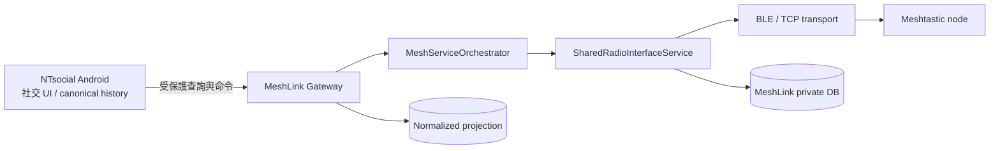
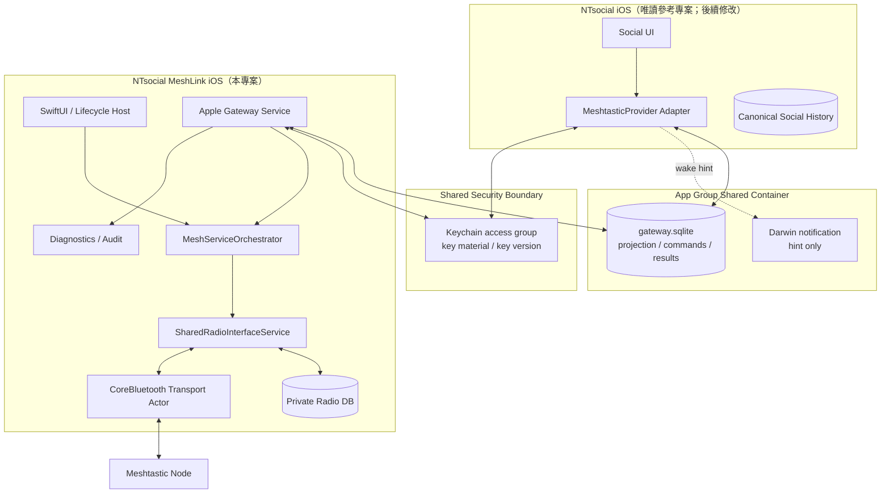
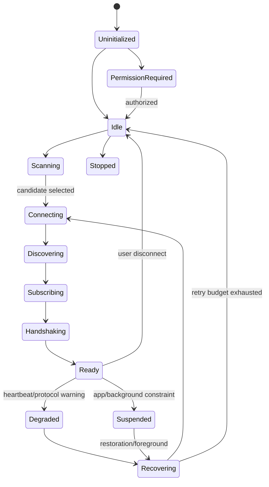
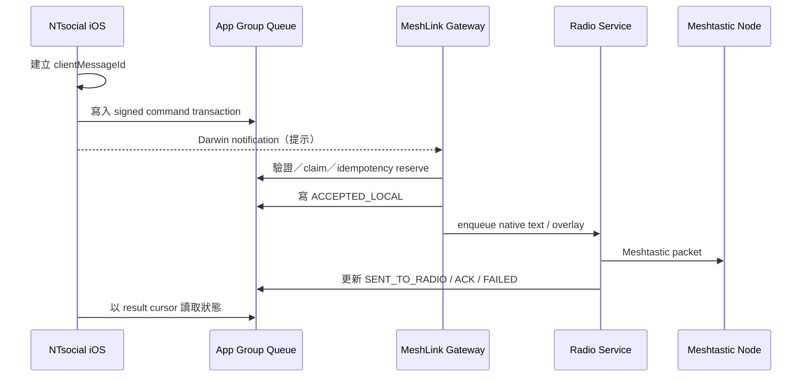
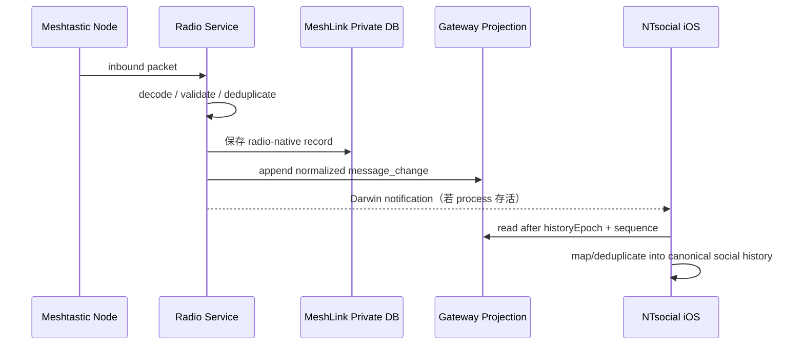

# iOS NTsocial MeshLink 開發施工計畫

> 文件狀態：可供工程拆票與實作的架構基線  
> 稽核日期：2026-08-07（Asia/Taipei）  
> 目標專案：`nuclear718/ntsocial-mesh-gateway-android`  
> 目標基線：`main@9443b6ed38f49e9db5d215927d8a9c610b4b14ac`  
> 唯讀參考專案：`nuclear718/NTsocial_release` 的 `main` 分支（稽核快照：2026-08-07）  
> 適用對象：iOS、Kotlin Multiplatform、BLE／Meshtastic、資安、QA 與 release 工程師  
> 文件目的：把現有 Android NTsocial MeshLink 的責任邊界、Gateway 語意與 Meshtastic 控制流程，轉化為可在 Apple 平台施工、測試及交付的方案。

---

## 1. 結論摘要

本次程式碼稽核得到四項關鍵結論。

1. **Android 版不是單純的 Meshtastic UI fork，而是「LoRa/radio owner＋受保護 Gateway」**。MeshLink 負責無線電連線、Meshtastic 原生訊息、節點／頻道投影、route token、命令驗證與 durable idempotency；NTsocial 母程式保有社交 UI、帳號政策及 canonical social history。iOS 版必須保留這個所有權分界，不能讓兩個 App 同時控制同一個 Meshtastic radio。
2. **現有 Kotlin Multiplatform 核心有實質可重用價值，但 iOS 目前仍是 scaffold**。`MeshServiceOrchestrator`、`SharedRadioInterfaceService`、`DirectRadioControllerImpl` 等平台中立邏輯可以沿用；然而 iOS BLE、亂數、權限、持久化、生命週期與宿主 App 尚未達 production-ready。尤其 `core/ble/src/iosMain/.../NoopStubs.kt` 仍含 `UnsupportedOperationException` 與 no-op 行為，現況不能上架。
3. **iOS 不應照抄 Android 的 `ContentProvider`、BroadcastReceiver、UID/package 驗證**。Apple sandbox 沒有等價 IPC。應建立語意等價、傳輸不同的 Apple Gateway：以 App Group 共用容器承載 durable projection／command mailbox，以 Keychain access group 保存協議金鑰；Darwin notification 只當提示，不當資料真相。
4. **建議交付型態為獨立的 GPL-3.0-or-later「NTsocial MeshLink iOS companion app」**。這可延續本專案與 Meshtastic Apple 程式碼的授權邊界，避免把 GPL radio implementation 直接嵌入 NTsocial 母程式。`NTsocial_release` 本次只讀，任何 App Group、Keychain entitlement 或 provider adapter 修改均列為後續工作，未在本計畫中執行。

iOS 1.0 的最小完整路徑應為：

```text
KMP 核心可在 iOS 編譯與測試
→ CoreBluetooth transport
→ Apple lifecycle host
→ 本機 Meshtastic 原生收發
→ Apple Gateway v2
→ NTsocial iOS provider adapter
→ 實機 RF／背景／重啟／跨版本驗收
→ TestFlight
```

---

## 2. 稽核範圍、證據強度與非目標

### 2.1 已檢查範圍

- 目標專案根目錄規範、Gradle/KMP 結構、Android Gateway、radio service、route token、命令驗證、iOS source set 與現有測試配置。
- `NTsocial_release` 的 iOS SwiftPM 模組、App lifecycle owner、provider health／release capability、entitlements 與 Android 端 MeshLink Gateway consumer。
- Meshtastic Apple 專案的 Apple 平台實作型態，特別是 CoreBluetooth actor、serial delegate queue、state restoration 與 GPLv3 授權邊界。

### 2.2 證據分類

| 分類 | 本文件中的意義 |
|---|---|
| 已確認 | 可直接由目前程式碼、設定或 capability 文件證實 |
| 架構決策 | 本計畫為消除平台差異而明確指定的施工方向 |
| 待實機驗證 | 需要 iPhone＋Meshtastic node、背景切換、斷線或 RF 環境才能確認 |
| 母程式後續修改 | 只列介面與驗收要求；本次沒有寫入 `NTsocial_release` |

### 2.3 非目標

- 不重寫 Meshtastic protocol。
- 不把 Android UI 逐畫面等比例移植；優先移植 radio、Gateway、設定及 diagnostics。
- 不承諾 iOS 有 Android foreground service 等價物。
- 不在 App Group 暴露 PSK、raw protobuf、完整位置、radio config 或 MeshLink 私有資料庫。
- 不讓 NTsocial iOS 與 MeshLink iOS 同時建立同一 radio 的 BLE session。
- 不修改本次被指定為 read-only 的 `NTsocial_release`。

---

## 3. Android 現況：必須保留的設計語意

### 3.1 系統責任邊界



Android 實作的核心不是 IPC API 的外型，而是以下不變條件：

- **單一 radio owner**：MeshLink 擁有連線與 Meshtastic 狀態機。
- **父 App 不讀 radio 私有資料庫**：只讀經過正規化與最小揭露的 Gateway projection。
- **父 App 不取得 PSK 或 raw protobuf**。
- **命令先驗證 caller、route、generation 與 idempotency，再排入 radio queue**。
- **`accepted` 僅表示命令已通過驗證並可靠排隊／持久化，不等於遠端節點已收到**。
- **Gateway contract 採 additive evolution**：新欄位可增加，舊 reader 必須忽略未知欄位。
- **Native Meshtastic text 使用標準 `TEXT_MESSAGE_APP`**，不能為 NTsocial 私訊另造不相容的私有 port。

### 3.2 Android Gateway 讀取面

`NtsocialGatewayProvider.kt` 為 certificate-pinned、read-only provider，主要提供：

- v1：status、envelopes、nodes、channels。
- v2：status、normalized channels、message changes。
- v2 status 語意包含：
  - `capabilities`
  - `bearer = MESHTASTIC`
  - `radioGeneration`
  - `historyEpoch`
  - `messageChangeSeq`
  - native history/send availability
  - overlay route availability
- channel projection 的核心欄位：
  - `sourceChannelId`
  - `routeToken`
  - slot／role
  - security metadata（不得含 PSK）
  - capability flags
- message-change projection 的核心欄位：
  - 穩定遞增 sequence
  - source message/channel/from/to identity
  - text／timestamp／status
  - 經過允許的 RF metadata

iOS 不需要複製 Android Cursor，但必須輸出相同的 domain meaning。

### 3.3 Android Gateway 命令面

`NtsocialGatewayCommandReceiver.kt` 與 caller verifier 實作了：

1. caller package／UID／signing certificate 驗證；
2. v1、routed overlay、native text 命令分類；
3. route token 驗證；
4. `clientMessageId` durable reservation；
5. 同 ID 同 fingerprint 的 retry 回傳既有 accepted/pending；
6. 同 ID 不同 fingerprint 必須 reject；
7. 產生 deterministic packet identity；
8. 成功驗證後才交給 radio queue。

Android 14 以上可檢查 sender UID/package；舊版另用 capability token。iOS 無此 sender API，因此 Apple Gateway 必須以 sandbox entitlement、App Group membership 與 cryptographic command envelope 取代。

### 3.4 Route token 與 generation

現有 route token 的重要語意：

- 隨機 token，短時效；現行 Android TTL 約 120 秒。
- 綁定 caller、`sourceChannelId` 與 `radioGeneration`。
- radio 重新連線、重新配置或 generation 改變後，舊 token 立即失效。
- token 只授權一條已驗證 route，不授權讀取 radio secrets。
- durable idempotency record 有界保存，避免無限制增長。

iOS 版 1.0 應維持 120 秒 TTL，除非 RF 實測證明需要調整；不可用永久 channel token 省略重新驗證。

### 3.5 可重用 KMP 核心

| 元件 | 可重用內容 | iOS 施工要求 |
|---|---|---|
| `MeshServiceOrchestrator` | start/stop、先選 DB 再接 radio、state flow、supervised actions | 由 Apple lifecycle coordinator 驅動，不依賴 Android Service |
| `SharedRadioInterfaceService` | radio lifecycle、FIFO、heartbeat、transport factory、reconnect、polite disconnect | 以 CoreBluetooth/TCP actual adapter 接入 |
| `DirectRadioControllerImpl` | in-process radio controller | iOS 使用 direct controller，不移植 Android AIDL |
| 共用 models/protobuf | Meshtastic message、node/channel domain | 建立 Android/iOS golden fixtures 防止 schema drift |
| 共用 repository/use case | radio/cache/message policy | 移除 Android-only clock、UUID、storage、permission 依賴 |

---

## 4. 現有 iOS 狀態與 P0 缺口

現有 iOS source set 並非空白，但仍屬「能讓部分 common code 編譯」的 scaffold，而不是可用 App。

| 缺口 | 已確認現況 | 風險 | 優先級 |
|---|---|---|---|
| iOS host | 無完整 Xcode app/workspace、Info.plist、entitlements、native lifecycle tests | 無法安裝、配對、背景恢復或上架 | P0 |
| CoreBluetooth | `NoopStubs.kt` 仍會 throw 或 no-op | 一進入 radio path 即失敗，或產生假成功 | P0 |
| 安全亂數 | iOS stub 不可作為 route/token/nonce production RNG | token 可預測、驗證失去意義 | P0 |
| 持久化 | 尚未證明 iOS durable DB 與 migration | 重啟後 history、idempotency、cursor 遺失 | P0 |
| 權限 | stub 可能回報假成功 | UI 與實際 Bluetooth authorization 不一致 | P0 |
| 背景生命週期 | 無 Apple state restoration owner | 斷線／背景後狀態與 queue 不可靠 | P0 |
| Gateway | 無 Apple 跨 App transport | NTsocial iOS 無法取得真實 provider | P0 |
| Keychain/App Group | 目標與母程式尚未完成共同 entitlement | 無法安全共享 mailbox/key | P0 |
| 實機測試 | 無 iOS radio/RF/restore matrix | 模擬器通過仍可能實機失敗 | P0 |
| diagnostics | 尚無可匯出、可遮蔽敏感資料的 iOS trace | 現場問題難以定位 | P1 |

**施工規則：任何 production path 中的 throw/no-op/fake-success stub，都必須在 Phase 1 被刪除、實作或以 build-time fail-fast 阻止進入 release。**

---

## 5. NTsocial iOS 母程式的相容邊界

唯讀稽核顯示，`NTsocial_release` 的 Apple 端已具備良好的 host 架構：

- Swift 6.1、iOS 17+、macOS 14+。
- SwiftPM 模組涵蓋 Core、Crypto、WireProto、BLE、HighSpeed、Store、UI。
- `NTSocialApp.swift` 已有明確 runtime owner；onboarding 後啟動、active 時 restore、panic wipe 前先停止 runtime。
- provider health 可在 UI test 注入，但目前不是真實 Meshtastic provider。
- release capability 明確標示 Meshtastic LoRa provider 為 unavailable／scaffold-only。
- 現有 entitlements 尚未具備 MeshLink/NTsocial 共用 App Group 與 Keychain access group。
- iOS 背景傳輸被正確描述為 best-effort，沒有虛構 Android foreground-service parity。

因此 iOS MeshLink 的工作不是接管 NTsocial runtime，而是提供一個可被 `NTSocialCore` provider adapter 消費的獨立 provider。

後續母程式需要的最小介面如下，**本次未執行**：

```swift
protocol MeshtasticProvider {
    func health() async -> ProviderHealth
    func status() async throws -> MeshGatewayStatus
    func channels() async throws -> [MeshChannelRoute]
    func messageChanges(after cursor: MessageCursor?) async throws -> MessageChangePage
    func sendNativeText(_ request: NativeTextRequest) async throws -> SendAcceptance
    func sendOverlay(_ request: OverlayRequest) async throws -> SendAcceptance
}
```

此 protocol 的 domain type 應與 Android `MeshLinkGatewayContract` 對齊，但底層 transport 改為 Apple Gateway。

---

## 6. 架構決策紀錄（ADR-001）

### 6.1 決策

建立一個**獨立、GPL-3.0-or-later 的 NTsocial MeshLink iOS companion app**，保留於本專案；共用 KMP domain/protocol/service，Apple 平台能力由 Swift/Kotlin Native adapter 提供。NTsocial iOS 母程式透過 App Group Gateway 互動，不直接 link MeshLink radio implementation。

### 6.2 評估方案

| 方案 | 結論 | 原因 |
|---|---|---|
| A. 把 GPL MeshLink/Meshtastic code 直接嵌入 NTsocial iOS | 不採用 | 授權邊界、release cadence、radio ownership 與故障隔離都變差 |
| B. 獨立 companion＋Apple Gateway | **採用** | 對齊 Android 邊界；可獨立上架、診斷、升級與管理 GPL 義務 |
| C. 完全另寫 Swift fork，不用 KMP 共用核心 | 不採用 | Android/iOS protocol、retry、idempotency 與 database policy 容易分叉 |
| D. 只用 URL scheme 臨時傳命令 | 不採用 | 無 durable queue、無 delta cursor、背景時容易遺失，不能支撐同步 |
| E. 直接共用 MeshLink 私有 DB | 不採用 | schema coupling、secret leakage、migration coordination 風險不可接受 |

### 6.3 後果

- 需要兩個 App 的相同 Team/App Group/Keychain entitlement。
- App Store 上需清楚說明 companion 關係與使用流程。
- 跨 App 即時喚醒不能保證；正確性必須建立在 durable mailbox，而非通知。
- GPL source offer、license notices、第三方 attribution 與 reproducible source tag 必須納入 release checklist。
- Radio 連線只由 MeshLink iOS 持有；NTsocial 自有 BLE mesh 不得誤接管 Meshtastic peripheral。

---

## 7. 目標系統架構



### 7.1 資料所有權

| 資料 | 唯一 owner | 可否共享 |
|---|---|---|
| PSK、radio config、raw protobuf | MeshLink private DB | 不可 |
| BLE peripheral/session、Meshtastic protocol state | MeshLink runtime | 不可 |
| node/channel radio cache | MeshLink | 僅最小 normalized projection |
| Gateway status/channel route/message delta | MeshLink Gateway | 可透過 App Group 讀取 |
| commands | NTsocial 寫入；MeshLink 消費 | 可，必須簽章與 durable |
| command results | MeshLink 寫入；NTsocial 讀取 | 可 |
| canonical social history、read state、thread UI | NTsocial | 不交由 MeshLink |
| diagnostic bundle | MeshLink | 僅使用者主動匯出，必須 redact |

### 7.2 單一 radio owner 規則

1. MeshLink process 是唯一可建立 Meshtastic BLE/TCP transport 的 process。
2. NTsocial provider adapter 僅寫 command mailbox、讀 projection。
3. companion 未安裝／未開啟／權限不足時，provider 回傳明確 degraded/unavailable，不可偷偷自行連 radio。
4. 如果未來要支援 embedded mode，必須另立 ADR 與授權審查，不得在 1.0 偷渡。

---

## 8. 建議程式碼與模組配置

以下路徑為新增／調整建議；實際 package 名稱應服從現有 Gradle convention，但責任不可混合。

```text
iosApp/
  NTsocialMeshLink.xcodeproj
  App/
    NTsocialMeshLinkApp.swift
    AppLifecycleCoordinator.swift
    DependencyContainer.swift
  Platform/
    Bluetooth/
      MeshtasticBluetoothTransport.swift
      BluetoothStateRestoration.swift
      BluetoothPermissionService.swift
    Security/
      SharedKeychainStore.swift
      CommandAuthenticator.swift
    Gateway/
      AppGroupLocation.swift
      GatewayNotificationHint.swift
    Diagnostics/
      DiagnosticExporter.swift
  UI/
    Onboarding/
    Radio/
    Channels/
    Diagnostics/

core/ble/src/iosMain/kotlin/
  IosRadioTransport.kt
  IosRadioTransportBridge.kt
  IosBluetoothPermission.kt

core/database/src/iosMain/kotlin/
  IosDatabaseFactory.kt
  IosMigrationRunner.kt

core/gateway/src/commonMain/kotlin/
  GatewaySchema.kt
  GatewayStatus.kt
  GatewayCommand.kt
  GatewayResult.kt
  RouteTokenService.kt
  IdempotencyStore.kt

core/gateway/src/iosMain/kotlin/
  AppleGatewayRepository.kt
  AppleGatewayWorker.kt
  AppleGatewayCryptoBridge.kt

core/platform/src/iosMain/kotlin/
  SecureRandomIos.kt
  ClockIos.kt
  UuidIos.kt
  FileProtectionIos.kt

contract-fixtures/
  gateway-v2/
    status/*.json
    channels/*.json
    message-changes/*.json
    commands/*.json
    results/*.json
```

### 8.1 Swift 與 Kotlin 的責任切割

- Swift actor/serial queue：持有 `CBCentralManager`、`CBPeripheral`、characteristic reference、state restoration callback。
- Kotlin common：Meshtastic framing、service state machine、message policy、queue、retry、repository、Gateway domain。
- Bridge：只傳 immutable byte arrays/events；所有 callback 必須回到單一序列化 executor。
- 禁止 Swift 與 Kotlin 各自實作一套 reconnect state machine。Swift 管 transport facts；Kotlin 管 protocol/service decisions。

---

## 9. CoreBluetooth transport 施工規格

### 9.1 Transport actor

建立 `MeshtasticBluetoothTransport` actor（或一個明確的 serial delegate queue owner）：

- `CBCentralManager` 使用固定 restoration identifier。
- 掃描只針對 Meshtastic service UUID；不做無限制全頻掃描。
- 使用 iOS 的 peripheral UUID 作暫時 transport identity；完成 Meshtastic handshake 後以 node identity 為真實 identity。
- 不依賴 Android MAC address，因 Apple 不提供等價穩定位址。
- discovery、connect、service discovery、characteristic discovery、notify enable、protocol handshake 分階段回報。
- 寫入長度使用 `maximumWriteValueLength(for:)`；不要移植 Android `requestMtu()` 思維。
- `writeWithoutResponse` 必須尊重 `canSendWriteWithoutResponse` 與 ready callback，避免塞爆 CoreBluetooth buffer。
- notify callback 只做 framing admission，不在 delegate queue 執行 DB 或重型 protobuf 工作。
- disconnect 原因要分類：user、Bluetooth off、permission denied、link loss、protocol timeout、radio reset。
- reconnect 使用 bounded exponential backoff＋jitter；使用者主動 disconnect 不自動重連。
- restoration callback 只恢復可證明的 peripheral/session，不把 stale reference 當成 ready。

### 9.2 Transport 狀態



每次進入 `Ready` 前必須同時滿足：

- CoreBluetooth connected；
- required services/characteristics discovered；
- notification subscription successful；
- protocol handshake completed；
- private DB selected/opened；
- radio generation 已建立；
- inbound/outbound queues 可用。

UI 不得把「BLE connected」直接顯示成「Meshtastic ready」。

### 9.3 測試注入點

Transport interface 至少能注入：

- fake clock；
- fake central/peripheral event stream；
- characteristic fragmentation；
- delayed/duplicated/out-of-order notification；
- Bluetooth off/on；
- restore with stale peripheral；
- write backpressure；
- handshake timeout；
- node reboot。

---

## 10. Apple lifecycle 與背景真相模型

iOS 沒有 Android foreground service 等價物，因此設計必須把「可恢復」與「永遠執行」分開。

### 10.1 Runtime owner

`AppLifecycleCoordinator` 是唯一 start/stop owner：

| 事件 | 動作 |
|---|---|
| onboarding 完成＋權限可用 | 開 DB、啟動 orchestrator、恢復上次 radio |
| app active | reconcile permission、radio、mailbox、pending result |
| app inactive/background | flush transaction、保存 queue/cursor、交給 CoreBluetooth restoration |
| Bluetooth off | generation rollover、route token invalidation、狀態設為 unavailable |
| protected data unavailable | 暫停 DB/Gateway，不做破壞性重建 |
| user disconnect | polite disconnect、停止 auto reconnect |
| account panic wipe | 先停止 runtime、關 DB、清 Keychain/App Group/private storage |
| app termination/relaunch | 由 durable state 恢復，不假設 callback 一定送達 |

### 10.2 背景保證

1. **可靠性來源是 durable queue，不是背景喚醒。**
2. Darwin notification 只提示已在執行的 process 重新讀 mailbox，不能作為 launch guarantee。
3. BackgroundTasks 可做 maintenance／flush，但不可作即時訊息 correctness 的唯一依賴。
4. CoreBluetooth state restoration 能改善 peripheral session 恢復，不能被描述為永遠在線。
5. provider status 必須揭露 `backgroundMode = BEST_EFFORT` 與最近活躍時間，讓母程式顯示真實健康狀態。
6. 使用者從 NTsocial 送出命令、而 companion 未執行時，命令保持 `PENDING_PROVIDER_WAKE`；可提供「開啟 MeshLink」deep link，但不能把 deep link 當隱形背景啟動。

---

## 11. Apple Gateway v2

### 11.1 傳輸選擇

採用：

- App Group container：durable projection、command queue、result queue。
- Shared Keychain access group：HMAC key、key version、installation identity。
- Darwin notification：`projectionChanged`、`commandAvailable` 的 best-effort hint。
- URL scheme／universal link：需要使用者介入時開啟 companion。
- 不採用 clipboard、local HTTP server、私有 API、直接讀 companion private DB。

### 11.2 Shared SQLite 建議

檔案：`<AppGroup>/MeshLinkGateway/gateway-v2.sqlite`

規則：

- WAL mode、foreign keys、busy timeout。
- schema migration 必須是 transactional。
- 每張表指定 writer，避免雙方改同一 row：
  - NTsocial：`command_queue`
  - MeshLink：status/channel/message projection、`command_result`
- command 消費使用 compare-and-set claim transaction。
- 資料庫 corruption 不可靜默清空；先備份、回報 health、重建 projection，commands 必須可稽核。
- iOS file protection 使用「首次解鎖後可用」等符合背景 restoration 的等級；敏感 key 仍留在 Keychain。
- projection 可重建；command/result/idempotency 不可任意丟棄。

### 11.3 Schema

```sql
CREATE TABLE gateway_meta (
    key TEXT PRIMARY KEY,
    value BLOB NOT NULL
);

CREATE TABLE status_projection (
    singleton_id INTEGER PRIMARY KEY CHECK (singleton_id = 1),
    schema_version INTEGER NOT NULL,
    provider_instance_id TEXT NOT NULL,
    provider_state TEXT NOT NULL,
    bearer TEXT NOT NULL,
    capabilities_json TEXT NOT NULL,
    radio_generation INTEGER NOT NULL,
    history_epoch TEXT NOT NULL,
    message_change_seq INTEGER NOT NULL,
    background_mode TEXT NOT NULL,
    updated_at_ms INTEGER NOT NULL
);

CREATE TABLE channel_projection (
    source_channel_id TEXT PRIMARY KEY,
    display_name TEXT,
    slot INTEGER,
    role TEXT NOT NULL,
    security_mode TEXT NOT NULL,
    capabilities_json TEXT NOT NULL,
    route_token TEXT,
    route_expires_at_ms INTEGER,
    radio_generation INTEGER NOT NULL,
    updated_at_ms INTEGER NOT NULL
);

CREATE TABLE message_change (
    sequence INTEGER PRIMARY KEY,
    history_epoch TEXT NOT NULL,
    source_message_id TEXT NOT NULL,
    source_channel_id TEXT,
    from_node_id TEXT,
    to_node_id TEXT,
    message_kind TEXT NOT NULL,
    text TEXT,
    status TEXT NOT NULL,
    sent_at_ms INTEGER,
    received_at_ms INTEGER,
    rx_rssi INTEGER,
    rx_snr REAL,
    hop_count INTEGER,
    UNIQUE(history_epoch, source_message_id, status)
);

CREATE TABLE command_queue (
    command_id TEXT PRIMARY KEY,
    client_message_id TEXT NOT NULL,
    caller_instance_id TEXT NOT NULL,
    command_type TEXT NOT NULL,
    canonical_payload BLOB NOT NULL,
    request_fingerprint TEXT NOT NULL,
    key_version INTEGER NOT NULL,
    nonce TEXT NOT NULL,
    created_at_ms INTEGER NOT NULL,
    expires_at_ms INTEGER NOT NULL,
    signature BLOB NOT NULL,
    state TEXT NOT NULL,
    claimed_at_ms INTEGER,
    UNIQUE(caller_instance_id, client_message_id)
);

CREATE TABLE command_result (
    command_id TEXT PRIMARY KEY,
    client_message_id TEXT NOT NULL,
    state TEXT NOT NULL,
    packet_id TEXT,
    error_code TEXT,
    error_detail_safe TEXT,
    accepted_at_ms INTEGER,
    updated_at_ms INTEGER NOT NULL
);
```

不得在 shared schema 出現：

- channel PSK；
- raw radio config；
- raw protobuf blob；
- precise position；
- Bluetooth identifiers 未經必要性審查的長期紀錄；
- private keys；
- 未遮蔽的 diagnostic trace。

### 11.4 Status domain

```json
{
  "schemaVersion": 2,
  "providerBundleId": "com.ntsocial.meshlink.ios",
  "providerInstanceId": "installation-uuid",
  "providerState": "READY",
  "bearer": "MESHTASTIC",
  "capabilities": [
    "NATIVE_TEXT_SEND",
    "NATIVE_TEXT_HISTORY",
    "CHANNEL_ROUTES",
    "MESSAGE_CHANGES"
  ],
  "radioGeneration": 42,
  "historyEpoch": "epoch-uuid",
  "messageChangeSeq": 1288,
  "backgroundMode": "BEST_EFFORT",
  "updatedAtMs": 1786057200000
}
```

Reader 必須忽略未知 capability／field；writer 不可重用已改變語意的欄位。

### 11.5 Command envelope

```json
{
  "schemaVersion": 2,
  "commandId": "uuid",
  "clientMessageId": "stable-client-id",
  "callerInstanceId": "ntsocial-installation-id",
  "commandType": "SEND_NATIVE_TEXT",
  "sourceChannelId": "meshtastic-channel-id",
  "routeToken": "short-lived-token",
  "radioGeneration": 42,
  "targetNodeId": "!12345678",
  "payload": {
    "text": "hello"
  },
  "createdAtMs": 1786057200000,
  "expiresAtMs": 1786057320000,
  "nonce": "base64url-128bit",
  "keyVersion": 1,
  "signature": "base64url-hmac-sha256"
}
```

簽章輸入必須是 deterministic canonical representation，不可直接簽未定序 JSON。

### 11.6 驗證順序

```text
schema supported
→ required fields/type/size
→ created/expires clock window
→ nonce format
→ key version
→ HMAC constant-time verify
→ caller installation enabled
→ route token / source channel / generation
→ clientMessageId reservation
→ request fingerprint comparison
→ durable accepted result
→ enqueue radio work
```

任何一步失敗都不得建立 radio packet。

### 11.7 Route token

- 32 bytes CSPRNG，Base64URL。
- TTL 120 秒。
- 綁定 `callerInstanceId + sourceChannelId + radioGeneration + capabilities`。
- 儲存 token hash，不必在 private store 保存明文。
- generation change、channel removed、security context change、panic wipe 時全部撤銷。
- route projection 可包含短期明文 token；過期後 parent 必須重新讀 channels。
- token error 分為 `ROUTE_EXPIRED`、`ROUTE_GENERATION_MISMATCH`、`ROUTE_NOT_AUTHORIZED`，不可只回傳 generic failure。

### 11.8 Durable idempotency

`requestFingerprint` 至少涵蓋：

```text
commandType
sourceChannelId
targetNodeId
canonical payload hash
radioGeneration
routing mode
```

規則：

- 同 caller＋同 `clientMessageId`＋同 fingerprint：回傳原結果，不重送。
- 同 caller＋同 `clientMessageId`＋不同 fingerprint：`IDEMPOTENCY_CONFLICT`。
- record 至少保存到訊息最長 retry window＋安全餘量；以有界 LRU/age pruning 管理。
- pruning 不可刪除仍為 pending/in-flight 的 record。
- packet ID 應由 stable inputs deterministic derivation，避免 App crash 後換 ID 重送。

---

## 12. 收發訊息流程與狀態語意

### 12.1 NTsocial → LoRa



### 12.2 LoRa → NTsocial



### 12.3 Send state

```text
CREATED
→ AUTHENTICATED
→ ROUTE_VALIDATED
→ RESERVED
→ ACCEPTED_LOCAL
→ QUEUED_RADIO
→ SENT_TO_RADIO
→ ACKNOWLEDGED（若 protocol 有可信 ack）
→ DELIVERED（只有具備端到端證據時才可使用）
```

Failure 可發生於任一階段，必須包含 stable error code。UI 文案必須區分：

- 已排入 MeshLink；
- 已交給 radio；
- 收到 protocol ack；
- 對端已讀／已收（只有真的有此證據才顯示）。

不要把 `accepted=true` 翻譯成「已送達」。

### 12.4 Cursor 與 history epoch

- parent cursor 為 `(historyEpoch, sequence)`。
- projection 重建、不可相容 migration 或資料 wipe 時產生新 `historyEpoch`。
- parent 發現 epoch 改變時，執行 bounded resync，而不是沿用舊 sequence。
- `message_change` 必須 append-only；狀態更新以新 change 表示，不覆蓋導致漏讀。
- retention 截斷時，status 提供 `oldestAvailableSequence`；落後 reader 必須收到 `CURSOR_TOO_OLD`。

---

## 13. 本機資料庫與 migration

### 13.1 原則

- 繼續使用現有 KMP database abstraction；不可讓 Android 與 iOS domain repository 分叉。
- iOS 實作底層必須是 durable SQLite，並有 migration test。
- 若現有 Room KMP 配置能在本 repo 的 iOS target 通過 compile、migration 與 crash-recovery proof，優先沿用；若無法，才以 SQLDelight adapter 實作相同 repository interface。**不得同時維護兩套 domain schema。**
- private radio DB 與 shared gateway DB 分離。
- DB open 必須先於 radio connect，維持 `MeshServiceOrchestrator` 的既有順序。
- migration 失敗時進入 `STORAGE_ERROR`，保留檔案供診斷，不可自動刪庫冒充成功。

### 13.2 必測 migration

- fresh install；
- N-1 → N；
- crash during migration；
- disk full；
- protected data unavailable；
- App Group schema older/newer than companion；
- parent 與 companion 版本交錯升級；
- history projection rebuild；
- panic wipe 後重新配對。

---

## 14. 安全模型

### 14.1 信任邊界

受信任：

- 相同 Apple Developer Team 所簽署、持有指定 App Group entitlement 的 NTsocial 與 MeshLink；
- Keychain access group 中的協議 key；
- MeshLink private container。

不受信任：

- shared container 中尚未驗證的 command bytes；
- deep-link parameters；
- radio inbound payload；
- notification hint；
- diagnostic import/export；
- 系統時間的小幅跳動；
- stale route/token/cursor。

### 14.2 主要威脅與控制

| 威脅 | 控制 |
|---|---|
| 偽造 command | App Group entitlement＋HMAC-SHA256＋key version |
| replay | nonce、expiresAt、durable clientMessageId reservation |
| route confused deputy | token 綁 caller/channel/generation/capability |
| duplicate LoRa send | durable idempotency＋deterministic packet ID |
| DB tamper/corruption | schema validation、transaction、health fail-closed、audit |
| secret leakage | shared projection 禁止 PSK/raw config；logs redaction |
| stale Bluetooth identity | peripheral UUID 只作 transport hint；handshake node identity 才是真相 |
| malicious oversized payload | command size/type/UTF-8 limits before allocation/send |
| clock skew | 小幅容忍窗＋monotonic receive time；過大偏差回報 health |
| companion downgrade | schema min/max、key rotation、unsupported-version reject |
| panic wipe race | 先停止 runtime、關 DB，再刪 private/shared/keychain |

### 14.3 Key lifecycle

- 首次完成 companion pairing/handshake 時建立 256-bit HMAC key。
- Keychain item 使用明確 access group、service、key version。
- rotation：建立新 key → 雙讀短窗口 → parent 確認 → 停用舊 key。
- panic wipe／team entitlement 改變／疑似 compromise 時立即撤銷。
- key 不可寫入 App Group SQLite、UserDefaults、log 或 diagnostic bundle。

### 14.4 Logging

預設可記：

- state transition；
- hashed peripheral/node identifier；
- error code；
- queue depth；
- duration；
- generation/epoch；
- schema version。

預設不可記：

- PSK；
- full message body；
- exact location；
- raw protobuf；
- route token/HMAC；
- Keychain error payload；
- 使用者帳號 token。

---

## 15. UI 最小範圍

iOS MeshLink 1.0 不需要複製所有 Android 畫面，但至少必須具備：

1. onboarding：用途、GPL/third-party notice、Bluetooth 權限、如何開啟 node；
2. radio picker：掃描結果、上次裝置、連線階段；
3. connection health：Bluetooth、protocol、DB、Gateway、background 限制分開顯示；
4. channel/node 基本檢視；
5. 原生 Meshtastic text 的最小驗證介面，供不依賴 NTsocial 的 RF 測試；
6. NTsocial integration health：App Group、Keychain、last command、last projection；
7. diagnostics：建立已 redacted bundle、顯示 app/build/schema/protocol 版本；
8. disconnect、forget radio、reset gateway、panic wipe。

禁止以單一綠燈掩蓋「BLE connected 但 handshake/Gateway 未 ready」。

---

## 16. 分階段施工計畫

### Phase 0 — 基線、契約與授權（P0）

**交付**

- ADR-001 合併。
- 鎖定 iOS deployment target、Swift/Kotlin/Gradle/Xcode version。
- 建立 Gateway v2 neutral schema 與 fixtures。
- 建立 third-party notices、GPL source/release policy。
- 定義 bundle IDs、App Group ID、Keychain access group、URL scheme。
- 建立單一 radio owner invariant 與 threat model。

**退出條件**

- Android contract fixtures 全數可由 common module decode。
- iOS 架構、授權與 entitlement naming 經 engineering/release 審查。
- 沒有任何人把 `NTsocial_release` 當作本 PR 的可寫入範圍。

### Phase 1 — iOS KMP production baseline（P0）

**交付**

- 建立 Xcode/Compose host，可在實機啟動 common orchestrator。
- 實作 secure RNG、clock、UUID、file protection、permission actual。
- 實作 iOS durable private DB factory/migrations。
- 將 release source set 中所有 critical no-op/throw stub 改成實作或 fail-fast build gate。
- 建立 simulator compile test＋device smoke test。

**退出條件**

- Release build 不含已知 fake-success stub。
- cold start/restart 後 DB state、installation ID、idempotency record 可保留。
- Bluetooth denied/off 狀態可正確顯示，不 crash。

### Phase 2 — CoreBluetooth/TCP radio transport（P0）

**交付**

- CoreBluetooth transport actor、scan/connect/discover/subscribe/handshake。
- framing、fragmentation、write backpressure、reconnect、state restoration。
- 接入 `SharedRadioInterfaceService` 與 `DirectRadioControllerImpl`。
- 可選 TCP transport：只在 Android 已有語意可共用且不延誤 BLE P0 時加入。

**退出條件**

- 至少兩款 iPhone 與兩種 Meshtastic firmware/node 完成本機收發。
- background/foreground、Bluetooth off/on、node reboot 後可恢復。
- 無雙重 reconnect state machine、無 unbounded queue。

### Phase 3 — iOS companion host 與 diagnostics（P0）

**交付**

- lifecycle coordinator、onboarding、radio picker、health UI。
- startup/restore/disconnect/forget/panic wipe。
- redacted diagnostic export。
- crash breadcrumbs 與 state-transition metrics。

**退出條件**

- 使用者可不依賴 NTsocial 完成配對、channel 檢視與 native text smoke test。
- panic wipe 經測試不留下 private DB、shared projection 或 Keychain key。
- background 限制以真實文案呈現。

### Phase 4 — Apple Gateway v2（P0）

**交付**

- App Group SQLite schema/migrations。
- shared Keychain key lifecycle。
- signed command envelope、route token、durable idempotency。
- status/channel/message-change projections。
- command result cursor。
- Darwin notification hints＋deep-link wake fallback。

**退出條件**

- companion kill/relaunch、parent kill/relaunch、雙方交錯升級仍不重複送。
- invalid signature、expired route、generation mismatch、ID conflict 全部 fail-closed。
- shared DB 不含禁止資料。
- Android/iOS fixtures 的 domain semantics 一致。

### Phase 5 — NTsocial iOS provider adapter（母程式後續；本次不修改）

**交付建議**

- 新增 App Group／Keychain entitlements。
- 實作 `MeshtasticProvider` adapter。
- provider health 接到既有 startup/runtime owner。
- backend selector 顯示 companion missing/locked/permission/background states。
- canonical social history 做 source message ID dedupe。
- command acceptance 與 delivery 狀態文案分離。

**退出條件**

- NTsocial iOS 可收發 private/public/channel 的支援範圍與 Android 對齊。
- 母程式永不直接讀 MeshLink private DB 或連 Meshtastic radio。
- parent 版本落後時能忽略 Gateway 新欄位而不中斷。

### Phase 6 — 硬化、跨平台與 release（P0/P1）

**交付**

- security/chaos/lifecycle/RF matrix。
- metrics、support runbook、migration rollback。
- TestFlight staged rollout。
- App Store privacy、Bluetooth usage description、GPL notices/source tag。
- Android/iOS interop evidence bundle。

**退出條件**

- 所有 P0 test gate 通過。
- 無 open critical/high security finding。
- 至少 72 小時長時間 soak 不產生 queue leak、token leak、重複 send 或永久 stale connection。
- release artifact 可追溯至 Git commit、schema、Meshtastic protocol/version。

---

## 17. 工程拆票清單

估算採相對尺寸：S（1–2 engineer-days）、M（3–5）、L（1–2 engineer-weeks）、XL（需再拆）。

| ID | 優先級 | 工作 | Owner | 估算 | Definition of Done |
|---|---|---|---|---|---|
| IOS-001 | P0 | ADR、授權與 single-owner boundary | Architect/Legal | M | ADR/notice/release policy 合併 |
| IOS-002 | P0 | Xcode＋Compose/KMP iOS host | iOS/KMP | L | 實機啟動 orchestrator |
| IOS-003 | P0 | deterministic iOS CI build | Build | M | clean runner 可產 simulator/device archive |
| IOS-010 | P0 | secure RNG、clock、UUID actual | KMP/iOS | M | deterministic tests＋CSPRNG device test |
| IOS-011 | P0 | private SQLite DB/migration | KMP/Data | L | restart/crash/migration matrix 通過 |
| IOS-012 | P0 | Keychain adapter/rotation | iOS/Security | M | key 不落 disk/log，rotation test 通過 |
| IOS-020 | P0 | CoreBluetooth transport owner | iOS/BLE | XL | scan→ready→disconnect 完整 |
| IOS-021 | P0 | reconnect/state restoration | iOS/BLE | L | background、BT toggle、node reboot 通過 |
| IOS-022 | P0 | framing/MTU/backpressure | BLE/KMP | L | fragmentation/load tests 無丟包或 OOM |
| IOS-023 | P1 | TCP transport parity | Network/KMP | M | 與 common transport contract 相容 |
| IOS-030 | P0 | lifecycle runtime owner | iOS | L | cold/warm/background/panic wipe 通過 |
| IOS-031 | P0 | background truth model | iOS/Product | M | health/UI 不做虛假 always-on 承諾 |
| IOS-032 | P0 | permissions/onboarding | iOS/UI | M | denied/restricted/off/on 流程完整 |
| IOS-040 | P0 | Gateway v2 common schema | KMP/API | L | golden fixtures＋compat tests |
| IOS-041 | P0 | App Group projection DB | iOS/Data | L | cross-process read/write/recovery 通過 |
| IOS-042 | P0 | signed command envelope | Security/KMP | L | tamper/replay/expiry tests 通過 |
| IOS-043 | P0 | route token service | Security/KMP | M | caller/channel/generation/TTL 綁定 |
| IOS-044 | P0 | durable idempotency | KMP/Data | L | crash/retry/conflict 不重送 |
| IOS-045 | P0 | delta cursor/history epoch | KMP/Data | M | rebuild/cursor-too-old 可恢復 |
| IOS-046 | P1 | Darwin hint/deep-link wake | iOS | M | hint 遺失仍不影響 correctness |
| IOS-050 | P1 | diagnostics/redaction/audit | iOS/Support | M | bundle 無 secrets/message body |
| IOS-060 | P0 | Android/iOS contract fixtures | QA/KMP | L | CI 雙端 decode/encode 通過 |
| IOS-061 | P0 | RF interoperability matrix | QA/BLE | XL | node/firmware/message types 有證據 |
| IOS-062 | P0 | chaos/lifecycle/security suite | QA/Security | XL | P0 failure modes automation/record |
| IOS-070 | P0 | NTsocial parent adapter proposal | iOS/API | L | read-only repo 開獨立後續 PR |
| IOS-071 | P0 | TestFlight/release runbook | Release | L | signed archive、staged rollout、rollback |

---

## 18. 測試矩陣

### 18.1 Unit / property tests

- canonical command encoding；
- HMAC vectors、constant-time verification wrapper；
- route TTL/generation/capability；
- idempotency same/different fingerprint；
- packet ID determinism；
- cursor、epoch、retention；
- fragmentation/reassembly；
- state-machine illegal transition；
- backoff budget/jitter bounds；
- redaction。

### 18.2 Contract tests

- Android producer → neutral fixture → iOS reader。
- iOS producer → neutral fixture → Android/common reader。
- v1 reader 讀 v2 additive payload。
- unknown capability/field。
- missing required field。
- old/new schema coexist。
- cursor too old、epoch changed。
- error code stability。

### 18.3 iPhone 實機 lifecycle

至少包含：

- iOS 17、iOS 18 及目前支援的最新 major；
- 兩種硬體世代；
- fresh install/upgrade/reinstall；
- permission allow/deny/restricted；
- Bluetooth off/on；
- screen lock；
- foreground→background→suspend→restore；
- force quit；
- system memory pressure；
- protected data locked；
- low battery/Low Power Mode；
- airplane mode；
- companion/parent 不同啟動順序。

### 18.4 RF／Meshtastic

- 相同 channel、不同 channel；
- primary/secondary channel；
- public/channel/private native text；
- long text boundary；
- duplicate/late/out-of-order packet；
- node reboot；
- radio config change；
- firmware supported matrix；
- weak signal/multi-hop；
- ACK present/absent；
- phone A Android MeshLink ↔ phone B iOS MeshLink；
- Android NTsocial ↔ iOS provider 的 end-to-end flow；
- iOS send → Android receive 與反向；
- concurrent messages without duplicate canonical history。

### 18.5 Gateway/security

- shared DB locked/busy/corrupt；
- App Group unavailable；
- Keychain locked/missing/wrong version；
- invalid HMAC；
- replay nonce；
- expired/future command；
- oversized text；
- invalid UTF-8；
- stale route；
- generation mismatch；
- same client ID different payload；
- queue crash between reserve/accepted/enqueue；
- malicious notification storm；
- deep-link parameter injection；
- panic wipe race。

### 18.6 Release gate

P0 release 必須同時具備：

- automated test result；
- 實機操作紀錄；
- RF evidence；
- diagnostic bundle sample；
- migration evidence；
- license/source tag evidence；
- known limitation 文件。

模擬器測試不能取代 CoreBluetooth/RF 實機測試。

---

## 19. CI/CD 與 release

### 19.1 Pull request CI

- Kotlin common unit/contract tests。
- Android existing tests 不得退化。
- iOS simulator compile/test。
- SwiftFormat/SwiftLint（依團隊 convention）。
- Kotlin lint/static analysis。
- forbidden-stub scan：release source set 中搜尋 `UnsupportedOperationException`、known no-op、insecure RNG。
- schema fixture compatibility。
- secret/log pattern scan。
- license notice validation。

### 19.2 Nightly／device lab

- signed development build 安裝到實機。
- BLE fake peripheral integration。
- 至少一組真實 Meshtastic node smoke。
- long-running reconnect/queue soak。
- DB migration/corruption recovery。
- parent/companion version skew。

### 19.3 TestFlight

建議階段：

1. internal engineering；
2. RF/QA ring；
3. NTsocial internal users；
4. limited external beta；
5. production phased release。

每階段監控：

- connect-to-ready latency；
- reconnect success；
- command accepted→radio latency；
- duplicate send count；
- cursor reset；
- queue age/depth；
- Gateway auth error；
- crash-free sessions；
- support diagnostic success rate。

---

## 20. 風險登錄

| 風險 | 機率/衝擊 | 緩解 | Stop-ship 條件 |
|---|---|---|---|
| iOS 背景被誤當 always-on | 高/高 | durable queue、真實 health、restore test | UI/規格仍承諾永遠在線 |
| GPL 邊界不清 | 中/高 | standalone companion、notice/source tag、法律審查 | 無法提供對應 source/notice |
| CoreBluetooth race/stale callback | 高/高 | actor/serial owner、generation、callback tests | stale session 可被標成 ready |
| command duplicate send | 中/高 | durable reservation、deterministic packet ID | crash/retry 會重送 |
| App Group schema drift | 中/高 | neutral schema、migration、version skew CI | parent/companion 交錯升級破壞資料 |
| secrets 落 shared DB/log | 低/高 | denylist scan、redaction、security review | PSK/token/key 出現在 export |
| parent/companion 雙 radio owner | 中/高 | architecture invariant、provider-only parent | 同一 peripheral 可被雙方連線 |
| KMP iOS DB 不成熟 | 中/中 | Phase 1 spike、repository abstraction | crash recovery/migration 無法證明 |
| Meshtastic firmware 差異 | 中/中 | supported matrix、capability negotiation | 目標 firmware 無法可靠收發 |
| App Store entitlement/review | 中/中 | 早期建立 bundle/group、TestFlight 驗證 | production profile 缺 entitlement |

---

## 21. iOS 1.0 Definition of Done

iOS MeshLink 1.0 只有在以下條件全部成立時才算完成：

- 可從乾淨 checkout 產生 signed iOS archive。
- 無 production critical stub、fake permission 或 insecure RNG。
- iPhone 實機可配對、恢復、斷線、forget Meshtastic node。
- native Meshtastic text 可雙向收發並保留 history。
- primary/secondary channel projection 正確且不洩漏 PSK。
- Apple Gateway status/channel/message delta/command result 全部 durable。
- route token 綁定 channel、caller、generation，TTL/revocation 正確。
- App crash、force quit、重啟、命令 retry 不造成 duplicate LoRa send。
- `accepted`、`sent`、`acknowledged`、`delivered` 的 UI/contract 語意不混淆。
- parent/companion 版本交錯升級有測試。
- panic wipe 清除 private DB、App Group projection/queue 與 Keychain key。
- Android↔iOS RF/contract interoperability matrix 通過。
- diagnostics 可支援現場排錯且不含 secrets。
- GPL、third-party notices、source tag、privacy/usage descriptions 完成。
- TestFlight staged rollout 與 rollback runbook 完成。
- `NTsocial_release` 的真實 provider adapter 另以經審查 PR 合併；在此之前 release capability 不可宣稱 Meshtastic provider available。

---

## 22. 前四週建議施工順序

### 第 1 週

- IOS-001：ADR/授權/entitlement naming。
- IOS-003：CI baseline。
- IOS-010：secure platform primitives。
- IOS-040：凍結 Gateway v2 domain/fixtures。
- 建立 forbidden-stub inventory。

### 第 2 週

- IOS-002：Xcode/KMP host。
- IOS-011：private DB proof。
- IOS-032：Bluetooth permission/onboarding skeleton。
- IOS-020：CoreBluetooth scan/connect spike。

### 第 3 週

- IOS-020/021/022：service discovery、notify、framing、backpressure、handshake。
- IOS-030：lifecycle owner。
- 第一輪真實 node native text send/receive。
- 建立 RF evidence template。

### 第 4 週

- IOS-041/042：App Group DB＋signed command。
- IOS-043/044：route/idempotency。
- IOS-045：message delta/epoch。
- 建立最小 fake NTsocial client 驗證 Gateway，不等待母程式 PR。

四週結束時的合理 checkpoint 不是「App Store ready」，而是：

```text
真實 iPhone 可穩定控制 node
＋ 本機 native text 可收發
＋ durable Apple Gateway vertical slice
＋ crash/retry 不重送
＋ contract fixture 不分叉
```

---

## 23. `NTsocial_release` 後續修改清單（本次未執行）

由於該專案被明確指定為 read-only，以下只做施工介面建議：

1. 在 production signing configuration 加入相同 App Group entitlement。
2. 加入最小 Keychain access group。
3. 實作 `MeshtasticProvider`，讀 Gateway projection、寫 signed command。
4. 將 provider health 接入現有 startup/runtime owner；移除僅供 fixture 的 production placeholder。
5. release capability 只有在實機 RF、background、security gate 通過後才由 unavailable 改為 available。
6. 將 backend status 細分：
   - companion not installed
   - companion not opened/onboarded
   - permission denied
   - radio disconnected
   - Gateway locked/migration error
   - ready
   - best-effort background
7. canonical social store 以 source message ID＋history epoch 做 dedupe。
8. 保持 NTsocial 自有 BLE/Wi-Fi transport 與 Meshtastic provider 的責任分離。
9. App panic wipe 必須協調 companion wipe；不能只刪母程式資料。
10. 建立 parent/companion version compatibility table。

---

## 24. 不可破壞的不變條件

工程師在任何實作或重構中都必須維持：

1. MeshLink 是唯一 Meshtastic radio owner。
2. NTsocial 不取得 PSK、raw config、raw protobuf 或 MeshLink private DB。
3. route token 是短期、caller/channel/generation-bound。
4. `clientMessageId` retry 不可產生第二個 radio send。
5. `accepted` 不等於 remote delivered。
6. Gateway notification 不是 source of truth。
7. background callback 不保證存在；queue 必須 durable。
8. channel/radio security context 改變時 generation 必須 rollover。
9. history rebuild 必須改 epoch。
10. schema 只能 additive evolution；breaking change 必須升 major。
11. iOS 不依賴 Android MAC、Service、AIDL、ContentProvider、BroadcastReceiver 或 UID semantics。
12. production 不可含 throw/no-op/fake-success platform stub。
13. diagnostic/log 不可洩漏 secrets 或預設記錄全文。
14. read-only 母程式只透過獨立 PR 修改。
15. GPL source/notice 必須與實際 release artifact 可追溯。

---

## 25. 稽核索引

本計畫的主要判讀依據包括：

### 目標專案

- `AGENTS.md`
- Android `NtsocialGatewayProvider`
- Android `NtsocialGatewayCommandReceiver`
- Android `NtsocialGatewayCallerVerifier`
- Android `NtsocialGatewayRouteTokenStore`
- `MeshServiceOrchestrator`
- `SharedRadioInterfaceService`
- `DirectRadioControllerImpl`
- `core/ble/src/iosMain/.../NoopStubs.kt`
- iOS source-set/build configuration
- 既有 Android/iOS gap analysis 與 Gateway tests

### 唯讀參考專案

- SwiftPM package/module configuration
- `NTSocialApp.swift`
- release capability manifest
- parity/status documentation
- iOS entitlements
- Android `MeshLinkGatewayContract`
- Android `MeshtasticGatewayManager`

### 外部同授權參考

- Meshtastic Apple 的 CoreBluetooth transport、state restoration、Swift concurrency 與 GPLv3 release 結構。

---

## 26. 最終施工判斷

本專案不需要從零重寫 iOS Meshtastic client；真正可行的路徑是：

- **保留 KMP 共用 domain、service、message、queue、retry 與 policy；**
- **以 Apple 原生 adapter 完成 CoreBluetooth、lifecycle、Keychain、App Group、permission、storage；**
- **把 Android Gateway 的安全與可靠性語意移植，而不是把 Android IPC 形式硬搬到 iOS；**
- **以獨立 companion 維持 radio ownership、故障隔離與 GPL 邊界；**
- **用 contract fixtures＋RF evidence 證明 Android/iOS 相容，而不是只靠「兩邊都能編譯」。**

施工優先級應固定為：**真實 radio vertical slice → durable Gateway → parent integration → 背景／安全／RF hardening**。在 CoreBluetooth、持久化與 durable idempotency 尚未通過實機 gate 前，不應先投入大量 UI parity，以免形成可展示但不可可靠使用的 iOS 版本。
