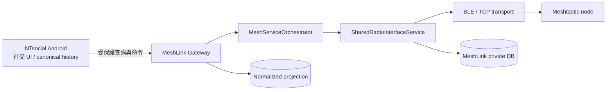
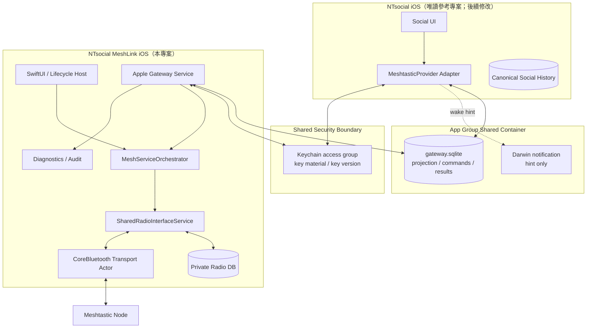
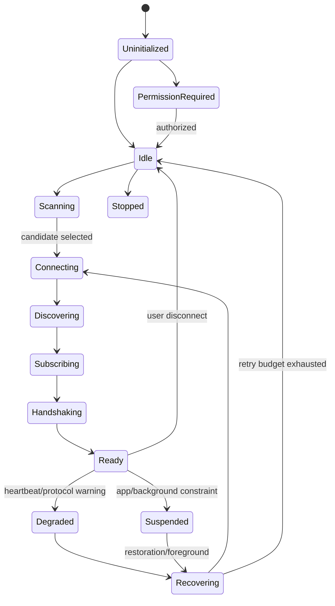
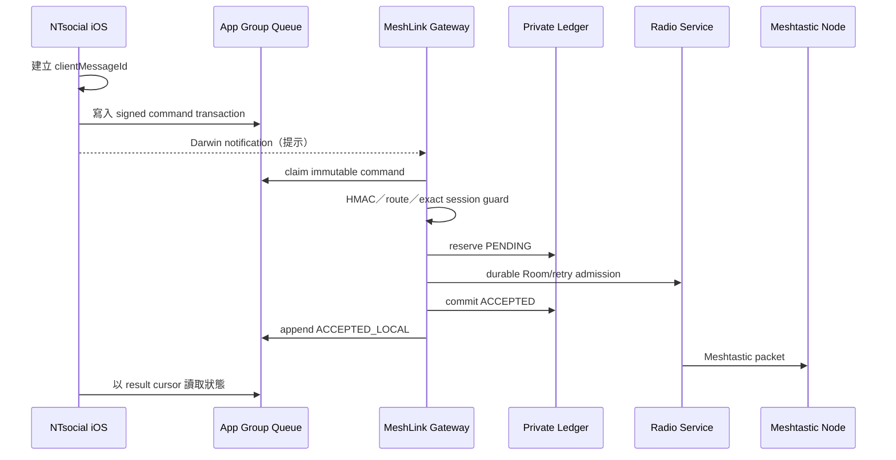
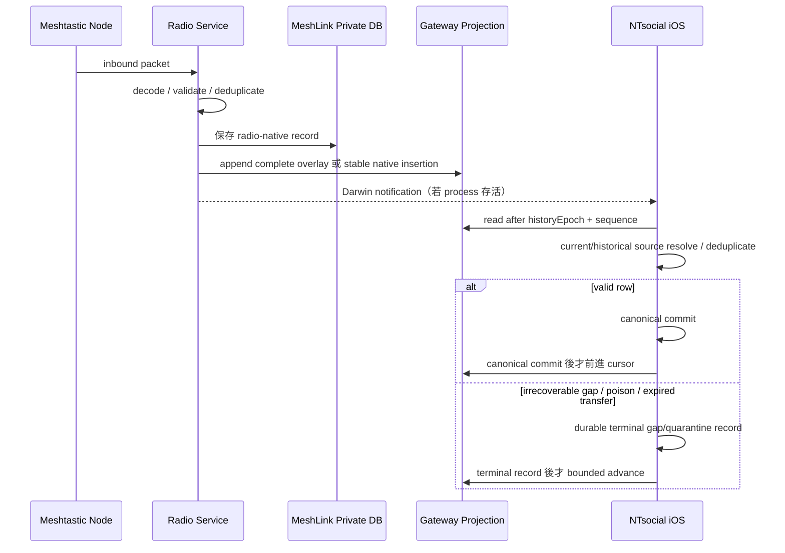

# iOS NTsocial MeshLink 開發施工計畫

> 文件狀態：iOS 原始碼 vertical slice 已完成；進入簽章、實機與 release 驗證
> 稽核日期：2026-08-07（Asia/Taipei）
> 目標專案：`nuclear718/ntsocial-mesh-gateway-android`
> 實作分支／基底：`codex/feat/ios-meshlink`，基底 HEAD `988d3327e45772e73dd2147ee7fffe4a26d370a6`；本文件更新時 iOS 變更尚未 commit
> 母程式專案：`nuclear718/NTsocial_release`（Apple Gateway adapter 由另行授權的工作樹實作；仍需簽章雙 App 驗證）
> 適用對象：iOS、Kotlin Multiplatform、BLE／Meshtastic、資安、QA 與 release 工程師
> 文件目的：把現有 Android NTsocial MeshLink 的責任邊界、Gateway 語意與 Meshtastic 控制流程，轉化為可在 Apple 平台施工、測試及交付的方案。

---

## 0. 2026-08-07 實作狀態補充

本節是目前原始碼與可重現證據的最高優先摘要；若後續章節仍保留早期「建議／未實作」文字而與本節衝突，以本節、`specs/004-ios-meshlink/` 與實際 source/test 為準。

### 0.1 已完成的 source vertical slice

- iOS 已正式列為本 repository 的第三產品軌。`ios/runtime` 產生 static `MeshLinkKit` framework；`iosApp` 提供 iOS 17+ SwiftUI/Xcode host，bundle ID 為 `com.ntsocial.meshlink.ios`。
- Runtime 使用真實 Koin graph，重用 `DirectRadioControllerImpl`、`MeshServiceOrchestrator`、shared repositories、Room 與 radio state machine。`IosDurableMessageQueue` 以 Room `QUEUED` packet 作為重啟／重連後的 durable work record，不把 queue admission 誤稱為 RF delivered。
- Apple BLE 採 **Kable-first**：真實 CoreBluetooth availability、peripheral UUID reconstruction、central state restoration 設定與 negotiated maximum write length 均在 `core/ble/src/iosMain`；沒有第二套 Swift radio transport owner。
- iOS secure random 使用 `SecRandomCopyBytes`，偏好使用 file-backed DataStore，radio/private state 使用 Room KMP SQLite。
- Apple Gateway v1 已實作：App Group SQLite mailbox、私有 durable idempotency ledger、versioned/length-delimited HMAC-SHA256 command codec、nonce replay protection、32-byte Base64URL/120 秒 route、caller/source/captured-slot/generation/capability 綁定、opaque generation rotation、claim/reclaim、durable result、bounded overlay ingress 與 stable-only native text feed。`overlay_epoch_state` 讓每個 history epoch 的 high-water 不因 128-row retention 淘汰而倒退，舊 v1 檔案缺表時會由 retained rows additive backfill，`user_version` 維持 1。已 accepted 的私有 ledger record 可在「ledger commit 後、result publish 前」crash/restart 時先於 process-local route resolution 重播原 packet ID；相同 client ID 若內容不同仍回 `IDEMPOTENCY_CONFLICT`。
- Radio readiness、inbound projection 與 admission 共用 selected/active radio、atomic session epoch/configured、所選 radio 的 active Room DB、complete-channel readback／final snapshot generation、Bluetooth、transport/App connection、history epoch 與 channel fingerprint 的 exact identity；route 發出時捕捉，durable admission 前在 `ChannelOperationLock` 內重新比對。所選 radio 或任一 routing context 改變都會撤銷舊 route。`READY` 或 inbound-identity-only revision 會立即 drain durable mailbox，暫時失敗再以 500／1,000／2,000 ms、最多三次的單一 coalesced job 處理。每輪最多 64 commands；budget 用盡時排下一個 delayed pass，第 65 筆不會 starvation，也不以 busy loop 續跑。
- Radio replacement 現在先以 generation-bound callback facade 與同步 validation／side-effect lock 撤銷 retired transport 的 connect／disconnect／data callback，再等待舊 ingress handler／child write、outbound queue／status／mesh-log generation 完全 quiesce；之後才切換 per-radio DB、由該 active DB 的 direct snapshot hydrate node cache、resume ingress 並啟動 replacement transport。Expected epoch 會保留到 packet dequeue 與同步 transport send 線性化點，即使 replacement 使用相同 address／transport object，retired admin、readback 或 raw send 也不能進入新 session。
- Manual／QR apply、public protected-channel reconcile 與 built-in provision 現在共用 serialized mutation contract：validate exact session／ensure admin → invalidate Gateway ingress → exact-session firmware mutation → correlated fresh readback → activate verified final identity。Fresh readback 沿用 firmware `69420` config-only sentinel，由 prior FULL Stage 2 已完成且無其他 owner 時才能建立的 host exclusive owner/token 歸屬；completion 使用專用 host flow，不以 generic generation、stale FULL response 或 parallel handshake 代替。Radio rejection、readback mismatch／timeout 或 session replacement 均保持 fail-closed。
- 已 `ACCEPTED_LOCAL` 但尚未 dispatch 的 Gateway packet 在 private Room row 保留原 `source_channel_id`；actual drain 會重新驗證 exact session、active ingress 與 slot/PSK/LoRa-derived source identity，並將 validation 到 matching firmware `QueueStatus` 維持在 operation boundary 內。Channel identity 已變更時舊 packet fail closed，不會因相同 numeric slot 送到新 channel。
- Swift bootstrap 解析 App Group `group.com.ntsocial.meshlink.gateway`，在 shared Keychain group `$(AppIdentifierPrefix)com.ntsocial.meshlink.gateway` 讀取／建立 32-byte HMAC key，監聽 payload-free Darwin command hint，並支援 `ntsocial-meshlink://process` foreground handoff。
- Focused UI 只提供 host/App Group/Bluetooth/background/parent handoff readiness，以及 scan/select/connect/disconnect/forget。Routes browser、native-text composer、results browser、Gateway reset/panic-wipe UI、maps 與完整 Meshtastic settings 不列入首版必要範圍，避免複製母程式 UX。Xcode host 已包含 source Privacy Manifest 與 `Assets.xcassets/AppIcon.appiconset`；其聲明與圖示仍須在 signed archive／App Store 階段複核。
- 另行授權的 `NTsocial_release` 工作樹已實作 Swift App Group/Keychain/Darwin/deep-link adapter、production payload provider、canonical-store import、Android-compatible projection identity、current catalog 與 same-epoch historical source resolver 分離、commit-before-cursor，以及 authenticated `enqueueNativeBroadcastText` API。First-send pending 會立即 durable 記錄 exact message／attempt／transport 的 `.queued`＋`.admission`，但不冒充 accepted；multipart restart correlation 保存 final social-header message ID、attempt、part kind/index/count、transfer ID 與 logical channel。Slot-indexed duplicate source identity 仍保留給 outbound route，canonical/history projection 則以 PRIMARY 優先、再 lowest slot deterministic collapse，security semantics 衝突時拒絕。Retention gap、malformed envelope、lost/expired transfer 只有在 durable gap／quarantine／abandoned-transfer terminal record 成功後才做 bounded cursor recovery；transient store/projection failure 不前進，已被 retention 淘汰的 row 也不宣稱可恢復。母程式 composer 仍刻意 deferred；這不改變 GPL companion 與 proprietary parent 分離的邊界。

### 0.2 已保留的驗證證據

- `:core:gateway:jvmTest`：36 tests passed；Gateway iosArm64／iosSimulatorArm64 compile passed。新增證據涵蓋 retention-safe `overlay_epoch_state`／additive v1 backfill、accepted-ledger crash replay、不同 fingerprint conflict，以及 admission 後 accepted-ledger commit 失敗的 retryable 狀態。
- Current-source focused slices 共 135/135：domain 16/16、data 104/104、`:ios:runtime:jvmTest` 15/15。Runtime 分布為 session／active-DB guard 4、bounded retry scheduler 3、64-command drain budget 3、durable dispatch identity 2、inbound-projection signal 1、shell/deep-link 2；data 分布為 config flow 32、connection 21、provision 11、packet handler 17、Gateway 22、real-lock integration 1。Deterministic tests 亦涵蓋 same-address reconnect、69420 host owner/token correlation、mutation/readback producer progress、premature activation window 與 accepted-before-drain channel replacement。Spotless、五個 changed modules Detekt、iOS Simulator Arm64 compile 與 diff check 通過；最終 bounded audit 對這些邊界無可重現 P0/P1。
- JDK 21、en-US `JAVA_TOOL_OPTIONS`、one worker 下，current-source root `./gradlew --no-daemon --max-workers=1 assembleDebug test allTests kmpSmokeCompile --continue --console=plain` 於 2m `BUILD SUCCESSFUL`：1,406 actionable tasks（333 executed、1 from cache、1,072 up-to-date）。Native iOS test link/run 仍依 convention `SKIPPED`。Root `detekt --continue` 只因五項既有 finding 非零：BLE `JvmDesktopBluetoothPairingService` line 154 `TooGenericExceptionCaught`、lines 143/188 `ThrowsCount`；model `NtsocialGatewayIdentity` line 168 `MagicNumber`；network `BleRadioTransport` line 246 `ThrowsCount`。Changed modules 與 Spotless 全綠。
- 母程式 `swift test --package-path ios --filter AppleGatewayAdapterTests`：27/27 passed；完整 `swift test --package-path ios`：668/668 passed，release build 亦 green。Focused suite 涵蓋共同 HMAC／identity vector、精確 Keychain service/account v1 座標、invalid HMAC、nonce replay、payload-conflict idempotency、newer-schema rejection、stream/result/cursor round-trip、additive `overlay_epoch_state` migration、first-send pending restart correlation、multipart all-parts terminal aggregation、chunk final-ID/UInt32 restart metadata、duplicate source deterministic collapse／security conflict、overlay gap／poison durable terminal recovery、same-epoch historical backlog、terminal rejection、native-text enqueue，以及 canonical commit-before-cursor。這仍是 source/test/build evidence，不是 signed two-App interoperability proof。
- 下列命令成功：

  ```bash
  xcodebuild -project iosApp/NTsocialMeshLink.xcodeproj \
    -scheme NTsocialMeshLink \
    -configuration Debug \
    -sdk iphonesimulator \
    -destination 'id=E3249756-57AF-4D9C-AA2B-3332E9309529' \
    CODE_SIGNING_ALLOWED=NO build
  ```

  Final Xcode 前找到的 Koin cycle（`NtsocialGatewayRepositoryImpl ↔ IosDurableMessageQueue`）已以 cycle-free `GatewayIngressSessionGate.activeSessionEpoch` 取代 queue 對 repository 的依賴；修正後 runtime 15/15、runtime Detekt、Simulator compile/framework link 均綠。Fresh Simulator Debug Derived Data `/tmp/ntsocial-ios-final-fixed.2fROK9` 的 signing-disabled `clean build -quiet` exit 0／零輸出；App 安裝並 cold-launch 於 `Codex iPhone 17`（UDID `E3249756-57AF-4D9C-AA2B-3332E9309529`）為 PID 67524，兩秒後仍為同一 PID。Fresh generic-iphoneos Release Derived Data `/tmp/ntsocial-ios-final-device.YaTk5N` 同樣 signing-disabled quiet exit 0／零輸出；bundle 為 `1.0.0`／build `1`，含 `Assets.car` 與 `PrivacyInfo.xcprivacy`。Zero quiet output 證明本輪無 Xcode／linker／ICU warning；上述仍是 unsigned source/simulator evidence，不是 signed archive 或可安裝實機證據。

### 0.3 尚未完成、不可宣稱的事項

- 尚未以 Apple Developer portal／provisioning profile 證明兩個**已簽章** App 真的共享 App Group、Keychain 與 Darwin／deep-link 流程。Source entitlement 字串不是此證據。
- 尚無 iPhone 實機 Bluetooth permission、scan、handshake、state restoration、reconnect、node reboot；無 connected-radio local admission、LoRa airtime、第二台 radio reception、remote receipt 或 Android↔iOS RF interoperability 證據。
- CoreBluetooth restoration 與 Darwin hint 皆為 best effort；不保證永久背景執行或被終止 App 的 command wake。
- Repository convention 仍關閉 Kotlin/Native iOS test link/run task；`iosSimulatorArm64Test` 即使顯示 Gradle success，也可能只代表相關 task 被 skip。目前 native test 證據僅為 test compilation／framework link。
- 唯一已知 open source P2 是 exact readback 已 admit 後 caller timeout/cancel、且 firmware 永遠不回 late response 時，host owner 在同一 epoch 維持 fail-closed，需 reconnect/new epoch 才恢復 readback／identity activation。這是 bounded liveness/availability，不是錯頻、跨 session 寫入或資料外洩。
- 先前 `libicu.icudtl_dat.o` 的 iOS Simulator 18.5 對 host 17.0 warning 已關閉：Xcode build phase 只接受經檢查為 `__text = 0`、單一 ICU data symbol、固定 `__const` bytes 的已知 Skiko member，將其 LC_BUILD_VERSION relink 為 deployment target 後原子重建 static archive；未知 layout 會 fail closed。此為 source／simulator toolchain evidence，仍不能取代 signed archive 驗證。
- 尚未完成 signed archive、Privacy Manifest／privacy nutrition label 的最終 linked-API 稽核、license/source offer、TestFlight、App Store metadata/review。此文件不宣稱 App Store readiness。
- 使用者口述 Android 已上架 Google Play 尚未由本 repository 的簽章／Console／Play-installed artifact 證據驗證，不得覆蓋 `AGENTS.md` 現有 Android Play 狀態。

---

## 1. 結論摘要

本次程式碼稽核與實作得到四項關鍵結論。

1. **Android 版不是單純的 Meshtastic UI fork，而是「LoRa/radio owner＋受保護 Gateway」**。MeshLink 負責無線電連線、Meshtastic 原生訊息、節點／頻道投影、route token、命令驗證與 durable idempotency；NTsocial 母程式保有社交 UI、帳號政策及 canonical social history。iOS 版必須保留這個所有權分界，不能讓兩個 App 同時控制同一個 Meshtastic radio。
2. **KMP iOS vertical slice 已從 scaffold 進入可編譯、可 link、可啟動的 source implementation**。`MeshServiceOrchestrator`、`SharedRadioInterfaceService`、`DirectRadioControllerImpl`、Room、DataStore 與 Kable 已接到真實 iOS runtime；但未經實機 BLE／radio/RF 與簽章雙 App 驗證，因此還不是 production-ready。
3. **iOS 沒有照抄 Android IPC**。Apple Gateway 已以 App Group mailbox、shared-Keychain HMAC、private in-memory routes／durable ledger、payload-free Darwin hint 與 foreground deep link 實作相同安全／durability 語意。
4. **交付型態維持獨立 GPL-3.0-or-later companion**。母程式 adapter 已在另行授權工作樹完成 source 與 focused tests，但 NTsocial 母程式仍不 link MeshLink radio implementation；正式互通要等匹配 entitlement 的 signed-device proof。

iOS 1.0 的最小完整路徑應為：

```text
KMP 核心與 Apple Gateway source（已完成）
→ Kable/CoreBluetooth runtime＋SwiftUI host（已完成 source／simulator）
→ NTsocial iOS provider adapter（已完成 source／focused tests）
→ signed dual-App App Group／Keychain 驗證
→ 實機 BLE／本機 Meshtastic 收發
→ 實機 RF／背景／重啟／跨版本驗收
→ signing／TestFlight／App Store gates
```

---

## 2. 稽核範圍、證據強度與非目標

### 2.1 已檢查範圍

- 目標專案根目錄規範、Gradle/KMP 結構、Android Gateway、radio service、route token、命令驗證、iOS source set 與現有測試配置。
- `NTsocial_release` 的 iOS SwiftPM 模組、App lifecycle owner、Apple Gateway adapter、provider health／release capability、source entitlements 與 Android 端 MeshLink Gateway consumer；母程式變更由另一個明確授權工作樹執行。
- Meshtastic Apple 專案的 Apple 平台實作型態，特別是 CoreBluetooth actor、serial delegate queue、state restoration 與 GPLv3 授權邊界。

### 2.2 證據分類

| 分類 | 本文件中的意義 |
|---|---|
| 已確認 | 可直接由目前程式碼、設定、focused test 或 simulator evidence 證實；仍需標明證據層級 |
| 架構決策 | 本計畫為消除平台差異而明確指定的施工方向 |
| 待實機驗證 | 需要 iPhone＋Meshtastic node、背景切換、斷線或 RF 環境才能確認 |
| 母程式 source 已實作、待裝置整合 | adapter／tests 已完成，但尚未有 matching signed entitlements 與雙 App 實機證據 |

### 2.3 非目標

- 不重寫 Meshtastic protocol。
- 不把 Android UI 逐畫面等比例移植；優先移植 radio、Gateway、設定及 diagnostics。
- 不承諾 iOS 有 Android foreground service 等價物。
- 不在 App Group 暴露 PSK、raw protobuf、完整位置、radio config 或 MeshLink 私有資料庫。
- 不讓 NTsocial iOS 與 MeshLink iOS 同時建立同一 radio 的 BLE session。
- 不把 `NTsocial_release` 的 proprietary business logic 或 secrets 複製進 GPL companion；母程式只透過另行授權變更消費公開 Apple Gateway contract。

---

## 3. Android 現況：必須保留的設計語意

### 3.1 系統責任邊界



Android 實作的核心不是 IPC API 的外型，而是以下不變條件：

- **單一 radio owner**：MeshLink 擁有連線與 Meshtastic 狀態機。
- **父 App 不讀 radio 私有資料庫**：只讀經過正規化與最小揭露的 Gateway projection。
- **父 App 不取得 PSK 或 raw protobuf**。
- **命令先驗證 caller、route、generation 與 idempotency，再排入 radio queue**。
- **`accepted` 僅表示命令已通過驗證並可靠排隊／持久化，不等於遠端節點已收到**。
- **Gateway contract 採 additive evolution**：新欄位可增加，舊 reader 必須忽略未知欄位。
- **Native Meshtastic text 使用標準 `TEXT_MESSAGE_APP`**，不能為 NTsocial 私訊另造不相容的私有 port。

### 3.2 Android Gateway 讀取面

`NtsocialGatewayProvider.kt` 為 certificate-pinned、read-only provider，主要提供：

- v1：status、envelopes、nodes、channels。
- v2：status、normalized channels、message changes。
- v2 status 語意包含：
  - `capabilities`
  - `bearer = MESHTASTIC`
  - `radioGeneration`
  - `historyEpoch`
  - `messageChangeSeq`
  - native history/send availability
  - overlay route availability
- channel projection 的核心欄位：
  - `sourceChannelId`
  - `routeToken`
  - slot／role
  - security metadata（不得含 PSK）
  - capability flags
- message-change projection 的核心欄位：
  - 穩定遞增 sequence
  - source message/channel/from/to identity
  - text／timestamp／status
  - 經過允許的 RF metadata

iOS 不需要複製 Android Cursor，但必須輸出相同的 domain meaning。

### 3.3 Android Gateway 命令面

`NtsocialGatewayCommandReceiver.kt` 與 caller verifier 實作了：

1. caller package／UID／signing certificate 驗證；
2. v1、routed overlay、native text 命令分類；
3. route token 驗證；
4. `clientMessageId` durable reservation；
5. 同 ID 同 fingerprint 的 retry 回傳既有 accepted/pending；
6. 同 ID 不同 fingerprint 必須 reject；
7. 產生 deterministic packet identity；
8. 成功驗證後才交給 radio queue。

Android 14 以上可檢查 sender UID/package；舊版另用 capability token。iOS 無此 sender API，因此 Apple Gateway 必須以 sandbox entitlement、App Group membership 與 cryptographic command envelope 取代。

### 3.4 Route token 與 generation

現有 route token 的重要語意：

- 隨機 token，短時效；現行 Android TTL 約 120 秒。
- 綁定 caller、`sourceChannelId` 與 `radioGeneration`。
- radio 重新連線、重新配置或 generation 改變後，舊 token 立即失效。
- token 只授權一條已驗證 route，不授權讀取 radio secrets。
- durable idempotency record 有界保存，避免無限制增長。

iOS 版 1.0 應維持 120 秒 TTL，除非 RF 實測證明需要調整；不可用永久 channel token 省略重新驗證。

### 3.5 可重用 KMP 核心

| 元件 | 可重用內容 | iOS 施工要求 |
|---|---|---|
| `MeshServiceOrchestrator` | start/stop、先選 DB 再接 radio、state flow、supervised actions | 由 Apple lifecycle coordinator 驅動，不依賴 Android Service |
| `SharedRadioInterfaceService` | radio lifecycle、FIFO、heartbeat、transport factory、reconnect、polite disconnect | iOS 1.0 以單一 Kable/CoreBluetooth BLE actual 接入；不啟用 TCP |
| `DirectRadioControllerImpl` | in-process radio controller | iOS 使用 direct controller，不移植 Android AIDL |
| 共用 models/protobuf | Meshtastic message、node/channel domain | 建立 Android/iOS golden fixtures 防止 schema drift |
| 共用 repository/use case | radio/cache/message policy | 移除 Android-only clock、UUID、storage、permission 依賴 |

---

## 4. 現有 iOS 實作狀態與未關閉 gate

| 範圍 | 目前 source／證據 | 尚未完成 | 優先級 |
|---|---|---|---|
| iOS host | Xcode project、SwiftUI host、Info.plist、source entitlements、Privacy Manifest、AppIcon asset、static framework；current-source fresh clean simulator、install/cold-launch/alive 與 unsigned generic-iphoneos Release pass | signed archive、實機 lifecycle、App Store pipeline | P0 |
| BLE | Kable/CoreBluetooth real availability、UUID reconstruction、restoration config、negotiated write length | 實機 permission/scan/handshake/restore/reconnect/node reboot | P0 |
| 安全亂數 | `SecRandomCopyBytes`；Gateway CSPRNG tests | device entropy／failure-path retention evidence | P0 |
| 持久化 | Room KMP、file-backed DataStore、App Group SQLite、private ledger、durable queue | signed cross-process migration/corruption/concurrency/crash recovery matrix | P0 |
| Gateway | common engine＋iOS coordinator/radio port/wake sink；36 JVM tests；exact session／active-DB／readback identity、retired-work barriers、READY drain、bounded retry、retention-safe overlay epoch high-water、accepted-ledger crash replay | signed two-App command/ingress/result round trip | P0 |
| Keychain/App Group | matching source identifiers＋Swift HMAC bootstrap | Apple Developer portal/profile entitlement proof | P0 |
| 母程式 | Swift adapter＋production payload provider＋restart-stable pending/multipart correlation＋deterministic current/historical resolver＋durable gap/poison recovery＋native-text egress API；focused 27/27、full SwiftPM 668/668、release build green | signed parent/companion device interop and release capability enablement；composer deferred | P0 |
| Native tests | iOS test source compiles | convention 仍 disabled link/run；必須啟用並執行 | P0 |
| Toolchain | data-only Skiko ICU archive normalization；generic-iphoneos Release signing-disabled clean build 產生 arm64 Mach-O，無 Xcode／linker／ICU warning | signed archive／Apple delivery toolchain 複驗；目前 artifact 仍 unsigned | P0 |
| RF | 無 | connected-radio admission、airtime、第二台 radio receipt、Android↔iOS matrix | P0 |
| diagnostics/admin UI | focused health/connection UI | redacted export、reset/panic-wipe 等視真實產品需求後續決定 | P1／deferred |

**施工規則：source implementation、simulator、signed entitlement、實機 BLE、connected-radio、RF、background 與 App Store 是不同證據層級；不可用較低層級代替較高層級。**

---

## 5. NTsocial iOS 母程式的相容邊界

`NTsocial_release` 的 Apple Gateway adapter 已在另行授權的工作樹實作，並保留以下邊界：

- 母程式 bundle ID 為 `com.ntsocial.ios`，只透過 App Group／Keychain／Darwin／deep link 操作 Apple Gateway，不 link `MeshLinkKit`，也不開第二個 Meshtastic BLE transport。
- Swift adapter 可讀 status/channels/results/overlay/native cursor、簽署 outbound command，並使用 production `NTSocialMeshtasticAppPayloadProvider` 產生完整 `NM` application envelope；另提供 authenticated `enqueueNativeBroadcastText` API，但母程式 composer 不在本次最小範圍。
- 只有 `ACCEPTED_LOCAL` 映射為 local accepted；文案不得翻譯成 RF、remote delivered 或 read。
- Native feed 以精確 `source_channel_id` 建立 Android-compatible durable automatic projection；mailbox/catalog 保留 slot-indexed duplicate source identities 供 outbound route 使用，current catalog 只服務目前 route，same-history-epoch historical resolver 保留已觀察 source 的最小 routing identity。Canonical/history projection 對相同 stable identity 以 PRIMARY 優先、再 lowest slot deterministic collapse；若 duplicate source 的 security semantics 衝突則拒絕，不以任意 slot 繼續。這讓 channel replacement 後既有 native／overlay backlog 仍可匯入。
- First-send `pendingLocalAcceptance` 立即 durable 寫入 exact message／attempt／transport 的 `.queued`＋`.admission`，保持 pending；後續同 attempt 的 `ACCEPTED_LOCAL` 只 ack／advance 一次。Parent-private restart correlation 保存 final social-header message ID、attempt、multipart kind/index/count、transfer ID 與 logical channel，不從 chunk 外層 16-byte header 或 hard-coded direct 0/1 重建。
- 正常 row 只有匹配且成功寫入 canonical store 後才前進 cursor。若是 retention gap、malformed envelope 或 lost/expired multipart transfer，必須先 durable 寫入 gap／quarantine／abandoned-transfer terminal record，之後才可 bounded advance 到 `firstRetained - 1` 或略過 deterministic poison；transient store/projection failure 仍不前進、可 retry。此流程不宣稱已淘汰 row 可 lossless recovery。
- Synthetic/native gateway author 不得污染 peer/profile/roster。
- App Group `group.com.ntsocial.meshlink.gateway`、Keychain suffix `com.ntsocial.meshlink.gateway`、companion ID `com.ntsocial.meshlink.ios`、Darwin names 與 deep link 在 source 一致。

Focused `AppleGatewayAdapterTests` 已 27/27 通過，完整 SwiftPM suite 已 668/668 通過，parent release build green；這證明目前 Swift codec/store/domain 與整體 package regression gate，不證明 Apple Developer entitlement、雙 App sandbox access、背景排程、BLE 或 RF。正式 release capability 只能在 signed two-App、connected-radio 與 RF gate 通過後標為 available。

---

## 6. 架構決策紀錄（ADR-001）

### 6.1 決策

建立一個**獨立、GPL-3.0-or-later 的 NTsocial MeshLink iOS companion app**，保留於本專案；共用 KMP domain/protocol/service，Apple 平台能力由 Swift/Kotlin Native adapter 提供。NTsocial iOS 母程式透過 App Group Gateway 互動，不直接 link MeshLink radio implementation。

### 6.2 評估方案

| 方案 | 結論 | 原因 |
|---|---|---|
| A. 把 GPL MeshLink/Meshtastic code 直接嵌入 NTsocial iOS | 不採用 | 授權邊界、release cadence、radio ownership 與故障隔離都變差 |
| B. 獨立 companion＋Apple Gateway | **採用** | 對齊 Android 邊界；可獨立上架、診斷、升級與管理 GPL 義務 |
| C. 完全另寫 Swift fork，不用 KMP 共用核心 | 不採用 | Android/iOS protocol、retry、idempotency 與 database policy 容易分叉 |
| D. 只用 URL scheme 臨時傳命令 | 不採用 | 無 durable queue、無 delta cursor、背景時容易遺失，不能支撐同步 |
| E. 直接共用 MeshLink 私有 DB | 不採用 | schema coupling、secret leakage、migration coordination 風險不可接受 |

### 6.3 後果

- 需要兩個 App 的相同 Team/App Group/Keychain entitlement。
- App Store 上需清楚說明 companion 關係與使用流程。
- 跨 App 即時喚醒不能保證；正確性必須建立在 durable mailbox，而非通知。
- GPL source offer、license notices、第三方 attribution 與 reproducible source tag 必須納入 release checklist。
- Radio 連線只由 MeshLink iOS 持有；NTsocial 自有 BLE mesh 不得誤接管 Meshtastic peripheral。

---

## 7. 目標系統架構



### 7.1 資料所有權

| 資料 | 唯一 owner | 可否共享 |
|---|---|---|
| PSK、radio config、raw protobuf | MeshLink private DB | 不可 |
| BLE peripheral/session、Meshtastic protocol state | MeshLink runtime | 不可 |
| node/channel radio cache | MeshLink | 僅最小 normalized projection |
| Gateway status/channel route/message delta | MeshLink Gateway | 可透過 App Group 讀取 |
| commands | NTsocial 寫入；MeshLink 消費 | 可，必須簽章與 durable |
| command results | MeshLink 寫入；NTsocial 讀取 | 可 |
| canonical social history、read state、thread UI | NTsocial | 不交由 MeshLink |
| diagnostic bundle | MeshLink | 僅使用者主動匯出，必須 redact |

### 7.2 單一 radio owner 規則

1. MeshLink process 是唯一可建立 Meshtastic transport 的 process；iOS 1.0 只啟用 Kable/CoreBluetooth BLE。
2. NTsocial provider adapter 僅寫 command mailbox、讀 projection。
3. companion 未安裝／未開啟／權限不足時，provider 回傳明確 degraded/unavailable，不可偷偷自行連 radio。
4. 如果未來要支援 embedded mode，必須另立 ADR 與授權審查，不得在 1.0 偷渡。

---

## 8. 已實作的程式碼與模組配置

目前 source 的主要配置如下；未列出的 shared Android／Desktop modules 仍維持原責任，不因 iOS host
而複製：

```text
iosApp/
  NTsocialMeshLink.xcodeproj
  NTsocialMeshLink/
    NTsocialMeshLinkApp.swift
    ComposeRootView.swift
    AppleGatewayBootstrap.swift
    Info.plist
    NTsocialMeshLink.entitlements
    PrivacyInfo.xcprivacy
    Assets.xcassets/AppIcon.appiconset/
  Tools/normalize_skiko_icu_archive.sh

ios/runtime/src/
  commonMain/.../
    IosGatewayRadioSessionGuard.kt
    IosGatewayProjectionSignal.kt
    BoundedGatewayRetryScheduler.kt
    GatewayCommandDrain.kt
    IosShell*.kt / IosConnectionScreen.kt
  iosMain/.../
    IosCompositionRoot.kt / MeshLinkRuntime.kt
    IosAppleGatewayCoordinator.kt
    IosAppleGatewayRadioPort.kt / IosAppleGatewayWakeSink.kt
    IosDurableMessageQueue.kt
    IosRadioTransportFactory.kt / IosRadioUiPort.kt

core/ble/src/iosMain/kotlin/
  IosBluetoothRepository.kt
  KablePlatformSetup.kt

core/database/src/iosMain/kotlin/
  DatabaseBuilder.kt

core/gateway/src/commonMain/kotlin/
  AppleGatewayContract/Models/Schema/Store.kt
  AppleGatewayCommandCodec/Validator.kt
  AppleGatewayRouteRegistry/PrivateLedger/Idempotency.kt
  AppleGatewayProviderEngine/RadioPort.kt

shared common modules/
  RadioSessionState + generation-bound transport callbacks
  RadioIngressWorkTracker + awaited packet-queue generation barrier
  active per-radio DatabaseManager + direct node-cache hydration
  exact Gateway ingress identity + channel repair/provision fail-closed
```

### 8.1 Swift 與 Kotlin 的責任切割

- Swift host：只負責 App lifecycle/scene、App Group path、shared-Keychain bootstrap、payload-free Darwin hint、
  deep link 與 Compose view-controller embedding；不持有另一套 `CBCentralManager`／Meshtastic transport。
- Kable/CoreBluetooth iOS actual：負責 Bluetooth availability、scan、peripheral reconstruction、GATT、
  restoration configuration 與 negotiated write length，是唯一 Apple BLE transport owner。
- Kotlin common/runtime：負責 Meshtastic framing、radio/service state machine、Room、message queue/retry、
  repository、exact session/database barriers、Apple Gateway domain 與 focused Compose UI。
- 禁止 Swift 與 Kotlin 各自實作 reconnect state machine；所有 retired transport callback 都先通過
  generation-bound serialized validation，才可改變 shared session 或投遞 bytes。

---

## 9. Kable/CoreBluetooth transport 實作與實機 gate

### 9.1 單一 transport owner

現行 source 由 Kable/CoreBluetooth actual 擔任唯一 owner；不得再建立平行 Swift transport：

- `CBCentralManager` 使用固定 restoration identifier。
- 掃描只針對 Meshtastic service UUID；不做無限制全頻掃描。
- 使用 iOS 的 peripheral UUID 作暫時 transport identity；完成 Meshtastic handshake 後以 node identity 為真實 identity。
- 不依賴 Android MAC address，因 Apple 不提供等價穩定位址。
- discovery、connect、service discovery、characteristic discovery、notify enable、protocol handshake 分階段回報。
- 寫入長度使用 `maximumWriteValueLength(for:)`；不要移植 Android `requestMtu()` 思維。
- `writeWithoutResponse` 必須尊重 `canSendWriteWithoutResponse` 與 ready callback，避免塞爆 CoreBluetooth buffer。
- notify callback 只做 framing admission，不在 delegate queue 執行 DB 或重型 protobuf 工作。
- disconnect 原因要分類：user、Bluetooth off、permission denied、link loss、protocol timeout、radio reset。
- reconnect 使用 bounded exponential backoff＋jitter；使用者主動 disconnect 不自動重連。
- restoration callback 只恢復可證明的 peripheral/session，不把 stale reference 當成 ready。

### 9.2 Transport 狀態

下圖是 UI／QA 應區分的 readiness 真相模型，不是授權另建一套 Swift reconnect state machine：



每次進入 `Ready` 前必須同時滿足：

- CoreBluetooth connected；
- required services/characteristics discovered；
- notification subscription successful；
- protocol handshake completed；
- persisted radio selection 已 authoritative hydrate，且其 private DB selected/opened；
- active DB 的 node cache 已由 direct snapshot hydrate；
- radio／transport callback／inbound／outbound generation 已建立且一致；
- complete channel readback/final snapshot 已綁定同一 configured session；
- inbound/outbound queues 已 resume 且可用。

UI 不得把「BLE connected」直接顯示成「Meshtastic ready」。

Radio selection／replacement 使用同一 awaited barrier：同步撤銷 retired transport callback generation，
停止新 ingress/outbound admission，等待舊 handler、child persistence、queue worker、status 與 mesh-log write
完成，切換 active per-radio DB 並 hydrate cache，最後才 resume ingress、建立 replacement transport。任何
stale callback、已 dequeue 的舊-generation packet、late database collector 或舊 handshake completion 都不可
改變新 session／DB。Manual／QR、repair/reconcile 與 built-in provision 由 mutation boundary 完整序列化，但
短期 operation boundary 會釋放讓 readback producer commit；每次 mutation 前 invalidate ingress，只有 host
owner/token 將 firmware 69420 config-only response 歸屬到同一 configured session 並完成專用 completion flow
後才 activate。Radio rejection、readback failure 或 acknowledgement timeout 不得用 cache 猜測成功。
Durable Gateway packet 另在 actual dispatch 重新驗證持久化 source identity；slot/PSK 改變即 fail closed。

### 9.3 測試注入點

Transport interface 至少能注入：

- fake clock；
- fake central/peripheral event stream；
- characteristic fragmentation；
- delayed/duplicated/out-of-order notification；
- Bluetooth off/on；
- restore with stale peripheral；
- write backpressure；
- handshake timeout；
- node reboot。

---

## 10. Apple lifecycle 與背景真相模型

iOS 沒有 Android foreground service 等價物，因此設計必須把「可恢復」與「永遠執行」分開。

### 10.1 Runtime owner

`AppLifecycleCoordinator` 是唯一 start/stop owner：

| 事件 | 動作 |
|---|---|
| onboarding 完成＋權限可用 | 開 DB、啟動 orchestrator、恢復上次 radio |
| app active | reconcile permission、radio、mailbox、pending result |
| app inactive/background | flush transaction、保存 queue/cursor、交給 CoreBluetooth restoration |
| Bluetooth off | generation rollover、route token invalidation、狀態設為 unavailable |
| radio selection replacement | revoke retired callback、quiesce ingress/outbound、switch DB/hydrate cache、再 connect |
| protected data unavailable | 暫停 DB/Gateway，不做破壞性重建 |
| user disconnect | polite disconnect、停止 auto reconnect |
| account panic wipe | 先停止 runtime、關 DB、清 Keychain/App Group/private storage |
| app termination/relaunch | 由 durable state 恢復，不假設 callback 一定送達 |

### 10.2 背景保證

1. **可靠性來源是 durable queue，不是背景喚醒。**
2. Darwin notification 只提示已在執行的 process 重新讀 mailbox，不能作為 launch guarantee。
3. BackgroundTasks 可做 maintenance／flush，但不可作即時訊息 correctness 的唯一依賴。
4. CoreBluetooth state restoration 能改善 peripheral session 恢復，不能被描述為永遠在線。
5. provider status 必須揭露 `backgroundMode = BEST_EFFORT` 與最近活躍時間，讓母程式顯示真實健康狀態。
6. 使用者從 NTsocial 送出命令、而 companion 未執行時，命令保持 `PENDING_PROVIDER_WAKE`；可提供「開啟 MeshLink」deep link，但不能把 deep link 當隱形背景啟動。

---

## 11. Apple Gateway v1（已實作 contract）

### 11.1 傳輸選擇

採用：

- App Group container：durable projection、command queue、result queue。
- Shared Keychain access group：HMAC key、key version、installation identity。
- Darwin notification：`projectionChanged`、`commandAvailable` 的 best-effort hint。
- URL scheme／universal link：需要使用者介入時開啟 companion。
- 不採用 clipboard、local HTTP server、私有 API、直接讀 companion private DB。

### 11.2 Shared SQLite

檔案：App Group `group.com.ntsocial.meshlink.gateway` 中的 `gateway-v1.sqlite`；`PRAGMA user_version = 1`。

規則：

- WAL mode、foreign keys、busy timeout。
- schema 初始化／additive migration 必須是 transactional；reader 遇到較新 schema 必須 fail closed。
- 每張表指定 writer，避免雙方改同一 row：
  - NTsocial：immutable `command_inbox`、自己的 `consumer_cursor`。
  - MeshLink：status/caller/channel projections、`command_claim`、append-only `command_result`、overlay/native ingress。
- command 消費以獨立 `command_claim` 做 reclaimable claim transaction；不改寫 immutable inbox row。
- 資料庫 corruption 不可靜默清空；先備份、回報 health、重建 projection，commands 必須可稽核。
- iOS file protection 使用「首次解鎖後可用」等符合背景 restoration 的等級；敏感 key 仍留在 Keychain。
- projection 可重建；command/result/cursor 不可任意丟棄。Authoritative route 與 private idempotency ledger 均不在 App Group。

### 11.3 Schema

現行 schema-v1 的共享表為 `gateway_meta`、`gateway_caller_projection`、`channel_projection`、
`command_inbox`、`command_claim`、`command_result`、`overlay_ingress`、`overlay_epoch_state`、
`native_message_change`、`consumer_cursor` 與 `used_nonce`。欄位與 index 的唯一 source of truth 是
`AppleGatewaySchema.kt`，並須與母程式的 Swift mailbox schema 同步。

本輪新增但不提升 `user_version` 的 additive state 為：

```sql
CREATE TABLE IF NOT EXISTS overlay_epoch_state (
    history_epoch TEXT NOT NULL,
    high_water INTEGER NOT NULL CHECK (high_water >= 0),
    PRIMARY KEY (history_epoch)
);
```

`appendNextOverlayIngress` 在同一 transaction 讀取／遞增此 high-water 並寫 ingress；retention 刪除舊
`overlay_ingress` rows 不得降低 high-water。若開啟既有 v1 DB 時缺此表，初始化會從 retained rows 的
`MAX(change_seq)` backfill；explicit reset 同時清除此 state。這避免清空 retained rows 後 sequence 重用。

不得在 shared schema 出現：

- channel PSK；
- raw radio config；
- raw protobuf blob；
- precise position；
- Bluetooth identifiers 未經必要性審查的長期紀錄；
- private keys；
- 未遮蔽的 diagnostic trace。

### 11.4 Status domain

```json
{
  "schemaVersion": 1,
  "providerInstanceId": "process-uuid",
  "readiness": "READY",
  "radioGeneration": "opaque-generation",
  "historyEpoch": "epoch-uuid",
  "overlayHighWater": 1288,
  "nativeTextHighWater": 4096,
  "activeKeyVersion": 1,
  "updatedAtMillis": 1786057200000
}
```

Channel capability、route token 與 expiry 位於 `channel_projection`；reader 必須拒絕較新 schema，且不可重用已改變語意的欄位。`READY` 只表示 selected/active radio、session epoch/configuration、active per-radio DB、complete readback/final snapshot、Bluetooth、transport/App state 與 channel fingerprint 的 exact guard 當下可 admission，不代表背景永久在線或 RF delivered。

### 11.5 Command envelope

```json
{
  "schemaVersion": 1,
  "requestId": "uuid",
  "callerId": "com.ntsocial.ios",
  "clientMessageId": "0123456789ABCDEF0123456789ABCDEF",
  "sourceChannelId": "meshtastic-channel-id",
  "routeToken": "base64url-32-bytes",
  "radioGeneration": "opaque-generation",
  "issuedAtMillis": 1786057200000,
  "expiresAtMillis": 1786057320000,
  "keyVersion": 1,
  "nonce": "16-bytes",
  "commandType": "NATIVE_BROADCAST_TEXT",
  "bodyPayload": "hello",
  "authenticationTag": "hmac-sha256"
}
```

實際 persisted row 使用 typed columns／BLOB，不以 JSON 為 wire format。簽章輸入是 versioned、length-delimited canonical bytes，不可直接簽未定序 JSON。Native text 僅允許 nonblank、最多 180 UTF-8 bytes 的 broadcast；不接受 target node。另一 command body 是完整且通過驗證的 `NM` envelope。

### 11.6 驗證順序

```text
schema supported
→ required fields/type/size
→ created/expires clock window
→ key version
→ nonce format
→ HMAC constant-time verify
→ exact accepted-ledger lookup（crash replay／conflict）
→ expiry（只阻止新 admission，不阻止 exact accepted replay）
→ route token / source channel / generation
→ nonce reservation
→ body validation
→ private PENDING ledger reservation／fingerprint comparison
→ exact session/channel guard under `ChannelOperationLock`
→ Room＋durable retry queue admission
→ private ACCEPTED ledger commit
→ append-only `ACCEPTED_LOCAL` result
```

只有通過 route/session/body/idempotency 驗證才可建立或 exact-content-check radio packet。若 radio admission 已完成但 ACCEPTED ledger commit 失敗，回傳 retryable `PENDING_PROVIDER_WAKE`／`QUEUE_FAILED` 並釋放 claim；這不能證明 packet 未排程，caller 必須以同一 client ID retry。

### 11.7 Route token

- 32 bytes CSPRNG，Base64URL。
- TTL 120 秒。
- 綁定 exact caller `com.ntsocial.ios`、`sourceChannelId`、captured slot、opaque generation 與 routing capability。
- Authoritative route 只存在 MeshLink process memory；App Group 只投影短期明文 token，process restart 不保留 route。
- process restart、selected/active radio、session epoch/configured、active per-radio DB、complete readback/final snapshot、Bluetooth、transport/App state、history epoch、complete channel fingerprint 任一 routing-context inequality、channel removed 或 panic wipe 都撤銷舊 route。
- route projection 可包含短期明文 token；過期後 parent 必須重新讀 channels。
- token error 分為 `ROUTE_EXPIRED`、`ROUTE_GENERATION_MISMATCH`、`ROUTE_NOT_AUTHORIZED`，不可只回傳 generic failure。

### 11.8 Durable idempotency

`requestFingerprint` 涵蓋 canonical command semantics，包括：

```text
commandType
sourceChannelId
canonical payload hash
radioGeneration
routing／delivery flags
```

規則：

- 同 caller＋同 `clientMessageId`＋同 fingerprint：回傳原結果，不重送。
- 同 caller＋同 `clientMessageId`＋不同 fingerprint：`IDEMPOTENCY_CONFLICT`。
- private ledger 每 caller 最多保留 256 筆 insertion-ordered record，沒有 TTL；不得放進 App Group。
- pruning 不可刪除仍為 pending/in-flight 的 record；accepted record 可在新 process、route 已遺失或 command 已過期後重建同一 `ACCEPTED_LOCAL` result，且不做第二次 radio admission。
- packet ID 應由 stable inputs deterministic derivation，避免 App crash 後換 ID 重送。
- 這是 restart-stable local idempotency，不是 exactly-once RF；在 local admission 與 ACCEPTED ledger commit 間 crash，實體 RF 仍可能重複。

---

## 12. 收發訊息流程與狀態語意

### 12.1 NTsocial → LoRa



`R->>M` 是 admission 後的可能後續，不由 `ACCEPTED_LOCAL` 證明；Apple Gateway v1 不在 App Group 虛構 `SENT_TO_RADIO`、ACK 或 remote-delivery state。

### 12.2 LoRa → NTsocial



### 12.3 Send state

```text
CREATED
→ AUTHENTICATED
→ ROUTE_VALIDATED
→ PENDING_LEDGER_RESERVED
→ DURABLY_ADMITTED_TO_ROOM_AND_RETRY_QUEUE
→ ACCEPTED_LEDGER_COMMITTED
→ ACCEPTED_LOCAL
```

Failure 可發生於任一階段，必須包含 stable error code。Apple Gateway v1 現行結果只表示
`PENDING_PROVIDER_WAKE`、`ACCEPTED_LOCAL` 或 `REJECTED`；它不虛構後續 RF 狀態。UI 文案必須區分：

- 已排入 MeshLink；
- 已交給 radio；
- 收到 protocol ack；
- 對端已讀／已收（只有真的有此證據才顯示）。

不要把 `accepted=true` 翻譯成「已送達」。

### 12.4 Cursor 與 history epoch

- parent 的 overlay/native cursor 都以 `(historyEpoch, sequence)` 為 domain。
- projection 重建、不可相容 migration 或資料 wipe 時產生新 `historyEpoch`。
- parent 發現 epoch 改變時，執行 bounded resync，而不是沿用舊 sequence。
- `native_message_change` 是 stable-only insertion stream；更新／刪除不產生 change 或 tombstone，legacy nullable identity 不從目前 slot 重算。
- `overlay_ingress` 最多保留 128 rows，但 `overlay_epoch_state` 的 high-water 不隨 retention 倒退。Parent 發現同 epoch retention gap 時，先 durable 記錄 gap terminal，再 bounded advance 到 `firstRetained - 1`；這保留可稽核的資料遺失事實，不宣稱已淘汰 row 可恢復。
- Malformed envelope 或 deterministic poison 先 durable quarantine terminal 才可略過；lost/expired multipart transfer 先 durable abandoned-transfer terminal 才可清理／續讀。Transient store/projection failure 不寫 terminal、不前移 cursor，保持 retryable。
- current catalog replacement 不得使同 epoch 已持久化 backlog 無法匯入；母程式以 historical source resolver 處理既有 overlay/native rows，但新送出仍只使用 current route projection。相同 stable source 的 catalog duplicates 在 outbound 保留各 slot route，canonical/history 則 PRIMARY 優先、再 lowest slot collapse；security semantics 衝突時 fail closed。

---

## 13. 本機資料庫與 migration

### 13.1 原則

- 繼續使用現有 KMP database abstraction；不可讓 Android 與 iOS domain repository 分叉。
- iOS 實作底層必須是 durable SQLite，並有 migration test。
- 若現有 Room KMP 配置能在本 repo 的 iOS target 通過 compile、migration 與 crash-recovery proof，優先沿用；若無法，才以 SQLDelight adapter 實作相同 repository interface。**不得同時維護兩套 domain schema。**
- private radio DB 與 shared gateway DB 分離。
- DB open 必須先於 radio connect，維持 `MeshServiceOrchestrator` 的既有順序。
- migration 失敗時進入 `STORAGE_ERROR`，保留檔案供診斷，不可自動刪庫冒充成功。

### 13.2 必測 migration

- fresh install；
- N-1 → N；
- crash during migration；
- disk full；
- protected data unavailable；
- App Group schema older/newer than companion；
- parent 與 companion 版本交錯升級；
- history projection rebuild；
- panic wipe 後重新配對。

---

## 14. 安全模型

### 14.1 信任邊界

受信任：

- 相同 Apple Developer Team 所簽署、持有指定 App Group entitlement 的 NTsocial 與 MeshLink；
- Keychain access group 中的協議 key；
- MeshLink private container。

不受信任：

- shared container 中尚未驗證的 command bytes；
- deep-link parameters；
- radio inbound payload；
- notification hint；
- diagnostic import/export；
- 系統時間的小幅跳動；
- stale route/token/cursor。

### 14.2 主要威脅與控制

| 威脅 | 控制 |
|---|---|
| 偽造 command | App Group entitlement＋HMAC-SHA256＋key version |
| replay | nonce、expiresAt、durable clientMessageId reservation |
| route confused deputy | token 綁 caller/channel/generation/capability |
| duplicate LoRa send | durable idempotency＋deterministic packet ID；exact accepted replay 不再 admission，但 local-admission/ledger-commit crash gap 不是 exactly-once RF |
| DB tamper/corruption | schema validation、transaction、health fail-closed、audit |
| secret leakage | shared projection 禁止 PSK/raw config；logs redaction |
| stale Bluetooth identity | peripheral UUID 只作 transport hint；handshake node identity 才是真相 |
| malicious oversized payload | command size/type/UTF-8 limits before allocation/send |
| clock skew | 小幅容忍窗＋monotonic receive time；過大偏差回報 health |
| companion downgrade | schema min/max、key rotation、unsupported-version reject |
| panic wipe race | 先停止 runtime、關 DB，再刪 private/shared/keychain |

### 14.3 Key lifecycle

- Swift bootstrap 在 protected data、App Group 與 shared-Keychain access 可用時讀取／建立 256-bit HMAC key；不依賴 radio pairing 完成。
- Keychain item 使用明確 access group、service、key version。
- 現行 source 使用 active key version 1；rotation、panic wipe／team entitlement 改變／疑似 compromise 的雙 App lifecycle 尚需 signed-device 設計與驗證，不可從 source bootstrap 推論已完成。
- key 不可寫入 App Group SQLite、UserDefaults、log 或 diagnostic bundle。

### 14.4 Logging

預設可記：

- state transition；
- hashed peripheral/node identifier；
- error code；
- queue depth；
- duration；
- generation/epoch；
- schema version。

預設不可記：

- PSK；
- full message body；
- exact location；
- raw protobuf；
- route token/HMAC；
- Keychain error payload；
- 使用者帳號 token。

---

## 15. UI 最小範圍

iOS MeshLink 1.0 不複製母程式 social UX 或完整 Android/Meshtastic UI；目前最小範圍為：

1. host/App Group／Keychain bootstrap readiness；
2. Bluetooth permission/power 與 radio scan／selection；
3. connect/configuration state、disconnect、forget；
4. best-effort background truth與 parent handoff；
5. NTsocial integration readiness，不顯示 payload 或 secret。

Routes/channel browser、native-text composer、command-results admin、Gateway reset/panic-wipe UI、diagnostic export、maps、firmware 與 broad settings 均 deferred。Native broadcast-text egress 已由母程式 authenticated adapter API 提供，不需在 companion 複製 composer。

禁止以單一綠燈掩蓋「BLE connected 但 handshake/Gateway 未 ready」。

---

## 16. 分階段施工計畫

### Phase 0 — 基線、契約與授權（P0）

**交付**

- ADR-001 合併。
- 鎖定 iOS deployment target、Swift/Kotlin/Gradle/Xcode version。
- 建立 Gateway v1 neutral schema 與 fixtures。
- 建立 third-party notices、GPL source/release policy。
- 定義 bundle IDs、App Group ID、Keychain access group、URL scheme。
- 建立單一 radio owner invariant 與 threat model。

**退出條件**

- Android contract fixtures 全數可由 common module decode。
- iOS 架構、授權與 entitlement naming 經 engineering/release 審查。
- 母程式變更只在另行授權、獨立審查的工作樹／PR 中進行。

### Phase 1 — iOS KMP production baseline（P0）

**交付**

- 建立 Xcode/Compose host，可在實機啟動 common orchestrator。
- 實作 secure RNG、clock、UUID、file protection、permission actual。
- 實作 iOS durable private DB factory/migrations。
- 將 release source set 中所有 critical no-op/throw stub 改成實作或 fail-fast build gate。
- 建立 simulator compile test＋device smoke test。

**退出條件**

- Release build 不含已知 fake-success stub。
- cold start/restart 後 DB state、installation ID、idempotency record 可保留。
- Bluetooth denied/off 狀態可正確顯示，不 crash。

### Phase 2 — Kable/CoreBluetooth BLE radio transport（source 已完成；device gate P0）

**已完成 source**

- Kable iOS availability、scan、peripheral UUID reconstruction、GATT profile 與 restoration configuration。
- negotiated maximum write length、shared framing／queue／reconnect path。
- 接入 `SharedRadioInterfaceService`、`DirectRadioControllerImpl` 與 generation-bound callback guard。
- TCP／USB／serial 不在 iOS 1.0 範圍；backend parity 只有新產品需求與獨立 gate 時再評估。

**退出條件**

- 至少兩款 iPhone 與兩種 Meshtastic firmware/node 完成本機收發。
- background/foreground、Bluetooth off/on、node reboot 後可恢復。
- 無雙重 reconnect state machine、無 unbounded queue。

### Phase 3 — iOS companion host 與 focused diagnostics（source／simulator 已完成；device gate P0）

**已完成 source**

- SwiftUI lifecycle host、Compose root、radio picker、integration/health UI。
- startup、foreground handoff、scan/select/connect/disconnect/forget。
- source Privacy Manifest、AppIcon asset catalog 與 fail-closed ICU normalization。
- Gateway reset/panic-wipe UI、diagnostic export、routes/results browser 與 broad settings deferred。

**退出條件**

- 使用者可不依賴 NTsocial 完成配對與連線／integration readiness 檢視；native-text egress 由母程式 adapter API 提供，companion composer deferred。
- background 限制以真實文案呈現。

### Phase 4 — Apple Gateway v1（source 已完成；signed cross-process gate P0）

**交付**

- App Group SQLite schema/migrations。
- shared Keychain key lifecycle。
- signed command envelope、route token、durable idempotency。
- status/channel/message-change projections。
- command result cursor。
- Darwin notification hints＋deep-link wake fallback。

**退出條件**

- companion kill/relaunch、parent kill/relaunch、雙方交錯升級仍不重複送。
- invalid signature、expired route、generation mismatch、ID conflict 全部 fail-closed。
- shared DB 不含禁止資料。
- Android/iOS fixtures 的 domain semantics 一致。

### Phase 5 — NTsocial iOS provider adapter（source 已完成；signed device integration 待驗證）

**已完成 source**

- source App Group／Keychain entitlement 宣告與 `MeshLinkGatewayAdapter`。
- provider health 接到既有 startup/runtime owner；stop/start 會 detach／reattach observer/provider。
- canonical social history 做 source message ID dedupe；outbound 保留 duplicate source 的 slot routes，canonical/history 以 PRIMARY 優先、再 lowest slot collapse，security conflict fail closed，並以 same-epoch historical source resolver 處理 catalog replacement 後 backlog。
- overlay 與 native ingress 先 commit canonical store 再前進 cursor；retention gap／malformed poison／lost-or-expired transfer 只有在 durable terminal record 後才做 bounded recovery，transient failure 不前移。
- complete `NM` 與 authenticated native broadcast-text enqueue API；parent composer deferred。
- command acceptance 與 delivery 狀態文案分離；first-send pending 有 exact message/attempt/transport durable correlation，multipart 等所有 part terminal 才整體 accepted，任一 rejection 只 fail 一次，後續 part result 只 drain cursor。
- chunked restart 保存 final social-header ID、attempt、part metadata、transfer ID 與 logical channel，不從 wrapper header 或 hard-coded channel semantics 重建。

**退出條件**

- NTsocial iOS 可收發 private/public/channel 的支援範圍與 Android 對齊。
- 母程式永不直接讀 MeshLink private DB 或連 Meshtastic radio。
- parent 版本落後時能忽略 Gateway 新欄位而不中斷。

### Phase 6 — 硬化、跨平台與 release（P0/P1）

**交付**

- security/chaos/lifecycle/RF matrix。
- metrics、support runbook、migration rollback。
- TestFlight staged rollout。
- App Store privacy、Bluetooth usage description、GPL notices/source tag。
- Android/iOS interop evidence bundle。

**退出條件**

- 所有 P0 test gate 通過。
- 無 open critical/high security finding。
- 至少 72 小時長時間 soak 不產生 queue leak、token leak、重複 send 或永久 stale connection。
- release artifact 可追溯至 Git commit、schema、Meshtastic protocol/version。

---

## 17. 工程拆票清單

估算採相對尺寸：S（1–2 engineer-days）、M（3–5）、L（1–2 engineer-weeks）、XL（需再拆）。

| ID | 優先級 | 工作 | Owner | 估算 | Definition of Done |
|---|---|---|---|---|---|
| IOS-001 | P0 | ADR、授權與 single-owner boundary | Architect/Legal | M | ADR/notice/release policy 合併 |
| IOS-002 | P0 | Xcode＋Compose/KMP iOS host | iOS/KMP | L | 實機啟動 orchestrator |
| IOS-003 | P0 | deterministic iOS CI build | Build | M | clean runner 可產 simulator/device archive |
| IOS-010 | P0 | secure RNG、clock、UUID actual | KMP/iOS | M | deterministic tests＋CSPRNG device test |
| IOS-011 | P0 | private SQLite DB/migration | KMP/Data | L | restart/crash/migration matrix 通過 |
| IOS-012 | P0 | Keychain adapter/rotation | iOS/Security | M | key 不落 disk/log，rotation test 通過 |
| IOS-020 | P0 | Kable/CoreBluetooth transport owner | iOS/BLE | XL | scan→ready→disconnect 完整 |
| IOS-021 | P0 | reconnect/state restoration | iOS/BLE | L | background、BT toggle、node reboot 通過 |
| IOS-022 | P0 | framing/MTU/backpressure | BLE/KMP | L | fragmentation/load tests 無丟包或 OOM |
| IOS-023 | deferred | non-BLE transport parity | Network/KMP | M | 不屬 iOS 1.0；有獨立產品需求／ADR 才啟動 |
| IOS-030 | P0 | lifecycle runtime owner | iOS | L | cold/warm/background/panic wipe 通過 |
| IOS-031 | P0 | background truth model | iOS/Product | M | health/UI 不做虛假 always-on 承諾 |
| IOS-032 | P0 | permissions/onboarding | iOS/UI | M | denied/restricted/off/on 流程完整 |
| IOS-040 | P0 | Gateway v1 common schema | KMP/API | L | golden fixtures＋compat tests |
| IOS-041 | P0 | App Group projection DB | iOS/Data | L | cross-process read/write/recovery 通過 |
| IOS-042 | P0 | signed command envelope | Security/KMP | L | tamper/replay/expiry tests 通過 |
| IOS-043 | P0 | route token service | Security/KMP | M | caller/channel/generation/TTL 綁定 |
| IOS-044 | P0 | durable idempotency | KMP/Data | L | crash/retry/conflict 不重送 |
| IOS-045 | P0 | delta cursor/history epoch | KMP/Data | M | rebuild/cursor-too-old 可恢復 |
| IOS-046 | P1 | Darwin hint/deep-link wake | iOS | M | hint 遺失仍不影響 correctness |
| IOS-050 | P1 | diagnostics/redaction/audit | iOS/Support | M | bundle 無 secrets/message body |
| IOS-060 | P0 | Android/iOS contract fixtures | QA/KMP | L | CI 雙端 decode/encode 通過 |
| IOS-061 | P0 | RF interoperability matrix | QA/BLE | XL | node/firmware/message types 有證據 |
| IOS-062 | P0 | chaos/lifecycle/security suite | QA/Security | XL | P0 failure modes automation/record |
| IOS-070 | P0 | NTsocial parent adapter | iOS/API | L | source＋27/27 focused／668/668 full tests＋green release build；signed dual-App gate 另驗 |
| IOS-071 | P0 | TestFlight/release runbook | Release | L | signed archive、staged rollout、rollback |

---

## 18. 測試矩陣

### 18.1 Unit / property tests

- canonical command encoding；
- HMAC vectors、constant-time verification wrapper；
- route TTL/generation/capability；
- idempotency same/different fingerprint；
- packet ID determinism；
- cursor、epoch、retention；
- fragmentation/reassembly；
- state-machine illegal transition；
- backoff budget/jitter bounds；
- redaction。

### 18.2 Contract tests

- Android producer → neutral fixture → iOS reader。
- iOS producer → neutral fixture → Android/common reader。
- early-v1 reader／database 與 current schema-v1 additive table migration。
- unknown capability/field。
- missing required field。
- old/new schema coexist。
- cursor too old、epoch changed。
- error code stability。

### 18.3 iPhone 實機 lifecycle

至少包含：

- iOS 17、iOS 18 及目前支援的最新 major；
- 兩種硬體世代；
- fresh install/upgrade/reinstall；
- permission allow/deny/restricted；
- Bluetooth off/on；
- screen lock；
- foreground→background→suspend→restore；
- force quit；
- system memory pressure；
- protected data locked；
- low battery/Low Power Mode；
- airplane mode；
- companion/parent 不同啟動順序。

### 18.4 RF／Meshtastic

- 相同 channel、不同 channel；
- primary/secondary channel；
- public/channel/private native text；
- long text boundary；
- duplicate/late/out-of-order packet；
- node reboot；
- radio config change；
- firmware supported matrix；
- weak signal/multi-hop；
- ACK present/absent；
- phone A Android MeshLink ↔ phone B iOS MeshLink；
- Android NTsocial ↔ iOS provider 的 end-to-end flow；
- iOS send → Android receive 與反向；
- concurrent messages without duplicate canonical history。

### 18.5 Gateway/security

- shared DB locked/busy/corrupt；
- App Group unavailable；
- Keychain locked/missing/wrong version；
- invalid HMAC；
- replay nonce；
- expired/future command；
- oversized text；
- invalid UTF-8；
- stale route；
- generation mismatch；
- same client ID different payload；
- queue crash between reserve/accepted/enqueue；
- malicious notification storm；
- deep-link parameter injection；
- panic wipe race。

### 18.6 Release gate

P0 release 必須同時具備：

- automated test result；
- 實機操作紀錄；
- RF evidence；
- diagnostic bundle sample；
- migration evidence；
- license/source tag evidence；
- known limitation 文件。

模擬器測試不能取代 CoreBluetooth/RF 實機測試。

---

## 19. CI/CD 與 release

### 19.1 Pull request CI

- Kotlin common unit/contract tests。
- Android existing tests 不得退化。
- iOS simulator compile/test。
- SwiftFormat/SwiftLint（依團隊 convention）。
- Kotlin lint/static analysis。
- forbidden-stub scan：release source set 中搜尋 `UnsupportedOperationException`、known no-op、insecure RNG。
- schema fixture compatibility。
- secret/log pattern scan。
- license notice validation。

### 19.2 Nightly／device lab

- signed development build 安裝到實機。
- BLE fake peripheral integration。
- 至少一組真實 Meshtastic node smoke。
- long-running reconnect/queue soak。
- DB migration/corruption recovery。
- parent/companion version skew。

### 19.3 TestFlight

建議階段：

1. internal engineering；
2. RF/QA ring；
3. NTsocial internal users；
4. limited external beta；
5. production phased release。

每階段監控：

- connect-to-ready latency；
- reconnect success；
- command accepted→radio latency；
- duplicate send count；
- cursor reset；
- queue age/depth；
- Gateway auth error；
- crash-free sessions；
- support diagnostic success rate。

---

## 20. 風險登錄

| 風險 | 機率/衝擊 | 緩解 | Stop-ship 條件 |
|---|---|---|---|
| iOS 背景被誤當 always-on | 高/高 | durable queue、真實 health、restore test | UI/規格仍承諾永遠在線 |
| GPL 邊界不清 | 中/高 | standalone companion、notice/source tag、法律審查 | 無法提供對應 source/notice |
| CoreBluetooth race/stale callback | 高/高 | actor/serial owner、generation、callback tests | stale session 可被標成 ready |
| command duplicate send | 中/高 | durable reservation、deterministic packet ID | crash/retry 會重送 |
| App Group schema drift | 中/高 | neutral schema、migration、version skew CI | parent/companion 交錯升級破壞資料 |
| secrets 落 shared DB/log | 低/高 | denylist scan、redaction、security review | PSK/token/key 出現在 export |
| parent/companion 雙 radio owner | 中/高 | architecture invariant、provider-only parent | 同一 peripheral 可被雙方連線 |
| KMP iOS DB 不成熟 | 中/中 | Phase 1 spike、repository abstraction | crash recovery/migration 無法證明 |
| Meshtastic firmware 差異 | 中/中 | supported matrix、capability negotiation | 目標 firmware 無法可靠收發 |
| App Store entitlement/review | 中/中 | 早期建立 bundle/group、TestFlight 驗證 | production profile 缺 entitlement |

---

## 21. iOS 1.0 Definition of Done

iOS MeshLink 1.0 只有在以下條件全部成立時才算完成：

- 可從乾淨 checkout 產生 signed iOS archive。
- 無 production critical stub、fake permission 或 insecure RNG。
- iPhone 實機可配對、恢復、斷線、forget Meshtastic node。
- Native broadcast text 經母程式 Gateway API 雙向收發、匯入 canonical history，且不要求 companion composer。
- primary/secondary channel projection 正確且不洩漏 PSK。
- Apple Gateway status/channel/message delta/command result 全部 durable。
- route token 綁定 channel、caller、generation，TTL/revocation 正確。
- Exact accepted-ledger replay 不造成第二次 local admission；local-admission/ledger-commit crash gap 的 RF duplicate 風險已實機測量、文件化並有操作策略，不宣稱 exactly-once RF。
- `accepted`、`sent`、`acknowledged`、`delivered` 的 UI/contract 語意不混淆。
- parent/companion 版本交錯升級有測試。
- Private DB、App Group mailbox 與 Keychain key 的跨 App reset／account lifecycle 已有經測試且不依賴未實作 UI 的明確流程。
- Android↔iOS RF/contract interoperability matrix 通過。
- 現有 health/log 可支援 release 排錯且不含 secrets；額外 exported diagnostic bundle 非 1.0 必要 UI。
- GPL、third-party notices、source tag、privacy/usage descriptions 完成。
- TestFlight staged rollout 與 rollback runbook 完成。
- `NTsocial_release` provider adapter source 已完成；release capability 仍須等 signed two-App、connected-radio、RF 與 background gates 後才能標示 available。

---

## 22. 前四週建議施工順序

### 第 1 週

- IOS-001：ADR/授權/entitlement naming。
- IOS-003：CI baseline。
- IOS-010：secure platform primitives。
- IOS-040：凍結 Gateway v1 domain/fixtures。
- 建立 forbidden-stub inventory。

### 第 2 週

- IOS-002：Xcode/KMP host。
- IOS-011：private DB proof。
- IOS-032：Bluetooth permission/onboarding skeleton。
- IOS-020：CoreBluetooth scan/connect spike。

### 第 3 週

- IOS-020/021/022：service discovery、notify、framing、backpressure、handshake。
- IOS-030：lifecycle owner。
- 第一輪真實 node native text send/receive。
- 建立 RF evidence template。

### 第 4 週

- IOS-041/042：App Group DB＋signed command。
- IOS-043/044：route/idempotency。
- IOS-045：message delta/epoch。
- 建立最小 fake NTsocial client 驗證 Gateway，不等待母程式 PR。

四週結束時的合理 checkpoint 不是「App Store ready」，而是：

```text
真實 iPhone 可穩定控制 node
＋ 本機 native text 可收發
＋ durable Apple Gateway vertical slice
＋ crash/retry 不重送
＋ contract fixture 不分叉
```

---

## 23. `NTsocial_release` adapter 現況與後續 gate

另行授權的母程式工作樹已完成 App Group／Keychain source declarations、Swift Gateway adapter、runtime
owner 接線、canonical import、restart-stable pending/multipart/chunk correlation、duplicate-source deterministic
projection、same-epoch historical resolver、durable gap/quarantine recovery、authenticated overlay/native-text
enqueue、27/27 focused／668/668 full tests與 green release build。母程式仍不 link GPL radio implementation，
也不開 Meshtastic transport。

尚需完成：

1. 以 production signing configuration 與 provisioning profile 證明兩個 App 取得相同 App Group entitlement。
2. 以相同 Team/AppIdentifier prefix 證明最小 Keychain access group 可跨 App 讀寫同一 HMAC key。
3. 以 signed device 驗證 Gateway projection、signed command、Darwin hint、missed-hint recovery、deep link、stop/start observer lifecycle 與 cursor commit。
4. release capability 只有在實機 RF、background、security gate 通過後才由 unavailable 改為 available。
5. 實機 backend status 應逐一驗證：
   - companion not installed
   - companion not opened/onboarded
   - permission denied
   - radio disconnected
   - Gateway locked/migration error
   - ready
   - best-effort background
6. 保持 NTsocial 自有 BLE/Wi-Fi transport 與 Meshtastic provider 的責任分離。
7. App panic wipe 的跨 App 協調仍需另行設計／驗證；不得假設刪除母程式資料會清除 companion private state。
8. 建立並驗證 parent/companion version compatibility table。
9. Native-text composer 只有在明確產品需求下另行實作；現行 authenticated adapter API 已足供 integration/test，不為了 parity 擴大母程式 UI。

---

## 24. 不可破壞的不變條件

工程師在任何實作或重構中都必須維持：

1. MeshLink 是唯一 Meshtastic radio owner。
2. NTsocial 不取得 PSK、raw config、raw protobuf 或 MeshLink private DB。
3. route token 是短期、caller/channel/generation-bound。
4. 已 accepted 的同 fingerprint `clientMessageId` replay 不可產生第二次 local radio admission；local admission 與 accepted-ledger commit 間的 crash gap 仍可能造成實體 RF duplicate，不得宣稱 exactly-once RF。
5. `accepted` 不等於 remote delivered。
6. Gateway notification 不是 source of truth。
7. background callback 不保證存在；queue 必須 durable。
8. channel/radio security context 改變時 generation 必須 rollover。
9. history rebuild 必須改 epoch。
10. schema 只能 additive evolution；breaking change 必須升 major。
11. iOS 不依賴 Android MAC、Service、AIDL、ContentProvider、BroadcastReceiver 或 UID semantics。
12. production 不可含 throw/no-op/fake-success platform stub。
13. diagnostic/log 不可洩漏 secrets 或預設記錄全文。
14. 母程式只透過另行授權、獨立審查的工作樹／PR 修改；不得將 proprietary logic 或 secrets 搬入 GPL companion。
15. GPL source/notice 必須與實際 release artifact 可追溯。

---

## 25. 稽核索引

本計畫的主要判讀依據包括：

### 目標專案

- `AGENTS.md`
- Android `NtsocialGatewayProvider`
- Android `NtsocialGatewayCommandReceiver`
- Android `NtsocialGatewayCallerVerifier`
- Android `NtsocialGatewayRouteTokenStore`
- `MeshServiceOrchestrator`
- `SharedRadioInterfaceService`
- `DirectRadioControllerImpl`
- `core/ble/src/iosMain` Kable/CoreBluetooth actuals
- `core/gateway/src/commonMain/.../apple`
- `ios/runtime` 與 `iosApp`
- `specs/004-ios-meshlink/`
- Android/iOS Gateway tests 與 build evidence

### 另行授權的母程式專案

- SwiftPM package/module configuration
- `NTSocialApp.swift`
- release capability manifest
- parity/status documentation
- iOS entitlements
- Android `MeshLinkGatewayContract`
- Android `MeshtasticGatewayManager`

### 外部同授權參考

- Meshtastic Apple 的 CoreBluetooth transport、state restoration、Swift concurrency 與 GPLv3 release 結構。

---

## 26. 最終施工判斷

本專案不需要從零重寫 iOS Meshtastic client；真正可行的路徑是：

- **保留 KMP 共用 domain、service、message、queue、retry 與 policy；**
- **以 Apple 原生 adapter 完成 CoreBluetooth、lifecycle、Keychain、App Group、permission、storage；**
- **把 Android Gateway 的安全與可靠性語意移植，而不是把 Android IPC 形式硬搬到 iOS；**
- **以獨立 companion 維持 radio ownership、故障隔離與 GPL 邊界；**
- **用 contract fixtures＋RF evidence 證明 Android/iOS 相容，而不是只靠「兩邊都能編譯」。**

目前 source vertical slice、durable Gateway、parent adapter 與 simulator host gate 已完成。後續優先級固定為：**signed dual-App entitlement／cross-process proof → 實機 BLE 與 connected-radio admission → RF／重啟／背景 hardening → signing／TestFlight／App Store gates**。在這些實機與 delivery gate 關閉前，不應先投入大量 UI parity，也不得宣稱 production／App Store ready。
