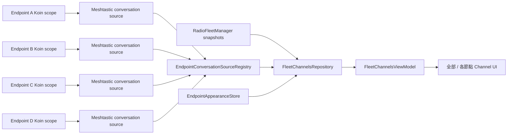
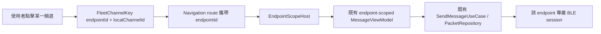

# Android NTsocial MeshLink 多節點 Channel UI/UX 與聚合架構提案

> 文件日期：2026-08-25（Asia/Taipei）  
> 稽核分支：`multi_nodes_`  
> 稽核基準提交：`2c62c6bc0facd50abd72b69f77601a0b32aa6435`（`Multi-Nodes FEATURES`）  
> 影響產品軌：Android NTsocial MeshLink  
> 文件性質：程式碼稽核、UI/UX 設計與實作提案；本文件本身不代表下列 production code 已完成修改

---

## 0. 執行摘要

### 0.1 結論

目前 `multi_nodes_` 分支已經具備相當重要的底層基礎：

1. 最多四個 Meshtastic BLE 端點的持久化目錄。
2. 每個 secondary endpoint 各自獨立的 Room 資料庫、DataStore、Koin scope、BLE client、service/repository graph、connection generation 與訊息處理流程。
3. 單一端點失敗不會直接摧毀整個 fleet manager。
4. Android UI 已可透過頂端 endpoint tabs 切換端點，並將大部分端點相關功能切入正確的 scope。

因此，**「一支 Android 手機同時維持四個 Meshtastic BLE 節點，並在 Channel 首頁聚合四個節點的 primary/secondary channels」在目前架構上是可延伸完成的，不需要推翻既有多端點底層。**

但目前畫面仍是「一次只選一個端點，再把整個功能頁切到該端點」的模式，而不是 fleet aggregation。若只繼續擴充現有 `RadioEndpointTabs`，會遇到三個 P0 正確性問題：

- Channel 首頁只能看見目前全域選取端點的 repository，無法同時觀察四組端點資料。
- 現有訊息路由只有 `contactKey`，沒有 `endpointId`；不同節點的 Channel 0 會產生相同 local key，聚合後存在錯誤開啟、錯誤標記已讀，甚至錯誤節點送出的風險。
- 切換 endpoint tab 時，`Main.kt` 會把目前 top-level feature 重設回根路由；這是 phase-1 隔離驗證的合理策略，但不符合「全部節點一頁瀏覽」以及「每節點專屬頁保留各自瀏覽位置」的 UX。

### 0.2 建議的核心決策

採用以下架構，而不是把四個端點資料庫合併：

> **保留每個 endpoint 的完整 runtime/data isolation，在其上新增一個唯讀、可動態增減來源的 Fleet Conversation Projection。**

資料讀取流程：



資料寫入與訊息傳送流程：



這個設計的關鍵是：

- **聚合只發生在 read model。**
- **訊息歷史、設定、packet queue、BLE session 仍留在原本 endpoint scope。**
- **任何可寫操作都必須攜帶 endpoint identity，不能依賴「目前全域選取中的節點」。**

---

## 1. 需求解讀與明確範圍

### 1.1 本階段必須完成

Android `Conversations/Channel` 第一個主分頁應具備：

1. `全部` 頁：
   - 不需點擊任何節點即可向下滑看所有已註冊節點的全部 configured channels。
   - 每個節點以獨立 card group 包覆。
   - 每張節點 card 具有可辨識但不刺眼的使用者自訂色調。
   - primary channel 永遠排在該節點 card 的第一列，secondary channels 依 channel index 排列。
   - 節點離線時仍顯示最後已知的 cached channel catalog，而不是整張 card 消失。

2. 每節點專屬頁：
   - `全部` 之後依序顯示最多四個 endpoint tabs。
   - tab 顯示 `displayName`，必要時以 address suffix 作輔助資訊，不能只顯示 MAC 最後四碼。
   - 各頁只顯示該節點 channels，並保留獨立捲動位置。

3. 正確導覽：
   - 點擊 channel 後，訊息頁必須知道來源 `endpointId`。
   - 返回時仍回到原本 `全部` 或該 endpoint 頁與原捲動位置。
   - 不因點擊 channel 而改寫全域 selected endpoint，除非使用者明確要求將其他功能同步切換到該節點。

4. 外觀設定：
   - 每個 endpoint 可設定色調、用途標籤與顯示順序。
   - 色彩不是唯一識別方式；節點名稱、用途、狀態與 protocol badge 必須同時存在。

### 1.2 本階段不應混入

以下項目不應阻塞第一版 Channel 聚合：

- 不在本 PR 同時完成 MeshCore 多節點 runtime。
- 不將四個 endpoint Room databases 合併成一個資料庫。
- 不在 Channel list 載入完整 message history。
- 不立即平行化四個 BLE setup handshake；目前 serialized bootstrap 較保守，先保留並進行硬體測試。
- 不把 app-global preferences 複製四份。
- 不在同一個 UI PR 重新設計所有 Settings、Nodes、Connections 畫面。

---

## 2. 最新程式碼現況稽核

### 2.1 已完成且應保留的基礎

| 區域 | 現況 | 判斷 |
|---|---|---|
| [`RadioEndpoint.kt`](core/radio-fleet/src/commonMain/kotlin/com/ntsocial/meshlink/core/radiofleet/RadioEndpoint.kt) | `MAX_RADIO_ENDPOINTS = 4`；有穩定 `RadioEndpointId`、profile、session state、snapshot | 可直接作為 fleet identity 基礎 |
| [`RadioFleetManager.kt`](core/radio-fleet/src/commonMain/kotlin/com/ntsocial/meshlink/core/radiofleet/RadioFleetManager.kt) | 維護 endpoint sessions、動態 reconcile profiles、端點級失敗投影、serialized connect | 不應被 UI 聚合層取代 |
| [`AndroidRadioEndpointSessionFactory.kt`](app/src/main/kotlin/com/ntsocial/meshlink/app/radio/AndroidRadioEndpointSessionFactory.kt) | legacy primary 使用 root graph；secondary endpoint 建立獨立 DB、DataStore、Koin scope 與 service graph | 是正確的 isolation boundary |
| [`RadioEndpointKoinModule.kt`](app/src/main/kotlin/com/ntsocial/meshlink/app/radio/RadioEndpointKoinModule.kt) | secondary scope 內已有 `RadioConfigRepository`、`PacketRepository`、`NodeRepository`、`ServiceRepository`、`SendMessageUseCase` 等完整依賴 | 聚合 source 可直接從 scope 建立 |
| [`RadioEndpointScopeRegistry.kt`](app/src/main/kotlin/com/ntsocial/meshlink/app/radio/RadioEndpointScopeRegistry.kt) | 以 `StateFlow<Map<RadioEndpointId, Scope>>` 暴露目前可用 secondary scopes | 可作為 Android source coordinator 的生命週期訊號 |
| [`ContactsViewModel.kt`](feature/messaging/src/commonMain/kotlin/com/ntsocial/meshlink/feature/messaging/ui/contact/ContactsViewModel.kt) | 已正確從單一 endpoint 的 `channelSetFlow` 建立空頻道 placeholder，並接合 packet preview/unread | 可抽出 Meshtastic channel projection 邏輯 |

### 2.2 現有 UI 的主要限制

[`Main.kt`](app/src/main/kotlin/com/ntsocial/meshlink/app/ui/Main.kt) 目前的關鍵行為是：

- `EndpointAwareNavigation()` 取得一個全域 `selectedEndpointId`。
- `RadioEndpointTabs()` 對所有 endpoint-aware top-level features 顯示 endpoint tab。
- tab 文字只有 `addressSuffix.uppercase()`。
- 切換端點後呼叫：

```kotlin
multiBackstack.navigateTopLevel(multiBackstack.currentTabRoute)
```

這會把 nested route 重設回該 top-level feature 根頁。

- `ScopedRadioNavigation()` 最終只讓整個 navigation content 位於：
  - legacy primary 的 root Koin graph，或
  - 一個 secondary endpoint 的 `UnboundKoinScope`。

因此，**同一個 `ContactsViewModel` 永遠只看得到一個 endpoint。** 這不是 bug，而是 phase-1 隔離設計的必然結果；但它不能直接承擔 fleet aggregate screen。

### 2.3 現有路由的 identity 不足

[`Routes.kt`](core/navigation/src/commonMain/kotlin/com/ntsocial/meshlink/core/navigation/Routes.kt) 目前為：

```kotlin
@Serializable
data class Messages(val contactKey: String, val message: String = "") : ContactsRoute
```

[`ContactsViewModel.kt`](feature/messaging/src/commonMain/kotlin/com/ntsocial/meshlink/feature/messaging/ui/contact/ContactsViewModel.kt) 對 broadcast channel 建立的 local key 為：

```kotlin
val contactKey = "$ch${DataPacket.ID_BROADCAST}"
```

所以四個 endpoint 的 Channel 0 會得到相同 local `contactKey`。在單端點 scope 內沒有問題；一旦聚合，只有 `contactKey` 就不再是全域唯一識別。

#### 必須採用的唯一鍵

```text
Fleet channel identity = endpointId + localChannelId
Fleet contact identity = endpointId + localContactKey
```

任何 Compose list key、Navigation route、mark-read、share、quick-chat、message composer、node-detail cross navigation，都不能丟失 `endpointId`。

### 2.4 目前 endpoint profile 不適合直接追加 UI 色彩欄位

[`DataStoreRadioEndpointStore.kt`](core/prefs/src/commonMain/kotlin/com/ntsocial/meshlink/core/prefs/radio/DataStoreRadioEndpointStore.kt) 現在將 profile 編碼成固定八欄：

1. endpoint ID
2. protocol
3. transport address
4. display name
5. enabled
6. auto connect
7. priority
8. legacy primary

而 decoder 明確要求：

```kotlin
if (fields.size != PROFILE_FIELD_COUNT) return null
const val PROFILE_FIELD_COUNT = 8
```

因此不應直接把 `hue`、`purposeLabel`、`sortOrder` 當第九、十、十一欄塞入既有字串格式。這樣做會提高升級時整份 endpoint catalog 解碼失敗的風險。

**建議建立獨立 `EndpointAppearanceStore`，以 endpoint ID 作 key。** Transport/session profile 與 UI presentation preferences 應維持不同生命週期與 schema。

### 2.5 `RadioProtocol` 尚未真正多平台化

目前 [`RadioEndpoint.kt`](core/radio-fleet/src/commonMain/kotlin/com/ntsocial/meshlink/core/radiofleet/RadioEndpoint.kt) 的 enum 只有：

```kotlin
enum class RadioProtocol {
    MESHTASTIC,
}
```

所以目前程式是「多 Meshtastic endpoint」，尚不是「多 protocol fleet」。這是合理的第一階段。建議先讓新的 Channel 聚合 domain model 不假設 Meshtastic `Int channel index`，但實際 adapter 只實作 Meshtastic。

### 2.6 `legacyPrimary` 與 Meshtastic primary channel 必須避免混淆

`legacyPrimary` 指的是保留舊 Android root graph/Gateway 相容性的 endpoint；它不是 Meshtastic 的 primary channel。UI 文案不得把兩者都翻成「主節點／主頻道」而不加區分。

建議：

- Settings/Connections 內稱 `legacyPrimary` 為「相容主節點」。
- Channel card 內稱 channel index 0 為「主要頻道」。
- 一般 Channel 首頁不必特別顯示 legacy-primary badge，避免干擾一般使用者。

---

## 3. 問題優先級

## P0：不先解決就不應推出聚合 Channel UI

### P0-1：所有可寫路由必須攜帶 endpoint identity

影響：

- 開啟訊息歷史
- 發送訊息
- 標記已讀
- 靜音設定
- 分享訊息
- Quick Chat
- 從訊息頁前往 node detail

錯誤做法：先修改全域 `selectedEndpointId`，再依賴畫面重組進入正確 scope。這存在競態條件，也會破壞其他 top-level feature 的狀態。

正確做法：route 本身攜帶 `endpointId`，entry 建立時由 `EndpointScopeHost` 選擇 root 或 secondary Koin scope。

### P0-2：建立 fleet-level read projection

不能讓 `FleetChannelsViewModel` 直接持有四組 Koin `Scope` 並散落呼叫 `scope.get()`。應建立 source registry，把 Koin 解析限制在 Android composition root/app radio integration 層。

### P0-3：Conversations 根頁必須脫離全域 selected endpoint scope

`全部` 頁若仍包在 `ScopedRadioNavigation(selectedEndpoint)` 裡，就只能看見單一端點。Conversations root 必須由 root Koin graph 建立 fleet ViewModel；只有訊息詳情等 endpoint-owned entry 才切入端點 scope。

### P0-4：不同 endpoint 的同名／同 index channel 必須保持完全獨立

所有 list key 與 click callback 必須傳遞 `FleetChannelKey`，不得只傳 channel index、channel name 或 `contactKey`。

## P1：第一個可用版本應一起完成

### P1-1：節點色調與用途設定

以獨立 presentation store 保存：

- `hueDegrees`
- `purposeLabel`
- `sortOrder`
- `showInAll`

### P1-2：離線／同步中／失敗／快取狀態

Channel catalog 是低變動資料。離線時應顯示快取並清楚標註，不應呈現空白畫面。

### P1-3：現代化 Material 3 視覺語言

優先重做 Channel 首頁元件，不必在同一個變更中重畫整個 app。

## P2：為 MeshCore 與自訂協議預留，但不阻塞 Meshtastic 版本

- protocol-neutral local conversation ID
- protocol capability model
- Meshtastic/MeshCore/Custom adapters
- 跨協議搜尋與 inbox
- 跨 endpoint RF scheduling policy

---

## 4. 建議的 Channel 首頁資訊架構

## 4.1 畫面結構

```text
┌──────────────────────────────────────────────┐
│ 頻道                                  搜尋  ⋮ │
├──────────────────────────────────────────────┤
│ [ 全部 ] [ 山搜指揮 ] [ 中繼站 ] [ 公共 ] ... │
├──────────────────────────────────────────────┤
│  ● 山搜指揮節點            已連線 · Meshtastic │
│    山區隊員聯繫                         3 未讀 │
│  ┌────────────────────────────────────────┐  │
│  │ 主要頻道  山搜指揮                2 未讀 │  │
│  │ #1        搜救一隊                     │  │
│  │ #2        後勤                         │  │
│  └────────────────────────────────────────┘  │
│                                              │
│  ● 山頂中繼節點               同步中          │
│    高海拔中繼                                 │
│  ┌────────────────────────────────────────┐  │
│  │ 主要頻道  Public LongFast               │  │
│  │ #1        NTsocial Relay                │  │
│  └────────────────────────────────────────┘  │
│                                              │
│  ● 備援節點                   離線 · 快取資料  │
│    緊急備援                                   │
│  ┌────────────────────────────────────────┐  │
│  │ 主要頻道  Emergency                     │  │
│  └────────────────────────────────────────┘  │
└──────────────────────────────────────────────┘
```

## 4.2 `全部` 頁的規則

1. 所有 endpoint groups 預設展開。
2. 不把「展開 card」當成看見 channels 的必要操作。
3. group 排序依 `sortOrder`，未設定時依 profile priority、legacy-primary、display name 決定穩定順序。
4. group 內排序：primary → secondary channel index 升冪。
5. card header 顯示：
   - display name
   - purpose label
   - connection/session state
   - protocol
   - channel 數量
   - channel unread 合計
6. 離線時：
   - 保留最近成功讀取的 catalog。
   - 顯示「離線」及最後同步時間。
   - 點擊可讀取本機歷史；composer 明確顯示不可即時送出或依既有 queue policy 處理。
7. 新增／刪除 endpoint 時，列表動態更新，不重設其他 groups 的捲動狀態。

## 4.3 每節點專屬頁

- tabs 第一個永遠是 `全部`。
- endpoint tab 使用 `displayName`；空間不足時截斷，address suffix 放在次要文字或 tooltip/accessibility description。
- 切換 tab 只改變 `FleetChannelsViewModel` 的 local filter，不呼叫 `fleetManager.select()`。
- 每個 tab 使用獨立 `LazyListState` 或至少保存目前 offset。
- 專屬頁可顯示更完整的 endpoint status、battery/last received 等資訊，但不要阻塞第一版。

## 4.4 色彩系統

使用者要求以色卡快速辨識節點，建議採「低彩度 card tint + 高彩度識別 rail」，而不是把整張 card 塗成高飽和色：

- card 背景：Material surface 與 endpoint hue 混合約 8%～12%。
- card 左側 4～6 dp rail：使用較明顯 endpoint accent。
- endpoint icon、selected tab indicator、unread badge outline：沿用 accent。
- 文字仍使用 `MaterialTheme.colorScheme.onSurface`，不自行猜測文字顏色。
- 深色模式降低背景亮度而非單純降低 alpha。
- 色彩不是唯一識別：名稱、用途、protocol icon 與狀態文字必須保留。

建議預設色相：

| 順序 | 預設色相 | 語意 |
|---|---:|---|
| 1 | 210° | 藍色 |
| 2 | 145° | 綠色 |
| 3 | 35° | 琥珀色 |
| 4 | 315° | 洋紅／紫色 |

使用者可在 0°～359° hue slider 或 12 個預設色票中選擇。正式 UI 建議先提供可存取性驗證過的色票，再提供「進階自訂色相」。

## 4.5 現代化視覺規格

- 頁面水平 padding：16 dp；大螢幕 24 dp。
- group card 間距：12 dp。
- card corner radius：20 dp。
- channel row 最小觸控高度：56 dp。
- card 不使用厚重陰影；採 `surfaceContainerLow`、細 rail 與適度 tonal elevation。
- endpoint 名稱：`titleMedium`。
- purpose/status：`bodySmall`／`labelMedium`。
- primary channel 使用明確 `主要` badge，但不將 secondary 全部弱化成難以閱讀的灰色。
- 未讀數使用 badge，`0` 時不顯示。
- app 名稱、主標題與 tabs 不重複堆疊三層 toolbar。

---

## 5. 建議的 domain model

### 5.1 新增檔案

建議路徑：

```text
core/radio-fleet/src/commonMain/kotlin/com/ntsocial/meshlink/core/radiofleet/conversation/
├── FleetConversationModels.kt
├── EndpointConversationSource.kt
└── EndpointConversationSourceRegistry.kt
```

第一階段可放在既有 `core:radio-fleet`，避免立即增加新 Gradle module；開始實作 MeshCore adapter 時，再抽成 `core:conversation-fleet`。

### 5.2 `FleetConversationModels.kt`

```kotlin
package com.ntsocial.meshlink.core.radiofleet.conversation

import com.ntsocial.meshlink.core.radiofleet.EndpointSessionState
import com.ntsocial.meshlink.core.radiofleet.RadioEndpointId
import com.ntsocial.meshlink.core.radiofleet.RadioEndpointProfile

/** endpoint 內部的 channel ID；使用 String，避免綁死 Meshtastic 的 Int index。 */
@JvmInline
value class LocalChannelId(val value: String)

/** fleet 範圍唯一的 channel identity。 */
data class FleetChannelKey(
    val endpointId: RadioEndpointId,
    val localChannelId: LocalChannelId,
)

enum class FleetChannelRole {
    PRIMARY,
    SECONDARY,
}

data class FleetChannelSummary(
    val key: FleetChannelKey,
    val localContactKey: String,
    val channelIndex: Int?,
    val name: String,
    val role: FleetChannelRole,
    val unreadCount: Int,
    val messageCount: Int,
    val lastMessageText: String?,
    val lastMessageAtMillis: Long?,
    val isMuted: Boolean,
)

data class EndpointConversationSnapshot(
    val endpointId: RadioEndpointId,
    val channels: List<FleetChannelSummary>,
    val lastSuccessfulSyncAtMillis: Long?,
    val hasCachedCatalog: Boolean,
)

data class EndpointAppearance(
    val hueDegrees: Float,
    val purposeLabel: String,
    val sortOrder: Int,
    val showInAll: Boolean = true,
)

data class FleetChannelGroup(
    val profile: RadioEndpointProfile,
    val sessionState: EndpointSessionState,
    val appearance: EndpointAppearance,
    val channels: List<FleetChannelSummary>,
    val lastSuccessfulSyncAtMillis: Long?,
    val hasCachedCatalog: Boolean,
) {
    val unreadCount: Int
        get() = channels.sumOf(FleetChannelSummary::unreadCount)
}
```

#### 逐段說明

- `LocalChannelId` 使用 `String`：Meshtastic adapter 可放 `"0"`、`"1"`；未來 MeshCore 或自訂協議可放 protocol-native ID，不必把整個 UI domain 重寫成另一種型別。
- `FleetChannelKey` 同時保存 endpoint 與 local channel ID，解決四個節點都有 Channel 0 時的碰撞。
- `localContactKey` 保留既有 `PacketRepository`／`MessageViewModel` 所需的 key；它只能在對應 endpoint scope 裡使用。
- `channelIndex` 允許 null，避免未來協議被迫提供 Meshtastic index。
- `EndpointConversationSnapshot` 是某一端點的 read projection，不包含 Koin scope、repository 或 protobuf object。
- `EndpointAppearance` 與 transport profile 分離。
- `FleetChannelGroup` 將 session state、profile、appearance 與 conversation snapshot 合成 UI 可直接使用的 immutable model。

### 5.3 不要把 channel catalog 塞進 `RadioEndpointSnapshot`

`RadioEndpointSnapshot` 應繼續負責 endpoint runtime/session 狀態。它現在已有 `primaryChannelName`，但完整聚合需求不應沿著這個欄位擴充成整份 `ChannelSet`，否則 transport orchestration 與 messaging domain 會重新耦合。

建議：

- 第一版保留欄位以避免無關破壞。
- 新畫面不依賴 `primaryChannelName`。
- 後續確認無使用者後移除或標記 deprecated。

---

## 6. Endpoint conversation source 與 registry

### 6.1 Contract

```kotlin
package com.ntsocial.meshlink.core.radiofleet.conversation

import com.ntsocial.meshlink.core.radiofleet.RadioEndpointId
import kotlinx.coroutines.flow.StateFlow

/** 一個 endpoint 對 fleet UI 提供的唯讀 conversation projection。 */
interface EndpointConversationSource {
    val endpointId: RadioEndpointId
    val snapshot: StateFlow<EndpointConversationSnapshot>
}

/** 動態反映目前已建立且可讀取的 endpoint sources。 */
interface EndpointConversationSourceRegistry {
    val sources: StateFlow<Map<RadioEndpointId, EndpointConversationSource>>
}

/** 只應由 app integration/lifecycle coordinator 呼叫。 */
interface MutableEndpointConversationSourceRegistry : EndpointConversationSourceRegistry {
    fun register(source: EndpointConversationSource)
    fun unregister(endpointId: RadioEndpointId)
}
```

#### 逐行意義

- `EndpointConversationSource` 不暴露寫入方法，避免 aggregate list 繞過 endpoint routing。
- `snapshot` 使用 `StateFlow`，新訂閱者立刻拿到目前 cache projection。
- registry 使用 map，source 的新增、scope 重建、endpoint removal 都能以 identity 更新。
- mutable contract 與 UI read contract 分離，feature layer 只依賴唯讀介面。

### 6.2 Android source coordinator

新增：

```text
app/src/main/kotlin/com/ntsocial/meshlink/app/radio/AndroidEndpointConversationSourceCoordinator.kt
app/src/main/kotlin/com/ntsocial/meshlink/app/radio/MeshtasticEndpointConversationSource.kt
```

Coordinator 責任：

1. 觀察 `RadioFleetManager.snapshots`。
2. 觀察 `RadioEndpointScopeRegistry.scopes`。
3. legacy-primary endpoint 使用 root Koin 的 `RadioConfigRepository`、`PacketRepository`、`ServiceRepository` 建立 source。
4. secondary endpoint 在對應 Koin scope 出現後，從該 scope 解析相同 repository contracts。
5. scope 消失、generation 重建或 endpoint 刪除時 unregister source。
6. 不把 `Scope` 暴露給 feature ViewModel。

概念骨架：

```kotlin
@Single
class AndroidEndpointConversationSourceCoordinator(
    private val fleetManager: RadioFleetManager,
    private val scopeRegistry: RadioEndpointScopeRegistry,
    private val registry: MutableEndpointConversationSourceRegistry,
    private val rootRadioConfigRepository: RadioConfigRepository,
    private val rootPacketRepository: PacketRepository,
    private val rootServiceRepository: ServiceRepository,
    @Named("AppScope") private val appScope: CoroutineScope,
) {
    private var job: Job? = null

    fun start() {
        if (job != null) return
        job = appScope.launch {
            combine(fleetManager.snapshots, scopeRegistry.scopes) { snapshots, scopes ->
                snapshots.values to scopes
            }.collectLatest { (snapshots, scopes) ->
                reconcileSources(snapshots, scopes)
            }
        }
    }

    private fun reconcileSources(
        snapshots: Collection<RadioEndpointSnapshot>,
        scopes: Map<RadioEndpointId, Scope>,
    ) {
        val expectedIds = snapshots.mapTo(mutableSetOf()) { it.profile.id }
        registry.sources.value.keys
            .filterNot(expectedIds::contains)
            .forEach(registry::unregister)

        snapshots.forEach { snapshot ->
            if (registry.sources.value.containsKey(snapshot.profile.id)) return@forEach

            val source =
                if (snapshot.profile.legacyPrimary) {
                    MeshtasticEndpointConversationSource(
                        endpointId = snapshot.profile.id,
                        radioConfigRepository = rootRadioConfigRepository,
                        packetRepository = rootPacketRepository,
                        serviceRepository = rootServiceRepository,
                        scope = appScope,
                    )
                } else {
                    val endpointScope = scopes[snapshot.profile.id] ?: return@forEach
                    MeshtasticEndpointConversationSource(
                        endpointId = snapshot.profile.id,
                        radioConfigRepository = endpointScope.get(),
                        packetRepository = endpointScope.get(),
                        serviceRepository = endpointScope.get(),
                        scope = endpointScope.get(named("ServiceScope")),
                    )
                }

            registry.register(source)
        }
    }
}
```

#### 實作注意

上述是結構骨架，不是可直接貼上即編譯的完整 patch。正式實作必須再補：

- generation 改變時替換舊 source，而不是只檢查 endpoint ID。
- source cleanup/collector cancellation。
- registry mutation 的 thread safety。
- primary root endpoint 尚未完成 migration 時的空狀態。
- Koin `AppScope` 的實際 qualifier 與現有 DI 命名對齊。
- 單元測試中使用 fake scope resolver，避免測試直接依賴 Android Koin internals。

### 6.3 Meshtastic source

可以從現有 `ContactsViewModel.contactList` 的 channel placeholder 邏輯抽出：

```kotlin
class MeshtasticEndpointConversationSource(
    override val endpointId: RadioEndpointId,
    radioConfigRepository: RadioConfigRepository,
    packetRepository: PacketRepository,
    serviceRepository: ServiceRepository,
    scope: CoroutineScope,
) : EndpointConversationSource {

    override val snapshot: StateFlow<EndpointConversationSnapshot> =
        combine(
            radioConfigRepository.channelSetFlow,
            packetRepository.getContacts(),
            packetRepository.getContactSettings(),
            serviceRepository.connectionState,
        ) { channelSet, contacts, settings, _ ->
            val channels =
                channelSet.settings.mapIndexed { index, channelSettings ->
                    val contactKey = "$index${DataPacket.ID_BROADCAST}"
                    val lastPacket = contacts[contactKey]

                    FleetChannelSummary(
                        key = FleetChannelKey(endpointId, LocalChannelId(index.toString())),
                        localContactKey = contactKey,
                        channelIndex = index,
                        name = channelSettings.name.ifBlank { "Channel $index" },
                        role =
                            if (index == 0) FleetChannelRole.PRIMARY
                            else FleetChannelRole.SECONDARY,
                        unreadCount = packetRepository.getUnreadCount(contactKey),
                        messageCount = packetRepository.getMessageCount(contactKey),
                        lastMessageText = lastPacket?.text,
                        lastMessageAtMillis = lastPacket?.time?.takeIf { it != 0L },
                        isMuted = settings[contactKey]?.isMuted == true,
                    )
                }

            EndpointConversationSnapshot(
                endpointId = endpointId,
                channels = channels,
                lastSuccessfulSyncAtMillis = currentTimeMillis(),
                hasCachedCatalog = channelSet.settings.isNotEmpty(),
            )
        }
            .distinctUntilChanged()
            .stateIn(
                scope = scope,
                started = SharingStarted.WhileSubscribed(stopTimeoutMillis = 5_000),
                initialValue = EndpointConversationSnapshot(
                    endpointId = endpointId,
                    channels = emptyList(),
                    lastSuccessfulSyncAtMillis = null,
                    hasCachedCatalog = false,
                ),
            )
}
```

#### 逐段說明

- `channelSetFlow` 提供 configured primary/secondary channel catalog。
- `getContacts()` 提供最後一筆 packet preview；不載入完整歷史。
- `getContactSettings()` 提供 mute 等 presentation state。
- `contactKey` 完全沿用現有單 endpoint 規則，只有在外層加上 endpoint identity。
- 第一階段以 index 0 判斷 primary，正式實作應再核對目前 `ChannelSet` normalization 對 disabled hole/role 的規則。
- `lastSuccessfulSyncAtMillis` 不應在每次任意 packet 更新都重設；正式版本應只在 channel catalog 成功載入／fresh readback 時更新。骨架在此簡化表達。
- `WhileSubscribed` 避免畫面完全不使用時持續做 UI projection，但 endpoint 的核心 radio/session collectors 不受影響。

---

## 7. Fleet repository：動態合併四個 sources

新增：

```text
feature/messaging/src/commonMain/kotlin/com/ntsocial/meshlink/feature/messaging/fleet/FleetChannelsRepository.kt
```

或若希望完全與 UI feature 解耦，可放入後續的 `core:conversation-fleet`。

```kotlin
class FleetChannelsRepository(
    private val fleetManager: RadioFleetManager,
    private val sourceRegistry: EndpointConversationSourceRegistry,
    private val appearanceStore: EndpointAppearanceStore,
) {
    val groups: StateFlow<List<FleetChannelGroup>> =
        combine(
            fleetManager.snapshots,
            sourceRegistry.sources,
            appearanceStore.appearances,
        ) { fleetSnapshots, sources, appearances ->
            FleetInputs(fleetSnapshots, sources, appearances)
        }
            .flatMapLatest(::observeGroups)
            .stateIn(
                scope = repositoryScope,
                started = SharingStarted.WhileSubscribed(5_000),
                initialValue = emptyList(),
            )

    private fun observeGroups(inputs: FleetInputs): Flow<List<FleetChannelGroup>> {
        val orderedSnapshots =
            inputs.fleetSnapshots.values.sortedWith(
                compareBy<RadioEndpointSnapshot> {
                    inputs.appearances[it.profile.id]?.sortOrder ?: Int.MAX_VALUE
                }.thenByDescending { it.profile.legacyPrimary }
                    .thenByDescending { it.profile.priority }
                    .thenBy { it.profile.displayName.lowercase() },
            )

        val groupFlows = orderedSnapshots.map { endpoint ->
            val appearance =
                inputs.appearances[endpoint.profile.id]
                    ?: EndpointAppearanceDefaults.forEndpoint(endpoint.profile.id)
            val source = inputs.sources[endpoint.profile.id]

            source?.snapshot?.map { sourceSnapshot ->
                FleetChannelGroup(
                    profile = endpoint.profile,
                    sessionState = endpoint.state,
                    appearance = appearance,
                    channels = sourceSnapshot.channels,
                    lastSuccessfulSyncAtMillis = sourceSnapshot.lastSuccessfulSyncAtMillis,
                    hasCachedCatalog = sourceSnapshot.hasCachedCatalog,
                )
            } ?: flowOf(
                FleetChannelGroup(
                    profile = endpoint.profile,
                    sessionState = endpoint.state,
                    appearance = appearance,
                    channels = emptyList(),
                    lastSuccessfulSyncAtMillis = null,
                    hasCachedCatalog = false,
                ),
            )
        }

        return combineLatestOrEmpty(groupFlows)
    }
}
```

#### 重要原則

- 外層 `combine` 處理 endpoint/source/prefs 集合變動。
- `flatMapLatest` 在 endpoint 新增、刪除、scope 重建時取消舊的 group composition。
- 每個 source 的 snapshot flow 持續推送 channels/unread/preview 更新。
- source 尚未可用時仍產生 endpoint group，UI 才能顯示 `Connecting`／`Synchronizing`，而不是讓節點從畫面消失。
- channel 數量最多約為「四個 endpoint × 每端點 configured channels」，不應使用四套 Paging pipeline。Paging 保留給大量 node/DM history。

---

## 8. Navigation 與 scope 的必要修改

## 8.1 新路由必須攜帶 endpoint ID

建議修改 [`Routes.kt`](core/navigation/src/commonMain/kotlin/com/ntsocial/meshlink/core/navigation/Routes.kt)：

```kotlin
@Serializable
sealed interface ContactsRoute : Route {
    @Serializable
    data object ContactsGraph : ContactsRoute, Graph

    @Serializable
    data object Contacts : ContactsRoute

    @Serializable
    data class FleetMessages(
        val endpointId: String,
        val contactKey: String,
        val message: String = "",
    ) : ContactsRoute

    @Serializable
    data class FleetShare(
        val endpointId: String,
        val message: String,
    ) : ContactsRoute

    @Serializable
    data class FleetQuickChat(
        val endpointId: String,
    ) : ContactsRoute

    // 過渡期保留既有 single-endpoint routes，待所有 caller 遷移後再移除。
    @Serializable
    data class Messages(val contactKey: String, val message: String = "") : ContactsRoute

    @Serializable
    data class Share(val message: String) : ContactsRoute

    @Serializable
    data object QuickChat : ContactsRoute
}
```

#### 為何不直接偷偷使用全域 selected endpoint

- 使用者可能正在 `全部` 頁點擊 Endpoint B Channel 0，但全域 selected endpoint 仍是 A。
- `fleetManager.select(B)` 是 suspend 操作，navigation/recomposition 順序可能造成短暫進入 A scope。
- 切換全域 endpoint 會讓 Nodes、Settings 等其他 top-level feature 狀態被改變。
- route 若可被 process recreation 恢復，更不能依賴當時記憶體中的全域 selection。

## 8.2 新增 `EndpointScopeHost`

建議放在：

```text
app/src/main/kotlin/com/ntsocial/meshlink/app/ui/EndpointScopeHost.kt
```

```kotlin
@Composable
fun EndpointScopeHost(
    endpointId: RadioEndpointId,
    content: @Composable () -> Unit,
) {
    val fleetManager = koinInject<RadioFleetManager>()
    val scopeRegistry = koinInject<RadioEndpointScopeRegistry>()
    val snapshots by fleetManager.snapshots.collectAsStateWithLifecycle()
    val scopes by scopeRegistry.scopes.collectAsStateWithLifecycle()
    val snapshot = snapshots[endpointId]

    when {
        snapshot == null -> EndpointUnavailableState()

        snapshot.profile.legacyPrimary -> content()

        scopes[endpointId] != null ->
            UnboundKoinScope(scope = checkNotNull(scopes[endpointId])) {
                content()
            }

        else -> EndpointScopeLoadingState(snapshot.state)
    }
}
```

#### 每一分支的意義

- endpoint 已刪除：顯示明確 unavailable state，不能 fallback 到 root endpoint。
- legacy primary：沿用現有 root graph。
- secondary scope 可用：用該 Koin scope 建立 MessageViewModel。
- session 尚在建立：顯示 loading/synchronizing，而不是誤用上一個 scope。

## 8.3 `contactsGraph` 接收 scope host lambda

`feature:messaging` 不應直接 import Android app 的 `RadioEndpointScopeRegistry`。修改 [`ContactsNavigation.kt`](feature/messaging/src/commonMain/kotlin/com/ntsocial/meshlink/feature/messaging/navigation/ContactsNavigation.kt)，由 app composition root 注入 wrapper：

```kotlin
typealias EndpointContent =
    @Composable (endpointId: RadioEndpointId, content: @Composable () -> Unit) -> Unit

fun EntryProviderScope<NavKey>.contactsGraph(
    backStack: NavBackStack<NavKey>,
    scrollToTopEvents: Flow<ScrollToTopEvent>,
    endpointContent: EndpointContent,
) {
    entry<ContactsRoute.ContactsGraph>(metadata = { ListDetailSceneStrategy.listPane() }) {
        FleetContactsEntryContent(backStack, scrollToTopEvents)
    }

    entry<ContactsRoute.FleetMessages>(metadata = { ListDetailSceneStrategy.detailPane() }) { args ->
        endpointContent(RadioEndpointId(args.endpointId)) {
            val messageViewModel: MessageViewModel =
                scopedViewModel(key = "messages-${args.endpointId}-${args.contactKey}")

            messageViewModel.setContactKey(args.contactKey)

            MessageScreen(
                contactKey = args.contactKey,
                message = args.message,
                viewModel = messageViewModel,
                onNavigateBack = dropUnlessResumed { backStack.removeLastOrNull() },
                // 其他 callback 同樣必須保留 args.endpointId。
            )
        }
    }
}
```

#### 關鍵細節

- ViewModel key 同時加入 endpoint ID 與 contact key，避免 Navigation 3 retained state 誤重用另一端點的 ViewModel。
- `MessageScreen` 本身可繼續使用既有 endpoint-scoped repositories。
- `Share`、`QuickChat`、node detail callback 也必須沿用同一 endpoint ID。
- 若 `navigateToNodeDetails` 仍只傳 `destNum`，跨到 Nodes feature 時可能落到錯誤 endpoint。短期至少先以 endpoint-aware route 包裝；長期讓所有 endpoint-owned routes 使用一致 `EndpointRouteContext`。

---

## 9. `Main.kt` 的必要結構調整

現有 endpoint tabs 不應顯示在新的 Conversations 根頁，因為該頁自己已有 `全部＋各節點` selector。

建議將目前：

```kotlin
val endpointAware =
    multiBackstack.currentTabRoute != TopLevelDestination.Connections.route &&
        multiBackstack.currentTabRoute != TopLevelDestination.MeshCore.route
```

改成概念上分離兩件事：

```kotlin
val currentTopLevel = multiBackstack.currentTabRoute

val isFleetConversations =
    currentTopLevel == TopLevelDestination.Conversations.route

val usesShellEndpointSelection =
    currentTopLevel != TopLevelDestination.Connections.route &&
        currentTopLevel != TopLevelDestination.MeshCore.route &&
        !isFleetConversations
```

接著：

```kotlin
if (usesShellEndpointSelection && endpointList.isNotEmpty()) {
    RadioEndpointTabs(...)
}

if (isFleetConversations) {
    // root fleet graph，不包在 selected endpoint scope。
    Box(modifier = Modifier.weight(1f)) {
        navigationContent()
    }
} else {
    ScopedRadioNavigation(
        endpointAware = usesShellEndpointSelection,
        selectedSnapshot = selectedSnapshot,
        endpointScope = selectedSnapshot?.let { endpointScopes[it.profile.id] },
        navigationContent = navigationContent,
        modifier = Modifier.weight(1f),
    )
}
```

### 9.1 這項修改的效果

- Conversations root 可取得 root-scoped `FleetChannelsViewModel` 與 registry。
- Nodes/Settings 等 feature 暫時維持現有全域 endpoint tabs，降低改動範圍。
- Conversations 的 message detail 不再靠整個 graph 的 selected scope，而由 route entry 的 `EndpointScopeHost` 精確切換。
- 不再因使用者在 Channel 專屬頁切換 endpoint tab，就重設其他 feature route。

### 9.2 改善既有 shell endpoint tabs

即使 Nodes/Settings 暫時保留現有 tabs，也應將只顯示 address suffix 的設計改善為：

```text
[ 山搜節點 · A12F ] [ 中繼站 · 91C4 ]
```

display name 是主要識別，address suffix 只是工程診斷資訊。

---

## 10. Fleet ViewModel

新增：

```text
feature/messaging/src/commonMain/kotlin/com/ntsocial/meshlink/feature/messaging/fleet/FleetChannelsViewModel.kt
```

```kotlin
sealed interface FleetChannelPage {
    data object All : FleetChannelPage
    data class Endpoint(val endpointId: RadioEndpointId) : FleetChannelPage
}

data class FleetChannelsUiState(
    val groups: List<FleetChannelGroup> = emptyList(),
    val selectedPage: FleetChannelPage = FleetChannelPage.All,
    val isLoading: Boolean = true,
) {
    val visibleGroups: List<FleetChannelGroup>
        get() = when (val page = selectedPage) {
            FleetChannelPage.All -> groups.filter { it.appearance.showInAll }
            is FleetChannelPage.Endpoint -> groups.filter { it.profile.id == page.endpointId }
        }
}

class FleetChannelsViewModel(
    repository: FleetChannelsRepository,
    private val appearanceStore: EndpointAppearanceStore,
) : ViewModel() {
    private val selectedPage = MutableStateFlow<FleetChannelPage>(FleetChannelPage.All)

    val uiState: StateFlow<FleetChannelsUiState> =
        combine(repository.groups, selectedPage) { groups, page ->
            val validPage =
                when (page) {
                    FleetChannelPage.All -> page
                    is FleetChannelPage.Endpoint ->
                        if (groups.any { it.profile.id == page.endpointId }) page
                        else FleetChannelPage.All
                }

            FleetChannelsUiState(
                groups = groups,
                selectedPage = validPage,
                isLoading = false,
            )
        }.stateIn(
            scope = viewModelScope,
            started = SharingStarted.WhileSubscribed(5_000),
            initialValue = FleetChannelsUiState(),
        )

    fun selectAll() {
        selectedPage.value = FleetChannelPage.All
    }

    fun selectEndpoint(endpointId: RadioEndpointId) {
        selectedPage.value = FleetChannelPage.Endpoint(endpointId)
    }

    fun updateEndpointHue(endpointId: RadioEndpointId, hueDegrees: Float) {
        viewModelScope.launch {
            appearanceStore.updateHue(endpointId, hueDegrees.coerceIn(0f, 359f))
        }
    }
}
```

### 10.1 ViewModel 不應做的事

- 不持有 Koin `Scope`。
- 不呼叫 `fleetManager.select()` 來切換 Channel page。
- 不直接把 protobuf `ChannelSet` 暴露給 Compose。
- 不合併或複製 message databases。
- 不在每次 recomposition 建立四個 repository collector。

---

## 11. Compose 畫面實作骨架

新增：

```text
feature/messaging/src/commonMain/kotlin/com/ntsocial/meshlink/feature/messaging/fleet/
├── FleetChannelsScreen.kt
├── FleetEndpointCard.kt
├── FleetChannelRow.kt
├── EndpointAppearanceDialog.kt
└── EndpointPalette.kt
```

### 11.1 `FleetChannelsScreen`

```kotlin
@Composable
fun FleetChannelsScreen(
    state: FleetChannelsUiState,
    onSelectAll: () -> Unit,
    onSelectEndpoint: (RadioEndpointId) -> Unit,
    onOpenChannel: (FleetChannelKey, String) -> Unit,
    onEditAppearance: (RadioEndpointId) -> Unit,
    modifier: Modifier = Modifier,
) {
    val groups = state.groups
    val selectedIndex =
        when (val page = state.selectedPage) {
            FleetChannelPage.All -> 0
            is FleetChannelPage.Endpoint ->
                groups.indexOfFirst { it.profile.id == page.endpointId }
                    .takeIf { it >= 0 }
                    ?.plus(1)
                    ?: 0
        }

    Column(modifier = modifier.fillMaxSize()) {
        PrimaryScrollableTabRow(
            selectedTabIndex = selectedIndex,
            edgePadding = 16.dp,
        ) {
            Tab(
                selected = selectedIndex == 0,
                onClick = onSelectAll,
                text = { Text("全部") },
            )

            groups.forEachIndexed { index, group ->
                Tab(
                    selected = selectedIndex == index + 1,
                    onClick = { onSelectEndpoint(group.profile.id) },
                    text = {
                        EndpointTabLabel(
                            displayName = group.profile.displayName,
                            addressSuffix = group.profile.addressSuffix,
                            sessionState = group.sessionState,
                        )
                    },
                )
            }
        }

        LazyColumn(
            modifier = Modifier.fillMaxSize(),
            contentPadding = PaddingValues(16.dp),
            verticalArrangement = Arrangement.spacedBy(12.dp),
        ) {
            items(
                items = state.visibleGroups,
                key = { it.profile.id.value },
            ) { group ->
                FleetEndpointCard(
                    group = group,
                    onOpenChannel = { channel ->
                        onOpenChannel(channel.key, channel.localContactKey)
                    },
                    onEditAppearance = {
                        onEditAppearance(group.profile.id)
                    },
                )
            }
        }
    }
}
```

#### 逐段說明

- index 0 固定代表 `全部`。
- endpoint tabs 由 `state.groups` 動態產生；最多四個，適合 scrollable tab row。
- `onSelectEndpoint` 只更新 ViewModel local page。
- `LazyColumn` 的 key 使用 endpoint ID，endpoint 插入／排序改變時不會錯配 card state。
- `visibleGroups` 在 `全部` 顯示所有 groups；專屬頁只留下單一 group。
- 點擊 channel 同時傳 `FleetChannelKey` 與 endpoint-local `contactKey`。

### 11.2 `FleetEndpointCard`

```kotlin
@Composable
fun FleetEndpointCard(
    group: FleetChannelGroup,
    onOpenChannel: (FleetChannelSummary) -> Unit,
    onEditAppearance: () -> Unit,
    modifier: Modifier = Modifier,
) {
    val palette = rememberEndpointPalette(group.appearance.hueDegrees)

    Surface(
        modifier = modifier.fillMaxWidth(),
        shape = RoundedCornerShape(20.dp),
        color = palette.container,
        tonalElevation = 1.dp,
    ) {
        Row {
            Box(
                modifier =
                    Modifier
                        .width(6.dp)
                        .fillMaxHeight()
                        .background(palette.accent),
            )

            Column(
                modifier = Modifier.padding(vertical = 14.dp),
            ) {
                EndpointCardHeader(
                    displayName = group.profile.displayName,
                    purposeLabel = group.appearance.purposeLabel,
                    protocol = group.profile.protocol,
                    sessionState = group.sessionState,
                    unreadCount = group.unreadCount,
                    onEditAppearance = onEditAppearance,
                    modifier = Modifier.padding(horizontal = 16.dp),
                )

                when {
                    group.channels.isNotEmpty() ->
                        group.channels.forEach { channel ->
                            FleetChannelRow(
                                channel = channel,
                                accent = palette.accent,
                                onClick = { onOpenChannel(channel) },
                            )
                        }

                    group.hasCachedCatalog ->
                        CachedCatalogUnavailableState(
                            lastSyncAtMillis = group.lastSuccessfulSyncAtMillis,
                        )

                    else ->
                        EndpointCatalogLoadingOrEmptyState(group.sessionState)
                }
            }
        }
    }
}
```

#### UX 說明

- card 整體有低彩度 tint，左側 rail 提供快速視覺辨識。
- header 不可只放顏色；名稱、用途與連線狀態必須可讀。
- `channels` 有資料時全部直接列出，不需要展開按鈕。
- source 尚未建立但 endpoint 已註冊時，顯示連線／同步狀態。
- 快取存在但 fresh projection 暫時不可用時，保留 card 並顯示最後同步資訊。

### 11.3 Channel row

每列至少包含：

- `主要` 或 `#index`。
- channel name。
- 最後訊息 preview（有資料時）。
- 最後訊息時間。
- unread badge。
- mute icon。
- endpoint 色彩不必在每列大面積重複，只使用小 accent。

Compose click target 應是整列，最小 56 dp，不使用只有小文字可點的設計。

---

## 12. Endpoint 外觀設定與資料遷移

### 12.1 新 contract

建議：

```text
core/radio-fleet/src/commonMain/kotlin/com/ntsocial/meshlink/core/radiofleet/presentation/EndpointAppearanceStore.kt
core/prefs/src/commonMain/kotlin/com/ntsocial/meshlink/core/prefs/radio/DataStoreEndpointAppearanceStore.kt
```

```kotlin
interface EndpointAppearanceStore {
    val appearances: StateFlow<Map<RadioEndpointId, EndpointAppearance>>

    suspend fun updateHue(endpointId: RadioEndpointId, hueDegrees: Float)

    suspend fun updatePurposeLabel(endpointId: RadioEndpointId, purposeLabel: String)

    suspend fun updateSortOrder(endpointId: RadioEndpointId, sortOrder: Int)

    suspend fun remove(endpointId: RadioEndpointId)
}
```

### 12.2 儲存格式

不要擴充 `radio_endpoint_profiles_v1` 的八欄 record。建議新增獨立 key：

```text
radio_endpoint_appearance_json_v1
```

JSON schema 概念：

```json
{
  "schemaVersion": 1,
  "items": {
    "endpoint-uuid-A": {
      "hueDegrees": 210.0,
      "purposeLabel": "山搜指揮",
      "sortOrder": 0,
      "showInAll": true
    }
  }
}
```

### 12.3 Migration 規則

1. key 不存在：依目前 endpoint 穩定順序分配四個預設色相並立即保存。
2. profile 已存在但 appearance 缺漏：只補該 endpoint，不重排其他已自訂 endpoint。
3. endpoint 被刪除：同步清除 appearance entry。
4. app 升級不得改變既有自訂色相。
5. endpoint address 變動但 endpoint ID 不變：保留 appearance。
6. endpoint 被刪除後重新註冊而得到新 ID：視為新節點，重新分配顏色。

### 12.4 外觀設定入口

至少提供兩個入口：

- Channel card header 的 overflow menu → `編輯節點外觀`。
- Connections fleet management 的 endpoint row → `名稱、用途與色彩`。

設定 dialog：

- endpoint display name（若允許修改 profile）。
- purpose label。
- 12 個可存取性色票。
- 進階 hue slider。
- 即時 preview。
- reset to default。

---

## 13. Top-level naming 與現有 Contacts/DM 的處理

目前 shared top-level enum 名稱為 `Conversations`，使用者產品語意則是「Channel 第一主分頁」。建議分兩步：

### 第一版

- 保留 route/class 名稱 `ContactsRoute`、`Conversations`，避免同時進行大規模 rename。
- 將使用者看見的繁體中文 label 改為「頻道」。
- 新根頁預設顯示 fleet channels。
- Direct Messages 可放在另一個次級 filter/tab，或在第一版暫時保留一個明確入口。

### 後續整理

- 將 domain 命名由 `Contacts` 遷移到 `Conversations`／`Channels`。
- 將 channel catalog 與 DM contacts 拆成不同 UI sections/read models。
- 不要再讓「頻道」與「聯絡人」共用一個模糊 Paging list 作為唯一首頁模型。

---

## 14. 長期多協議設計

## 14.1 何時擴充 `RadioProtocol`

等到 MeshCore endpoint session factory 已有最小可用 adapter 時，再將：

```kotlin
enum class RadioProtocol {
    MESHTASTIC,
}
```

擴充為：

```kotlin
enum class RadioProtocol {
    MESHTASTIC,
    MESHCORE,
    NTSOCIAL_CUSTOM,
}
```

不要只加 enum 值卻沒有 session factory、source adapter、capability 與 UI fallback，否則會產生看似支援、實際無法使用的設定。

## 14.2 Capability model

```kotlin
data class ConversationCapabilities(
    val supportsChannels: Boolean,
    val supportsDirectMessages: Boolean,
    val supportsReadState: Boolean,
    val supportsDeliveryAck: Boolean,
    val supportsChannelMutation: Boolean,
)
```

UI 依 capability 顯示功能，不使用 `when (protocol)` 散落在每個 composable。

## 14.3 Adapter 邊界

未來每種協議只需實作：

```kotlin
interface EndpointConversationSource
```

以及對應的 endpoint-owned send/navigation contract。Fleet UI 不應知道 Meshtastic protobuf、MeshCore packet class 或自訂協議 frame format。

## 14.4 Channel identity 不可假設為整數

- Meshtastic：`localChannelId = "0"`。
- MeshCore：可能是 channel hash、name-derived ID 或 protocol-native ID。
- Custom：可使用 UUID/topic ID。

因此 UI domain 使用 `LocalChannelId(String)`，`channelIndex` 只是 optional presentation metadata。

---

## 15. 建議檔案修改清單

## 15.1 P0 必改

| 檔案 | 修改 |
|---|---|
| `app/.../ui/Main.kt` | Conversations root 脫離 selected endpoint scope；隱藏 shell endpoint tabs；注入 endpoint scope host |
| `core/navigation/.../Routes.kt` | 新增 endpoint-aware message/share/quick-chat routes |
| `feature/messaging/.../navigation/ContactsNavigation.kt` | fleet root entry；detail entry 依 route endpoint ID 切 scope |
| `feature/messaging/.../ui/contact/ContactsViewModel.kt` | 保留單 endpoint 用途；抽出 channel projection 重複邏輯，不直接硬改成四端點 ViewModel |
| `core/radio-fleet/.../conversation/*` | 新增 protocol-neutral model、source 與 registry contracts |
| `app/.../radio/AndroidEndpointConversationSourceCoordinator.kt` | 將 root/secondary repositories 轉成 sources |
| `app/.../radio/MeshtasticEndpointConversationSource.kt` | 建立單 endpoint channel catalog/read projection |
| `feature/messaging/.../fleet/FleetChannelsRepository.kt` | 動態合併 sources、fleet state 與 appearance |
| `feature/messaging/.../fleet/FleetChannelsViewModel.kt` | `全部`／endpoint local page state |
| `feature/messaging/.../fleet/FleetChannelsScreen.kt` | 新 Channel 首頁 |
| `app/.../ui/EndpointScopeHost.kt` | 精確 route-to-scope routing |

## 15.2 P1 建議同一里程碑完成

| 檔案 | 修改 |
|---|---|
| `core/.../presentation/EndpointAppearanceStore.kt` | appearance contract |
| `core/prefs/.../DataStoreEndpointAppearanceStore.kt` | schema-versioned persistence |
| `feature/messaging/.../fleet/FleetEndpointCard.kt` | 色調 card、狀態 header、完整 channel list |
| `feature/messaging/.../fleet/EndpointAppearanceDialog.kt` | 色票、hue、用途與排序 |
| `feature/connections/.../RadioFleetPanel.android.kt` | 顯示名稱／用途／色彩設定入口；改善只顯示工程資訊的介面 |
| resources | 繁體中文、英文、日文 strings；禁止 hard-coded user-facing text |

## 15.3 暫時不要改

- 不把四個 endpoint repositories 註冊成 root `List<RadioConfigRepository>`。
- 不讓 feature 直接拿 `RadioEndpointScopeRegistry`。
- 不移除 legacy-primary root graph。
- 不改成共用一個 Room database。
- 不把 `selectedEndpointId` 當成 aggregate screen filter。

---

## 16. 測試策略

## 16.1 純單元測試

### `FleetChannelsRepositoryTest`

至少驗證：

1. 四個 fake sources 同時輸出 groups。
2. 四個 endpoint 都有 local channel ID `0`，仍產生四個不同 `FleetChannelKey`。
3. source 新增後不用重建 ViewModel 即出現在列表。
4. endpoint 移除後 group 消失，其他 group 保留。
5. secondary scope generation 重建時，舊 source 不再推送資料。
6. endpoint Failed/Registered 時，cached channels 仍保留。
7. sort order 與 `showInAll` 正確。
8. unread sum 只計算 channels，不誤加其他 endpoint DM。

### `EndpointAppearanceStoreTest`

1. 無既有 key 時分配四個不同預設色相。
2. 修改 hue 後 process recreation 仍保留。
3. 舊八欄 endpoint profile 完全不受影響。
4. 刪除 endpoint 會清除 appearance。
5. malformed JSON 以安全 defaults 恢復，不刪除 endpoint catalog。

### `FleetChannelsViewModelTest`

1. 初始頁為 `All`。
2. 選 endpoint 不呼叫 `fleetManager.select()`。
3. endpoint 被移除時自動回 `All`。
4. appearance update 做 0～359 clamp。

## 16.2 Navigation/DI 整合測試

1. 點 Endpoint A Channel 0 建立 `FleetMessages(A, contactKey0)`。
2. 點 Endpoint B Channel 0 建立 `FleetMessages(B, contactKey0)`。
3. 兩者建立不同的 endpoint-scoped `MessageViewModel`。
4. B 的 composer 只呼叫 B scope 的 fake `SendMessageUseCase`。
5. endpoint 不存在時顯示 unavailable，不 fallback 到 A/root。
6. process recreation 後 route 仍能還原正確 endpoint。
7. Share、Quick Chat、node detail 不遺失 endpoint ID。

## 16.3 Compose UI 測試

1. `全部` 頁不點擊即可找到四個 endpoint header 與全部 channels。
2. primary row 永遠在每張 card 第一列。
3. endpoint tabs 顯示名稱，不只顯示 address suffix。
4. 200% font scale 不截斷關鍵狀態／未讀 badge。
5. light/dark mode card tint 均保持可讀。
6. 色盲模擬下仍可依名稱與用途辨識 endpoint。
7. 無 channel、同步中、離線有快取、失敗四種狀態都有明確內容。
8. TalkBack traversal 順序：endpoint header → channels → card actions。

## 16.4 實體硬體測試矩陣

目前 source/fake tests 不能取代四節點實機驗證。至少使用四個實際 Meshtastic nodes，設定不同 primary channels 與用途：

| 測試 | 驗收 |
|---|---|
| 冷啟動自動連線四節點 | serialized bootstrap 過程每張 card 顯示獨立進度，最終四個 session 都可 Ready |
| 四節點各收一則訊息 | 訊息只更新正確 endpoint card/channel row |
| 四個 Channel 0 同名 | UI 仍依 endpoint card 區分，點擊後歷史不混線 |
| 從 Endpoint C 發訊息 | 只有 C 的 BLE transport 出現 outbound packet |
| 中途關閉 Endpoint B | A/C/D 保持可用；B 顯示離線快取 |
| B 重新啟動 | B source 重建後恢復，其他 card 不閃退或重設 |
| 快速 reconnect storm | 無 scope leak、重複 collectors、錯誤 ViewModel reuse |
| App background/Doze | 回前景後 catalog、unread 與 session state 一致 |
| 四節點不同 channel config | 不互相覆寫 DataStore/Room/channel set |
| 長時間運作 | 觀察 BLE 穩定度、電量、記憶體與 collector 數量 |

### 16.5 建置 gate

修改 shared KMP contracts 時，至少執行專案既有 Android 與 KMP gates；若第一版只新增 Android composition integration，也仍需確認 commonMain model 沒有破壞 Desktop/JVM 與 iOS Simulator compilation。

---

## 17. 實作順序

### PR 1：Identity 與 navigation correctness

- 新增 fleet keys/models。
- 新增 endpoint-aware routes。
- 新增 `EndpointScopeHost`。
- Message/Share/QuickChat 的 ViewModel key 加 endpoint ID。
- 建立 route correctness tests。

此 PR 先消除錯節點讀寫風險，即使新 UI 尚未完成也有獨立價值。

### PR 2：Read source registry 與 aggregate repository

- source/registry contracts。
- Android coordinator。
- Meshtastic source。
- dynamic fleet repository。
- 四 fake source tests。

### PR 3：新 Channel UI

- `全部＋各節點` tabs。
- fleet cards、channel rows、loading/offline/error states。
- Conversations root 脫離 shell selected endpoint scope。
- 保留返回位置與 per-page scroll state。

### PR 4：Appearance 與 UI polish

- appearance store/migration。
- 色票與 hue dialog。
- Connections 設定入口。
- light/dark、font scale、TalkBack、screenshot tests。

### PR 5：四節點實機驗證與穩定化

- 四節點 cold start/reconnect/background 測試。
- 檢查 serialized bootstrap UX。
- 修正 source lifecycle、scope generation 與 BLE edge cases。
- 在實機證據完成前，不宣稱四節點已達 production-grade 穩定度。

### PR 6：多協議 adapter foundation

- 只有在 MeshCore runtime 開始實作時才加入 enum/capabilities/adapters。
- Fleet UI 只新增 protocol badge 與 capability-driven behavior，不重寫 aggregate architecture。

---

## 18. 驗收條件

第一階段完成必須同時滿足：

1. 使用者進入第一個 Channel 主分頁後，預設看到 `全部`。
2. 不點任何 endpoint，即可向下滑看所有 endpoint 的所有 configured channels。
3. 每個 endpoint 有獨立、可自訂色調的 card，且色彩不是唯一識別方式。
4. `全部` 之外有每 endpoint 專屬頁。
5. 四個 endpoint 即使都有 Channel 0、同名 channel，也不會混合歷史、未讀、mute 或 send target。
6. 點擊任何 channel 後，Navigation route 明確包含 endpoint ID。
7. 發訊息時只使用來源 endpoint 的 `SendMessageUseCase`／BLE session。
8. endpoint 離線時保留 cached catalog 並顯示狀態。
9. 新增／刪除／重建一個 endpoint 不會重設其他 endpoint 的畫面與 collectors。
10. 既有 legacy-primary Gateway 相容 graph 不被破壞。
11. Desktop/Windows 與 iOS 的既有 single-radio runtime 至少維持可編譯，除非另有明確產品變更。
12. 四節點實機測試通過後，才可把功能標示為 production-ready。

---

## 19. 風險與防護

| 風險 | 防護 |
|---|---|
| route 遺失 endpoint ID | fleet key、typed route、integration test |
| scope 重建後舊 source 繼續推送 | source 綁 generation；reconcile 時 unregister/cancel |
| 四個 channel 0 key collision | 所有 fleet list/navigation key 使用 endpoint ID + local key |
| UI 直接依賴 Koin Scope | 以 source registry 隔離 Koin |
| 色彩在深色模式不可讀 | low-alpha tint、Material onSurface、contrast tests |
| endpoint profile migration 壞掉 | appearance 使用獨立 schema，不增加既有八欄 record |
| aggregate collector 過多 | channels 使用 bounded StateFlow，不建立四套 Paging |
| 一個節點離線讓整頁空白 | source missing 仍保留 fleet snapshot group；顯示 cached/offline state |
| 使用者把 legacy primary 當主要頻道 | UI 文案區分「相容主節點」與「主要頻道」 |
| 過早抽象多協議導致工程膨脹 | contract protocol-neutral，第一個 adapter 只做 Meshtastic |
| 宣稱四 BLE 穩定但缺乏證據 | 將四節點硬體矩陣列為 release gate |

---

## 20. 最終建議

目前的多端點 branch 並不是需要重寫的失敗架構；相反地，它已完成最困難的一部分：**將 secondary Meshtastic endpoints 的 DB、DataStore、Koin、repository、service 與 BLE session 隔離。**

下一步最重要的不是再增加一層「選取節點 tab」，而是補上兩個目前缺少的邊界：

1. **Fleet read projection：**讓一個 root-scoped ViewModel 安全地同時觀察四個 endpoint 的 channel summaries。
2. **Endpoint-addressed navigation/write path：**任何訊息詳情與寫入操作都由 route 明確指定 endpoint，不再依賴全域 selection。

完成這兩個邊界後，`全部＋各節點` 的 UI、節點色卡、用途標籤與未讀摘要都會成為相對單純的 presentation work；未來加入 MeshCore 或自訂協議時，也只需要新增 endpoint conversation adapter，而不必再次推翻 Channel 首頁。

**建議以「Identity correctness → source registry → aggregate UI → appearance → 四節點實機驗證」的順序推進。** 其中 route identity 與 source lifecycle 是 P0；視覺翻新不能先於這兩項正確性工程。
