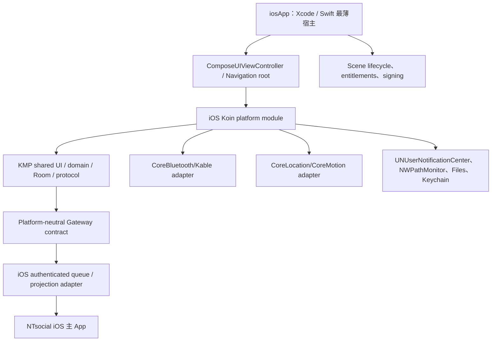

# NTsocial MeshLink Android 與 iOS 深度差距分析報告

> 稽核日期：2026-08-06（Asia/Taipei）<br>
> 稽核基準：`aaf7463f395dd2978a53addabd9e9d04e7b4e2a1`<br>
> `config.properties` 宣告的 Android packaging/source version：`1.0.2 (versionCode 3)`；這不是公開 release tag<br>
> 報告範圍：本 repository 的 Android 產品、KMP 共用層與 iOS source set；必要時以相鄰 NTsocial iOS 主 App 及官方 Meshtastic Apple client 作邊界／參考比較。<br>
> 本文件是原始碼、建置、測試與發布證據稽核，不把「可編譯」推論成「可執行」，也不把歷史硬體證據推論成目前 artifact 的證據。

---

## 1. 執行摘要

### 1.1 最重要的結論

截至 2026-08-06，Android 與 iOS 並不是兩個已存在、只差幾個功能或版號的 NTsocial MeshLink App：

- **Android** 已是具備產品宿主、Bluetooth radio lifecycle、Meshtastic 設定／訊息／節點功能、Room 資料層、背景佇列、Android Gateway v1/v2、通知與 Android 建置產物的實際產品。歷史 artifact 曾有 connected-radio／雙 radio RF 證據，但 2026-08-06 的 `1.0.2 (3)` current source 尚缺 connected-radio revalidation、Gateway caller admission、QR/readback、GPS device evidence與 Play 發布 gate。
- **iOS** 目前只有部分 KMP 共用程式碼和 22 個 `iosMain` 檔案，可通過 Kotlin/Native simulator **編譯**；repository 內沒有 Xcode App target、App entry point、bundle ID、iOS 版號、完整 DI、可工作的 radio transport、可執行 native test、IPA、TestFlight 或 App Store pipeline。
- 因此，iOS 目前較準確的定位是 **Phase 0／pre-product／compile-only scaffolding**，不是「接近完成但落後 Android 若干版本」。
- iOS 並非一切從零開始：protobuf/model、部分 repository/domain、Room schema、訊息／節點／設定 Compose UI、QR URL parser、Gateway identity 演算法與不少共用測試可重用；但這些資產尚未被一個 iOS App host 與真實平台服務串成產品。
- 最大風險不是 UI 少幾頁，而是 **安全、宿主、DI、持久化、BLE、背景生命週期、跨 App Gateway 與測試／發布鏈全部未完成**。

一句話判定：

> Android 是「已實作、尚有 release gate 的 radio companion/Gateway」；iOS 是「有價值的 KMP 共用基底，但尚未建立可運行產品」。iOS 應被當成新的產品啟用計畫，而不是收尾性 port。

### 1.2 對「iOS 還有哪些版本尚未跟上」的直接回答

不能用一般 semver 減法回答，因為 iOS 還沒有自己的產品版號。以本 repository 的里程碑能力來看：

| Android 基準 | Android 現況 | iOS 對等狀態 | 判定 |
|---|---|---|---|
| 目前 source/packaging version `1.0.2 (3)` | 有 Android application、manifest、資源；目前 source有 Debug build gate，另有較早的 APK/AAB建置證據 | 沒有 iOS application target、bundle/version 或安裝包 | **尚未追上任何可安裝產品版本** |
| Gateway v1 | 已有受保護的 Provider／command／event 與 immutable v1 contract | 沒有 iOS 跨 App IPC 或 caller trust contract | **完全未跟上** |
| Additive Gateway v2 | channel catalog、route token、capability、ledger、Room admission、message cursor 已實作 | 只有少部分共用 identity/repository/schema 可編譯，沒有 iOS adapter | **只具底層可重用材料，未形成能力** |
| Room schema 43 | Android 有 41→42→43 migration source/tests與 stable identity/origin capture；實機只證明 active/opened DB 的 42→43，沒有 retained 41→42→43 完整鏈 | iOS builder 有原始碼，但 preferences 是 no-op，沒有 migration/runtime test | **未達可用／可驗證等級** |
| 2026-07-31 channel QR 里程碑（當時 Android `1.0.1 (2)`） | Android CameraX/ZXing scanner、8-channel parser/ADD preview、capacity/duplicate/placeholder與 sequential writes；沒有 camera-to-screen或 connected-radio import/readback證據 | 共用 QR parser/renderer 可編譯；沒有 iOS 相機 scanner，且產生新 PSK 的 RNG 不安全 | **未跟上** |
| 2026-08-06 channel/GPS reliability 里程碑（目前 `1.0.2 (3)`） | verified channel transaction/exact readback、opt-in repair、location desired-state/FGS policy有 source/automated evidence，沒有 current-device/radio evidence | iOS phone-location actual 明確為空；無 CoreLocation 或可靠 channel transport | **未跟上** |
| Android 發布鏈 | 目前 source可建 Debug；2026-07-18 snapshot曾產出通過 R8/Lint Vital/cloud guards的 unsigned Google Release AAB，但無 final signed/Play-uploadable artifact或公開 GitHub Release | 無 archive、IPA、簽章、TestFlight、App Store metadata | **整條發布鏈缺失** |

上述 `1.0.1`、`1.0.2` 是 repository／artifact 里程碑，不代表兩個平台都有對應公開商店版本。iOS 在建立真正的 app version 前，不應直接宣稱 `1.0.2`，否則會讓使用者誤以為已有同等功能與相容性證據。

### 1.3 建議決策

本報告建議採用：

1. 正式把 iOS 定義為第三個 product track，先補治理、bundle/version、簽署與架構 ADR。
2. 以本 repository 的 **KMP／Compose Multiplatform host + Apple 原生 platform adapters** 為預設方向。
3. 第一個 vertical slice 只做「App 可啟動 → 掃到 radio → 連線／完成 handshake → 收一則訊息 → 送一則訊息 → 重啟後重連」，在此之前不要把大量時間投入品牌畫面與長尾設定頁。
4. P0 先修全零隨機數、持久化 no-op、DI、BLE 與 iOS test/CI；任何一項未完成都不可向測試者散布具頻道建置能力的 iOS build。
5. iOS Gateway 必須另做 threat model 與 transport；保留 v1/v2 的語意和安全目標，但不得機械移植 Android ContentProvider、Broadcast 或 AIDL。

---

## 2. 稽核範圍、證據與限制

### 2.1 本次查核了什麼

- repository 的 `app/`、`core/`、`feature/`、`desktop/`、build logic、CI、release workflow、Fastlane 與文件。
- 所有 `src/iosMain` 與 iOS test source set。
- Android Gateway、channel QR、channel reliability、location、訊息、資料庫與 background queue 的目前原始碼／既有驗證紀錄。
- 本機 KMP iOS simulator compile 與 iOS test task 的實際行為。
- 相鄰 `NTsocial_release/ios` 的產品身分與授權邊界（唯讀）。
- 公開的官方 [Meshtastic-Apple](https://github.com/meshtastic/Meshtastic-Apple) 作為 Apple 平台技術參考，不把它當成 NTsocial MeshLink iOS 成品。

### 2.2 成熟度標記

後續表格採用以下標記，避免把 source presence 誤當產品完成度：

| 標記 | 意義 |
|---|---|
| `I` | 原始碼已有具體實作 |
| `A` | 有自動化測試／build gate |
| `H` | 有實體手機或 radio 證據；會註明是否為歷史 artifact |
| `C` | 只證明目標可編譯，未證明 link／launch／runtime |
| `S` | stub、no-op、固定假值或會拋例外 |
| `X` | 缺少此層或此產品能力 |
| `N` | 不能直接移植，必須先定義 iOS 專屬設計 |

優先級定義：

| 優先級 | 定義 |
|---|---|
| `P0` | 安全、產品可行性、可啟動宿主、DI/持久化、radio MVP或CI真實性阻斷；未完成不得進入下一里程碑或散布相關能力 |
| `P1` | 核心companion/Gateway功能；可在P0最小binding或go/no-go決策後完成真實平台實作 |
| `P2` | Production/TestFlight/App Store hardening、正式品牌、法遵、accessibility與長尾平台能力 |
| `P3` | 非首發必要、可延後或需另行產品核准的能力，例如WidgetKit、CoreNFC與非必要transport |

同一項可能刻意拆成不同優先級，例如「P0決定是否需要background location並提供fail-closed binding，P1再實作完整CoreLocation」，或「P0提供最小AppIcon以完成packaging，P2再做正式品牌QA」。

### 2.3 限制

- GitHub公開 repository/account/global name/readme搜尋未找到 NTsocial MeshLink iOS；這不排除私人、未掛載或未公開的程式庫。
- Apple台灣公開 Search/Lookup API 對 `NTsocial MeshLink`、`NTsocial`、`com.ntsocial.ios`、`com.ntsocial.meshlink`、`com.ntsocial.meshlink.ios` 均回傳 0。這只代表指定公開來源、關鍵字與 storefront查無，不排除 unlisted app、其他地區／名稱、私人 TestFlight或未公開 App Store Connect record。
- 本次沒有 iPhone、iPad 或 Meshtastic radio，所以沒有新增任何 iOS runtime／BLE／RF 證據。
- Android 的大部分 current-state build/test/device 結果來自 repository 內保留的可重現紀錄；本次針對比較目的另外執行的是 KMP/iOS compile 與 test-task audit，沒有重跑完整 Android release gate。

### 2.4 Android 證據台帳：不能混用不同 artifact

| 日期／基準 | Artifact／版本 | 實際證明 | 沒有證明 |
|---|---|---|---|
| 2026-07-18 snapshot | 25,533,958-byte Google Release AAB；SHA-256 `39B2D41A07F5BBB687D3070B0BC200FACF8FEC7E5F4591627AF3A8F0DD03C511` | R8、Lint Vital、cloud guards、AAB packaging | 未簽署、不可上傳 Play；不是 current `1.0.2` final artifact |
| 2026-07-28 field artifact | Android Debug APK；SHA-256 `C48DD5B89E1FB6960ECE4A666CA31728612BB94BF008E7D8D95A9C2EAFE28F1A` | 兩個 radio方向的RF與remote parent decode；修正 Gateway event permission後的 field evidence | 沒重跑完整 multi-variant gate；不能外推到 8/6 source |
| 2026-07-29 base `90eeaf92` | 50,783,283-byte Google arm64 Debug APK；SHA-256 `94F4477B3D3BB0AD63B0EF229FA78549885363DBC69FE315D67C4677BAD5857B` | 四台 Android 16 install/launch/data retention；active/opened DB 42→43；361 focused tests與完整 source gates | 沒有 radio、Provider caller command、RF、remote receipt或 retained 41→42→43完整鏈；兩個 dormant DB仍為42 |
| 2026-07-31 base `af526f7e4` | `1.0.1 (2)`，51,948,716-byte Google arm64 Debug APK；SHA-256 `76B8F876CC4C2327B3C3E2274C0ECC09D06EA217C9154F204D385BA9D35368E6` | 四手機 install/hash/data-retention；QR parser/capacity與synthetic scanner tests；source gates | 沒有 camera-to-screen、connected-radio import/readback；該紀錄未主張新 App launch/RF evidence |
| 2026-08-06 current HEAD `aaf7463f3` | source/packaging version `1.0.2 (3)`；本報告未建立 final artifact hash | repository retained record顯示 `spotlessApply spotlessCheck assembleDebug test allTests`、`kmpSmokeCompile`、兩 flavor Debug lint通過；本次另重跑 KMP/iOS compile | 沒有新的 connected-radio、RF、real-device GPS、QR/readback或 Gateway caller admission證據 |

補充：root Detekt在 2026-08-06 retained record仍有七個未修改程式中的既存 findings。2026-07-29的一般 `assembleRelease` 曾受未修改 Widget release resources阻擋；這和 2026-07-18成功的 unsigned Google App Bundle是不同 snapshot、不同 gate。

---

## 3. 產品身分與來源邊界

### 3.1 必須區分的三套程式

| 程式庫／產品 | 真實身分 | 授權／邊界 | 能否視為 NTsocial MeshLink iOS |
|---|---|---|---|
| 本 repository `ntsocial-mesh-gateway-android` | Android NTsocial MeshLink 與 Windows NTsocial MeshLink，共用 KMP 基礎 | GPL-3.0-or-later；`AGENTS.md` 目前只把 Android、Windows 列為 first-class tracks | **只有 iOS 編譯骨架，沒有 iOS App** |
| 相鄰 `NTsocial_release/ios` | NTsocial 社交主 App 的 iOS 版 | 私有／All Rights Reserved；未經另行明確、可追溯且與 GPL 散布相容的授權，不得複製其程式或資產，也不得把其 EULA限制套用到本 GPL repository | **不是 MeshLink**；只能作為未來 Gateway consumer 的需求來源 |
| `meshtastic/Meshtastic-Apple` | 官方原生 Apple Meshtastic client | GitHub metadata為GPL-3.0；Swift/SwiftUI，獨立品牌、bundle ID 與治理 | 是可參考／可評估 fork 的 radio client，**不是 NTsocial MeshLink** |

相鄰 NTsocial iOS主App的唯讀稽核顯示：名稱`NTsocial`、bundle ID `com.ntsocial.ios`、版本`1.0.0 (1)`、deployment target iOS 17。它有test-only typed provider boundary與unsigned Release Simulator CI；但自身parity文件指出沒有production Meshtastic transport/provider，且沒有signed archive、IPA、TestFlight或實體radio證據。為維持GPL/私有repository邊界，本公開報告不收錄其private commit或內部型別細節。它不能填補本報告所述的MeshLink iOS缺口。

四個常被混淆的版本／發布身分如下：

| 身分 | 宣告版本（稽核日） | 可安裝／發布證據 |
|---|---|---|
| 本 repo Android MeshLink | source/packaging `1.0.2 (3)` | Debug/source gate；有不同 snapshot的 APK/AAB證據，但非 Play-ready，無公開 GitHub Release |
| 本 repo iOS MeshLink | 無 | 無 App target、IPA、TestFlight或App Store listing |
| 私有 NTsocial iOS 主 App | `1.0.0 (1)` | unsigned simulator CI；不是 MeshLink，無 production radio provider |
| 官方 Meshtastic Apple | source tag `v2.7.18`；台灣 App Store `2.7.17` | 官方獨立 Apple client；不是 NTsocial MeshLink，版號不可與本專案直接比較 |

官方 Meshtastic-Apple 在本次稽核固定到 tag `v2.7.18`、commit `20a263de699f6c6f9c6f9972f70f82f3dea55a4c`（GitHub Release 2026-08-04），bundle ID `gvh.MeshtasticClient`、effective iOS deployment target 17.5；台灣 storefront當時公開版為 `2.7.17`。source tag比 storefront高一個 patch只描述官方 Meshtastic自己的發布節奏，不是 NTsocial MeshLink iOS版號。

### 3.2 目前 HEAD 的提交名稱不能代表 iOS 產品進度

目前 HEAD 的提交訊息是 `keep setup ios version ntsocial app`，但該提交仍未加入 Xcode target 或 iOS App host。該提交在 iOS source set 的直接變更僅是為新 Android phone-location UI 補一個五行 `actual`，其函式內容為空，註解明示 iOS forwarding 不在該 Android-focused change 範圍內：

`feature/settings/src/iosMain/kotlin/com/ntsocial/meshlink/feature/settings/radio/component/PositionConfigScreen.ios.kt`

因此應以 source、build、runtime 與 release 證據判斷成熟度，不能從 commit subject 推論「iOS 版已建立」。

### 3.3 iOS scaffold 的上游語意

目前 iOS KMP scaffold 的主要初始來源是 Meshtastic-Android 的 [PR #4876](https://github.com/meshtastic/Meshtastic-Android/pull/4876)，merge commit `d136b162a428ae852930bcef2df42d237308bea3`，合併日期 2026-03-21，且是目前 HEAD的 ancestor；後續 fork另有 namespace與個別 iOS actual修改。該 PR的價值是讓共用 source set開始面對 Kotlin/Native編譯問題；交付範圍主要是 iOS target與stubs，而非完整 Xcode App、CoreBluetooth radio client或App Store pipeline。

`docs/roadmap.md` 的描述較符合現況：iOS proof target 是「Done (Stubbing)」，下一步仍是建立 Xcode skeleton 並啟動 App。`docs/kmp-status.md` 的 `9/10`、`~100% Add iOS without surprises` 應解讀為「Android-first 結構的可攜性評估」，**不能當作 iOS 產品完成度**；該文件本身也把「補齊 iOS actuals、建立 skeleton target」列為後續工作。

---

## 4. 量化盤點：iOS 到底有多少實作

### 4.1 全 repository source-set 統計

以下數量以 tracked source path 計算，不包含 build output：

| 類別 | Kotlin 檔案數 | 解讀 |
|---|---:|---|
| `commonMain` | 757 | 大量可重用的 model/domain/repository/Compose source |
| `androidMain` | 119 | Android 平台 adapters；另有純 Android `app` 等模組 |
| `iosMain` | 22（共 1,083 行） | 數量很小，且多數是 stub/no-op |
| `iosTest`／`iosArm64Test`／`iosSimulatorArm64Test` | 0 | 沒有任何 iOS-native test source |
| Swift | 0 | 沒有 Apple App host |
| `.xcodeproj`／`.xcworkspace` | 0 | 沒有可由 Xcode 建置／執行的 App |
| `Info.plist`／iOS entitlements | 0 | 沒有權限、背景模式、App Group、隱私或簽章設定 |

### 4.2 代表性模組失衡

檔案數不是完成率，但能佐證 iOS 平台層仍未形成：

| 模組 | `commonMain` | `androidMain` | `iosMain` | iOS 判讀 |
|---|---:|---:|---:|---|
| `core:ble` | 23 | 3 | 1 | 唯一 iOS 檔案含關鍵 throw/no-op |
| `core:data` | 44 | 6 | 0 | 沒有 iOS platform wiring |
| `core:database` | 27 | 2 | 1 | builder 存在，但偏好序列化 no-op |
| `core:network` | 24 | 14 | 0 | 無 Darwin client／network monitor／discovery |
| `core:service` | 5 | 35 | 0 | 無 iOS radio/service/background orchestration |
| `core:ui` | 123 | 7 | 3 | 共用畫面多，但 iOS platform utility 大量 stub |
| `feature:connections` | 19 | 3 | 0 | 無 iOS platform ViewModel/use-case binding |
| `feature:firmware` | 30 | 3 | 0 | 演算法可編譯，實際 iOS DFU/檔案選擇不可用 |
| `feature:intro` | 3 | 12 | 0 | onboarding UI 實際是 Android-only |
| `feature:messaging` | 25 | 1 | 0 | UI/logic 可重用，無 transport/service host |
| `feature:node` | 82 | 3 | 0 | UI/logic 可重用，平台 utility 會使部分功能失效 |
| `feature:settings` | 78 | 13 | 9 | iOS 檔案多為 no-op；主 Settings 畫面是空 body |
| `feature:wifi-provision` | 11 | 0 | 0 | 共用 source 有，但無 iOS network/radio runtime |

此外，`app`、`core:api`、`core:barcode`、`feature:widget` 是純 Android 模組，沒有 iOS target。這正好涵蓋 iOS 最缺的 App host、Gateway IPC、相機 QR scanner 與 widget。

---

## 5. 逐項功能差距

### 5.1 產品宿主、品牌與啟動

| 項目 | Android | iOS | 優先級與具體缺口 |
|---|---|---|---|
| Product track | `AGENTS.md` 明確定義 Android 為 first-class track | 尚未列為正式 track | **P0/N**：先補產品治理、owner、支援範圍與跨 Android/Windows 影響規則 |
| Application host | `app/` 有 Android Application/Activity/Manifest | 無 `iosApp`、Swift entry、`ComposeUIViewController` 或 scene lifecycle | **P0/X**：沒有 host 就無法 launch |
| Application identity | `com.ntsocial.meshlink` | 無 bundle ID、display name、URL scheme | **P0/X**：決定如 `com.ntsocial.meshlink.ios` 或跨平台統一策略；候選 ID尚未核准，且不得占用相鄰主 App既有的 `com.ntsocial.ios` |
| Version governance | source/packaging `1.0.2 (3)`；Android release automation 有自己的 versionCode 規則 | 無 `CFBundleShortVersionString`／`CFBundleVersion` policy | **P0/X**：建立 iOS semver/build-number與App Store policy；兩平台都不得拿 radio-reported upstream `min_app_version` 判定 MeshLink App過期、取消裝置選擇或導向上游 App更新 |
| 啟動／Navigation 3 shell | Android 已有 splash、Nav host、top-level destinations | 共用 destination 可編譯，但沒有 root controller 或 iOS navigation host | **P0/X** |
| Onboarding | `feature:intro` 主要 UI 在 `androidMain` | 無 iOS intro UI、Bluetooth disclosure 或 radio selection onboarding | **P1/X** |
| 品牌資產 | Android 綠色品牌、icons、resources 已存在 | 無 AppIcon、LaunchScreen、asset catalog 或 iOS 品牌 QA | **P0最小packaging／P2正式QA**：0.1只補可建置placeholder/已授權最小資產；正式品牌、尺寸、dark mode與視覺QA列P2，未經授權不得複製私有主App資產 |
| DI 啟動 | Android `AppKoinModule`和平台modules可形成graph；既有canonical test使用Koin `Module.verify(...)` | 無iOS Koin root、platform module、完整binding或host verification | **P0/X**：新增iOS host module的JVM-side `verify(...)` gate，並以simulator launch smoke驗證Native實際graph |
| Lifecycle | Android Application/Activity/service lifecycle 明確 | 無 scene phase、foreground/background、termination/relaunch policy | **P0/X** |

**判定：** iOS 連「能顯示首頁並形成完整 object graph」的產品最小條件都尚未具備。

### 5.2 BLE、radio 連線與 transport

| 項目 | Android | iOS | 優先級與具體缺口 |
|---|---|---|---|
| BLE 掃描 | 已有 BLE repository、權限與 Connections UI；首發 UI 明確只顯示 Bluetooth | 共用 Kable scanner 部分 source 可編譯，但沒有 iOS repository/DI/權限與可執行畫面 | **P0/X** |
| 建立 peripheral | Android 可由已儲存 device address 重連 | iOS `createPeripheral(...)` 直接拋 `UnsupportedOperationException("iOS Peripheral not yet implemented")` | **P0/S**；冷啟動重連必定不可用 |
| Write length／priority | Android 有MTU/connection-priority對應行為 | iOS write length目前回`null`；priority回`false` | **P1/S/N**：從CBPeripheral/Kable取得maximum write length；CoreBluetooth沒有Android `requestConnectionPriority`直接對等，應明確標成N/A而非假裝功能失敗 |
| Bluetooth repository | Android 有實作與 DI | iOS 完全缺少 | **P0/X** |
| `RadioTransportFactory` | Android/desktop 有平台 binding | iOS 缺少 | **P0/X** |
| Radio service／handshake | Android `MeshService`、connection/config managers 能驅動 radio lifecycle | iOS 無 `core:service` 實作、無 service owner、無 foreground/background policy | **P0/X** |
| Message queue | Android 有 Room + WorkManager durable work path；但 native send仍有 binder silent-drop/false-success、fire-and-forget admission、error propagation與QueueStatus 35缺口 | iOS 無 platform `MessageQueue`、scheduler 或 retry owner | **P0/X**；設計正確的 awaited admission/error contract，不複製 Android已知缺陷 |
| Cold reconnect | Android 有 reconnect path；仍應以目前 artifact 做實機 gate | iOS address-based peripheral path會 throw；也未設 CoreBluetooth state restoration | **P0/S/X** |
| 背景 BLE | Android 由 foreground service 管理 | iOS 無 `bluetooth-central` background mode、restoration identifier 或受限行為定義 | **P0/N**；必須按 iOS suspension 規則設計 |
| TCP／USB／Serial | Android backend 有能力但首發共用 Connections UI 刻意只露出 Bluetooth | iOS 無 network transport wiring；USB/Serial 不能假設有 Android 對等物 | **P2/N**；先守住 Bluetooth-only scope |

**重要平台差異：** `feature:firmware` 中仍有以 MAC address 及 `MAC + 1` 尋找 DFU device 的假設。CoreBluetooth 對 peripheral 使用 UUID-style identifier，不能把 Android MAC 演算法當成跨平台契約；iOS DFU 必須以 service/manufacturer/CBPeripheral identity 重新設計。

### 5.3 Meshtastic 設定、頻道與 QR

| 項目 | Android | iOS | 優先級與具體缺口 |
|---|---|---|---|
| 完整 config 讀取 | Android 能進行 admin session、完整 config sync | 共用 model/handler 部分可編譯；沒有可工作的 transport/service | **P0/X（整合）** |
| 一般 radio 設定 UI | Compose screen／ViewModel 大多在 commonMain | 畫面 source 可編譯，但 enum entries 在 iOS 永遠是空陣列，且主 Settings 畫面為空 | **P1/S**；實際 dropdown 會沒有選項 |
| Channel CRUD | Android 可寫入 radio | 共用 UI/logic 可編譯，無 radio write path | **P1/X（依賴 P0 BLE/service）** |
| Verified channel transaction | Android 現行路徑會依序 write、等待 matching `Routing.NONE`、commit、完整 readback，只有 exact readback 才更新 UI；目前是I/A，不是current H | 共用 reliability contract 部分存在，但沒有 iOS transport/session owner | **P1/C**；需共享狀態機並做兩台 radio 實測 |
| Protected channel repair | Android per-radio opt-in、預設關閉、只修可證明缺失的 secondary placeholder | iOS 無持久 prefs、radio generation/runtime，因此不可運作 | **P1/C/X** |
| Built-in NTsocial channel | Android 有保守 slot/LoRa provisioner，但 legacy path仍是queue/cache-based，沒有 verified ACK+fresh readback；LoRa與channel是兩個sequential commands，第二步失敗可能留下LoRa變更 | 共用演算法可重用，但無 iOS radio command path | **P1/C**；iOS應追corrected verified contract，不複製legacy非交易語意 |
| QR URL parsing/rendering | parser/generator主要在 `core:model/commonMain/.../ChannelSet.kt`，`core:ui/commonMain`承接dialog/ViewModel；官方8-channel round-trip有測試 | 可編譯，是少數真實可重用能力 | **C**；仍未有 App 可呼叫 |
| QR live scanner | Android `core:barcode` 使用 CameraX 1280×960、ZXing QR/TRY_HARDER | `core:barcode` 無 iOS target；scanner provider 是 unsupported/no-op | **P1/X**：以 `AVCaptureSession` + `UIKitView` 實作 |
| QR 匯入 readback | Android ADD-mode 容量、duplicate/placeholder、sequential writes 與 readback 已修正 | parser 之外沒有相機、radio write/readback runtime | **P1/X** |
| 新頻道 PSK | Android 使用安全 platform RNG | iOS `platformRandomBytes(size)`回傳全零，`Channel.getRandomKey()`直接使用它；目前因無App host而尚不可達 | **P0/S/latent critical blocker**：在修成`SecRandomCopyBytes`前不得讓iOS channel creation變成可達或散布build |

### 5.4 訊息、節點、telemetry 與資料庫

| 項目 | Android | iOS | 優先級與具體缺口 |
|---|---|---|---|
| Native channel chat | Android 有 Room history、work path、狀態與一般 channel UI；但 binder silent-drop/false-success等repair plan尚未實作 | 共用 UI/model/repository source 很多，但無 transport、queue、host | **P0/P1 整合缺口**；iOS queue要以修正後的contract為準 |
| Direct message | Android 有既有 DM path，但另有已記錄的 private-message repair gaps | iOS 無 runtime | **P1**；應先修共用契約，勿把 Android 已知缺陷複製過去 |
| Node list/detail | Android 可顯示 nodes、metrics、telemetry | 共用 UI 可編譯；日期會空白、clipboard 會 throw、位置功能缺失 | **P1/S** |
| 日期／時間 | Android 有 locale-aware formatter | iOS `DateFormatter` 所有輸出皆為空字串，time tick 固定 `0L` | **P1/S**；訊息時間、charts、debug log 皆受影響 |
| Room database | Android Room schema 43、per-radio DB、Gateway cursor/identity已實作；41→42與42→43有source/tests，但device只保留active/opened DB 42→43證據 | iOS 有 Room KMP builder + BundledSQLiteDriver，屬真實 source | **C（未驗證）**；沒有 host 或 runtime migration test |
| DB manager preferences | Android可持久化database cache limit、per-DB last-used/LRU與legacy-cleanup flag | iOS `PreferencesSerializer.readFrom`永遠回空、`writeTo`不寫入 | **P0/S**；DB manager metadata/cache-limit/LRU無法持久，不應誤稱這個store保存active radio |
| Radio／Proto DataStore | Android以`MeshPrefs`/`RadioPrefs.deviceAddress`等named stores保存selected radio，並建立CorePreferences／LocalConfig／ModuleConfig／ChannelSet／LocalStats | iOS沒有這些platform store與binding | **P0/X**；selected radio/active DB address及設定無法跨重啟恢復 |
| Schema migration | Android 有 schema 41→42→43 source/tests，亦有過往手機 migration 紀錄 | iOS 沒有 migration test、clean install／upgrade run | **P0/X（驗證）** |
| Clear/reset cursor | Android 現有 `getGatewayHistoryState()` 在 live clear 後可能短暫發布舊 epoch，是已知缺陷 | iOS 無 Gateway publisher | **不可作為 parity 目標**；應先修共用語意再移植 |

### 5.5 平台 UI 與設定 actuals

現有 iOS source 不是單純「功能未接線」；多個 actual 會呈現錯誤資訊、靜默失敗或直接 crash：

| iOS actual 現況 | 使用者影響 | 優先級／修法 |
|---|---|---|
| `enumEntriesOf()` 回空 list | radio/config dropdown 沒有任何選項 | **P1**：用 Kotlin enum entries 或可攜 API |
| `createClipEntry()` throw | 訊息、node ID、public key、QR 等 copy 操作 crash | **P0/P1**：接 UIPasteboard／Compose clipboard API，未支援時顯式停用 |
| HTML 只回 raw text | 條款／說明格式遺失 | P2：安全的 attributed rendering |
| open URL、檔案開啟／儲存、toast 都 no-op | 文件、export/import、外部連結無反應 | P1：實作 platform services，回傳成功／失敗而非靜默 |
| Bluetooth/location/notification/local-network permission helper 為 no-op 或固定真值 | UI 可能誤認已授權，造成隱私與狀態機錯誤 | **P0**：Bluetooth/location/notification分別用其原生authorization/settings狀態；local network沒有一般preflight API，需以實際network operation/capability結果建模，不能硬套同一組enum |
| GPS disabled 固定回 false | 使用者無法知道系統定位不可用 | P1：接 CoreLocation authorization/services state |
| keep-screen-on、brightness、settings navigation no-op | 長時間操作與故障引導不一致 | P2 |
| `SettingsMainScreen` 空 body | 主設定頁可能完全空白 | **P1**：接共用 Settings screen 或 iOS 專用 shell |
| About Libraries 回空 | GPL／第三方 attribution UI 缺失 | **P1/法遵**：產生並呈現 notices |
| timezone 固定 GMT0 | position/config 時區錯誤 | P1：以 `NSTimeZone`/Foundation 實作 |
| ringtone、debug log、security key、TAK export no-op | 重要操作表面存在但沒有結果 | P1/P2：未實作前應 fail closed 並標示 unavailable |
| TAK local-network helper回true | 該expect源自Android 17 `ACCESS_LOCAL_NETWORK`；iOS沒有同型preflight permission，若把true解讀成「已授權」才會造成假語意 | **P1/N**：允許啟動真實network operation，以Info.plist用途字串、系統prompt與operation/policy-denied error建模；移除共用Boolean的授權暗示 |

### 5.6 Location、GPS 與背景行為

| 項目 | Android | iOS | 優先級與具體缺口 |
|---|---|---|---|
| Location repository | Android 有 platform location source | iOS `Location`是空class，無CoreLocation repository | **P1/X**；P0只需決定需求、提供capability-aware unavailable binding並隱藏/停用入口，完整CoreLocation/phone forwarding在P1 |
| Phone-location preference | Android Device → Position 已有 per-node opt-in | iOS actual 是空函式 | **P1/S** |
| Desired-state reconciliation | Android 綜合 radio 選擇、fixed position、Fine/Coarse、system location、lifecycle/reconnect/restart | iOS 無對等狀態機 | **P1/X**；需改用 iOS authorization accuracy/background semantics |
| Background indicator/service | Android 只有 opt-in+permission+system enabled 才啟用 location FGS | iOS 沒有 background mode、indicator、Always/When In Use policy | **P0決策／P1實作**：先決定產品是否需要background location並fail closed；完整CoreLocation/background行為列P1 |
| Compass/motion | Android 有相關 platform 能力 | iOS 無 CoreMotion/heading adapter | P2 |
| 實機證據 | 依2026-08-06 repository retained record，Android source gate綠（本次未重跑完整 Android gate），但 Android 11–17/API 30–37與第二台radio reception仍是release gate | 無任何 iPhone/device/radio evidence | **P0/P1** |

iOS 不能照抄 Android foreground service。應把共用層保留為「使用者意圖與可觀察狀態」，將 `CLLocationManager` authorization、accuracy、background updates、indicator 與系統終止行為留在 iOS host。

### 5.7 Notifications、background work 與系統整合

| 項目 | Android | iOS | 優先級與具體缺口 |
|---|---|---|---|
| 訊息通知 | Android notification channels/actions有I/A，但沒有本次current OEM/鎖屏action真機矩陣 | 無 `UNUserNotificationCenter` integration | P1 |
| Radio keep-alive | Android foreground service + notification | iOS 無持續 service；必須依 CoreBluetooth restoration 與系統允許範圍重設承諾 | **P0/N** |
| Durable retry | Android WorkManager + Room path存在，但 native send的silent-drop/false-success與admission/error propagation仍待修 | 無 iOS scheduler/queue owner | **P0/X** |
| 開機／App 更新恢復 | Android receivers/service path有I/A；沒有本次OEM boot/reconnect、Doze/battery-saver真機矩陣 | iOS 無直接對等；要定義 launch/restoration/reconciliation | P1/N |
| Deep link/share | Android manifest/routes 有實作 | 無 URL scheme、Universal Links、share extension | P1/P2 |
| Widget | Android `feature:widget` | 無 WidgetKit target | P3/N；不是 radio MVP 阻斷項 |
| NFC | Android `core:nfc` 有平台 implementation | 無 CoreNFC、entitlement、使用者流程 | P2/N；只有明確產品需求才加入 |
| Rendered map | Android 已刻意移除 map 與相關 cloud/native dependencies | iOS 無 map | **不是缺口**；不要為表面 parity 重加地圖 |
| Telemetry/analytics | Android flavors 都注入 `NoopPlatformAnalytics`，cloud-free | iOS 無 app runtime | **P0 binding／P2法遵**：先注入`NoopPlatformAnalytics`讓完整DI graph成立並維持cloud-free；release前補Apple privacy manifest/declarations |

### 5.8 Network、firmware、Wi-Fi provisioning 與 TAK

| 項目 | Android | iOS | 優先級與具體缺口 |
|---|---|---|---|
| HTTP client | Android/desktop 有平台 engine/DI | 無 `ktor-client-darwin` 或 iOS HttpClient DI | **P0 unavailable binding／P1實作**：Bluetooth-only骨架先明確回capability unavailable，網路feature啟用前再接Darwin engine |
| Network monitor | Android 有 platform monitor | 無 `NWPathMonitor` adapter | **P0 unavailable binding／P1實作** |
| Service discovery | Android/desktop 有相應 backend | 無 Bonjour/`NWBrowser` adapter | P2 |
| Firmware logic | 多數 Secure DFU algorithm已KMP化；Android有file/BLE platform path與protocol tests，但本次沒有current-artifact實體DFU證據 | iOS source 可編譯，但 address constructor throw、MAC+1 假設錯誤、無 file handler | **P1/N**：重做 Apple DFU identity 與 document picker |
| USB/UF2 | Android/desktop 有部分 backend | iOS 無一般 USB host 對等 | P3/N：明確標示不適用，或設計檔案 export workflow |
| Wi-Fi provisioning | common feature source 存在 | 無 radio/network runtime，不能視為可用 | P2 |
| TAK ZIP/zlib | Android有platform exporter/permission path、shared TAK implementation與pure tests；本次未確認current-device/server end-to-end | iOS `ZipArchiver`、`ZlibCodec` 是少數有真實實作的 source | C：需 host、file picker、permission 與 integration test |
| TAK export/permission | Android 有平台流程 | iOS PrefExporter no-op，permission 固定 true | P2/S |

### 5.9 Android Gateway v1/v2 與 iOS 跨 App 整合

Android Gateway 的產品價值很大，也是 iOS 與 Android 最大的功能差距之一。

| Gateway 能力 | Android | iOS | 差距 |
|---|---|---|---|
| v1 contract | immutable `/v1/status`、`/v1/envelopes`、`/v1/nodes`、`/v1/channels`；AIDL只保留deprecated adapter | 無 Provider 或其他 iOS API | X/N |
| v2 status/catalog/history | sanitized status、完整 channel catalog；`message-changes`是stable-only insertion cursor，不是update/delete feed | 低層 identity/schema 部分可編譯，無 publisher/client surface | C/X |
| Capability | caller-bound、request-bound、single-use、30 秒 TTL | 無 caller identity／capability storage | N |
| Route token | source/slot/generation/caller-bound，120 秒 TTL | 無 iOS route issuance/validation | N |
| Overlay transport | outbound固定 `PRIVATE_APP / port 256`；legacy `497`只接受receive-only；完整envelope上限180 bytes | 共用protobuf可用，無iOS跨App/radio admission | X/N |
| Commands | routed NTsocial envelope與broadcast-only native channel text；native text不接受destination，`EXTRA_TO`缺口應fail closed | 無跨 App command transport | X/N |
| Source identity | encrypted ID只由resolved PSK的domain-separated SHA-256衍生；shorthand 1–10與full key收斂，CLEAR保留既有規則 | identity演算法部分在shared source可編譯 | C/X |
| Idempotency | durable 256-entry ledger、PENDING→Room/Work→ACCEPTED | 共用資料概念可重用，無 iOS scheduler/owner | C/X |
| Acceptance semantics | 只代表local Room/WorkManager/ledger admission；crash window仍可能造成RF duplicate，不是exactly-once/remote receipt | 尚無iOS local admission owner | X/N |
| Trusted caller | exact UID/package/certificate allowlist與compatibility matrix已source-tested；device只覆蓋debug/debug install/startup，無Play signer pair或current Provider command admission | iOS 沒有 package UID/signature API 的直接對等 | **必須重新設計** |
| Metadata-only event | explicit package-scoped broadcast，client re-query | 無 Darwin notification/URL wake-up/shared store contract | N |
| Parent App integration | Android source有精確trust matrix；current artifact的direct Provider/caller admission仍未實機證明 | 私有主 App內已有typed/test provider boundary，但未發現可供獨立MeshLink iOS使用、已實作且驗證的production cross-App contract | X/N |

#### 為何不能把 Android Gateway 直接 port 到 iOS

- iOS 沒有 Android `ContentProvider`、explicit broadcast、UID/package/certificate verifier 或 AIDL 的相同模型。
- App 可能被 suspension/termination；30 秒 capability 與 120 秒 in-memory route token在跨 App 切換時未必有相同可用性。
- App Group 只在相同 Apple Developer Team、正確 entitlement 與明確資料 ownership 下可用；它本身不是 caller authentication 的完整替代。
- App Group queue或Darwin notification本身不能任意啟動已suspended/terminated的第三方App；custom URL activation通常會造成使用者可見的前景切換。因此iOS不能先承諾Android Gateway式「任意背景即時command」。
- **禁止兩個 App 直接同時讀寫 MeshLink 的 Room database。** 這會破壞 schema ownership、migration、鎖與 canonical history 邊界。
- URL scheme／Universal Link 可作 wake-up 或導航，但不是可信 caller 身分；所有 command 仍需 authenticated、versioned、durable request。

#### 建議的 iOS Gateway 方向

先建立 platform-neutral Gateway semantics，再實作 iOS adapter：

1. 抽出版本化 request/response schema、180-byte 限制、source identity、stable message identity、cursor epoch、idempotency fingerprint 等與平台無關的 contract。
2. 若 MeshLink 與 NTsocial iOS 主 App由同一 Apple Team 簽署，可評估 App Group + shared Keychain access group：Keychain 保存 per-install secret，App Group 保存有界、版本化、加密驗證的 command/result queue。
3. MeshLink仍是radio與Room的唯一owner，NTsocial主App仍是社交canonical history owner；parent App只寫入command queue、讀sanitized projection，不直接碰MeshLink DB。
4. Darwin notification／URL activation 只作 metadata-only best-effort wake-up；真正狀態由 re-query 取得。
5. 「accepted」仍只能代表 durable local admission，不可聲稱 airtime 或 remote receipt。
6. 對 process restart、token expiration、重送、App 被終止、裝置鎖定、Keychain 不可用與兩 App版本不相容做明確狀態機與測試。
7. P0先決定MeshLink未運行時的command SLA：接受延遲到下次啟動、要求user-mediated handoff、嵌入shared SDK，或採其他架構；若產品要求背景即時RF而Apple lifecycle無法支持，必須在go/no-go ADR明確拒絕不實承諾。

這個設計必須先有 threat model／ADR，並由兩個 App 的 signing/team owner 審查；不能在 UI 層臨時拼接。

---

## 6. iOS 原生實作逐檔稽核

repository 目前共有 22 個 `iosMain` Kotlin 檔案。下表逐一說明它們真正提供的能力。

| 檔案 | 目前內容／成熟度 | 產品影響 |
|---|---|---|
| `core/ble/.../NoopStubs.kt` | peripheral by address 會 throw；MTU/priority/platform config 為 null/no-op | BLE 冷重連與 DFU 阻斷，P0 |
| `core/common/.../Dispatchers.kt` | `ioDispatcher` 使用 `Dispatchers.Default` | 可用的基本實作，但未做效能/runtime 驗證 |
| `core/common/.../NoopStubs.kt` | 日期全空、region 空、address validation false、parcel 讀寫 no-op、metric 固定 | 多個 UI/資料流程錯誤，P1；parcel 邊界需重新評估 |
| `core/database/.../DatabaseBuilder.kt` | Room builder/BundledSQLite 真實；preferences serializer 不讀不寫 | DB core 有基礎，但重啟持久狀態不可靠，P0 |
| `core/model/.../NoopStubs.kt` | random bytes 全零 | 通道金鑰安全漏洞，P0 release blocker |
| `core/repository/.../Location.kt` | 空 location class | 無 CoreLocation，P0/P1 |
| `core/takserver/.../ZipArchiver.kt` | 有 Foundation-based ZIP/file code | 候選可用 source，仍需 integration test |
| `core/takserver/.../ZlibCodec.kt` | 有 zlib implementation | 候選可用 source，仍需 test vectors/runtime test |
| `core/testing/.../Location.kt` | iOS testing location placeholder | 無 native test consumer，僅 compile support |
| `core/testing/.../TestUtils.ios.kt` | iOS test utility actual | 目前沒有 iOS test source，也沒有會執行的 native test binary |
| `core/ui/.../component/NoopStubs.kt` | tick 固定 0、enum list 空 | time-sensitive UI 與設定 dropdown 失效 |
| `core/ui/.../theme/NoopStubs.kt` | dynamic color null | 可接受 fallback，不是主要 blocker |
| `core/ui/.../util/NoopStubs.kt` | clipboard throw；URL/file/toast/permission/settings/NFC/brightness 等 no-op | 廣泛 runtime crash／靜默失敗／錯誤權限狀態，P0/P1 |
| `feature/settings/.../debugging/NoopStubs.kt` | debug log export no-op | 診斷能力缺失 |
| `feature/settings/.../AboutLibrariesLoader.kt` | 回傳空 libraries | attribution UI 缺失，法遵風險 |
| `feature/settings/.../SettingsNavigation.kt` | `SettingsMainScreen` 空 body | 主設定入口不可用 |
| `feature/settings/.../DeviceConfigScreen.ios.kt` | system timezone固定回`GMT0` | Device timezone設定錯誤 |
| `feature/settings/.../ExternalNotificationConfigScreen.ios.kt` | ringtone trailing/import hook no-op | external notification ringtone設定不完整 |
| `feature/settings/.../PositionConfigScreen.ios.kt` | location button與phone-location sharing no-op | Position功能無作用 |
| `feature/settings/.../SecurityConfigScreen.ios.kt` | security export no-op | 金鑰／安全設定 export 缺失 |
| `feature/settings/.../tak/PrefExporter.kt` | no-op | TAK 設定匯出缺失 |
| `feature/settings/.../tak/TakPermissionUtil.kt` | 對Android-specific local-network permission check固定回true | iOS沒有同型preflight API；true只能表示「不由此Android gate阻擋」，不得宣稱已取得local-network authorization，實際operation/error仍須處理 |

### 應立刻採取的 stub 政策

在真正 iOS App 啟動前，所有 stub 應分類為：

- **安全敏感**：RNG、permission、caller trust、Keychain、DB persistence。不得回傳假成功，必須真實實作或 fail closed。
- **會造成資料損壞／錯誤設定**：channel write、config write、Room selector、export。未實作時隱藏功能並回明確錯誤。
- **會 crash**：clipboard/peripheral constructor。release build 不得保留可從 UI 到達的 throw。
- **顯示退化**：dynamic color、HTML、toast。可以有清楚 fallback，但不可靜默無反應。

---

## 7. 已可重用的 KMP 資產

iOS 雖不是產品，但共用化工作有實際價值。以下不應重寫：

| 可重用資產 | 可重用程度 | iOS 仍需補什麼 |
|---|---|---|
| Meshtastic protobuf/model | 高 | 方案A以本repo `core:proto` pin為normative並以firmware/wire fixtures驗證；只有選B/C或要與official client共同維護程式時，才盤點Meshtastic-Apple reference pin差異。不可因Apple App semver較新就直接升級 |
| domain/repository interfaces | 高 | iOS concrete implementations 與 Koin bindings |
| Room entities、DAO、schema 43、Gateway stable identity | 中高 | file path/protection/backup policy、prefs、migration/runtime tests |
| Messaging/node/settings Compose UI 與 ViewModels | 中高 | App host、navigation、platform actual、accessibility、Apple layout QA |
| QR URL parser/renderer | 高 | AVCapture scanner、camera permission、radio write/readback |
| Channel reliability model/transaction contract | 中高 | iOS service owner、BLE packet matching、reconnect/generation test |
| Gateway identity、cursor／ledger語意 | 中 | iOS cross-App transport、authentication、background/lifecycle redesign |
| Secure DFU 共用演算法 | 中 | 移除 MAC 假設、CoreBluetooth identity、file picker、實機 DFU |
| TCP/stream codecs | 中 | Darwin socket/client與產品範圍；首發仍建議 Bluetooth-only |
| TAK ZIP/zlib | 中 | export UI、file access、permissions、interop tests |
| commonTest 的 pure logic tests | 高 | 真正在 macOS runner執行 iOS binary，而不只是 JVM 執行同一 source |

共用 source 的正確說法是「降低 iOS 實作量」，不是「iOS 功能已完成」。只有 platform adapter、DI、link、launch、runtime 與 device evidence 全部成立後，才能升級成熟度。

---

## 8. 安全與資料完整性風險

| 風險 | 嚴重度 | 現況 | 必要處置 |
|---|---|---|---|
| iOS channel RNG 全零 | **Critical（latent）** | 目前無iOS App host；一旦channel creation變得可達，就會產生可預測的全零key | 以Security framework `SecRandomCopyBytes`實作；驗證status、輸出長度與failure中止，使用可注入deterministic test double；大量non-zero/uniqueness樣本不能取代安全contract |
| Permission helper 回假成功 | **High** | UI/logic可能在未授權時處理Bluetooth、定位、local network或notification | Bluetooth用`CBManager.authorization`、location用`CLAuthorizationStatus`、notification用`UNNotificationSettings`；local network無一般preflight status API，應以真實NWBrowser/Bonjour/socket操作及policy-denied error建模，不可共用一個布林假值 |
| Preferences 不持久 | **High** | DB metadata/LRU與selected radio/設定分屬不同stores，兩者目前都可能在重啟後遺失或錯置 | 分別實作database preferences與named Mesh/Radio/Proto stores，原子寫入，file protection/backup policy；relaunch tests |
| Clipboard constructor throw | **High** | 多個一般 UI 操作可 crash | 實作或先停用入口；UI tests 覆蓋 |
| BLE identity 使用 MAC 假設 | **High** | reconnect/DFU 對 Apple identity 模型不成立 | 以 CoreBluetooth UUID、service/manufacturer data 與 state restoration 設計 |
| 無 iOS caller trust | **Critical（進入 Gateway 時）** | 尚無 authenticated parent integration | threat model、App Group/Keychain entitlement、request MAC/replay defense、version negotiation |
| 兩 App 共享 Room 的誘惑 | **Critical** | 尚未實作，但容易成為捷徑 | 明文禁止；使用獨立 command/projection store，MeshLink 單一 DB owner |
| iOS test 實際未執行 | **High** | test tasks disabled；容易把 compile green 當 runtime green | macOS runner link/run native tests與 simulator launch |
| Pre-release UI/runtime dependency matrix | **High** | Compose Multiplatform `1.11.0-rc01`、Material3 `1.11.0-alpha07`、Lifecycle `2.11.0-beta01`，且本次在`feature:node`/`feature:firmware`出現Skiko `0.9.22.2`→`0.144.6`相容警告 | vertical slice前鎖定/驗證整組版本，不只壓掉單一warning；做simulator與device render/lifecycle smoke及明確upgrade policy |
| Firmware protocol／替代架構pin漂移 | **Medium；選B/C時High** | 方案A的Android/iOS共享同一`core:proto`，官方Apple repo不是normative；若選B/C，Apple `v2.7.18` pin當時比本repo領先135 commits，但revision差本身不等於wire不相容 | 一般gate對準firmware compatibility與本repo submodule upgrade fixtures；選B/C時才加跨repo pin/wire盤點，不用App semver或commit新舊直接推論相容性 |
| 私有主 App程式／資產誤入 GPL repo | **Critical（法務）** | repository boundary已規定，但 iOS 開發容易誤用相鄰 source | clean-room contract；只搬明確授權資產；更新 NOTICE/third-party provenance |

---

## 9. 建議的 iOS 技術路線

### 9.1 三個選項

| 選項 | 共用現有 KMP | Apple radio 成熟度 | 長期維護 | Gateway 共用 | 評估 |
|---|---:|---:|---:|---:|---|
| A. 本 repo 新增 Compose Multiplatform iOS host，平台服務用原生 adapter | 高 | 初期低→中 | 最低的跨平台重複 | 高 | **建議預設** |
| B. Fork Meshtastic-Apple，全面 SwiftUI 原生化 | 低 | 高 | 需長期追兩套 UI/domain | Gateway 需另寫或建立 bridge | 若極重視最快取得成熟 Apple radio stack，可作替代方案 |
| C. 原生 SwiftUI host + KMP shared SDK/domain | 中 | 中高 | bridge/API 管理成本較高 | 中高 | Compose runtime/UX 無法達標時的折衷 |

### 9.2 建議方案：A，加上「Apple-native adapter」原則

選 A 不代表把 Android API 包一層就交給 iOS。建議架構為：



核心原則：

- UI/domain 優先重用，lifecycle、permissions、BLE restoration、notification、signing、Keychain 與跨 App IPC 留在 iOS host。
- 官方 Meshtastic-Apple 可作 BLE/UX/edge-case參考；若實際引用程式，需逐檔保留原copyright/license notice、履行對應原始碼提供義務，並另做dependency、asset與商標授權盤點。GitHub repository license metadata不能取代file-level audit。
- 私有 NTsocial 主 App只提供公開／經批准的 contract需求；未經權利人另行明確、可追溯且與GPL散布相容的授權，不把其閉源business logic或資產放入本repository，也不把其All Rights Reserved/EULA限制帶入GPL專案。
- shared contract 變更必須同時回歸 Android 與 Windows，不能為 iOS 破壞既有 host boundary。

### 9.3 先做 time-boxed vertical slice 再鎖定架構

在全面投入前，建議以同一台 iPhone、同一台 Meshtastic node 做一個有明確退出條件的 spike：

1. Xcode host 可在 simulator 和實機 launch。
2. 完整 Koin graph建立，首頁可 render。
3. 掃描並連上一台 radio，完成 config handshake。
4. 收到並持久化一則 native channel message。
5. 送出一則 native channel message，重啟 App 後狀態不遺失。
6. 背景／回前景後能 reconciliation；不能保證的行為有產品文案與狀態呈現。
7. Compose/Material3/Lifecycle/Skiko版本矩陣已鎖定並記錄，simulator與實機render/lifecycle smoke無不相容warning或已知未處理crash。

如果 Compose/Skiko、Kable/CoreBluetooth 或 binary size 在此 slice 無法達標，再用同一驗收腳本比較選項 C 或 Meshtastic-Apple fork，避免只靠架構偏好決策。

---

## 10. 建議里程碑與優先級

iOS 應使用自己的 pre-release milestone，不要在功能證據不足時直接標 `1.0.2`。

### 10.1 iOS `0.1`：可啟動、安全的產品骨架（P0）

工作項目：

1. 更新 `AGENTS.md`／產品文件，把 iOS 定義為第三 product track；訂 bundle ID、最低 iOS、owner、Apple Team、版本政策，並明訂radio的upstream `min_app_version`不得拿來判定NTsocial MeshLink App版號或導向上游App更新。
2. 完成Gateway可行性go/no-go ADR：Apple Team/entitlement ownership、MeshLink未運行時command SLA、是否接受user-mediated handoff、App Group/shared SDK等候選；這一階段不必完成詳細wire protocol threat model。
3. 建立`iosApp/` Xcode target、最薄Swift entry、KMP framework/SPM或明確framework linking、最小可建置AppIcon/LaunchScreen、Info.plist、privacy manifest與signing profiles；正式品牌QA留在`0.5`。
4. 建立Compose root/navigation、iOS Koin bootstrap與完整platform module；P0先提供`ProcessLifecycle`、`NoopPlatformAnalytics`及capability-aware unavailable network等必要binding。新增該host module的JVM-side `Module.verify(...)` gate，再以simulator launch smoke驗證Native graph。
5. 立即以`SecRandomCopyBytes`取代全零RNG；檢查Security framework status與輸出長度，失敗時中止，並以可注入deterministic test double覆蓋success/failure contract。
6. 實作全部 named DataStore、修正 DB preferences serializer；決定 Application Support path、NSFileProtection、backup exclusion 與 database ownership。
7. 移除所有 security-sensitive 假成功 stub；未支援功能必須 fail closed。
8. 建立 macOS CI：simulator/device compile、framework/app link、`xcodebuild`、真正 Kotlin/Native test、launch smoke。

退出條件：

- clean install、launch、relaunch皆成功；DI graph 完整。
- channel key path只接受Security framework成功結果與正確長度，RNG failure會中止操作；測試以可注入double驗證contract，不以抽樣「看起來隨機」作安全證明。
- database metadata/LRU與selected radio/active DB address各自透過正確store，在強制終止／重啟後仍正確。
- schema 41→42→43及 clean schema 43在 simulator與至少一台實機通過。
- CI產生可安裝的simulator app，而非只有`.klib`；實機build若納入CI，必須使用受保護的development signing，不能把unsigned device app當成可安裝產物。

### 10.2 iOS `0.2`：Bluetooth radio MVP（P0）

工作項目：

1. 實作 iOS `BluetoothRepository`、permission state、scanner、peripheral identity與 `RadioTransportFactory`。
2. 實作 radio lifecycle owner、handshake/config sync、durable message queue與 foreground/background reconciliation。
3. 設計 CoreBluetooth state restoration；以真實 CBPeripheral identity取代 MAC/address假設。
4. 串接 Connections UI、radio 選擇、錯誤／reconnect UX。
5. 先限定 Bluetooth；USB/TCP 不作 MVP release blocker。

退出條件：

- 兩種 radio／至少兩台 node可掃描、連線、讀取完整 config。
- native channel message可雙向傳送，App reboot/relaunch後不產生重複 Room row。
- Bluetooth toggle、radio斷電、離開/回到前景、OS memory pressure情境都有明確恢復或錯誤狀態。
- 「local accepted」「firmware accepted」「remote received」三種語意不混淆。

### 10.3 iOS `0.3`：核心 companion 功能（P1）

工作項目：

1. 啟用 intro、message、node、settings主流程；補 DateFormatter、locale、enum、clipboard、URL/file、toast與 attribution。
2. Channel CRUD、verified transaction/readback、protected repair；built-in NTsocial provisioner以corrected verified contract重建，不複製Android legacy queue/cache及非交易式LoRa+channel語意。
3. `AVCaptureSession` QR scanner、camera permission、8-channel ADD與 camera-to-screen/readback test。
4. CoreLocation/phone-location opt-in、notification、background policy。
5. Ktor Darwin、NWPathMonitor；僅在範圍確認後加入 Bonjour/TCP。
6. iOS file picker與 Apple-specific Secure DFU。

退出條件：

- 主要畫面沒有可到達的 throw/no-op；所有未支援項目清楚標示。
- QR實拍匯入、頻道 exact readback、重連後 snapshot reconciliation在實機通過。
- 訊息、node metrics、日期／locale、copy/export、notification可用。
- location opt-in/opt-out、精確／約略、系統定位關閉、前後景與重啟矩陣通過。

### 10.4 iOS `0.4`：NTsocial Gateway parity（P1/P2）

工作項目：

1. 在P0可行性go/no-go通過後，完成詳細protocol threat model：team identity、entitlements、Keychain、App Group、versioning、replay、lock state、background限制與request/result SLA。
2. 抽出 platform-neutral v1/v2 schema與驗證規則；保持 Android v1 immutable。
3. 建立 iOS command queue、sanitized read projection、metadata-only wake-up與單一 radio/DB owner。
4. 實作 source-channel identity、route／generation語意、durable idempotency、history epoch/cursor。
5. 建立 NTsocial iOS 主 App integration fixture；不得依賴私有程式進入 GPL repo。

退出條件：

- 若ADR採App Group/shared Keychain transport，兩App必須由相容的Apple Team/entitlements簽署，並通過development與distribution-like signing matrix。
- unauthorized app、replay、tamper、expired request、wrong version全部 fail closed。
- parent own-echo、duplicate retry、process restart、history clear、radio switch與slot reuse有自動化和實機證據。
- 兩台 radio完成 overlay/native text interop；任何 accepted結果都不誤稱remote receipt。

### 10.5 iOS `0.5`：Release Candidate（P2）

工作項目：

- Dynamic Type、VoiceOver、dark mode、iPhone/iPad/adaptive layout、繁中／英文 localization。
- 所有 Bluetooth、camera、location、local-network、Bonjour/background用途字串與 entitlement最小化。
- App Store privacy declarations、support/privacy URL、license/NOTICE、export compliance。
- dSYM、crash diagnostics policy、archive/export、TestFlight、release SOP、rollback與migration備援。
- 對最小支援 iOS、最新穩定 iOS與至少一個中間版本做 device matrix。

退出條件：

- signed archive、IPA export與 TestFlight internal install成功。
- 完整 clean install/upgrade/data retention/device/radio/Gateway matrix通過。
- 無 Critical/High security finding，所有 store metadata與實際 runtime一致。

### 10.6 iOS `1.0`

只有 `0.1`–`0.5` 的退出條件全部達成，且 Android/iOS Gateway contract互通與產品文案審查完成後，才建議發布 `1.0`。iOS build number可以獨立成長；user-visible semver只有在明確定義跨平台 feature contract後才與 Android對齊。

---

## 11. 具體程式變更地圖

以下是建議 work packages，不代表本次報告已實作：

| 路徑／新模組 | 建議變更 |
|---|---|
| `iosApp/`（新增） | Xcode project、Swift host、Compose root、assets、Info.plist、privacy manifest、entitlements、signing/configurations |
| `build-logic/.../KotlinAndroid.kt` | 將 iOS 從 compile-only 逐步升級為 framework/link/test；不要全域 disable native tests |
| `build-logic/.../RootConventionPlugin.kt` | 改由 target/task discovery 建立 smoke gate，或至少加入 `core:meshcore`、`feature:meshcore` |
| `core:model/src/iosMain` | Security framework RNG；failure必須 fail closed |
| `core:database/src/iosMain` | 真實 preferences serializer、Application Support path、file protection/backup policy |
| `core:datastore`／`core:prefs` | iOS named stores、repository bindings、relaunch/migration tests |
| `core:di`／iOS host module | 組裝完整graph；P0先提供`ProcessLifecycle`、`NoopPlatformAnalytics`與capability-aware unavailable `NetworkRepository`等binding，讓Bluetooth-only graph可解析；後續再替換成真實feature implementation |
| `core:ble/src/iosMain` | peripheral identity、connection、notification、write、restoration、scan permission |
| `core:data`／`core:service` | wire既有commonMain connection/config/data managers，新增必要iOS platform adapters、radio lifecycle與queue owner；不要複製一套iOS data handlers |
| `core:network/src/iosMain` | Darwin HttpClient、NWPathMonitor、必要時Bonjour discovery |
| `core:data/src/iosMain`（location） | 比照Android layer實作`LocationRepository`/CoreLocation、permission/accuracy、heading；interface/type維持`core:repository` |
| `core:ui/src/iosMain` | date/locale、enum、clipboard、file/URL、permission、screen/system settings services |
| `feature:intro` | 優先把可共享onboarding UI/navigation移到`commonMain`；只有Bluetooth permission/disclosure platform hook留`iosMain` |
| `feature:settings` | 優先重用/移動shared screen/navigation到`commonMain`；只有permission、file、location等platform hooks留`iosMain`，補attribution/export |
| `core:barcode` 或新 KMP scanner module | 共用 contract + `AVCaptureSession` implementation；Android module identity保持不變 |
| 新 `core:gateway-contract`（建議） | transport-neutral schema/validators/identity/cursor；Android `core:api` 保持 Android host adapter |
| 新 iOS Gateway adapter | App Group/Keychain/queue/projection/wakeup，待 threat model核准後實作 |
| `.github/workflows` | macOS iOS compile/link/test/launch/archive jobs，保護 signing secrets |
| `docs/`、`NOTICE.md`、`THIRD_PARTY_NOTICES.md` | iOS ADR、privacy、release SOP與任何 Meshtastic-Apple code provenance |

### 第一批 tickets 建議

為避免把大型「做 iOS」ticket變成不可驗收工作，第一批至少拆成：

1. `IOS-001 Product identity, host and Gateway feasibility ADR`
2. `IOS-002 Xcode/Compose launch target`
3. `IOS-003 Secure random actual + tests`
4. `IOS-004 iOS Koin bootstrap, Module.verify and launch smoke`
5. `IOS-005 DataStore and Room preferences persistence`
6. `IOS-006 CoreBluetooth scanner/repository`
7. `IOS-007 RadioTransportFactory + handshake vertical slice`
8. `IOS-008 Durable queue and lifecycle reconciliation`
9. `IOS-009 Native test/macOS CI gate`
10. `IOS-010 Detailed Gateway protocol threat model`（進入`0.4`前完成）

每張 ticket都要同時寫：受影響 product track、不可退化的 Android/Windows contract、source test、simulator test、device/radio驗收與未完成限制。

---

## 12. 測試與驗收矩陣

### 12.1 CI 必須新增的層次

| Gate | 目前 | 目標 |
|---|---|---|
| KMP source compile | 本次macOS本機有`iosSimulatorArm64` compile；Ubuntu workflow雖呼叫task，不構成Apple-target CI證據 | macOS runner同時compile simulator + device targets；全模組自動discovery；若要支援Intel Mac simulator則加`iosX64`，否則ADR明確停止支援 |
| Framework link | 無 | link debug/release framework或直接 link app |
| Kotlin/Native unit test | 被 build logic停用 | macOS runner實際產生並執行 test binary |
| Xcode build | 無 | `xcodebuild` simulator build/test |
| Launch smoke | 無 | `simctl` install/launch，檢查無 startup crash與DI failure |
| UI test | 無 | onboarding、scan permission、主要 navigation、copy/export/QR |
| Archive | 無 | PR做unsigned generic/simulator build或不含祕密的archive檢查；實機development app與distribution archive都需對應code signing，受保護release才export IPA |
| TestFlight | 無 | protected/manual approval後上傳，保留artifact/commit/provenance |

目前 root `kmpSmokeCompile` 使用靜態 module list，遺漏 settings 中已包含的 `:core:meshcore` 與 `:feature:meshcore`。本次必須額外顯式 compile這兩個模組才得到完整結果；建議改為自動 target discovery，避免新增模組後再次漏檢。

現有target只有`iosArm64`與`iosSimulatorArm64`。`iosSimulatorArm64`支援Apple Silicon simulator；若產品仍要求Intel Mac上的simulator開發，必須另加`iosX64`，否則在host ADR與CI support matrix明確排除，避免默認所有iOS simulator host都受支援。

### 12.2 實機與 radio matrix

至少要有：

- 一台跑「最低支援 iOS」的 iPhone、一台跑「最新穩定 iOS」的 iPhone；iPad UI若宣稱支援，加入實體或足夠的 simulator/device QA。
- 兩台不同硬體或不同 firmware情境的 Meshtastic node，才能驗證雙向 RF與interop，而不是只看 local queue。
- clean install、升級、保留資料、DB 41→42→43、radio切換、whole-history clear。
- Bluetooth permission首次允許／拒絕／之後開啟、Bluetooth toggle、radio斷電、距離中斷、App背景、系統終止後重新開啟、手機重啟。
- QR：另一個螢幕顯示官方 dense 8-channel QR → iPhone實拍 → 選擇 → sequential writes → exact readback。
- Location：When In Use／若必要則 background授權、precise/approximate、system location off、fixed position、opt-out、背景／重連／重啟、第二台 radio接收。
- Notifications：前景、背景、鎖屏、permission denied、tap action、重複訊息。
- Firmware：正常更新、中斷、重連、錯誤 image、不同 bootloader/DFU identity；不可用 MAC+1推論。
- Gateway：合法／非法 caller、版本不相容、replay/tamper、duplicate client ID、process restart、radio generation改變、slot reuse、兩台 radio remote receipt。

### 12.3 證據分級

每個 release claim至少附：

1. commit SHA；
2. build command與 toolchain；
3. artifact SHA-256、bundle/version、signing identity類型；
4. simulator/device型號與 iOS版本；
5. radio型號、firmware、channel config與測試步驟；
6. 結果要分成 local admission、BLE write、firmware ack、RF transmit、remote receipt；
7. 已知限制與未測項目。

---

## 13. 不應把 Android 現況原封不動當成 iOS 黃金標準

Android 已大幅領先，但仍有自己的缺口。iOS 應追「正確 contract」，不是複製已知問題：

1. **2026-08-06 current source仍缺 connected-radio Provider/caller admission與第二台radio互通重驗。** 2026-07-28曾有雙向RF/remote decode，7/29有install/startup/migration，7/31有四手機install integrity；它們是不同artifact，不能合併或自動套到目前HEAD。
2. **Gateway history live-clear epoch 有已知 publisher defect。** 應先修正並建立共用 contract test，再做 iOS projection。
3. **Native send／private messaging另有 repair plan。** `NTSOCIAL_MESHLINK_PRIVATE_MESSAGE_REPAIR_PLAN.md` 記錄contact identity、binder silent-drop/false-success、fire-and-forget admission、error propagation、QueueStatus 35與private Gateway command等缺口；其中一部分影響一般native send，不只DM。iOS不應以這些尚未修正的路徑作queue/reliability parity target。
4. **Android location仍需 API 30–37實機政策驗證**，尤其 API 37 minimum-scope／location button行為與第二台 radio reception。
5. **Built-in NTsocial provisioner不是verified transaction。** legacy path仍採queue/cache，沒有matching ACK + fresh exact readback；LoRa config與channel write是兩個sequential commands，第二步失敗時第一步可能已留下。iOS應直接追corrected contract。
6. **Android尚未 Play Production-ready。** 尚需upload key備份、final Play app-signing certificate與兩App trust同步、首次傳送terms acceptance、UGC report/block/ignore、stale localized `analytics_notice`移除或改寫、final policy URLs及in-app `privacy_url`、API 37 minimum-scope/location-button驗證、store assets/Console declarations、cloud-free Internal-track device testing，以及account-specific closed testing/Production access。
7. **其他radio follow-up未完成。** radio-history import、RF scheduler expansion、完整且有使用者同意/驗證的node policy、MeshCore transport與current-artifact remote RF reception都不能視為已交付。
8. **Connections UI Bluetooth-only是產品決策，不是缺陷。** iOS MVP可維持相同範圍；不必為數字 parity先做 USB/TCP。
9. **Rendered map是刻意移除。** iOS 不應重新加入 Google/Map/cloud runtime來追求表面功能數量。

建議先把上述跨平台 contract缺陷分成 shared fix，再讓 Android與 iOS各自通過平台驗證，才能避免兩套實作產生不同語意。

---

## 14. 風險登錄表

| 風險 | 機率 | 影響 | 緩解／決策點 |
|---|---:|---:|---|
| 把 compile-only 誤報為接近完成 | 高 | 高 | 報告與 dashboard分開標示 C/link/runtime/device/release證據 |
| Compose/Skiko iOS runtime不穩或版本衝突 | 中高 | 高 | 先做 vertical slice；鎖版與 simulator render test；保留選項 C |
| CoreBluetooth背景／重連不符產品期待 | 高 | 高 | 先寫可保證／不可保證行為；state restoration實測；避免承諾常駐 service |
| iOS Gateway跨 App安全模型不足或背景SLA不可行 | 高 | Critical | P0 go/no-go；若選App Group/shared Keychain則驗證compatible-team entitlements，再做secret、MAC/replay/version與suspension/termination tests |
| 持久化 ownership錯誤造成資料遺失 | 中高 | Critical | MeshLink單一 Room owner、migration/backup policy、crash/relaunch tests |
| iOS firmware沿用 MAC假設 | 高 | 高 | Apple-specific identity設計與實機DFU matrix |
| shared變更破壞 Android／Windows | 中 | 高 | 每個 shared PR列 track impact；保留 Android/desktop gates |
| protobuf／firmware版本漂移 | 中 | 高 | 固定 wire fixtures、明確 submodule升级程序、兩端 interop |
| 私有 NTsocial iOS code/asset誤入 GPL | 中 | Critical | clean-room需求文件、license review、hash/provenance紀錄 |
| App Store entitlement/privacy被拒 | 中 | 高 | 最小權限、用途字串與實際runtime一致、早期 TestFlight/review rehearsal |
| 沒有硬體 lab導致假性完成 | 高 | 高 | 指定 iPhone/radio matrix與artifact evidence為 milestone exit gate |

---

## 15. 建置與測試證據

### 15.1 本次實際執行

本次唯一真正的Apple-target compile證據來自本機macOS，而非Ubuntu CI。工具鏈為：macOS 26.5.2 build `25F84`（Apple Silicon `arm64`）、Xcode 26.6 build `17F113`、iPhoneSimulator SDK 26.5、`xcode-select`=`/Applications/Xcode.app/Contents/Developer`、Gradle 9.5.0、project Kotlin plugin 2.3.21（Gradle runtime顯示內建Kotlin 2.3.20）、JDK 21.0.11與en-US locale。

```bash
./gradlew \
  kmpSmokeCompile \
  :core:meshcore:compileKotlinIosSimulatorArm64 \
  :feature:meshcore:compileKotlinIosSimulatorArm64 \
  --no-configuration-cache
```

結果：`BUILD SUCCESSFUL`，235 tasks，51 executed，約 14 秒。這只證明 Kotlin/Native iOS simulator source可以編譯；沒有 framework/app link、Xcode build、launch、BLE或 UI runtime。

編譯同時在 `feature:node`、`feature:firmware` 顯示 Skiko incompatible-version warnings：Coil帶入的 Skiko與 Compose解析版本不同。建立 iOS host前應解決並加 render smoke，不能忽略成純訊息。

另執行：

```bash
./gradlew \
  :core:common:iosSimulatorArm64Test \
  :core:model:iosSimulatorArm64Test
```

Gradle 最終顯示成功，但 `linkDebugTestIosSimulatorArm64` 與 `iosSimulatorArm64Test` 都是 `SKIPPED`。原因是 build convention明確停用 iOS test link/run tasks；所以這不是測試通過證據。

### 15.2 build logic／CI 的實際意義

- `build-logic/convention/src/main/kotlin/com/ntsocial/meshlink/buildlogic/KotlinAndroid.kt` 把 `iosArm64()`／`iosSimulatorArm64()` 註解為 **compile-only validation**。
- 同檔會停用 iOS test linking、`iosArm64Test`、`iosSimulatorArm64Test` 與 test binaries。
- `RootConventionPlugin.kt` 的 `kmpSmokeCompile` 只依賴 JVM與 iOS simulator compile；沒有 device compile、framework link或 app launch。
- `.github/workflows/reusable-check.yml` 在Ubuntu lint job呼叫該smoke task；非macOS host上的Apple target不能作為實際iOS compile/link證據。workflow沒有macOS iOS app job，其中macOS matrix是Desktop package，不是iOS。
- release workflow裡既有的Apple Developer ID/notarization祕密與流程用於Desktop macOS DMG，不是iOS App Store signing；Fastlane預設平台也是Android。
- Kover設定排除 compile-only iOS stubs；coverage不能證明這些 actuals有效。

### 15.3 文件一致性問題

- `docs/roadmap.md` 的「iOS proof target — Done (Stubbing)；Next: Xcode skeleton」是可信現況。
- 同文件「CI validates every target／run tests on macOS for iOS」是設計原則，尚未被 workflow落實。
- `docs/kmp-status.md` 的高分是結構性 KMP readiness，不應用於對外宣稱 iOS App完成率。建議把 dashboard拆成：shared-source readiness、host completeness、platform adapters、runtime tests、device/radio tests、release readiness六欄。

---

## 16. 最終優先順序

### 立即阻斷（P0）

1. 不發布、不散布可建立 channel 的 iOS build，直到全零 RNG修正。
2. 完成iOS product/architecture/signing與Gateway背景可行性go/no-go ADR；詳細protocol threat model在進入`0.4`前完成。
3. 建立可 launch的 Xcode host與完整 Koin graph。
4. 完成 DataStore/DB preferences持久化與 migration tests。
5. 完成 CoreBluetooth repository、transport、radio lifecycle與 durable queue。
6. 讓 iOS native tests在 macOS CI真正 link/run；修 smoke module漏檢。

### 核心產品（P1）

1. 訊息、node、settings、channel verified transaction。
2. QR live scan/import/readback。
3. CoreLocation、permissions、notifications、background reconciliation。
4. Date/locale/enum/clipboard/file/URL等可達 UI actual。
5. Apple-specific firmware DFU。
6. iOS Gateway v1/v2語意與 parent integration。

### Release hardening（P2）

1. 品牌、localization、accessibility、iPad/adaptive UX。
2. privacy manifest、entitlements、App Store declarations與完整 attribution。
3. signed archive、IPA、TestFlight、dSYM、release/rollback SOP。
4. 完整 device/radio/cross-app matrix。

### 可延後（P3）

- WidgetKit、CoreNFC、Bonjour/TCP、非必要檔案型 USB/UF2流程。
- Rendered map不列入 parity；除非產品策略另行核准，維持 cloud-free/no-map boundary。

---

## 17. 結論

iOS 現在不是「比 Android 少幾個畫面」，而是尚缺一整個 Apple product host與平台執行層。最有效的追趕方式不是逐頁複製 Android UI，而是按以下依賴順序推進：

> 產品／安全決策 → 可啟動宿主與 DI → 安全持久化 → BLE/radio vertical slice → 核心 companion 功能 → iOS Gateway → 實機／雙 radio驗證 → TestFlight/App Store。

只要沿用既有 KMP domain/UI資產，並對 CoreBluetooth、CoreLocation、background、Keychain與跨 App IPC採 Apple-native設計，iOS 不必重做 Android的全部 business logic；但在 host、platform adapters、native tests與硬體證據完成前，任何「iOS 已接近 Android `1.0.2`」的說法都不成立。

建議下一個正式產出不是「iOS 1.0」，而是 `IOS-001` 架構／產品 ADR與 `0.1` 可啟動安全骨架，並用本報告第 10、12 節的退出條件逐階段驗收。

---

## 附錄 A：主要本地證據索引

- `AGENTS.md`：產品邊界、Android Gateway v1/v2、Room 43、channel/GPS、release gate 的 current-state source of truth。
- `config.properties`：Android `VERSION_NAME=1.0.2`、`VERSION_CODE=3`、application ID與 SDK policy。
- `docs/roadmap.md`：iOS compile-only/stubbing 與 Xcode skeleton next step。
- `docs/kmp-status.md`：shared KMP readiness，以及仍需 flesh out actuals／boot target。
- `build-logic/convention/src/main/kotlin/com/ntsocial/meshlink/buildlogic/KotlinAndroid.kt`：iOS targets與 native test停用規則。
- `build-logic/convention/src/main/kotlin/RootConventionPlugin.kt`：`kmpSmokeCompile`與靜態 module list。
- `.github/workflows/reusable-check.yml`：Ubuntu smoke/test shards與缺少 iOS macOS job的證據。
- `core/model/src/iosMain/kotlin/com/ntsocial/meshlink/core/model/util/NoopStubs.kt`：全零 RNG。
- `core/model/src/commonMain/kotlin/com/ntsocial/meshlink/core/model/Channel.kt`：channel key直接使用 platform RNG。
- `core/ble/src/iosMain/kotlin/com/ntsocial/meshlink/core/ble/NoopStubs.kt`：BLE peripheral throw/no-op。
- `core/database/src/iosMain/kotlin/com/ntsocial/meshlink/core/database/DatabaseBuilder.kt`：Room builder與 preferences no-op。
- `core/ui/src/iosMain/kotlin/com/ntsocial/meshlink/core/ui/util/NoopStubs.kt`：clipboard／URL／file／permission等 stubs。
- `feature/settings/src/iosMain/...`：空 Settings、GMT0與各種 export/location no-op。
- `NTSOCIAL_MESHLINK_PRIVATE_MESSAGE_REPAIR_PLAN.md`：Android private-message已知缺口，不能當 iOS parity gold standard。
- `ANDROID_CHANNEL_GPS_RELIABILITY_ANALYSIS_AND_PLAN.md`：Android channel/GPS設計、驗證與尚未完成的實機 gate。

## 附錄 B：外部參考

- [Meshtastic-Android PR #4876 — Implement iOS support](https://github.com/meshtastic/Meshtastic-Android/pull/4876)：目前 KMP iOS scaffold 的上游背景。
- [Meshtastic-Apple](https://github.com/meshtastic/Meshtastic-Apple)：原生 Apple radio client 的技術／UX參考；不是 NTsocial MeshLink。
- [Meshtastic iOS App Store 頁面](https://apps.apple.com/tw/app/meshtastic/id1586432531)：官方 Apple client公開發布的參考證據，不代表 NTsocial MeshLink已有 App Store版。

## 附錄 C：建議完成度儀表板格式

未來不要再用單一「iOS readiness 百分比」。每個 feature應分別填六個欄位：

| Feature | Shared source | iOS adapter | App wiring | Native automated test | Device/radio evidence | Release artifact |
|---|---|---|---|---|---|---|
| 例：QR parser | Done | Scanner missing | Missing | Parser only | None | None |
| 例：Room | Schema/builder present | Preferences broken | Missing | None | None | None |
| 例：BLE | Interface/shared source present | Critical gaps | Missing | None | None | None |

只有最後六欄都達到該功能定義的退出條件，才可把功能標成 iOS complete。
