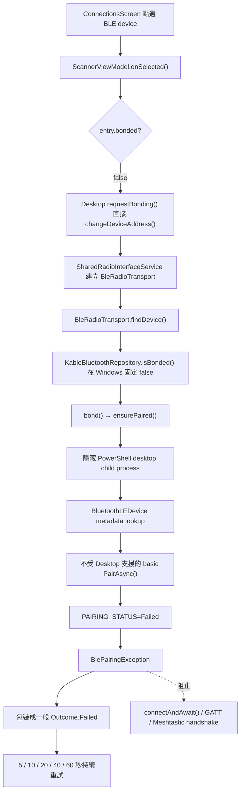
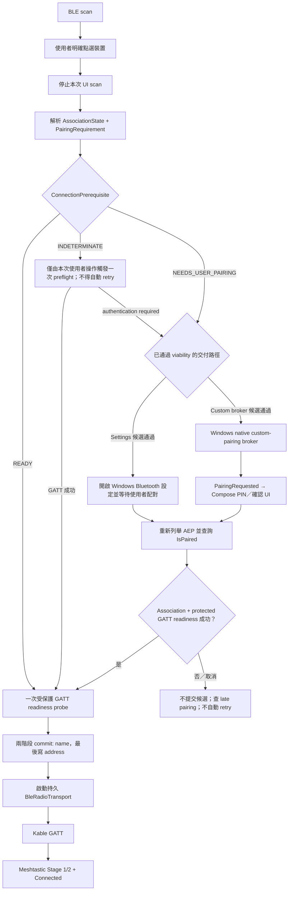

# NTsocial MeshLink Windows BLE 配對失敗：失敗邊界分析與條件式修改規格

- 報告版本：2.0（取代原 2026-07-23 探索性報告）
- 報告日期：2026-07-23（Asia/Taipei）
- 主要影響軌：Microsoft Windows `NTsocial MeshLink` Desktop
- Android 影響：不得改變既有 Android `createBond()`、Gateway IPC 或 Android 綠色品牌行為
- Fork 基準：`ce20e086cd0f10686e071b57335837eaadfaf755`
- 上游比對基準：`bb7508a4f256450df90fd6c363788c7cbf5b4834`
- 原始失敗記錄基準：`8ae1bd4e72d8` 加上當時尚未提交的 Windows 配對實驗
- 結論狀態：**已確認現行 production 設計不成立；本次原生失敗原因與替代架構仍須通過診斷／真機 gate**
- 本報告變更範圍：分析與工程修改規格；未修改 Kotlin、Gradle、Windows 配對狀態或節點設定

## 1. 執行摘要

目前沒有證據顯示 Logo、主題、Splash 或其他視覺品牌變更破壞 BLE。已確認的設計事實有兩層：

1. 官方 Meshtastic Desktop 上游提供 Windows BLE 掃描與 Kable GATT 路徑，但**沒有完成或證明可靠的
   Windows first-pair、PIN 與 bonding 實作**。上游 JVM `BluetoothRepository.bond()` 原本就是
   no-op，官方 Desktop 文件也明寫 BLE bonding 尚未支援。
2. NTsocial fork 為補足此缺口新增了 PowerShell／WinRT pairing helper，但 helper 呼叫的
   `DeviceInformation.Pairing.PairAsync()` 被 Microsoft 明確列為 **Desktop apps 不支援的方法**。
   因此這條 helper 只能視為診斷實驗，不能作為可發布的 Windows 配對實作。

這兩層事實與目前症狀一致，並已足以判定現行 helper 不可發布；但不能據此聲稱已解析這一次
`PAIRING_STATUS=Failed` 的原生直接原因：

- BLE advertisement scan 正常，因此能看到正確名稱、address 與 RSSI。
- 舊路徑未先取得受保護 GATT attribute 所需的 authentication，收到
  `HRESULT 0x80650005 / E_BLUETOOTH_ATT_INSUFFICIENT_AUTHENTICATION`。
- 新路徑在 Kable GATT 之前呼叫 Desktop 不支援的 basic `PairAsync()`；helper 隨後只輸出
  `PAIRING_STATUS=Failed`。現有 log 無法區分 WinRT result failure、PowerShell projection／wait exception
  或其他 broker 失敗，所以「unsupported API」是已確認的設計缺陷，不是這次 native status 的完整鑑識。
- 專案中沒有 `DeviceInformationCustomPairing`、`PairingRequested`、`ProvidePin` 或 Compose PIN
  UI，因此 helper 沒有顯示 Windows UI 時，App 內也不存在第二條輸入 PIN 的路徑。
- 現行失敗發生在 `bleConnection.connectAndAwait()` 之前；service UUID、characteristic subscription、
  Stage 1/2 config handshake 與封包交換不是**最先出現的失敗邊界**，但也因未執行而尚未由本次測試驗證。

工程決策如下：

> **停止把互動式配對放在 `BleRadioTransport`／reconnect loop。使用者點選裝置後，先解析該節點的
> connection prerequisite；需要配對時才走經驗證的 Windows 流程。通過 association 與受保護 GATT
> readiness 檢查後，才提交 radio address 並建立持久 transport。**

建議分兩階段恢復：

- **Phase 0 候選 A（外部 Settings）：**移除 PowerShell basic `PairAsync()`，驗證 Windows Bluetooth
  Settings 能替同一節點配對，且預配對後 Kable 能完成受保護 GATT；兩項通過後才可升格為 Phase 1。
- **Phase 0 候選 B（App 內 PIN）：**先以小型原生 C#／C++ prototype 驗證
  `DeviceInformation.Pairing.Custom` 在選定 Desktop app model 上可用；通過後才整合 versioned broker
  IPC、`PairingRequested` 與 Compose PIN／確認 UI。

不能把「改成 MSIX」、「取消 `-NonInteractive`」、「增加 retry」或「只升級 Kable」當成正式修復。

## 2. 已觀測環境與證據

### 2.1 Windows 測試環境

| 項目 | 觀測值 |
|---|---|
| 作業系統 | Microsoft Windows 11 Home，64-bit |
| OS version / build | `10.0.26200` / `26200` |
| Bluetooth adapter | Intel(R) Wireless Bluetooth(R)，PnP status `OK` |
| Bluetooth driver | `24.50.0.4`，driver date `2026-05-08` |
| Desktop 啟動方式 | Gradle `:desktop:run`，一般 Compose/JVM Desktop process |
| Windows 發行格式 | Compose Desktop MSI／EXE；不是 MSIX |
| Kable | fork 使用 `0.42.0`；調查時上游為 `0.44.3` |
| Desktop log | `%TEMP%\ntsocial-meshlink-desktop-run.out.log` |
| Log 時間範圍 | 2026-07-23 16:14:12 至 16:18:45 +08:00 |
| Log SHA-256 | `826ABF87B115D1F4944778DAF8434751F55F6EE9ECA0C884067F18DBBACF030A` |

`stderr` 只有 Java locale 與 SLF4J provider 警告，沒有足以解釋 Bluetooth／WinRT 失敗的內容。

### 2.2 節點觀測

| 節點 | 位址（遮蔽） | 測試期間 RSSI | App 掃描 | App 配對 |
|---|---|---:|---|---|
| `Meshtastic_7faf` | `…:7F:AF` | 約 `-64` 至 `-67 dBm` | 成功 | `Failed` |
| `Meshtastic_fe66` | `…:FE:66` | 約 `-68` 至 `-76 dBm` | 成功 | `Failed` |

App 關閉後的唯讀 WinRT metadata 查詢對兩個位址均返回：

- 正確裝置名稱
- `IsPaired=false`
- `CanPair=true`
- `ConnectionStatus=Disconnected`
- `BluetoothAddressType=Random`

這只能證明 Windows system cache 保有 metadata，不代表兩台裝置當時都在線。
`BluetoothLEDevice.FromBluetoothAddressAsync()` 可以從 cache 取得未配對裝置，而建立
`BluetoothLEDevice` object 本身也不一定發起連線。

### 2.3 已執行的聚焦測試

以下現有測試在 JDK 21 上成功：

```text
:core:ble:jvmTest
:core:network:allTests
:feature:connections:allTests
:desktop:test
```

這些測試成功只證明 Kotlin 邏輯、fake process output mapping 與 Desktop host 組裝沒有失敗，**不證明
真實 Windows first-pairing 可用**。目前配對測試沒有執行真正的 PowerShell、WinRT pairing broker、
Windows system consent、PIN ceremony 或 BLE 硬體。

## 3. 已確認的設計缺陷與未解析的執行期失敗

### 3.1 設計缺口一：調查範圍內的上游 Desktop bonding 未完成

官方 Desktop BLE 是在 2026 年 3 月的上游 PR
[#4818](https://github.com/meshtastic/Meshtastic-Android/pull/4818) 引入 Kable backend。
該實作提供掃描與 GATT 操作，但沒有 Windows PIN callback 或 bonding 實作。

本報告固定比對的上游 commit `bb7508a4f256450df90fd6c363788c7cbf5b4834` 之 JVM repository
明確具有下列語意：

```kotlin
override fun isBonded(address: String): Boolean = false // Bonding not supported on desktop yet

override suspend fun bond(device: BleDevice) {
    // No-op
}
```

上游 `JvmScannerViewModel` 則假設 OS 會在 GATT connection 期間處理 pairing。這個假設對本次需要
authentication 的 Meshtastic 節點不成立。

截至 fork commit `8ae1bd4e72d8`，NTsocial 版本仍保持相同行為。純品牌 rename commit
`f42e08fec76e770542449b272724559c7e5bac50` 對 `KableBluetoothRepository` 幾乎只是 package rename，
沒有把既有 bonding 功能改壞，因為可用的 Windows bonding 功能原本就不存在。

### 3.2 設計缺口二：fork helper 使用 Microsoft 明列不支援的 Desktop API

現行 helper 在：

```text
core/ble/src/jvmMain/kotlin/com/ntsocial/meshlink/core/ble/
  JvmDesktopBluetoothPairingService.kt
```

透過隱藏、`-NonInteractive` 的 Windows PowerShell 5.1 process 執行：

```powershell
$pairOperation = $pairing.PairAsync()
```

Microsoft 的 Desktop WinRT 支援矩陣在「Unsupported members」明確列出：

| Class | Unsupported method |
|---|---|
| `DeviceInformationPairing` | `PairAsync` |

來源：[WinRT APIs not supported in desktop apps](https://learn.microsoft.com/en-us/windows/apps/desktop/modernize/winrt-api-desktop-app-support)

因此需要區分兩件事：

- `BluetoothLEDevice` lookup、`IsPaired`、`CanPair` 等部分 WinRT API 在目前 Desktop process 可用。
- 這**不代表** `DeviceInformationPairing.PairAsync()` 在 Desktop app 受支援。

Compose JVM 主程式派生 PowerShell child process，不會把 child process 轉換成 UWP／AppContainer，也不會
消除 Desktop support restriction。jpackage MSI／EXE 仍是 Desktop app。Microsoft 將此方法列在
UWP-only UI 相依的 unsupported members，而不是「只需要 package identity」的清單，所以：

- 改成 MSI 安裝版不會自動修復。
- 單純改成 MSIX或補 capability 不是 Microsoft 文件提供的修復。
- 取消 `-WindowStyle Hidden` 或 `-NonInteractive` 只能作診斷實驗，不能使不受支援的 API 成為
  production solution。

### 3.3 為何沒有 PIN 輸入 UI

目前專案沒有：

- `DeviceInformation.Pairing.Custom`
- `DeviceInformationCustomPairing.PairingRequested`
- `DevicePairingKinds.ProvidePin`
- `DevicePairingKinds.DisplayPin`
- `DevicePairingKinds.ConfirmPinMatch`
- Compose PIN input／confirmation state

Microsoft 的 custom pairing contract 要求 App 參與 ceremony：

- `ProvidePin`：App 向使用者取得 PIN，再呼叫 `args.Accept(pin)`。
- `DisplayPin`：App 顯示 Windows 提供的 PIN，讓使用者在對端輸入。
- `ConfirmPinMatch`：App 顯示 PIN 並要求使用者確認。
- `ConfirmOnly`：App 接受或拒絕 pairing request；Desktop 仍可能顯示 system consent。

來源：[Pair devices](https://learn.microsoft.com/en-us/windows/apps/develop/devices-sensors/pair-devices)、
[DevicePairingKinds](https://learn.microsoft.com/en-us/uwp/api/windows.devices.enumeration.devicepairingkinds)

上述是**受支援 custom-pairing app model** 下的 contract。Microsoft reference sample 主要示範
UWP／AppContainer 情境；目前 Compose JVM 或其派生的 full-trust helper 是否屬於可使用該 API 的
app model，仍必須由 Phase 0 viability prototype 證明。custom overload 未出現在同一份 unsupported
清單，只能形成候選，不能當成 Microsoft 對 full-trust Desktop 的正面支援保證。

原報告曾引用 basic pairing 文件，認為 Windows 應自動顯示必要互動。該語意適用於文件所述的
basic pairing 情境，但不能推翻 Microsoft 對 Desktop `DeviceInformationPairing.PairAsync()` 的明確限制。
因此正確說法是：

> 本次沒有觀察到 PIN／system dialog；無法證明 helper 已進入有效 pairing ceremony，也不能期待目前
> unsupported basic API 必然替 Compose Desktop 顯示 PIN UI。

### 3.4 `PAIRING_STATUS=Failed` 是壓縮結果，不是原生狀態

目前 helper 的兩條路徑會產生相同 stdout：

```powershell
# PairAsync 正常完成，但 DevicePairingResultStatus 是 Failed
Write-Output ('PAIRING_STATUS=' + $result.Status.ToString())
exit 6

# lookup、PairAsync、PowerShell WinRT projection 或 wait 拋出例外
catch {
    Write-Output 'PAIRING_STATUS=Failed'
    exit 9
}
```

Kotlin runner 取得 `WindowsPairingProcessResult.exitCode`，但 `ensurePaired()` 只把 `result.output` 傳給
`pairingOutcomeFrom()`。所以既有 log 仍無法知道：

- 實際 exit code 是 6 還是 9
- 真實 `DevicePairingResultStatus`
- `ProtectionLevelUsed`
- exception type／HRESULT／InnerException

所以目前只能同時成立兩項結論：

1. 現行 basic `PairAsync()` production 設計已確定不成立，應退役。
2. 本次具體 failure 尚未解析；不得把 helper 的字串 `Failed` 直接翻譯成 PIN 錯誤、使用者拒絕、
   `DevicePairingResultStatus.Failed` 或任何特定 HRESULT。

保留 exit code、原生 status 與經 allowlist 消毒的 exception 資料，仍是 Phase 0 必做診斷；它們不會
使 basic `PairAsync()` 變成受支援的 Desktop production path。

## 4. 完整失敗呼叫鏈

以下行號以 fork commit `ce20e086c` 為基準，後續修改時可能位移。



主要位置：

1. `feature/connections/.../ui/ConnectionsScreen.kt:259-265`
   - 將裝置點擊傳給 `scanModel.onSelected(entry)`。
2. `feature/connections/.../ScannerViewModel.kt:317-328`
   - 未配對 BLE entry 走 `requestBonding()`。
3. `feature/connections/.../ScannerViewModel.kt:353-362`
   - Desktop 預設實作沒有等待配對，只立即設定 device address。
4. `feature/connections/.../JvmScannerViewModel.kt:37-42`
   - 沒有 override；註解仍宣稱 OS 會在 GATT 自動配對，已與目前實作和實測不符。
5. `core/network/.../BleRadioTransport.kt:250-271`
   - transport 找裝置後主動 bond，成功才呼叫 `connectAndAwait()`。
6. `core/ble/.../KableBluetoothRepository.kt:43-46`
   - Windows 的 `isBonded()` 不是查詢特定裝置，而是一律回傳 false，然後呼叫 helper。
7. `core/ble/.../JvmDesktopBluetoothPairingService.kt:76-114`
   - 啟動 hidden/non-interactive PowerShell。
8. `core/ble/.../JvmDesktopBluetoothPairingService.kt:143-169`
   - 執行 helper，但忽略 exit code。
9. `core/ble/.../JvmDesktopBluetoothPairingService.kt:274-299`
   - 呼叫 basic `PairAsync()`，把 result failure 與 exception 壓成相同 sentinel。
10. `core/network/.../BleRadioTransport.kt:217-225`
    - `BlePairingException` 被包成普通 `Outcome.Failed`。
11. `core/network/.../BleReconnectPolicy.kt:98-114`
    - policy 不看 exception 的 permanent 分類。

本次完全未抵達：

- `BleRadioTransport.kt:271` 的 `connectAndAwait()`
- GATT service discovery
- Meshtastic FROMNUM subscription
- `want_config_id` Stage 1／Stage 2
- 最終 `ConnectionState.Connected`
- Meshtastic packet RX／TX

## 5. 舊路徑與新路徑的不同失敗

### 5.1 舊上游路徑

舊路徑直接進入 Kable GATT，受保護 attribute 回傳：

```text
HRESULT(0x80650005): 需要先驗證屬性，才能讀取或寫入屬性。
```

Microsoft 定義為 `E_BLUETOOTH_ATT_INSUFFICIENT_AUTHENTICATION`：

[COM Bluetooth error codes](https://learn.microsoft.com/en-us/windows/win32/com/com-error-codes-9#e_bluetooth_att_insufficient_authentication)

這證明當時的 GATT connection 沒有取得該 attribute 所需的 authentication。它本身不單獨證明：

- 一定需要哪一種 PIN ceremony
- 一定需要永久 bond
- 應採 basic 或 custom pairing

### 5.2 現行 fork 路徑

現行路徑在 GATT 前先執行 fork-only helper：

| 節點 | Connection attempts | Bond starts | 完整 pairing failures | 到達 GATT connect |
|---|---:|---:|---:|---:|
| `Meshtastic_7faf` | 4 | 3 | 2 | 0 |
| `Meshtastic_fe66` | 4 | 4 | 4 | 0 |

六次完整失敗 duration：

```text
Meshtastic_7faf: 10.271 s, 15.254 s
Meshtastic_fe66:  3.864 s, 4.890 s, 12.511 s, 22.519 s
```

最後中斷為 `Packets RX: 0`、`Packets TX: 0`。heartbeat 曾被排程，但
`toRadio characteristic unavailable`，所以沒有實際 Meshtastic characteristic write。

## 6. 上游、fork 與 Kable 比對

### 6.1 Git 歷史判定

| 版本／commit | BLE pairing 行為 |
|---|---|
| 上游 `0b2e89c46`（PR #4818） | 引入 Desktop Kable；bonding 仍未支援 |
| fork `f42e08fec` | 主要為 namespace／品牌 rename；bonding 行為未變 |
| fork `8ae1bd4e` | Windows `isBonded=false`、`bond()` no-op |
| fork `ce20e086c` | 新增 PowerShell PairAsync helper、fake tests 與 fail-before-GATT 行為 |

`ce20e086c` 同時包含 Windows 品牌、Splash、Theme 與 BLE pairing 實驗，所以該 commit 並不只是
Logo 變更。純 scanner／GATT 核心檔案在 `8ae1bd4e` 至該 commit 間沒有因視覺資產而退化：

- `KableBleScanner.kt`
- `KableBleConnection.kt`
- `KableBleConnectionFactory.kt`
- `MeshtasticBleConstants.kt`
- `DesktopRadioTransportFactory.kt`

結論是「視覺變更沒有破壞既有 BLE 核心」，但不能再假設 fork 只是「最新上游加皮膚」。

### 6.2 Kable 能力邊界

fork 使用的 Kable `0.42.0` JVM/btleplug surface 提供：

- scan
- connect／disconnect
- service discovery
- read／write
- subscribe／unsubscribe

沒有 exposed：

- pair
- bond
- PIN callback
- Windows pairing ceremony

調查時上游使用的 Kable `0.44.3` 仍沒有 explicit pair／bond API。因此：

- 升級 Kable可作獨立 backend 相容性實驗。
- 不能把升級 Kable 當成 Windows first-pairing 修復保證。
- 配對可能由 Windows 預先完成、由受支援的 OS automatic pairing 完成，或由另外的 Windows-native
  integration 完成；目前 Kable JVM API 本身不能主動要求 PIN pairing。

## 7. 其他已確認的程式缺陷

這些缺陷不是第一次 `PairAsync()` 失敗的根因，但必須與配對架構一起修正。

### 7.1 互動式配對放在 transport/reconnect 層

`BleRadioTransport` 是背景 transport，會在斷線後重試。PIN／system consent 是使用者互動，不應從
背景 reconnect loop 啟動。

後果：

- 使用者取消後仍可能再次觸發配對。
- App 冷啟動或背景重連可能非預期彈出 UI。
- pairing failure 和 transient GATT failure 混在同一個 backoff policy。

### 7.2 permanent 分類被忽略

`BlePairingException` 在 `BleExceptionClassifier` 被標為 permanent，但：

- `BleRadioTransport` 將所有 exception 包成 `Outcome.Failed`。
- `BleReconnectPolicy` 不檢查 `isPermanent`。
- transport 設定 `maxFailures=Int.MAX_VALUE`。

因此失敗會按 5、10、20、40、60 秒持續重跑。這是放大器，不是第一個 failure 的原因。

### 7.3 Windows bonded state 是假的

`KableBluetoothRepository.isBonded(address)` 在 Windows 不是 per-device query，而是由
`isExplicitPairingRequired` 推導，結果對所有 Windows address 都是 false。

後果：

- 已由 Windows Settings 配對的裝置也可能重跑 helper。
- App restart 後無法正確辨識保存的 Windows bond。
- UI 與 transport 的 bonded 語意不一致。

### 7.4 裝置選取不是 transaction

`ScannerViewModel.onSelected()` 會先更新 `radioPrefs.devName`，Desktop `requestBonding()` 又立即
`changeDeviceAddress()`。也就是尚未配對成功就提交新裝置，啟動 transport。

正確語意應是：

1. 保留目前連線。
2. 對新裝置執行 pairing gate。
3. 成功後一次性提交名稱與 address。
4. 失敗或取消時不改動目前連線。

### 7.5 scan contention

目前畫面 scan 與 transport `findDevice()` 可能重疊，log 也有 advertisement flow prematurely closing。
這可能造成 `OperationAlreadyInProgress` 或 Windows stack contention，但不能解釋 unsupported basic
`PairAsync()` 的第一個 failure。

### 7.6 診斷資料被過度壓縮

helper 丟失：

- exit code
- HRESULT
- exception type
- InnerException
- native result status
- `ProtectionLevelUsed`

應保留結構化、已消毒資料，但不得記錄 PIN、完整 MAC、DeviceInformation.Id 或其他敏感 payload。

## 8. 已證實、尚未證實與優先度

### 8.1 已證實

- Windows adapter 與 BLE advertisement scan 可用。
- 測試期間兩個節點都可被 App 掃描。
- 舊 GATT 路徑沒有取得 attribute 所需 authentication。
- 上游 JVM Desktop 沒有顯式 bond/PIN 實作。
- Kable JVM 沒有 pair/bond API。
- 現行 helper 呼叫 Microsoft 明列 Desktop 不支援的 basic `DeviceInformationPairing.PairAsync()`。
- 目前專案沒有 custom pairing callback 或 PIN UI。
- 新路徑在 Kable GATT connect 前失敗。
- pairing failure 被錯誤地自動重試。
- 現有 unit tests 不執行真實 Windows pairing。

### 8.2 仍須驗證

- Windows Settings 能否從乾淨無 bond 狀態完成同一節點 pairing。
- Settings 預配對後，現有 Kable能否完成受保護 GATT read/write 與 Meshtastic handshake。
- 節點實際要求的 ceremony：`ProvidePin`、`DisplayPin`、`ConfirmPinMatch`、`ConfirmOnly` 或其他。
- `DeviceInformationCustomPairing.PairAsync()` 在選定的 full-trust Desktop app model 是否受支援且實機可用。
- 若 full-trust custom helper 不可用，哪一種 Microsoft 明確支援的 API／app model 可行；應分開評估
  unpackaged Win32／Windows App SDK full-trust、packaged full-trust、AppContainer／UWP 類模型，
  以及各自的 identity、capability、activation、IPC 與 deployment。
- 節點 hardware model、firmware version、pairing mode 與殘留 bond。
- Windows build、Intel driver 與特定 firmware 組合是否另有相容問題。
- 停止所有 scan 後是否消除額外 contention。
- 明確指定 `BluetoothAddressType.Random` 或使用 AEP `DeviceInformation.Id` 是否改變 lookup；這只應作
  A/B 實驗，不是主要根因。

### 8.3 已降低優先度

- Logo／Theme／Splash 造成 BLE 核心退化。
- 單一節點硬體故障。
- 單純 RSSI 過弱。
- Meshtastic GATT service 完全不存在。
- 單純升級 Kable即可取得 PIN pairing。

## 9. 目標架構與不可違反的語意

### 9.1 目標流程



`IsPaired=true` 只代表 Windows association；它不是 BLE security keys 一定可用的充分證據。真正的
readiness gate 還要包含一次受保護 GATT 存取。反過來，`IsPaired=false` 也不必然代表 `NO_PIN`
裝置一定要先做 interactive pairing；這必須由 Phase 0 的 firmware／mode matrix 決定。

### 9.2 必要架構規則

1. pairing 只能由使用者在 Connections UI 明確觸發。
2. `BleRadioTransport` 不得啟動 PIN／consent ceremony。
3. prerequisite 與 pairing 成功前不得切換或持久化新 radio address。
4. pairing 失敗、取消、PIN 錯誤不得自動重開 UI。
5. transport 只可自動重試真正 transient 的 GATT／連線錯誤。
6. 配對期間只允許一個 active request，並停止會競爭的 scan。
7. Windows association 必須是 per-device、以新 AEP object 可重新查詢的真實狀態；不得把它冒充
   protected-GATT readiness。
8. App 冷啟動若發現保存的 bond 已消失，只回報「需要重新配對」，不可自行彈出 PIN。
9. Kable仍負責配對成功後的 GATT；不要重寫 Meshtastic BLE protocol。
10. Windows-native integration 留在 Desktop/platform boundary。`commonMain` 只能放平台中立的狀態、結果
    與 retry contract，不得 import `java.*`、`android.*` 或 WinRT。
11. Android `createBond()` 行為必須保留；任何 common interface 變更都要同步更新 Android implementation
    和測試。
12. macOS／Linux 保持現有 non-Windows policy，不能因 Windows helper 而被迫繼承 Windows UI。
13. cancel／timeout 後不得自動 unpair；必須重新查詢 association。若 Windows 在取消後才完成配對，
    UI 應告知「系統已完成配對，可重新選取」，但本次 request 仍不得提交 radio address。
14. 是否能在舊 radio transport 持續連線時配對新節點，要先做 Phase 0 concurrency test；若 adapter
    不允許，暫停舊 transport，失敗時恢復。保證的是舊選取 metadata 可回復，不是無條件保證 GATT
    全程不中斷。

## 10. 具體修改辦法

以下名稱是建議規格；工程師可以依現有命名微調，但責任邊界與語意必須保留。

### 10.1 分開 association、pairing requirement 與連線 readiness

目標檔案：

```text
core/ble/src/commonMain/kotlin/com/ntsocial/meshlink/core/ble/BluetoothRepository.kt
core/ble/src/androidMain/kotlin/com/ntsocial/meshlink/core/ble/AndroidBluetoothRepository.kt
core/ble/src/jvmMain/kotlin/com/ntsocial/meshlink/core/ble/KableBluetoothRepository.kt
core/testing/src/commonMain/kotlin/com/ntsocial/meshlink/core/testing/FakeBle.kt
```

現行 `fun isBonded(address: String): Boolean` 無法表達 async WinRT query，也把三個不同概念壓成一個
Boolean。建議先新增平台中立模型：

```kotlin
enum class BluetoothAssociationState {
    PAIRED,
    UNPAIRED,
    PLATFORM_MANAGED,
    UNKNOWN,
}

enum class PairingRequirement {
    REQUIRED,
    NOT_REQUIRED,
    UNKNOWN,
}

sealed interface ConnectionPrerequisite {
    data object Ready : ConnectionPrerequisite
    data class NeedsUserPairing(val reason: PairingReason) : ConnectionPrerequisite
    data class Indeterminate(val reason: PrerequisiteUnknownReason) : ConnectionPrerequisite
}
```

必要語意：

- Android 可把 `BluetoothAdapter.getRemoteDevice(address).bondState` 映射到 `PAIRED`／`UNPAIRED`，
  並保留現行由使用者點選觸發的 `createBond()`。
- Windows `IsPaired` 只映射 `PAIRED`／`UNPAIRED`，不能直接推導 `Ready`。
- macOS／Linux 若 pairing 由 OS／Kable 管理，應回 `PLATFORM_MANAGED`，不能宣稱 `NOT_REQUIRED`。
- `PairingRequirement.NOT_REQUIRED` 描述的是已由 firmware／mode 實測證明可直接建立所需安全層的節點，
  不是 bond 狀態。
- `UNKNOWN` 不得自動視為 ready，也不得永久封鎖；只能進入一次、使用者觸發、無 reconnect 的
  prerequisite preflight，或要求外部配對。
- 可以保留 `BluetoothRepository.bond()` 供 Android 現有 user-driven flow 使用，但
  `BleRadioTransport` 不得呼叫它。Windows association query 應由 Desktop coordinator／provider
  注入，不應把 WinRT 寫進 transport repository。

若調整 `BluetoothRepository` public contract，工程師必須一次盤點並更新：

```text
core/ble/.../AndroidBluetoothRepository.kt
core/ble/.../KableBluetoothRepository.kt
core/testing/.../FakeBle.kt
core/network/.../BleRadioTransport*Test.kt
feature/connections/.../ScannerViewModel*Test.kt
```

先以 `rg "isBonded|bond\\(|BluetoothRepository"` 建立完整 call-site 清單，避免只修改兩個 production
implementer 而漏掉 fake、Android bonding 或 reconnect tests。

### 10.2 退役現行 PowerShell basic pairing

目標檔案：

```text
core/ble/src/jvmMain/kotlin/com/ntsocial/meshlink/core/ble/
  JvmDesktopBluetoothPairingService.kt
core/ble/src/jvmTest/kotlin/com/ntsocial/meshlink/core/ble/
  JvmDesktopBluetoothPairingServiceTest.kt
```

必須移除 production path：

- Base64 PowerShell script
- `WindowsPairingProcessRunner`
- `-ExecutionPolicy Bypass`
- `DeviceInformation.Pairing.PairAsync()`
- 只靠 `PAIRING_STATUS=...` 的 sentinel protocol

短期可保留的只有：

- 非互動式 paired-state query
- 結構化 diagnostic probe（若工程團隊仍需要）

若保留舊 helper 作診斷，檔名與 UI 必須明示 `UnsupportedDiagnosticProbe`，不得由 production selection
path 呼叫，也不得據此宣稱 pairing 支援。

### 10.3 新增平台中立 domain model與 Desktop coordinator contract

建議新增：

```text
core/ble/src/commonMain/kotlin/com/ntsocial/meshlink/core/ble/
  PairingModels.kt
  ConnectionPrerequisite.kt
core/ble/src/jvmMain/kotlin/com/ntsocial/meshlink/core/ble/
  DesktopBluetoothPairingCoordinator.kt
feature/connections/src/commonMain/kotlin/com/ntsocial/meshlink/feature/connections/
  PairingUiState.kt
desktop/src/main/kotlin/com/ntsocial/meshlink/desktop/ble/
  WindowsBluetoothPairingCoordinator.kt
  WindowsPairingBrokerProcessClient.kt
```

`commonMain` 只放平台中立 enum／sealed types。`DesktopBluetoothPairingCoordinator` 是不含 WinRT、
Settings URI 或 process 細節的 JVM Desktop contract，只由 `JvmScannerViewModel` 使用，再映射到
common `PairingUiState`；共同 UI 不得直接引用 `jvmMain` type。Windows process/client 實作全部留在
`desktop` host。

coordinator 對 UI 只提供一個 authoritative pending-prompt mailbox：

```kotlin
interface DesktopBluetoothPairingCoordinator {
    val state: StateFlow<PairingSessionState>
    val pendingPrompt: StateFlow<PendingPairingPrompt?>

    suspend fun query(target: PairingTarget): BluetoothAssociationState
    suspend fun resolvePrerequisite(target: PairingTarget): ConnectionPrerequisite
    suspend fun beginPairing(target: PairingTarget): PairingOutcome
    suspend fun answerPrompt(
        requestId: String,
        promptId: String,
        response: PairingPromptResponse,
    )
    suspend fun cancel(requestId: String)
}
```

`PairingSessionState` 是 `core:ble` 的平台中立 session/domain 狀態，不引用 Compose resources，也不含
UI 文案。`feature:connections` 再把它映射成 `PairingUiState`。建議補上取消後再查詢與 post-pair
readiness 狀態：

```kotlin
sealed interface PairingSessionState {
    data object Idle : PairingSessionState
    data class Checking(val requestId: String, val deviceLabel: String) : PairingSessionState
    data class WaitingForExternalPairing(val requestId: String, val deviceLabel: String) : PairingSessionState
    data class Pairing(val requestId: String, val deviceLabel: String) : PairingSessionState
    data class VerifyingAssociation(val requestId: String) : PairingSessionState
    data class VerifyingProtectedGatt(val requestId: String) : PairingSessionState
    data class CancelledButPaired(val requestId: String) : PairingSessionState
    data class Failed(
        val requestId: String,
        val code: PairingFailureCode,
        val canRetryExplicitly: Boolean,
    ) : PairingSessionState
}
```

broker callback 由 coordinator 私下持有；它建立 `PendingPairingPrompt`，等待 UI 透過
`answerPrompt(requestId, promptId, ...)` 回覆。不得同時再公開第二個 callback／Channel，否則會有兩個
真相來源。

pending prompt 使用 session-scoped `StateFlow` 是刻意的：Compose recomposition、視窗短暫失焦後仍要
看得到尚未回覆的 prompt。每個 prompt 只接受一次 response；UI 收到 acknowledgement 後立即清除，
terminal／cancel／timeout 時強制清除，late／duplicate response 一律拒絕。使用者輸入的 `ProvidePin`
保留在 dialog local state；只有 `DisplayPin`／`ConfirmPinMatch` 的 Windows-provided PIN 可短暫存在
pending prompt。兩者都不得持久化、寫 log 或進 exception。

錯誤文案由 `feature:connections` 依 `PairingFailureCode` 映射到 Compose Multiplatform string
resources；`core:ble` 不應持有 hardcoded UI text 或 resource key。

### 10.4 Connections selection 改成 transaction

目標檔案：

```text
feature/connections/src/commonMain/kotlin/com/ntsocial/meshlink/feature/connections/
  ScannerViewModel.kt
feature/connections/src/jvmMain/kotlin/com/ntsocial/meshlink/feature/connections/
  JvmScannerViewModel.kt
feature/connections/src/androidMain/kotlin/com/ntsocial/meshlink/feature/connections/
  AndroidScannerViewModel.kt
```

不要把三個獨立 preferences write 誤稱為原子操作。建議新增 `RadioSelectionTransaction`，先保存舊
name／address，候選值只存在記憶體：

```kotlin
data class PendingBleSelection(
    val address: String,
    val displayName: String,
)

suspend fun commitBleSelection(selection: PendingBleSelection) {
    val previousName = radioPrefs.devName
    val previousAddress = radioPrefs.deviceAddress
    try {
        radioPrefs.setDevName(selection.displayName)
        changeDeviceAddress(selection.address) // 最後寫；此操作會觸發 transport
        awaitCandidateReady()
    } catch (error: Throwable) {
        radioPrefs.setDevName(previousName)
        changeDeviceAddress(previousAddress)
        throw error
    }
}
```

BLE selection 必須：

1. snapshot 舊 name／address；不先寫 candidate preferences。
2. 暫停 BLE scan。
3. 解析 prerequisite；必要時執行外部 Settings 或已通過 viability 的 native broker。
4. 執行 protected-GATT readiness probe。
5. 通過後先寫 name，最後寫會觸發 transport 的 address。
6. 新 transport 未 ready 時 rollback 舊 name／address，並嘗試恢復舊 transport。
7. pairing 失敗／取消：不提交 candidate；不得自動 unpair。
8. cancel／timeout 後重新列舉 AEP；若系統 late-paired，只提示重新選取。
9. terminal 後依 `bleAutoScan` 恢復 scan。

`JvmScannerViewModel` 必須 override Desktop bonding，不能再依賴 base class 的「直接 connect」。
Android `AndroidScannerViewModel` 維持既有 user-triggered `createBond()`，成功後才 commit。

目前 `addRecentAddress()` 是 TCP recent-address 語意，不應無條件套到 BLE。若產品確實要保存 BLE recent
devices，先定義獨立 model／storage；本修復不要順手混用 TCP helper。

### 10.5 UI：新增 pairing state 與安全對話框

目標檔案：

```text
feature/connections/src/commonMain/kotlin/com/ntsocial/meshlink/feature/connections/ui/
  ConnectionsScreen.kt
feature/connections/src/commonMain/kotlin/com/ntsocial/meshlink/feature/connections/ui/components/
  BluetoothPairingDialog.kt
```

UI 必須支援：

- 檢查是否已配對
- 等待 Windows Settings 手動配對
- `ProvidePin`
- `DisplayPin`
- `ConfirmPinMatch`
- `ConfirmOnly`
- 取消
- timeout
- 明確重試按鈕
- unsupported ceremony／AccessDenied／broker unavailable 等可恢復錯誤

Meshtastic proto 定義 `RANDOM_PIN`、`FIXED_PIN`、`NO_PIN`；目前專案的 fixed-PIN editor 採六位數
限制。Phase 0 必須確認各實際 firmware 的 random/fixed PIN 長度與
`PairingRequested.PairingKind`。Production UI 只能依已驗證的 Meshtastic contract 設定長度，
不能只根據裝置名稱猜測。

安全要求：

- PIN field 使用 numeric password keyboard／visual transformation。
- `ProvidePin` 不放入 ViewModel persistent state；session-scoped pending prompt 只保存完成互動所需的
  最小資料。
- submit、cancel、timeout、dialog dispose 後清除 local value。
- `DisplayPin`／`ConfirmPinMatch` 的 PIN 也不得寫 log。
- 不在 UI 顯示完整 MAC。
- 配對期間 disable 其他裝置列，或要求先取消目前 session。

新增字串時先查 `.skills/compose-ui/strings-index.txt`，使用 Compose Multiplatform resources，最後執行：

```text
python3 scripts/sort-strings.py
```

不得在 common UI hardcode 英文錯誤訊息。

### 10.6 transport：只驗證，不啟動 pairing

目標檔案：

```text
core/network/src/commonMain/kotlin/com/ntsocial/meshlink/core/network/radio/
  BleRadioTransport.kt
  BleReconnectPolicy.kt
core/ble/src/commonMain/kotlin/com/ntsocial/meshlink/core/ble/
  BlePairingException.kt
  BleExceptionClassifier.kt
```

正常 `BleRadioTransport.attemptConnection()` 應改為：

```text
find device
→ 讀取 coordinator 已解析的 ConnectionPrerequisite
→ NEEDS_USER_PAIRING／INDETERMINATE：立即結束本次 transport
→ READY：connectAndAwait()
→ service discovery
→ subscribe
```

必須刪除 transport 內的：

```kotlin
bluetoothRepository.bond(device)
```

`NO_PIN`／未知狀態的探索性 direct GATT 只能由 selection coordinator 建立短生命週期 preflight，
且每次使用者點選最多一次、沒有 reconnect/backoff、不寫 preferences。成功才標成
`PairingRequirement.NOT_REQUIRED`；若回 authentication-required，轉為 `NeedsUserPairing`。若工程上
暫時重用 `BleRadioTransport`，必須提供 isolated preflight mode，禁止 persistence、background retry
與自動 UI，並在完成後恢復舊 transport。

不要讓 WinRT／broker error 直接滲入 reconnect policy。分成三層：

```kotlin
sealed interface BrokerFailure // process、activation、IPC、protocol
sealed interface PairingOutcome // paired、already paired、cancelled、native pairing failure
enum class ConnectionRetryDisposition { GIVE_UP, USER_ACTION_REQUIRED, TRANSIENT_GATT }
```

`PairingFailureCode` 的 domain allowlist 至少包含：

- `PAIRING_REQUIRED`
- `DEVICE_NOT_FOUND`
- `NOT_READY_TO_PAIR`
- `USER_CANCELLED`
- `AUTHENTICATION_FAILED`
- `AUTHENTICATION_TIMEOUT`
- `PROTECTION_LEVEL_NOT_MET`
- `ACCESS_DENIED`
- `UNSUPPORTED_CEREMONY`
- `OPERATION_IN_PROGRESS`
- `BROKER_UNAVAILABLE`
- `BROKER_CRASHED`
- `BROKER_PROTOCOL_ERROR`
- `WINDOWS_FAILURE`

`AuthenticationFailure` 不等於 PIN 錯誤；只有已知 ceremony、handler state 與原生證據都能證明時，
UI 才可顯示 PIN-specific 提示。`NotReadyToPair` 也只能建議檢查 node pairing mode，不能宣告 firmware
mode 就是原因。

對外診斷只允許 enum、numeric HRESULT 與 allowlist exception category；不可包含 PIN、完整 address、
`DeviceInformation.Id`、原始 exception message 或 protocol line。

`BleReconnectPolicy` 只接收 `ConnectionRetryDisposition`：

- `GIVE_UP`／`USER_ACTION_REQUIRED`：立即 `GiveUp`，通知 UI。
- `TRANSIENT_GATT`：才使用現有 backoff。
- `maxFailures=Int.MAX_VALUE` 不得覆蓋 permanent classification。

### 10.7 Desktop DI 與平台邊界

目標檔案：

```text
core/ble/src/jvmMain/kotlin/com/ntsocial/meshlink/core/ble/
  DesktopBluetoothPairingCoordinator.kt
desktop/src/main/kotlin/com/ntsocial/meshlink/desktop/di/DesktopKoinModule.kt
desktop/src/main/kotlin/com/ntsocial/meshlink/desktop/ble/
  WindowsBluetoothPairingCoordinator.kt
  WindowsPairingBrokerProcessClient.kt
  WindowsBluetoothSettingsLauncher.kt
```

建議：

- `core:ble/commonMain` 只定義跨平台 domain model；`core:ble/jvmMain` 的 Desktop contract 不含任何
  Windows API。
- `desktop` host 提供 Windows process、WinRT、Settings launcher 與 broker lifecycle。
- `DesktopKoinModule` 依 `DesktopOS` 恰好綁定一個 implementation。
- Windows 綁定 real implementation；macOS／Linux 綁定明確 `PlatformManaged` fallback，不回
  `NOT_REQUIRED`、不顯示 Windows UI。
- 移除 `JvmDesktopBluetoothPairingService` 上會與 host binding 衝突的自動 `@Single`，由
  `DesktopKoinModule` 明確組裝。
- 新增 `DesktopKoinTest`，驗證三個 OS branch 都只有一個 pairing coordinator binding。

這是 MeshLink 自身的本機 Windows adapter，不是 `NTsocial_Windows` product IPC。不得將其描述為
兩個產品已建立互通，也不得導入相鄰專有 repository 的程式碼或秘密。

## 11. 第一階段：Windows Settings 預配對方案

這是建議先落地的 release-unblock path。

### 11.1 使用者流程

1. 使用者在 MeshLink 點選未配對節點。
2. App 停止 scan 並查詢 `IsPaired`。
3. 若未配對，顯示說明與「開啟 Windows Bluetooth 設定」按鈕。
4. 使用者明確按下後，App 開啟：

   ```text
   ms-settings:bluetooth
   ```

5. 使用者在 Windows 設定完成 PIN pairing。
6. 回到 MeshLink 後，App 每 1 秒或在 window focus 恢復時重新查詢，最多等待 120 秒。
7. 只有 `IsPaired=true` 才提交 address 並進入 Kable。
8. cancel／timeout 不改變目前選取裝置。

Microsoft 正式列出 `ms-settings:bluetooth`：

[Launch Windows Settings](https://learn.microsoft.com/en-us/windows/apps/develop/launch/launch-settings)

實作可先驗證既有 JVM `rememberOpenUrl()` 的
`java.awt.Desktop.browse(URI("ms-settings:bluetooth"))`。若 installed MSI／EXE 對 custom scheme 不支援，
再使用 Windows-only fixed-command launcher；不得把任何使用者輸入插入 shell command。

### 11.2 第一階段完成條件

- PowerShell basic PairAsync production path 已停用。
- 未配對裝置不會啟動 transport。
- Windows Settings 配對成功後，App 能偵測 bond。
- 已配對節點能完成受保護 GATT 與 Meshtastic handshake。
- cancel／timeout 不會自動 retry pairing。
- App restart 與 Windows reboot 後可重連。
- UI 明確標示這是 Windows 外部配對流程，不宣稱 App 內 PIN 已實作。

若 Windows Settings 自身也無法配對，立即停止 App pairing 工程，先調查：

- node firmware／pairing mode
- 殘留 bond
- Windows build／driver
- 節點是否真的處於 pairing-ready 狀態

## 12. 第二階段：App 內 custom-pairing broker

### 12.1 先做 viability prototype，不能直接整合

Microsoft Desktop support matrix只明確排除 basic `DeviceInformationPairing.PairAsync()`，沒有在同一清單
中列出 `DeviceInformationCustomPairing.PairAsync()`。這使 custom pairing 成為合理候選，但**不是已知
保證可用的 Compose JVM 解法**。

先建立最小 C#／C++ prototype，在同一台筆電與同一節點驗證：

- 以 `DeviceInformationKind.AssociationEndpoint` 取得可配對 object。
- `DeviceInformation.Pairing.Custom` 非 null。
- `PairingRequested` 會觸發。
- 能觀察實際 `PairingKind`。
- 正確 PIN 可配對。
- 錯誤 PIN、cancel、timeout 可控。
- 最終重新查詢 `IsPaired=true`。
- helper 關閉後 bond 仍由 Windows 正常保存。

Microsoft reference sample 說明 pairing 只能對 `AssociationEndpoint` 執行：

[Device enumeration and pairing sample](https://learn.microsoft.com/en-us/samples/microsoft/windows-universal-samples/deviceenumerationandpairing/)

該 sample 是 UWP feature sample，只能作 ceremony 與 API 使用方式的基準，不能直接證明 unpackaged
Compose Desktop 可用。

若 full-trust C#／C++ custom helper 失敗，停止在 PowerShell 上修補，改評估 packaged UWP／WinUI
pairing broker。Kotlin coordinator 與 IPC DTO 應保持不變，讓 app model 替換不影響 shared feature。

### 12.2 建議 broker 專案

```text
desktop/windows-pairing-broker/
  NTsocial.MeshLink.PairingBroker.csproj
  Program.cs
  PairingSession.cs
  WindowsBleDeviceResolver.cs
  Protocol/
    Messages.cs
    ProtocolCodec.cs
  Security/
    SensitiveBuffer.cs
  PROTOCOL.md
```

Phase 0 可用 .NET 8/C# 快速驗證。若正式封裝 C# helper：

- 必須 self-contained 或明確封裝 runtime，不能假設使用者已安裝 .NET。
- 新增相關開源授權與 provenance 至 `THIRD_PARTY_NOTICES.md`。
- 不得把 helper 做成閉源或從相鄰 proprietary project 複製。

C++/WinRT 可減少 runtime 體積，但工程成本較高；應在 viability 之後決定，不要在 API 可用性尚未證明前
先做完整 packaging。

### 12.3 Broker 必須執行的流程

1. 從 stdin 接收固定 schema request；不接受任意 script／WinRT method。
2. 解析正規化 address，但不信任 JVM 提供的顯示名稱。
3. 以 BLE AEP selector 找到穩定 `DeviceInformation.Id`。
4. 驗證 `DeviceInformationKind.AssociationEndpoint`、`Pairing != null`、`CanPair`。
5. 保留 `BluetoothAddressType`；本次實機為 `Random`。
6. 若 `IsPaired=true`，回傳 `ALREADY_PAIRED`，不得再次 PairAsync。
7. 取得 `DeviceInformation.Pairing.Custom`。
8. 在 `Custom.PairAsync()` 前註冊 `PairingRequested`。
9. 依實際 `PairingKind` 取得 deferral、把 prompt 傳給 JVM、等待有界回應。
10. 依 contract 呼叫 `Accept()`／`Accept(pin)`。
11. 所有 terminal／exception／cancel path 都 complete deferral、解除 handler、dispose device。
12. 成功後重新查詢 `IsPaired`，並回傳 `DevicePairingResultStatus` 與 `ProtectionLevelUsed`。
13. parent pipe 關閉或 JVM 結束時立即取消 session 並退出。

Broker 必須能處理：

- `ProvidePin`
- `DisplayPin`
- `ConfirmPinMatch`
- `ConfirmOnly`

不要在未實測前盲目把所有 `DevicePairingKinds` bit 一次交給 Windows；不同 flag 組合可能改變 ceremony
選擇。Phase 0 應記錄 Meshtastic `RANDOM_PIN`、`FIXED_PIN`、`NO_PIN` 實際要求的 pairing kind，production
只宣告已實作並驗證的 kinds。

`DevicePairingProtectionLevel` 也必須實測：

- `Default`
- `EncryptionAndAuthentication`

受保護 GATT 需要 authentication，但不能在未驗證 firmware 相容性前任意 hardcode 或在 failure 後
靜默降級。若收到 `ProtectionLevelCouldNotBeMet`，應顯示相容性錯誤並停止，不可偷偷降低安全要求。

## 13. Broker IPC 規格

建議使用一個 pairing request 對應一個 child process，以匿名 stdin/stdout pipes 傳遞 versioned NDJSON。
helper 啟動參數不含 address、PIN 或使用者資料。

### 13.1 Query

```json
{"v":1,"type":"query","requestId":"8d3...","address":"AABBCCDDEEFF"}
```

### 13.2 Start pairing

```json
{"v":1,"type":"pair","requestId":"8d3...","address":"AABBCCDDEEFF","timeoutMs":120000}
```

### 13.3 Broker prompt

```json
{"v":1,"type":"prompt","requestId":"8d3...","promptId":"p17...","kind":"providePin"}
```

### 13.4 JVM response

```json
{"v":1,"type":"promptResponse","requestId":"8d3...","promptId":"p17...","decision":"accept","pin":"123456"}
```

### 13.5 Terminal result

```json
{
  "v":1,
  "type":"result",
  "requestId":"8d3...",
  "status":"paired",
  "nativeStatus":"Paired",
  "protectionLevelUsed":"EncryptionAndAuthentication"
}
```

失敗範例：

```json
{
  "v":1,
  "type":"result",
  "requestId":"8d3...",
  "status":"failed",
  "failureCode":"authenticationFailed",
  "nativeStatus":"AuthenticationFailure",
  "hresult":"0x........",
  "retry":"userAction"
}
```

協定要求：

- `v`、`type`、`requestId` 必填。
- 同一 process 同時只允許一個 active request。
- 每行設定大小上限，例如 8 KiB。
- response 必須比對 `requestId + promptId`。
- unknown version／type、重複 terminal result、stale response 必須 fail closed。
- stdout 只允許 protocol；已消毒診斷走 stderr。
- Kotlin 不得把完整 input/output line 寫入 log，避免 PIN response 被記錄。
- PIN 不得進 command line、環境變數、暫存檔、Registry 或 shell history。
- helper 從 App 安裝目錄的固定絕對路徑啟動，不可透過 `PATH` 搜尋。
- Release build 應驗證 bundled helper SHA-256；只有實際配置並驗證 code signing 時才能宣稱已簽章。

## 14. 錯誤、UI 與重試語意

| 狀態／錯誤 | 自動 pairing retry | Transport retry | UI 行為 |
|---|---:|---:|---|
| `AlreadyPaired` | 否 | 適用一般 GATT policy | 直接提交並連線 |
| `PairingRequired` | 否 | 否 | 要求使用者明確配對 |
| `DeviceNotFound` | 否 | 否 | 恢復 scan |
| `NotReadyToPair` | 否 | 否 | 提示檢查 node pairing mode |
| `UserCancelled` | 否 | 否 | 安靜回到裝置列表 |
| `PIN rejected`／`AuthenticationFailure` | 否 | 否 | 顯示明確「重新輸入」按鈕 |
| `AuthenticationTimeout` | 否 | 否 | 顯示明確重試 |
| `ProtectionLevelCouldNotBeMet` | 否 | 否 | firmware/security 相容錯誤 |
| `AccessDenied` | 否 | 否 | Windows 權限／政策提示 |
| `UnsupportedCeremony` | 否 | 否 | App 元件不支援，回報 pairing kind |
| `OperationAlreadyInProgress` | 不重開 UI；最多清理後查詢一次 | 否 | 若仍存在則要求使用者重試 |
| broker unavailable／crash／protocol error | 否 | 否 | App 安裝元件錯誤 |
| paired 後 GATT busy／短暫 disconnect | 不適用 | 是 | 沿用 BLE backoff |
| paired 後再次 insufficient authentication | 否 | 否 | 視為 stale bond／security mismatch，要求重新配對 |

任何「重試配對」按鈕都必須建立新的 requestId。舊 session 晚到的 prompt／result 一律忽略。

## 15. PIN、隱私與安全要求

- 目前專案的 Meshtastic fixed-PIN editor 為六位數。Production broker 應依 Phase 0 驗證結果接受
  有界 ASCII digits，不要在尚未驗證所有 firmware 前假設所有 pairing mode 都一定是六位。
- PIN 不得持久化至 DataStore、Room、檔案、Windows Registry、crash report 或 analytics。
- PIN 不得進入：

  - Kermit／SLF4J
  - exception message
  - `PairingResult`
  - long-lived／replaying `StateFlow`
  - command-line arguments
  - process environment
  - helper stderr

- Compose TextField／JSON 轉碼可能短暫產生 immutable `String`；工程上無法承諾 JVM 記憶體零拷貝，但
  必須縮短存活時間、禁止 logging，並在 submit／cancel／dispose 後清除可變 buffer。
- API boundary 優先使用 `CharArray`，傳送後覆寫。
- Broker 使用可清除 buffer，呼叫 WinRT 後立即清除。
- `DisplayPin`／`ConfirmPinMatch` 的值同樣視為敏感資料。
- address、AEP ID 與裝置名稱只在必要 scope 使用；log 沿用 anonymize，不輸出完整 MAC／DeviceInformation.Id。
- broker 不接受任意 command、file path、PowerShell 或 method name。
- 使用者取消必須終止／忽略 pending prompt；不能在晚到 callback 中自動 Accept。
- ETW／WPR 只能在受控診斷時使用；ETL 可能包含裝置 identifier，不公開上傳。

## 16. Packaging 與 CI 修改

### 16.1 `desktop/build.gradle.kts`

若 Phase 2 採 native broker：

- 只在 Windows host build broker。
- 將 helper 與 `PROTOCOL.md`／protocol version manifest 放入 Desktop app image。
- MSI／EXE 都必須包含同一版本 helper。
- helper 使用固定相對 app-image path，runtime 轉成絕對路徑。
- 若使用 self-contained .NET，檢查 x64／arm64 架構與 runtime 體積。
- 若新增 reflection/JNI/ServiceLoader dependency，同步檢查 `desktop/proguard-rules.pro` 與 Android rules。
- 保留 Windows application ID、vendor、menu group 與 upgrade UUID，不因 BLE helper 改變 installer identity。

### 16.2 Windows CI

建議調整：

```text
.github/workflows/reusable-check.yml
```

新增／強化：

- Windows runner build native broker。
- broker native unit tests。
- `:desktop:test` 用 fake broker executable 驗證真正 process/stdin/stdout lifecycle。
- malformed JSON、EOF、crash、timeout、unknown protocol version。
- `createDistributable` 後檢查 helper 存在。
- Kotlin client protocol version 與 broker version 一致。
- log capture 斷言不含測試 PIN。

自動 CI 仍不能冒充硬體 pairing 驗證。Windows runner build 綠燈只代表 binary、protocol 與 packaging
正確，不代表 system consent、driver、firmware 或 RF hardware 可用。

## 17. 測試規格

### 17.1 Kotlin unit tests

- already paired 不啟動 broker，直接 commit。
- 未配對成功後才 commit name/address。
- pairing failure／cancel 不改 address，也不斷開目前連線。
- pairing 期間 scan 停止；terminal 後依 preference 恢復。
- `ProvidePin → submit → paired` 狀態完整。
- wrong PIN、cancel、timeout、AccessDenied 映射正確。
- stale／duplicate prompt response 被拒絕。
- terminal pairing failure 不進 reconnect loop。
- 冷啟動發現 bond 消失，只顯示 `PAIRING_REQUIRED`。
- broker crash／EOF／malformed NDJSON／unknown version fail closed。
- success 後第二次連線不重跑 pairing。
- macOS／Linux 維持原 non-Windows policy。
- Android bonding flow 不變。

### 17.2 Native broker unit tests

以 WinRT adapter abstraction fake：

- handler 在 `Custom.PairAsync()` 前註冊。
- `ConfirmOnly`、`DisplayPin`、`ProvidePin`、`ConfirmPinMatch` 使用正確 `Accept` overload。
- 需要 async user input 時取得 deferral。
- accept／reject／cancel／exception path 都 complete deferral。
- finally 一定解除 handler、dispose device。
- `IsPaired` 前後驗證。
- AEP kind／CanPair／Random address resolution。
- 所有 `DevicePairingResultStatus` 映射。
- HRESULT／inner exception 保留但消毒。
- parent pipe 關閉時退出。
- stdout／stderr 永不輸出 PIN。

### 17.3 Windows 真機矩陣

| 類別 | 必測情境 |
|---|---|
| Pairing mode | `RANDOM_PIN`、`FIXED_PIN`、`NO_PIN` |
| User action | 正確 PIN、錯誤 PIN、取消、timeout |
| Bond state | 未配對、已配對、手動刪除 Windows bond |
| Address | Random address；若可取得再測 Public address |
| Radio state | Bluetooth 關閉／重開 |
| Device count | 一個與兩個節點同時在線 |
| Concurrency | pairing 期間切換裝置、重複點擊 |
| Lifecycle | App close/restart、tray hide/show、Windows reboot |
| Artifact | Gradle run、installed MSI、installed EXE |
| Firmware | 至少兩種 Meshtastic hardware／firmware 組合 |
| Post-pair | GATT service、FROMNUM subscription、Stage 1、Stage 2、最終 Connected |
| Data path | 至少一次 Meshtastic packet round trip |
| Privacy | log 無 PIN、keys、完整 address 或 message payload |

### 17.4 共用/KMP 驗證

若只改本報告，不需 Gradle。工程師實際修改 BLE／network／connections 後，依專案規則至少執行：

```text
./gradlew spotlessApply spotlessCheck detekt assembleDebug test allTests --no-configuration-cache
./gradlew kmpSmokeCompile :app:lintFdroidDebug :app:lintGoogleDebug --no-configuration-cache
./gradlew :desktop:test --no-configuration-cache
```

若改 Desktop packaging：

```text
./gradlew :desktop:packageReleaseDistributionForCurrentOS --no-configuration-cache
```

並檢查 MSI／EXE：

- 名稱 `NTsocial MeshLink`
- Manufacturer `LiberaNt LLC`
- menu group `NTsocial`
- upgrade UUID `6784A2DD-CE59-518B-AA15-C26302D6FA85`
- helper binary 路徑／版本／hash
- taskbar／tray／toast identity

實際 release claim 還需要 100%／150%／200% scaling 下檢查 PIN dialog 與 system consent。

## 18. 分階段落地與驗收門檻

### Phase 0：建立可判別基線

工作：

1. 關閉 MeshLink 與所有 retry。
2. 只保留一個節點在線。
3. Windows Settings 從乾淨無 bond 狀態配對。
4. 記錄 pairing mode、firmware、是否出現 PIN、最終 `IsPaired`。
5. Settings 預配對後啟動現有 Kable，驗證 GATT／Meshtastic exchange。
6. 建立最小 native custom-pairing prototype。

Gate：

- Settings 失敗：先查 driver／firmware／pairing mode，不進 App custom pairing。
- Settings 成功但 Kable GATT 失敗：先查 Kable／address identity／service access。
- Settings + Kable 成功：確認主要缺口是 App first-pair UX。
- full-trust custom prototype 成功：可進 Phase 2 broker integration。
- full-trust custom prototype 失敗：評估 packaged UWP／WinUI broker。

### Phase 1：先恢復可用性

工作：

- 停用／刪除 production PowerShell PairAsync。
- pairing 移出 transport/reconnect。
- transactional selection。
- Windows Settings button + paired-state polling。
- permanent failure 停止 retry。

驗收：

- 未配對點擊不進 GATT。
- 手動配對後可進入 Kable。
- cancel／timeout 不改現有連線。
- restart／Windows reboot 後可重連。
- MSI／EXE 實機通過。

此階段只能宣稱：

> Windows 可掃描，並可在 Windows Settings 預配對後連線。

不能宣稱 App 內 PIN pairing 已交付。

### Phase 2：Broker、IPC 與 Compose UI

工作：

- versioned NDJSON broker。
- 實測必要 pairing kinds。
- PIN／confirmation dialog。
- cancel／timeout／error mapping。
- process integration tests。

驗收：

- 正確 PIN 成功。
- 錯誤 PIN、取消與 timeout 可恢復且不自動重試。
- 結果後重新查詢 `IsPaired=true`。
- pairing 成功後完整 Meshtastic handshake。
- log 無 PIN／完整 identifier。

### Phase 3：Packaging 與 hardening

工作：

- broker 納入 MSI／EXE。
- fixed path、hash、protocol version 檢查。
- Windows CI。
- EOF／crash／malformed protocol／stale response hardening。
- 移除所有 legacy PowerShell script 與 fake sentinel test。

驗收：

- Gradle run 與安裝版行為一致。
- broker 缺失／被替換時 fail closed。
- 非 Windows distribution 不包含 Windows broker。

### Phase 4：硬體 release gate

必須完成：

- 至少兩種 Meshtastic hardware／firmware。
- 至少目前 Intel adapter 與另一組主流 Windows adapter／build。
- `RANDOM_PIN`、`FIXED_PIN`、`NO_PIN`。
- restart、Windows reboot、unpair/re-pair。
- GATT、Stage 1/2、Connected、packet round trip。

通過前不得宣稱「完整 Windows BLE first-pairing 已交付」。

## 19. 決策表

| 新證據 | 工程決策 |
|---|---|
| Windows Settings 無法配對 | 先查 node firmware／mode、driver、殘留 bond |
| Settings 成功，但預配對後 Kable仍失敗 | 查 Kable、AEP/address identity、GATT service access |
| Settings + Kable成功 | first-pair UX／App pairing integration 是主要缺口 |
| full-trust custom prototype 成功 | 採 Desktop native broker + versioned IPC |
| full-trust custom prototype 失敗 | 採 packaged UWP／WinUI broker 或維持 Settings flow |
| `RequiredHandlerNotRegistered` | pairing kinds／PairingRequested handler 不完整 |
| `ProtectionLevelCouldNotBeMet` | security／firmware 相容性，不得靜默降級 |
| 停止 scan 後成功 | scan contention 是共同因素 |
| 明確 Random address handling 後成功 | endpoint identity handling 問題 |
| broker 成功但 GATT insufficient auth | bond stale、protection level 或 firmware security mismatch |

## 20. 目前不應做的事

- 不應再把目前 basic `PairAsync()` helper 當 production 候選。
- 不應用更多 retry 取代 pairing state machine。
- 不應從 background transport 或冷啟動自動彈 PIN。
- 不應在配對成功前寫入新 device address。
- 不應把 `Failed` 直接宣告為 PIN 錯、節點拒絕或權限錯誤。
- 不應把改成 MSIX／MSI／取消 hidden window 視為 API 支援修復。
- 不應把 Kable版本升級視為 explicit pairing API。
- 不應把 Microsoft UWP sample 成功直接等同 Compose JVM production path 成功。
- 不應一次宣告所有 pairing kinds 而不做真機 ceremony 驗證。
- 不應靜默降低 protection level。
- 不應記錄 PIN、完整 MAC、AEP ID、PSK、message payload 或其他敏感資料。
- 不應讓 Windows helper code 進入 `commonMain` 或影響 Android Gateway。

## 21. 參考資料

### Microsoft

- [WinRT APIs not supported in desktop apps](https://learn.microsoft.com/en-us/windows/apps/desktop/modernize/winrt-api-desktop-app-support)
- [`0x80650005` / `E_BLUETOOTH_ATT_INSUFFICIENT_AUTHENTICATION`](https://learn.microsoft.com/en-us/windows/win32/com/com-error-codes-9#e_bluetooth_att_insufficient_authentication)
- [Pair devices](https://learn.microsoft.com/en-us/windows/apps/develop/devices-sensors/pair-devices)
- [DeviceInformationCustomPairing](https://learn.microsoft.com/en-us/uwp/api/windows.devices.enumeration.deviceinformationcustompairing)
- [DeviceInformationCustomPairing.PairingRequested](https://learn.microsoft.com/en-us/uwp/api/windows.devices.enumeration.deviceinformationcustompairing.pairingrequested)
- [DevicePairingKinds](https://learn.microsoft.com/en-us/uwp/api/windows.devices.enumeration.devicepairingkinds)
- [DevicePairingResultStatus](https://learn.microsoft.com/en-us/uwp/api/windows.devices.enumeration.devicepairingresultstatus)
- [DevicePairingProtectionLevel](https://learn.microsoft.com/en-us/uwp/api/windows.devices.enumeration.devicepairingprotectionlevel)
- [BluetoothLEDevice.FromBluetoothAddressAsync](https://learn.microsoft.com/en-us/uwp/api/windows.devices.bluetooth.bluetoothledevice.frombluetoothaddressasync)
- [Device enumeration and pairing sample](https://learn.microsoft.com/en-us/samples/microsoft/windows-universal-samples/deviceenumerationandpairing/)
- [Custom pairing sample source](https://github.com/microsoft/Windows-universal-samples/blob/main/Samples/DeviceEnumerationAndPairing/cs/Scenario9_CustomPairDevice.xaml.cs)
- [Launch Windows Settings](https://learn.microsoft.com/en-us/windows/apps/develop/launch/launch-settings)
- [App capability declarations](https://learn.microsoft.com/en-us/windows/apps/package-and-deploy/app-capability-declarations)
- [Bluetooth Test Platform pairing tests](https://learn.microsoft.com/en-us/windows-hardware/drivers/bluetooth/testing-btp-tests-pairing)

### Upstream與 dependencies

- [Meshtastic Android/Desktop Kable PR #4818](https://github.com/meshtastic/Meshtastic-Android/pull/4818)
- [Meshtastic Desktop documentation](https://github.com/meshtastic/Meshtastic-Android/blob/main/docs/en/user/desktop.md)
- [Kable 0.42.0 JVM BtleplugPeripheral](https://github.com/JuulLabs/kable/blob/0.42.0/kable-core/src/jvmMain/kotlin/com/juul/kable/btleplug/BtleplugPeripheral.kt)

## 22. 最終結論

目前可確定的 failure stack：

```text
BLE advertisement / device list             正常
Windows device metadata lookup               可用
上游 Desktop explicit bonding                未實作
fork PowerShell basic PairAsync               Desktop 不受支援，實測失敗
App PIN/custom pairing state                  未實作
Kable GATT connect（新路徑）                  未到達
Meshtastic protocol exchange                 未發生
```

所以本案不是「改 Logo 後 BLE 莫名壞掉」，而是：

> 上游從未交付完整 Windows first-pair/PIN；fork 加入的補丁又選用了 Microsoft 明列不支援於
> Desktop apps 的 basic `DeviceInformationPairing.PairAsync()`。

工程上應立即停止修補這條 PowerShell basic-pairing 路徑，先建立：

```text
Windows Settings pairing
→ paired-state verification
→ Kable protected GATT
→ Meshtastic Stage 1/2
```

的可用基線，再以真機 viability gate 選擇 full-trust custom broker 或 packaged Windows broker。
最終實作必須把 pairing 放在使用者明確觸發的 Connections flow，成功後才提交 radio address；transport
只負責已配對後的 GATT 與可重試連線錯誤。
