# NTsocial MeshLink Windows BLE 配對失敗問題分析報告

- 報告日期：2026-07-23（Asia/Taipei）
- 調查範圍：NTsocial MeshLink Windows Desktop 與 Meshtastic BLE 節點的掃描、配對及進入 GATT 前的狀態
- 基準 commit：`8ae1bd4e72d8`（`main`，工作樹含尚未提交的 Windows 品牌化與 BLE 配對實驗）
- 本輪限制：唯讀調查；未修改 Kotlin、Gradle、Windows 設定、節點設定或配對狀態
- 結論狀態：**已定位失敗邊界，但尚未取得足以宣告根因的底層錯誤**

## 1. 摘要

目前證據足以確認：

1. Windows Desktop 可以掃描到 Meshtastic 節點，取得正確名稱、位址與穩定 RSSI。
2. 原始 Desktop 路徑未先建立 bond，進入受保護 GATT 屬性時收到
   `HRESULT 0x80650005`。Microsoft 將此碼定義為
   `E_BLUETOOTH_ATT_INSUFFICIENT_AUTHENTICATION`，也就是該屬性必須先通過驗證。
3. 現行工作樹已改成在 Kable GATT 連線前呼叫 Windows
   `DeviceInformation.Pairing.PairAsync()`，但兩個節點都沒有出現 PIN 對話框，並在
   pairing helper 階段顯示 `Windows Bluetooth pairing failed (Failed).`。
4. 現行失敗發生後不會執行 `bleConnection.connectAndAwait()`；因此本次 log 中沒有成功的
   GATT connection、service discovery、特徵值存取或 Meshtastic 封包交換。
5. **目前無法由既有 log 判斷 `Failed` 是 WinRT 正常回傳
   `DevicePairingResultStatus.Failed`，還是 PowerShell／WinRT 互操作拋出例外。**
   兩種情況都被 helper 壓縮成相同字串，Kotlin 端又沒有記錄 process exit code 或底層
   HRESULT。這是現在無法確認真因的主要阻礙。

因此，現階段最準確的說法是：

> 直接 GATT 的舊路徑確定缺少驗證；新的顯式配對路徑則確定在 Windows pairing helper
> 內失敗。失敗位於 `PairAsync()` 呼叫／等待／結果處理附近，但現有觀測資料不足以區分
> Windows 拒絕配對、配對 ceremony 不相容、應用程式權限／身分問題，或 WinRT
> PowerShell interop 例外。

## 2. 測試環境快照

| 項目 | 觀測值 |
|---|---|
| 作業系統 | Microsoft Windows 11 Home，64-bit |
| OS version / build | `10.0.26200` / `26200` |
| Bluetooth adapter | Intel(R) Wireless Bluetooth(R)，PnP status `OK` |
| Bluetooth driver | `24.50.0.4`，driver date `2026-05-08` |
| Desktop 啟動方式 | Gradle `:desktop:run`，一般 JVM desktop process |
| Windows 發行格式 | Compose Desktop `MSI` / `EXE`；不是 MSIX |
| Kable | `0.42.0` |
| Desktop log | `%TEMP%\ntsocial-meshlink-desktop-run.out.log` |
| Log 時間範圍 | 2026-07-23 16:14:12 至 16:18:45 +08:00 |
| Log SHA-256 | `826ABF87B115D1F4944778DAF8434751F55F6EE9ECA0C884067F18DBBACF030A` |

`stderr` 只有 Java locale 與 SLF4J 無 provider 的警告，沒有 Bluetooth 或 WinRT
失敗細節。這些警告與目前配對失敗沒有直接關聯。

## 3. 節點與即時／快取狀態

測試過程曾同時觀察到：

| 節點 | 位址（遮蔽） | 畫面 RSSI 範圍 | App 掃描 | 配對結果 |
|---|---|---:|---|---|
| `Meshtastic_7faf` | `…:7F:AF` | 約 `-64` 至 `-67 dBm` | 成功 | `Failed` |
| `Meshtastic_fe66` | `…:FE:66` | 約 `-68` 至 `-76 dBm` | 成功 | `Failed` |

在報告撰寫期間，使用者已關閉其中一個節點，**目前實際在線只剩一個節點**；本次沒有記錄
是哪一個仍在線，避免推測。

在 App 關閉後執行唯讀 WinRT 查詢，Windows 對兩個已知位址都返回：

- 正確裝置名稱
- `IsPaired = false`
- `CanPair = true`
- `ConnectionStatus = Disconnected`
- `BluetoothAddressType = Random`

這個結果不能解讀成兩台都仍在線。Microsoft 文件說明
`BluetoothLEDevice.FromBluetoothAddressAsync()` 可以從 Windows system cache 取得未配對裝置，
而建立 `BluetoothLEDevice` 本身也不一定會發起連線。因此此查詢只證明 Windows 仍保有兩個
裝置的 metadata，不能取代即時 advertisement scan。

## 4. 兩階段失敗證據

### 4.1 舊路徑：未配對便存取 GATT

先前畫面顯示：

```text
HRESULT(0x80650005): 需要先驗證屬性，才能讀取或寫入屬性。
```

這對應 Windows 的
`E_BLUETOOTH_ATT_INSUFFICIENT_AUTHENTICATION`。它證明 Meshtastic GATT 端要求已驗證／加密的
連線，也證明只依賴 JVM Kable／btleplug 自動處理 first pairing 不足。

### 4.2 現行路徑：顯式 pairing helper 失敗

現行呼叫順序為：

```mermaid
flowchart LR
    A["BLE advertisement scan 成功"] --> B["findDevice() 找到相同位址"]
    B --> C["isBonded() 在 Windows 回傳 false"]
    C --> D["bond() → ensurePaired()"]
    D --> E["隱藏的 Windows PowerShell 5.1 process"]
    E --> F["BluetoothLEDevice.FromBluetoothAddressAsync(address)"]
    F --> G["DeviceInformation.Pairing.PairAsync()"]
    G --> H["PAIRING_STATUS=Failed"]
    H --> I["BlePairingException"]
    I --> J["未進入 Kable connectAndAwait()"]
```



相關程式位置：

- `KableBluetoothRepository.kt:43-46`：Windows 一律走 `ensurePaired()`。
- `BleRadioTransport.kt:250-271`：先 bond；`BlePairingException` 會重新拋出；成功後才可進入
  `connectAndAwait()`。
- `JvmDesktopBluetoothPairingService.kt:143-169`：啟動 helper 並只解析輸出字串。
- `JvmDesktopBluetoothPairingService.kt:259-302`：PowerShell WinRT pairing script。

本次 log 統計：

| 節點 | Connection attempts | Bond starts | 完整記錄的 pairing failures | 到達 GATT connect |
|---|---:|---:|---:|---:|
| `Meshtastic_7faf` | 4 | 3 | 2 | 0 |
| `Meshtastic_fe66` | 4 | 4 | 4 | 0 |

`Meshtastic_7faf` 有一次 bond 流程在使用者切換節點時被中止，所以 bond starts 與完整 failure
數量不同。

六次完整失敗的 session duration 為：

```text
Meshtastic_7faf: 10.271 s, 15.254 s
Meshtastic_fe66:  3.864 s, 4.890 s, 12.511 s, 22.519 s
```

最後中斷統計為 `Packets RX: 0`、`Packets TX: 0`。背景 heartbeat 曾被排程，但 log 明確顯示
`toRadio characteristic unavailable`，所以沒有實際寫入 Meshtastic characteristic。

## 5. 為何現在的 `Failed` 不能代表真正錯誤

helper 有兩條不同路徑會產生完全相同的輸出：

```powershell
# PairAsync 正常完成，但 Windows result status 本身是 Failed
Write-Output ('PAIRING_STATUS=' + $result.Status.ToString())
exit 6

# FromBluetoothAddressAsync、PairAsync、Await-WinRt 或結果投影等任一步驟拋出例外
catch {
    Write-Output 'PAIRING_STATUS=Failed'
    exit 9
}
```

Kotlin runner 其實有取得 `exitCode`，但 `ensurePaired()` 只把 `result.output` 傳給
`pairingOutcomeFrom()`；既有 log 沒有 exit code，也沒有以下任一資料：

- PowerShell exception type
- WinRT／COM `HRESULT`
- `InnerException`
- 真正的 `DevicePairingResultStatus`
- `ProtectionLevelUsed`
- pairing ceremony / `DevicePairingKinds`
- pairing dialog 是否被 Windows 建立但無法顯示或取得 owner

Microsoft 將 `DevicePairingResultStatus.Failed` 定義為「unknown failure」。即使未發生 PowerShell
例外，只記錄 `Failed` 仍不足以指出具體原因。

### 單元測試為何仍會通過

`JvmDesktopBluetoothPairingServiceTest` 使用 `FakePairingProcessRunner`，直接回傳
`PAIRING_STATUS=Paired`、`AlreadyPaired`、`PairingCanceled` 等人工字串。測試只確認：

- 位址正規化
- 產生的 script 包含 `PairAsync()`
- 已知狀態字串能映射成預期 outcome／exception
- timeout 與非 Windows 分支

測試沒有在 Windows 執行真實 WinRT pairing，沒有驗證系統 PIN UI、應用程式身分／capability、
PowerShell async projection 或真實 BLE 硬體。因此 `:core:ble:jvmTest`、`:desktop:test`
成功不能證明 Windows first pairing 可用。

## 6. Kable／btleplug 邊界

本機 Gradle cache 中的 Kable `0.42.0` JVM source 與 FFI surface 已唯讀檢查。JVM
`BtleplugPeripheral` 提供 connect、disconnect、service discovery、read、write、subscribe
等方法，但 FFI 沒有 pair／bond API。

因此目前架構必須在 Kable 外部完成 Windows pairing；不能期待
`KableBluetoothRepository.bond()` 直接委派給現有 Kable JVM API。

## 7. 已證實、可排除與尚未證實

### 已證實

- BLE adapter 與掃描功能可用。
- 測試期間兩台節點都曾發出可被 App 接收的 advertisement。
- 裝置名稱及 RSSI 足以辨識節點；最新畫面沒有 `unnamed` 造成的選錯裝置證據。
- 兩台裝置都重現相同 pairing failure，問題不侷限於單一 MAC。
- 舊路徑的 GATT characteristic 需要 authentication。
- 現行路徑在進入 Kable GATT connect 前失敗。
- Windows cache 中兩個裝置均為未配對、可配對，address type 為 `Random`。
- 現行 log 無法區分 WinRT result `Failed` 與 helper exception。

### 可暫時降低優先度

- 訊號過弱：兩台節點在測試時 RSSI 均足以穩定掃描。
- 單一節點硬體故障：兩個節點以相同方式失敗，而且使用者確認節點可由手機端正常使用。
- Meshtastic GATT service 完全不存在：先前已到達受保護屬性並取得
  insufficient-authentication error，而不是 service-not-found。

### 尚未證實

- 兩台節點的硬體型號、firmware version 與 Bluetooth pairing mode。
- Windows「設定 → Bluetooth 與裝置」能否對目前在線節點完成手動配對。
- Microsoft 官方 Device Enumeration and Pairing sample／Bluetooth LE Explorer 能否完成配對。
- 目前 helper 是 exit code 6 還是 exit code 9。
- Gradle unpackaged JVM process 是否因 package identity、capability 或 UI ownership 影響
  `PairAsync()`。
- 是否需要 basic pairing 以外的 custom pairing ceremony。
- `BluetoothAddressType.Random` 未明確傳入 overload 是否影響配對。
- 同時存在的 Kable scan 與 pairing request 是否造成 Windows Bluetooth stack contention。
- Windows Bluetooth ETW 中真正的 protocol／broker failure。

## 8. 根因假設與目前排序

以下是調查優先度，不是已證實結論。

### H1：Windows pairing helper 的 WinRT／PowerShell 執行或等待路徑失敗（高）

支持證據：

- PIN UI 完全沒有出現。
- basic `PairAsync()` 的 Microsoft 文件指出，Desktop 若需要使用者互動，Windows 會處理並顯示
  system dialog；本次沒有觀察到該 ceremony。
- helper 在隱藏、`-NonInteractive` 的 PowerShell 5.1 child process 中執行。
- helper 把所有 WinRT／reflection／async projection exception 都壓成 `Failed`。
- 測試 artifact 是 Gradle 啟動的 unpackaged JVM process；Bluetooth WinRT API 在 desktop app
  可用，但 Microsoft 也註明部分 API／capability 的行為會受 package identity 與 app model 影響。

反證／限制：

- 同一類 WinRT read-only 呼叫可成功取得 `BluetoothLEDevice` 與 pairing metadata。
- 尚未取得 exit code 9 或底層 exception，不能確認是 interop exception。

### H2：Windows basic pairing ceremony 與 Meshtastic PIN 模式不匹配（中高）

Meshtastic 節點需要 authentication，且使用者預期第一次連線時輸入 PIN。若 basic
`PairAsync()` 沒有為該裝置選到正確 ceremony，可能需要以官方 sample 驗證
`DeviceInformation.Pairing.Custom`、`PairingRequested` 與相符的 `DevicePairingKinds`。

目前不能直接判定「一定要 custom pairing」；Microsoft 文件明確說 basic pairing 應由 Windows
處理必要的使用者互動。必須先取得真實 result status／ceremony。

### H3：使用 random BLE address，helper 未傳入 address type（中）

兩台裝置的 WinRT `BluetoothAddressType` 都是 `Random`，但 helper 使用單參數
`FromBluetoothAddressAsync(address)`，沒有使用可明確指定 address type 的 overload。

單參數呼叫確實返回正確裝置，所以這不是「找不到裝置」；但仍應以
`FromBluetoothAddressAsync(address, BluetoothAddressType.Random)` 或直接沿用 active
`DeviceInformation.Id` 做 A/B 測試，確認 pairing endpoint identity 沒有歧義。

### H4：UI scan、transport scan 與無限 retry 造成 stack contention（中）

log 中可見：

- UI 與 transport 多次交錯 `Starting scan`／`Removing scan listener`
- 7 次 `Unable to deliver advertisement event due to failure in flow or premature closing`
- pairing failure 被持續重試，backoff 為 5、10、20、40 秒

`BlePairingException` 雖在 classifier 標示為 permanent，但 reconnect policy 使用
`maxFailures = Int.MAX_VALUE`，`Outcome.Failed` 本身不帶 permanent flag，所以 pairing failure
仍會重試。這可能引入 `OperationAlreadyInProgress` 或 broker contention，但無法解釋第一個
pairing attempt 為何已經失敗，較可能是放大器而非最初根因。

### H5：Windows build／driver 或 Meshtastic firmware 相容性（中低）

Windows build 26200、Intel Bluetooth driver 24.50.0.4 與節點 firmware 的組合尚未做官方
reference-client 對照。Meshtastic firmware 過去也曾有特定版本的 BLE pairing regression。

不過兩個節點都可被手機正常使用、可在 Windows 掃描，且同一 App helper 以相同方式失敗，
目前證據較偏向 host pairing path。沒有 Windows Settings／官方 sample 基線前仍不能排除。

## 9. 建議的下一輪調查順序

下一輪應先取得鑑別力最高的證據，而不是直接改 production code。

### P0：建立 Windows 原生配對基線

1. 關閉 NTsocial MeshLink，確保沒有背景 retry。
2. 僅保留一個節點在線。
3. 從 Windows「設定 → Bluetooth 與裝置 → 新增裝置」手動配對。
4. 記錄是否出現 PIN、Windows 顯示的裝置名稱、成功／失敗訊息與時間。
5. 不在 log 或報告中記錄實際 PIN。

判讀：

- Windows Settings 也失敗：優先調查 Windows driver、節點 firmware／pairing mode 或殘留 bond。
- Windows Settings 成功：硬體與 Windows stack 的基本 pairing path 成立，焦點回到 App helper。

### P0：保留 helper 的真正結果

在獨立 diagnostic probe 或經使用者核准的暫時診斷版本中，至少記錄：

- child process exit code（6 或 9）
- 真正 `DevicePairingResultStatus`
- `ProtectionLevelUsed`
- exception type、HRESULT、InnerException
- `IsPaired`／`CanPair` 在 PairAsync 前後的值
- PairAsync 開始與完成時間
- address type 與取得 DeviceInformation 的方式

不要記錄 PIN、金鑰、私訊、位置或其他 BLE payload。

判讀：

- exit 9：先修 WinRT／PowerShell interop、權限或 async projection。
- exit 6 且 status 19：PairAsync 有完成，需調查 pairing ceremony、endpoint、app model 或 Windows
  broker。
- 明確 status 8/9/11/12/16：依 AuthenticationNotAllowed、AuthenticationFailure、
  ProtectionLevelCouldNotBeMet、AccessDenied、RequiredHandlerNotRegistered 分流。

### P1：用 Microsoft reference implementation 交叉驗證

在同一台筆電、同一個在線節點測試：

- Microsoft Device Enumeration and Pairing sample
- Microsoft Bluetooth LE sample／Bluetooth LE Explorer

若官方 sample 成功而 helper 失敗，可把硬體、driver 與大部分 Windows stack 問題降到低優先度。

### P1：建立單一、無競爭的重現條件

- pairing 前停止 UI advertisement scan
- transport 不再另外啟動第二個 scan
- 每次只允許一個 pairing attempt
- pairing failure 後停止自動 retry，等待使用者再次選取
- 使用 active scan 產生的 `DeviceInformation.Id`，或明確傳入 `BluetoothAddressType.Random`

這些是後續 A/B 實驗條件，不是本報告授權的程式修改。

### P1：擷取 Windows Bluetooth ETW

目前：

- `Microsoft-Windows-Bluetooth-BthLEPrepairing/Operational` 已啟用但 record count 為 0。
- `Microsoft-Windows-DeviceAssociationService/Performance` 未啟用。
- 最近三小時的 System log 沒有相關 Bluetooth／DeviceAssociation 事件。

下一次重現前應依 Microsoft Bluetooth／ETW 指引啟用適當 provider，使用 WPR／WPA 或
Microsoft Bluetooth 測試工具擷取短時間 ETL。ETL 可能包含裝置識別資訊，需限制保存範圍並避免
公開上傳。

### P2：補齊節點端資訊

透過手機或 serial（不記錄 PIN／keys）取得：

- hardware model
- firmware version
- Bluetooth enabled
- pairing mode（例如 fixed/random/no PIN）
- 是否存在已保存的 Windows bond

## 10. 決策表

| 新證據 | 優先結論 |
|---|---|
| Windows Settings 無法配對 | 先查 host driver、節點 firmware／mode、殘留 bond |
| Windows Settings 成功，Microsoft sample 成功 | App helper／app model／interop 問題 |
| helper exit code 9 | PowerShell／WinRT exception，不是 status 19 |
| helper exit code 6 + status 19 | Windows pairing ceremony／broker 的 unknown failure |
| 明確 `AccessDenied` | capability、package identity、policy 或使用者權限 |
| 明確 `RequiredHandlerNotRegistered` | custom pairing handler／pairing kinds |
| 停止 scan 後成功 | concurrent scan／broker contention |
| 明確傳入 `Random` address type 後成功 | endpoint address-type handling |

## 11. 目前不應做的事

- 不應再把 `Failed` 直接宣告成節點拒絕、PIN 錯誤或 Windows 權限錯誤。
- 不應用更多 retry 取代診斷；目前 retry 只會重複同一個不透明失敗。
- 不應把綠色單元測試視為真實 Windows pairing 驗證。
- 不應在 log 中加入 PIN、PSK、訊息 payload 或其他敏感資料。
- 在取得 Windows Settings／官方 sample／exit code 與 HRESULT 前，不宜決定最終實作方向。

## 12. 參考資料

- Microsoft：[`0x80650005` / `E_BLUETOOTH_ATT_INSUFFICIENT_AUTHENTICATION`](https://learn.microsoft.com/zh-tw/windows/win32/com/com-error-codes-9)
- Microsoft：[Pair devices](https://learn.microsoft.com/en-us/windows/apps/develop/devices-sensors/pair-devices)
- Microsoft：[DevicePairingResultStatus](https://learn.microsoft.com/en-us/uwp/api/windows.devices.enumeration.devicepairingresultstatus)
- Microsoft：[BluetoothLEDevice.FromBluetoothAddressAsync](https://learn.microsoft.com/en-us/uwp/api/windows.devices.bluetooth.bluetoothledevice.frombluetoothaddressasync)
- Microsoft：[Device enumeration and pairing sample](https://learn.microsoft.com/en-us/samples/microsoft/windows-universal-samples/deviceenumerationandpairing/)
- Microsoft：[Bluetooth Low Energy sample](https://learn.microsoft.com/en-us/samples/microsoft/windows-universal-samples/bluetoothle/)
- Microsoft：[App capability declarations](https://learn.microsoft.com/en-us/windows/apps/package-and-deploy/app-capability-declarations)
- Microsoft：[WinRT API support for desktop apps](https://learn.microsoft.com/en-us/windows/apps/desktop/modernize/winrt-api-desktop-app-support)
- Microsoft：[Bluetooth Test Platform pairing tests](https://learn.microsoft.com/en-us/windows-hardware/drivers/bluetooth/testing-btp-tests-pairing)
- Microsoft：[ETW instrumentation overview](https://learn.microsoft.com/en-us/windows-hardware/test/weg/instrumenting-your-code-with-etw)
- Kable JVM `0.42.0` sources：本機 Gradle dependency cache（唯讀檢查）

## 13. 報告結論

目前最可靠的根因定位層級是：

```text
BLE advertisement / device selection        正常
Windows device metadata lookup               可用
Windows explicit pairing helper              失敗
Kable GATT connect / service discovery       本次未到達
Meshtastic protocol exchange                 本次未發生
```

真正需要回答的下一個問題不是「再改哪一行」，而是：

> helper 到底取得 exit code 6 還是 9；若是 WinRT result，完整 status／protection level 是什麼；
> 若是 exception，底層 HRESULT 與 InnerException 是什麼？

在取得這組證據，以及 Windows Settings／Microsoft reference sample 的對照結果前，任何具體修正
都仍屬猜測。
