# `:app`

## Overview

The `:app` module is the Android host for **NTsocial MeshLink**, led and maintained by LiberaNt LLC
and the NTsocial team as the open-source companion app for Android NTsocial. It assembles the
Meshtastic-derived radio foundation with the NTsocial Gateway, feature modules, dependency graph, and
main UI shell. This fork is not an official Meshtastic or MeshCore release.

Copyright and provenance rules are defined in the repository
[NOTICE](../NOTICE.md) and [copyright policy](../docs/copyright-and-attribution.md).

## Key components

### 1. `MainActivity` and `Main.kt`

The single Android Activity hosts the shared `MeshtasticNavDisplay` navigation shell and the
adaptive root UI.

### 2. `MeshService`

The core background service manages long-running communication with the Meshtastic radio. It is
declared in the app manifest for system visibility and implemented in `:core:service`.

### 3. NTsocial Gateway host

The app exposes the protected, versioned Provider/capability/command/event boundary used by the
Android NTsocial parent app. New integrations must not bind directly to `IMeshService`.

### 4. Koin application

`MeshUtilApplication` creates the host DI graph and assembles core and feature modules.

## Architecture

The module is intentionally a thin host:

- `core:*` owns shared data, transport, service, protocol, and UI contracts.
- `feature:*` owns user-facing screens.
- `:app` owns Android lifecycle, manifests, root DI, and navigation assembly.

The generated dependency graph below is maintained by the project build tooling.

## Module dependency graph

```mermaid
graph TB
  :app[app]:::android-application
  :app -.-> :core:ble
  :app -.-> :core:common
  :app -.-> :core:data
  :app -.-> :core:database
  :app -.-> :core:datastore
  :app -.-> :core:di
  :app -.-> :core:domain
  :app -.-> :core:model
  :app -.-> :core:navigation
  :app -.-> :core:network
  :app -.-> :core:nfc
  :app -.-> :core:prefs
  :app -.-> :core:proto
  :app -.-> :core:service
  :app -.-> :core:resources
  :app -.-> :core:ui
  :app -.-> :core:barcode
  :app -.-> :core:takserver
  :app -.-> :feature:intro
  :app -.-> :feature:messaging
  :app -.-> :feature:connections
  :app -.-> :feature:meshcore
  :app -.-> :feature:node
  :app -.-> :feature:settings
  :app -.-> :feature:firmware
  :app -.-> :feature:wifi-provision
  :app -.-> :feature:widget

classDef android-application fill:#CAFFBF,stroke:#000,stroke-width:2px,color:#000;
classDef android-application-compose fill:#CAFFBF,stroke:#000,stroke-width:2px,color:#000;
classDef compose-desktop-application fill:#CAFFBF,stroke:#000,stroke-width:2px,color:#000;
classDef android-feature fill:#FFD6A5,stroke:#000,stroke-width:2px,color:#000;
classDef android-library fill:#9BF6FF,stroke:#000,stroke-width:2px,color:#000;
classDef android-library-compose fill:#9BF6FF,stroke:#000,stroke-width:2px,color:#000;
classDef android-test fill:#A0C4FF,stroke:#000,stroke-width:2px,color:#000;
classDef jvm-library fill:#BDB2FF,stroke:#000,stroke-width:2px,color:#000;
classDef kmp-feature fill:#FFD6A5,stroke:#000,stroke-width:2px,color:#000;
classDef kmp-library-compose fill:#FFC1CC,stroke:#000,stroke-width:2px,color:#000;
classDef kmp-library fill:#FFC1CC,stroke:#000,stroke-width:2px,color:#000;
classDef unknown fill:#FFADAD,stroke:#000,stroke-width:2px,color:#000;
```

<!--region graph-->

<!--endregion-->