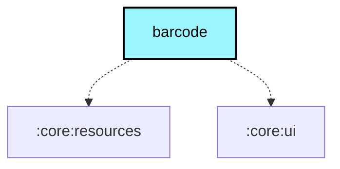

# `:core:barcode`

## Overview

The `:core:barcode` module scans QR codes and barcodes with CameraX and decodes frames locally with ZXing. It is used
for node configuration, pairing, and contact sharing without Google Play Services, ML Kit, a cloud API, or a network
connection.

The shared `BarcodeScanner` contract and `LocalBarcodeScannerProvider` live in `core:ui/commonMain`; this module remains
Android-only because it owns CameraX integration.

## Source layout

- `src/main/.../BarcodeScannerProvider.kt`: camera permission, preview, scanner dialog, and lifecycle.
- `src/main/.../BarcodeAnalyzerFactory.kt`: shared ZXing decoder used by both product flavors.
- `src/test/`: scanner unit tests.

## Usage

```kotlin
val scanner = rememberBarcodeScanner { result ->
    // Handle the scanned text, or null when dismissed.
}
scanner.startScan()
```

## Module dependency graph

<!--region graph-->

<!--endregion-->
