# `:core:prefs`

## Overview
The `:core:prefs` module provides a type-safe preferences layer backed by DataStore (multiplatform). On Android, legacy `SharedPreferences` are automatically migrated to DataStore on first access via `SharedPreferencesMigration`.

## Key Components

### 1. DataStore Providers (`CorePrefsAndroidModule`)
Provides named `DataStore<Preferences>` singletons for each active preference domain (app, mesh, radio, UI, location-reporting consent, etc.). Each DataStore uses an injected `CoroutineDispatchers.io` scope and includes a `SharedPreferencesMigration` for seamless migration from the legacy preference files.

### 2. Specialized Prefs
- **`RadioPrefs`**: Manages radio-specific settings (e.g., the last connected device address).
- **`UiPrefs`**: Manages UI preferences (e.g., theme selection, unit systems).
- **`MapConsentPrefs`**: Stores consent for the Meshtastic radio/MQTT location-reporting feature. It does not configure or load a map SDK.

Analytics preferences and map tile/provider preferences are intentionally absent. Both Android flavors
use the same local-only preference behavior and do not initialize a cloud diagnostics runtime.

## Module dependency graph

```mermaid
graph TB
  :core:prefs[prefs]:::kmp-library

classDef android-application fill:#CAFFBF,stroke:#000,stroke-width:2px,color:#000;
classDef android-application-compose fill:#CAFFBF,stroke:#000,stroke-width:2px,color:#000;
classDef compose-desktop-application fill:#CAFFBF,stroke:#000,stroke-width:2px,color:#000;
classDef android-feature fill:#FFD6A5,stroke:#000,stroke-width:2px,color:#000;
classDef android-library fill:#9BF6FF,stroke:#000,stroke-width:2px,color:#000;
classDef android-library-compose fill:#9BF6FF,stroke:#000,stroke-width:2px,color:#000;
classDef android-test fill:#A0C4FF,stroke:#000,stroke-width:2px,color:#000;
classDef jvm-library fill:#BDB2FF,stroke:#000,stroke-width:2px,color:#000;
classDef kmp-feature fill:#FFD6A5,stroke:#000,stroke-width:2px,color:#000;
classDef kmp-library-compose fill:#FFC1CC,stroke:#000,stroke-width:2px,color:#000;
classDef kmp-library fill:#FFC1CC,stroke:#000,stroke-width:2px,color:#000;
classDef unknown fill:#FFADAD,stroke:#000,stroke-width:2px,color:#000;

```

<!--region graph-->

<!--endregion-->
