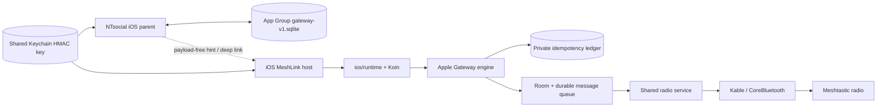

# Implementation Plan: iOS NTsocial MeshLink Companion

## Current phase

The smallest useful iOS vertical slice is implemented in source. Remaining work is verification and release hardening, not expansion into a full Meshtastic client. iOS is the repository's third product track; Android and Windows contracts remain unchanged.

## Technical context

- Kotlin 2.3/JDK 21, Compose Multiplatform, Navigation 3, Koin, Room KMP, DataStore, Kable, and Okio.
- SwiftUI/App lifecycle host, iOS 17 deployment target, static Kotlin framework `MeshLinkKit`.
- Existing radio owner: `SharedRadioInterfaceService`, `DirectRadioControllerImpl`, `MeshServiceOrchestrator`, and `KableMeshtasticRadioProfile`.
- Existing durable admission: Room packet rows plus `IosDurableMessageQueue`, which replays `QUEUED` work after startup/reconnect and never equates queue admission with RF delivery.
- Cross-app boundary: Apple Gateway v1 SQLite mailbox in an App Group, HMAC key in shared Keychain, payload-free Darwin notifications, and `ntsocial-meshlink://process` as a foreground handoff.

## Implemented architecture

The App Group contains only projections and mailboxes. MeshLink's Room database and restart-stable ledger remain private; the parent canonical social store remains private to the parent. The runtime processes work only while iOS schedules the process. Darwin notifications and the deep link do not create an always-running service.

## Implemented module layout

- `core/gateway`: Apple Gateway v1 models, length-delimited canonical codec, HMAC validator, schema/store, in-memory route registry, private ledger, provider engine, radio-port contract, and JVM/common tests.
- `ios/runtime`: `MeshLinkKit` static framework, Koin composition root, shared radio/orchestrator integration, atomic session state, exact Gateway radio-session/active-database guard, inbound-identity drain signal, READY drain/bounded retry, durable queue, Apple Gateway coordinator/radio port/wake sink, host facade, and focused Compose UI.
- `iosApp`: SwiftUI/Xcode host, plist, source entitlements, AppIcon asset catalog, Privacy Manifest, App Group lookup, shared-Keychain HMAC bootstrap, Darwin observer, scene/URL handoff, Compose view-controller embedding, and fail-closed data-only Skiko ICU archive normalization.
- `core/ble`: Kable-first iOS availability/scanner/connection implementation, peripheral reconstruction by UUID, central state restoration configuration, and negotiated maximum write length.
- Shared service/data/database code: generation-bound transport callbacks and synchronous exact-session sends; awaited radio-ingress/packet-queue retirement; active-database/cache hydration before connect; firmware-69420 readback with host-exclusive owner/token and dedicated completion; serialized manual/QR/reconcile/provision mutations; and durable source identity revalidation at actual dispatch.
- `core/database`, `core/model`, build logic: iOS Room/KSP wiring, durable database paths, Security.framework random bytes, and root iOS smoke coverage.
- `NTsocial_release` sibling: separately authorized Swift adapter, App Group/Keychain/Darwin/deep-link contract implementation, canonical-store integration, restart-stable pending/multipart/final-ID correlation, slot-retaining outbound catalog plus deterministic current/historical canonical projection, durable gap/quarantine recovery, and authenticated overlay/native-text enqueue APIs. Its native-text composer remains deferred, and it is not linked into this GPL companion.

## Persistence and security

- App Group database: `gateway-v1.sqlite`, schema/user version 1, WAL/foreign-key/busy-timeout coordination, status/caller/channel projections, immutable command inbox, separate reclaimable claims, append-only results, bounded overlay ingress, additive retention-independent `overlay_epoch_state`, stable-only native message changes, consumer cursors, and nonce reservations. Overlay append advances epoch high-water atomically; an early v1 database is backfilled from retained rows without a version bump.
- Private Room: existing radio/node/channel/message state; never shared.
- Private ledger: `(caller_id, client_message_id)` with fingerprint, deterministic packet ID, `PENDING`/`ACCEPTED`, insertion order, and a 256-record-per-caller cap without TTL.
- Routes: 32 CSPRNG bytes encoded Base64URL, 120-second TTL, exact caller/source/slot/generation binding, authoritative only in process memory. Process start and any exact session/routing-context inequality rotate the opaque generation and invalidate routes. The identity includes session epoch, selected/active radio equality, configuration completion for that epoch, selected radio's active Room database, complete-channel readback/final-snapshot generations, history epoch, Bluetooth permission/power, transport/App connection states, and complete channel fingerprint; admission rechecks it under `ChannelOperationLock`.
- Authentication: 32-byte HMAC-SHA256 key from shared Keychain; versioned length-delimited canonical bytes; expiry, caller/key, nonce replay, strict payload, and constant-time tag checks.
- Outbound commit order for new work: authenticate/validate → exact accepted-ledger replay/conflict lookup → resolve route → reserve nonce → reserve private ledger → recheck exact session guard → durably admit Room/retry work → mark ledger accepted → append `ACCEPTED_LOCAL` result. An accepted ledger record can reconstruct a missing result after restart without a live old route or second local admission.
- A transient radio/queue or final accepted-ledger commit failure releases the claim and leaves a retryable pending result; permanent failures append rejection. `READY` transitions drain the mailbox; retryable work uses one coalesced 500/1,000/2,000-ms, three-attempt scheduler. A 64-command drain-budget exhaustion schedules a delayed continuation. No local state represents remote delivery, and the local-admission/ledger-commit crash gap is not exactly-once RF.
- Radio replacement revokes the retired callback generation synchronously, quiesces and awaits old ingress/child writes and outbound queue/status/log work, switches the active per-radio database, hydrates its current node snapshot, and only then resumes/connects. Expected epoch survives admin/readback admission, packet dequeue, and the synchronous transport-send linearization point, including same-address/same-transport replacement.
- Manual/QR apply, protected reconcile, and built-in provision use one mutation boundary: validate/ensure → invalidate ingress → exact-session mutation → correlated fresh readback → activate exact identity. Readback reuses firmware `69420` with a host-exclusive owner/token after FULL Stage 2 and a dedicated completion flow; stale FULL/parallel/generic-generation events cannot complete it. The operation lock is released while the producer commits, and ambiguous outcomes remain closed.
- Accepted Gateway Room rows persist their source identity. Actual iOS drain revalidates exact active ingress plus slot/PSK/LoRa-derived identity and holds `ChannelOperationLock` through exact-session packet admission and matching QueueStatus. A changed source fails closed. The sole open P2 is same-epoch liveness if an admitted readback times out/cancels and firmware never returns; reconnect/new epoch recovers, with no wrong-channel or disclosure path.
- Parent pending admission is durable per exact message/attempt/transport and remains pending until a matching terminal result. Multipart restart state preserves final social-header ID, attempt, kind/index/count, transfer ID, and logical channel; acceptance waits for every part and any rejection fails once. Outbound retains duplicate source slots, canonical/history projection collapses equal stable identities by PRIMARY then lowest slot and rejects security conflicts. A retention gap, malformed envelope, or lost/expired transfer advances only after a durable terminal gap/quarantine/abandoned record; transient failures leave the cursor unchanged and evicted rows are not claimed recoverable.

## Product scope

- Android: no Provider, command, Room schema, branding, or packaging behavior is replaced by Apple Gateway.
- Windows: no IPC, branding, startup, or packaging behavior changes.
- iOS: focused BLE companion and Apple integration boundary only. The UI covers readiness, Bluetooth, scan/select/connect/disconnect/forget, background truth, and parent handoff. Routes browser, diagnostic text composer, command-result browser, Gateway reset/panic-wipe UI, maps, firmware management, and non-BLE transports are deferred.

## Completed verification

1. Current-source focused slices pass 135/135: domain 16/16, data 104/104, and `:ios:runtime:jvmTest` 15/15—session/active-database guard 4, bounded retry 3, command-drain budget 3, durable-dispatch identity 2, inbound-projection signal 1, and shell/deep-link 2. `:core:gateway:jvmTest` separately passes 36. Deterministic coverage and the final bounded audit found no reproducible P0/P1 in the same-address, readback-owner, mutation, activation, and dispatch boundaries.
2. Gateway and runtime iosArm64 and iosSimulatorArm64 compilation passed; `:ios:runtime:compileTestKotlinIosSimulatorArm64` and `linkDebugFrameworkIosSimulatorArm64` passed.
3. Current-source Spotless, five changed modules' Detekt, iOS Simulator Arm64 compilation, and diff hygiene pass. The earlier retained revision passed the JDK 21/en-US/one-worker 1,410-task root gate; current-source root full Gradle/root Detekt exact results remain pending and must replace—not inherit—that evidence.
4. Parent `swift test --package-path ios --filter AppleGatewayAdapterTests`: 27/27 tests passed; complete `swift test --package-path ios`: 668/668 passed; release build is green. Coverage includes exact shared-Keychain coordinates, additive overlay-epoch migration, restart-stable pending/multipart/final-ID correlation, duplicate-source selection/security conflict, durable gap/poison recovery before cursor advance, same-epoch historical backlog, terminal rejection, and native-text enqueue.
5. An earlier retained revision has signing-disabled fresh-Derived-Data Simulator Debug, AppIcon/Privacy Manifest, install/cold-launch/UI, ICU normalization, and generic-iphoneos Release evidence. Current-source Xcode clean-build exact results remain pending; neither revision is signed archive/device proof.

## Remaining verification plan

1. Provision both apps with the same real App Group and Keychain access group; verify HMAC sharing, SQLite coordination, Darwin hints, missed-hint recovery, deep-link handoff, restart, and upgrade on signed devices.
2. Run physical-device Bluetooth authorization/off, scan/select, handshake, foreground/background, restoration, reconnect, and node-reboot tests.
3. Run connected-radio local admission, LoRa airtime, second-radio reception, parent canonical-store commit, retry/restart, duplicate, remote receipt, and bidirectional Android/iOS interoperability tests.
4. Complete signing/archive validation of the AppIcon, Privacy Manifest, and ICU-normalization path, then licensing/source-offer, TestFlight, and App Store checks only after the preceding evidence is retained.
5. Enable real Kotlin/Native test link/run tasks. The current convention disables them, so a Gradle `iosSimulatorArm64Test` success with skipped native tasks is not test-execution evidence. Separately evaluate whether the bounded readback-owner P2 needs recovery beyond reconnect/new epoch.

No simulator result proves App Group signing, device BLE, radio admission, RF transmission, remote receipt, background permanence, TestFlight, or App Store readiness.
